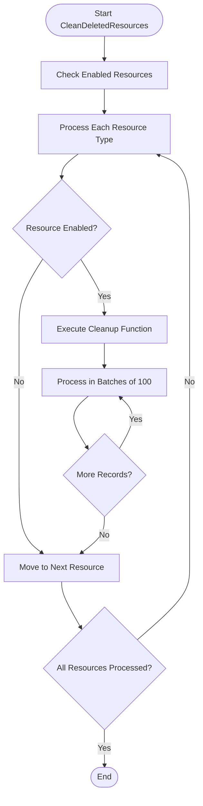
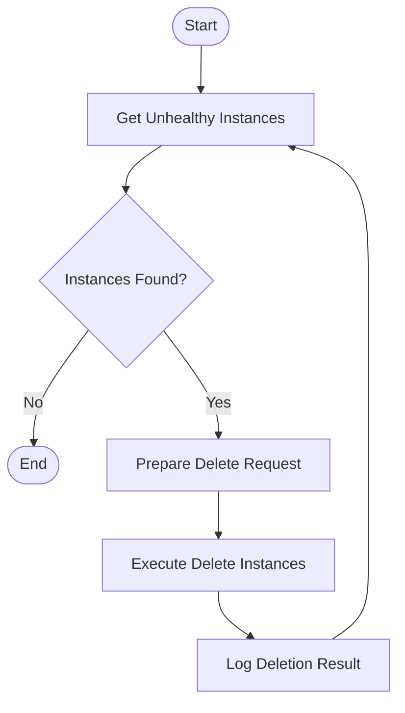
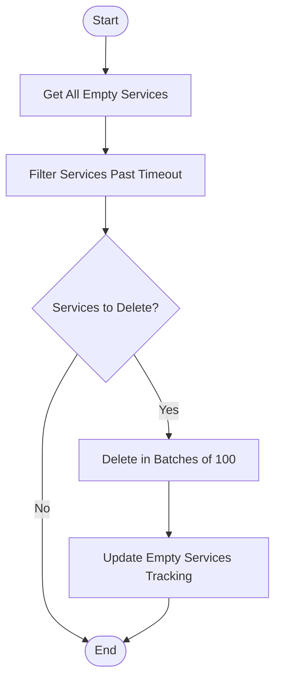
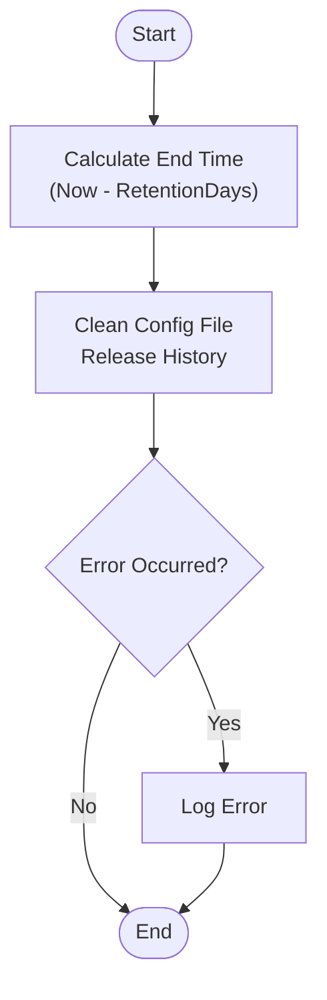
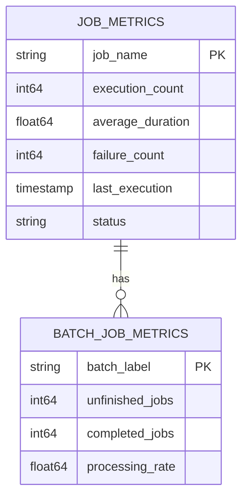

# Maintenance and Background Jobs

<cite>
**Referenced Files in This Document**   
- [config.go](file://pkg/admin/job/config.go)
- [job.go](file://pkg/admin/job/job.go)
- [delete_unhealthy_instance.go](file://pkg/admin/job/delete_unhealthy_instance.go)
- [delete_empty_service.go](file://pkg/admin/job/delete_empty_service.go)
- [clean_deleted_resource.go](file://pkg/admin/job/clean_deleted_resource.go)
- [history_clean.go](file://pkg/admin/job/history_clean.go)
- [sys_metrics.go](file://pkg/common/otel/metrics/sys_metrics.go)
- [discovery_handle.go](file://plugin/observability/statis/prometheus/discovery_handle.go)
</cite>

## Table of Contents
1. [Introduction](#introduction)
2. [Automated Cleanup Processes](#automated-cleanup-processes)
3. [Configuration Options for Job Scheduling](#configuration-options-for-job-scheduling)
4. [History Cleaning Job](#history-cleaning-job)
5. [Manual Maintenance Operations](#manual-maintenance-operations)
6. [Monitoring Metrics](#monitoring-metrics)
7. [Troubleshooting Guidance](#troubleshooting-guidance)
8. [Performance Tuning Recommendations](#performance-tuning-recommendations)
9. [System Stability and Resource Efficiency](#system-stability-and-resource-efficiency)

## Introduction
This document provides comprehensive details about the maintenance and background job system in the Polaris server. It covers automated cleanup processes, configuration options, history cleaning, manual operations, monitoring metrics, troubleshooting, and performance tuning. These background jobs are essential for maintaining system stability, ensuring data consistency, and optimizing resource utilization in large-scale deployments.

## Automated Cleanup Processes

The system implements several automated cleanup processes to maintain data integrity and resource efficiency. These background jobs run periodically to remove obsolete or unhealthy resources from the system.

### Deleted Resources Cleanup
The `CleanDeletedResources` job is responsible for cleaning up soft-deleted resources from the database. This includes instances, services, clients, service contracts, and various rule types (circuit breaker, rate limit, router, fault detection, and lane rules). The job processes these resources in batches to minimize database load.



**Diagram sources**
- [clean_deleted_resource.go](file://pkg/admin/job/clean_deleted_resource.go#L150-L270)

**Section sources**
- [clean_deleted_resource.go](file://pkg/admin/job/clean_deleted_resource.go#L1-L270)

### Unhealthy Instances Cleanup
The `DeleteUnHealthyInstance` job identifies and removes instances that have failed health checks for an extended period. This process helps maintain service reliability by eliminating non-functional endpoints from service discovery.



**Diagram sources**
- [delete_unhealthy_instance.go](file://pkg/admin/job/delete_unhealthy_instance.go#L60-L109)

**Section sources**
- [delete_unhealthy_instance.go](file://pkg/admin/job/delete_unhealthy_instance.go#L1-L110)

### Empty Services Cleanup
The `DeleteEmptyService` job removes service entries that have no associated instances. This cleanup prevents clutter in the service registry and improves system performance by reducing unnecessary metadata.



**Diagram sources**
- [delete_empty_service.go](file://pkg/admin/job/delete_empty_service.go#L80-L162)

**Section sources**
- [delete_empty_service.go](file://pkg/admin/job/delete_empty_service.go#L1-L163)

## Configuration Options for Job Scheduling

The background job system provides flexible configuration options to control job execution intervals, batch sizes, and timeouts. These settings allow administrators to tune the system for their specific deployment requirements.

### Job Configuration Structure
All jobs are configured through the `JobConfig` structure, which defines the basic properties for each maintenance job:

```mermaid
classDiagram
class JobConfig {
+string Name
+bool Enable
+map[string]interface{} Option
}
JobConfig : Name - Unique identifier for the job
JobConfig : Enable - Controls whether the job is active
JobConfig : Option - Configuration parameters for the job
```

**Diagram sources**
- [config.go](file://pkg/admin/job/config.go#L8-L14)

**Section sources**
- [config.go](file://pkg/admin/job/config.go#L1-L26)
- [job.go](file://pkg/admin/job/job.go#L50-L176)

### Execution Intervals
Each job has a configurable execution interval that determines how frequently it runs. The intervals are defined in the job-specific configuration:

- **Unhealthy Instance Cleanup**: Configured via `instanceDeleteTimeout`, defaulting to 60 minutes
- **Empty Service Cleanup**: Configured via `serviceDeleteTimeout`, defaulting to 30 minutes
- **Deleted Resources Cleanup**: Fixed interval of 1 minute
- **History Cleaning**: Fixed interval of 1 minute

The system uses a ticker-based approach to execute jobs at their specified intervals, ensuring consistent timing across restarts.

### Batch Size Configuration
Batch processing is used to manage large volumes of data without overwhelming system resources. The default batch size is 100 for most cleanup operations, with the history cleaning job using a larger batch size of 1,000 records.

For the history cleaning job, the batch size can be customized through the `batchSize` configuration parameter, allowing administrators to balance between cleanup speed and database load.

## History Cleaning Job

The history cleaning job is responsible for removing obsolete operational records from the system, specifically configuration file release histories. This process helps maintain database performance and storage efficiency.

### Configuration and Retention
The history cleaning job is configured with two key parameters:

- **RetentionDays**: Specifies how long history records should be retained before deletion (default: 7 days)
- **BatchSize**: Controls the number of records processed in each batch (default: 1,000)



**Diagram sources**
- [history_clean.go](file://pkg/admin/job/history_clean.go#L50-L78)

**Section sources**
- [history_clean.go](file://pkg/admin/job/history_clean.go#L1-L79)

The job runs every minute and removes all configuration release history records that are older than the specified retention period. This ensures that historical data is preserved for the configured duration while preventing unbounded growth of the history table.

## Manual Maintenance Operations

In addition to automated background jobs, the system supports several manual maintenance operations that can be performed by administrators when needed.

### Cache Invalidation
The system maintains various caches for performance optimization. When significant configuration changes occur, administrators may need to manually invalidate caches to ensure consistency. This can be achieved by restarting the service or using specific administrative endpoints.

### Consistency Checks
The system provides mechanisms to verify data consistency between the database and in-memory caches. These checks can be triggered manually to identify and resolve any discrepancies that may have occurred due to system failures or network issues.

### Data Repair
For critical data corruption scenarios, the system offers data repair operations that can restore consistency across distributed components. These operations should be performed with caution and typically require coordination between multiple system administrators.

While the codebase does not explicitly show manual operation endpoints, the architecture supports such operations through the administrative interface and direct database access when necessary.

## Monitoring Metrics

The system provides comprehensive monitoring metrics to track the performance and status of background jobs. These metrics are essential for maintaining system health and identifying potential issues.

### Job Execution Metrics
The system exposes several metrics related to job execution:



**Diagram sources**
- [sys_metrics.go](file://pkg/common/otel/metrics/sys_metrics.go#L36-L76)
- [discovery_handle.go](file://plugin/observability/statis/prometheus/discovery_handle.go#L87-L195)

### Performance Impact Metrics
To monitor the performance impact of background jobs, the system tracks:

- **cache_update_cost**: Measures the time spent updating caches
- **instance_regis_cost_time**: Tracks the cost of instance registration operations
- **batch_job_unfinish**: Monitors the number of unfinished batch jobs

These metrics help administrators understand the resource consumption of maintenance operations and identify potential bottlenecks.

**Section sources**
- [sys_metrics.go](file://pkg/common/otel/metrics/sys_metrics.go#L36-L116)
- [discovery_handle.go](file://plugin/observability/statis/prometheus/discovery_handle.go#L87-L195)

## Troubleshooting Guidance

When background jobs fail or perform suboptimally, administrators can follow these troubleshooting steps to diagnose and resolve issues.

### Failed Job Diagnosis
Common symptoms of failed jobs include:

- Repeated error logs in the maintenance job component
- Accumulation of records that should have been cleaned
- Increased database size despite cleanup jobs running

To diagnose failed jobs:
1. Check the system logs for error messages from the maintenance component
2. Verify that the job is enabled in the configuration
3. Confirm that the system has proper database connectivity
4. Check for resource constraints (CPU, memory, disk space)

### Common Issues and Solutions
- **Database connection timeouts**: Increase database connection pool size or optimize queries
- **Insufficient permissions**: Verify that the maintenance job has necessary database permissions
- **Resource exhaustion**: Reduce batch sizes or adjust job scheduling intervals
- **Clock skew issues**: Ensure all cluster nodes have synchronized clocks

The system logs detailed information about job execution, including success/failure status and processing counts, which can be invaluable for troubleshooting.

## Performance Tuning Recommendations

For large-scale deployments, administrators should consider these recommendations to optimize background job performance.

### Large-Scale Deployment Considerations
In environments with high service and instance counts, the default configuration may need adjustment:

- **Increase batch sizes**: For systems with millions of records, consider increasing batch sizes to reduce the overhead of database round-trips
- **Adjust cleanup intervals**: Balance between timely cleanup and system load by tuning the execution intervals
- **Stagger job execution**: Configure jobs to run at different times to avoid resource contention

### Resource Optimization
To minimize the performance impact of maintenance operations:

- Schedule intensive jobs during off-peak hours
- Monitor database performance metrics during job execution
- Consider read replicas for jobs that primarily perform read operations
- Implement rate limiting for deletion operations to prevent database overload

The system's modular job architecture allows for independent tuning of each maintenance task based on the specific characteristics of the deployment.

## System Stability and Resource Efficiency

The background job system plays a crucial role in maintaining overall system stability and resource efficiency.

### Stability Contributions
Regular cleanup of unhealthy instances and empty services ensures that service discovery returns accurate results, preventing client applications from attempting to connect to non-functional endpoints. This directly improves the reliability of the entire service mesh.

The deletion of obsolete configuration histories prevents unbounded growth of database tables, which could otherwise lead to performance degradation and potential outages.

### Resource Efficiency
By removing deleted resources and their associated metadata, the system conserves both memory and storage resources. This is particularly important in large-scale deployments where thousands of services and millions of instances may come and go over time.

The batch processing approach ensures that cleanup operations do not overwhelm system resources, maintaining predictable performance characteristics even during intensive maintenance activities.

The comprehensive monitoring metrics provide early warning of potential issues, allowing administrators to proactively address problems before they impact system stability.