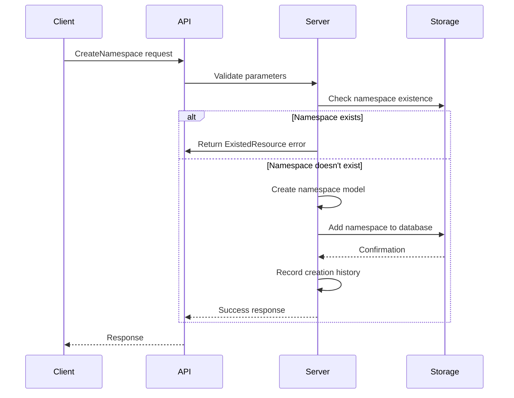
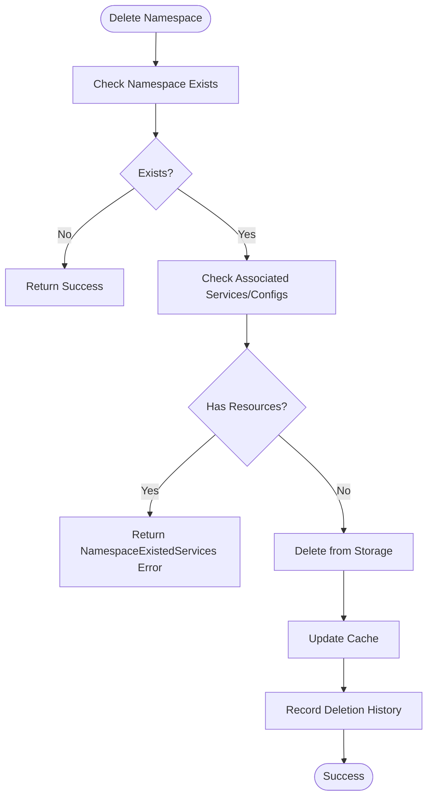
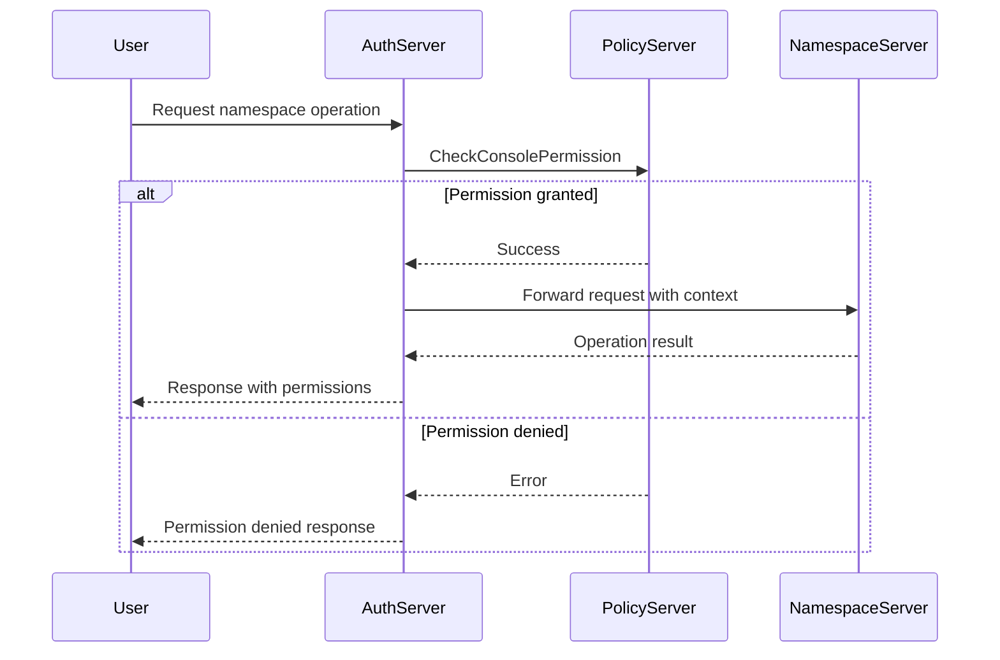
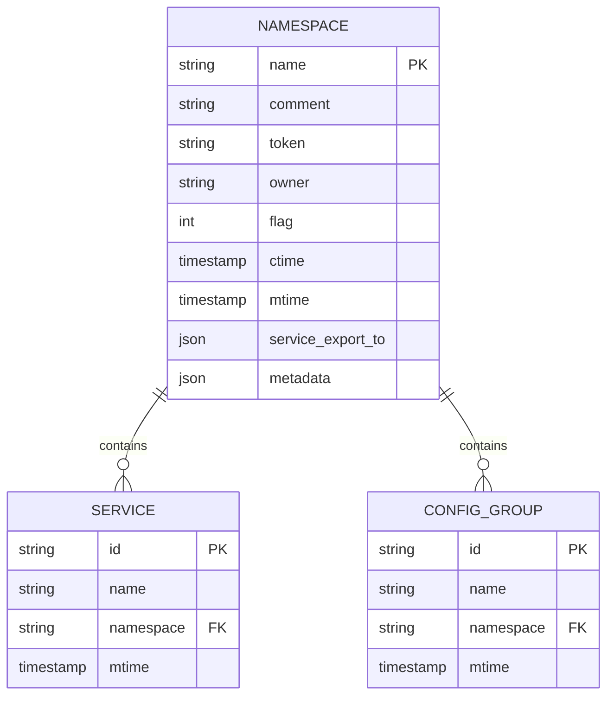

# Namespace Management

<cite>
**Referenced Files in This Document**   
- [namespace.go](file://pkg/namespace/namespace.go)
- [namespace.go](file://pkg/cache/namespace/namespace.go)
- [namespace.go](file://apis/pkg/types/namespace.go)
- [namespace.go](file://plugin/store/mysql/namespace.go)
- [server.go](file://pkg/namespace/server.go)
- [default.go](file://pkg/namespace/default.go)
- [api.go](file://pkg/namespace/api.go)
- [server.go](file://pkg/namespace/interceptor/auth/server.go)
</cite>

## Table of Contents
1. [Introduction](#introduction)
2. [Core Components](#core-components)
3. [Namespace Lifecycle Management](#namespace-lifecycle-management)
4. [System-Reserved and Default Namespaces](#system-reserved-and-default-namespaces)
5. [Access Control and Authorization](#access-control-and-authorization)
6. [Namespace Data Storage and Replication](#namespace-data-storage-and-replication)
7. [Best Practices for Namespace Design](#best-practices-for-namespace-design)
8. [Integration Examples](#integration-examples)

## Introduction
Namespace Management provides logical isolation for services, configurations, and governance rules within the system. This functionality enables multi-tenancy by creating separate environments for different teams, applications, or deployment stages. The namespace system supports creation, modification, and deletion operations through both API and CLI interfaces, with comprehensive access control integrated into the authentication system. Namespaces serve as the foundational organizational unit for resource management, allowing administrators to enforce quotas, apply policies, and control visibility across different parts of the system.

## Core Components

The namespace management system consists of several key components that work together to provide a robust multi-tenancy solution. The core functionality is implemented in the `Server` struct within the namespace package, which handles all namespace operations. This server interacts with the storage layer for persistence, the cache layer for performance optimization, and the authentication system for access control. The system supports batch operations for efficient management of multiple namespaces and includes comprehensive validation and error handling.

**Section sources**
- [server.go](file://pkg/namespace/server.go#L1-L63)
- [api.go](file://pkg/namespace/api.go#L1-L42)
- [default.go](file://pkg/namespace/default.go#L1-L133)

## Namespace Lifecycle Management

### Creation
Namespaces can be created individually or in batches through the `CreateNamespace` and `CreateNamespaces` API endpoints. The system validates namespace names according to predefined rules and checks for existing namespaces to prevent duplicates. When creating a namespace, users can specify metadata, ownership information, and service visibility settings. The system automatically generates a unique token for each namespace and records creation timestamps.



**Diagram sources**
- [namespace.go](file://pkg/namespace/namespace.go#L75-L120)
- [namespace.go](file://plugin/store/mysql/namespace.go#L30-L60)

### Modification
Existing namespaces can be updated using the `UpdateNamespace` and `UpdateNamespaces` endpoints. The system allows modification of metadata, ownership, and service visibility settings while preserving the namespace identifier. All updates are transactional and include audit logging to track changes. The system validates modifications to ensure data integrity and consistency.

### Deletion
Namespaces can be deleted individually or in batches through the `DeleteNamespace` and `DeleteNamespaces` endpoints. Before deletion, the system verifies that no services or configuration groups are associated with the namespace to prevent orphaned resources. Deletion operations are performed within database transactions to ensure data consistency and are logged for audit purposes.



**Diagram sources**
- [namespace.go](file://pkg/namespace/namespace.go#L180-L230)
- [namespace.go](file://plugin/store/mysql/namespace.go#L200-L220)

## System-Reserved and Default Namespaces

The system defines several reserved namespaces for specific purposes. The `pole-system` namespace is reserved for system-level services and components, ensuring isolation of critical infrastructure. The `default` namespace serves as the fallback namespace for resources that don't explicitly specify a namespace. Additionally, a `Production` namespace is predefined for production workloads, providing a standardized environment for production deployments.

These system-reserved namespaces have special handling in the codebase and cannot be deleted through normal operations. They serve as anchor points for the system's multi-tenancy model and provide a consistent foundation for resource organization.

```mermaid
classDiagram
class Namespace {
+string Name
+string Comment
+string Token
+string Owner
+bool Valid
+time CreateTime
+time ModifyTime
+map[string]struct{} ServiceExportTo
+map[string]string Metadata
+ListServiceExportTo() []*wrappers.StringValue
}
class SystemNamespace {
+string pole-system
+string default
+string Production
}
Namespace <|-- SystemNamespace
```

**Diagram sources**
- [server.go](file://pkg/namespace/server.go#L15-L25)
- [namespace.go](file://apis/pkg/types/namespace.go#L1-L47)

## Access Control and Authorization

Namespace-level access control is integrated with the system's authentication and authorization framework. The `auth.Server` interceptor wraps the core namespace operations, adding permission checks before allowing operations to proceed. Each operation (create, read, update, delete) requires appropriate permissions, which are verified against the user's role and policy assignments.

When retrieving namespaces, the system dynamically sets the `Editable` and `Deleteable` flags based on the user's permissions, providing a clear indication of what actions are allowed. This approach enables fine-grained access control while maintaining a consistent user experience across different permission levels.



**Diagram sources**
- [server.go](file://pkg/namespace/interceptor/auth/server.go#L1-L256)
- [namespace.go](file://pkg/namespace/namespace.go#L300-L350)

## Namespace Data Storage and Replication

Namespace data is stored in a relational database with a dedicated `namespace` table. The storage layer provides CRUD operations through the `namespaceStore` implementation, which handles database transactions and error management. Each namespace record includes metadata such as creation and modification timestamps, owner information, and service visibility settings.

The system employs a cache layer to improve performance, with the `namespaceCache` component maintaining an in-memory representation of namespace data. The cache is updated asynchronously based on modification timestamps, ensuring consistency while minimizing database load. Cache invalidation is handled through event publishing, allowing multiple nodes in a cluster to maintain synchronized namespace views.



**Diagram sources**
- [namespace.go](file://plugin/store/mysql/namespace.go#L1-L282)
- [namespace.go](file://pkg/cache/namespace/namespace.go#L1-L300)

## Best Practices for Namespace Design

### Hierarchy and Naming Conventions
Organize namespaces according to organizational structure, environment, and application domains. Use a consistent naming convention such as `{organization}-{environment}-{application}` to ensure clarity and prevent naming conflicts. For example: `acme-dev-ecommerce`, `acme-staging-ecommerce`, `acme-prod-ecommerce`.

### Quota Management
Implement resource quotas at the namespace level to prevent any single team or application from consuming excessive system resources. Monitor namespace usage and set appropriate limits for services, instances, and configuration items.

### Environment Separation
Use separate namespaces for different environments (development, staging, production) to ensure isolation and prevent accidental changes to production systems. This separation allows for different policies, access controls, and monitoring configurations for each environment.

## Integration Examples

### Multi-Environment Organization
Organize microservices across environments using namespaces:
- `dev` namespace for development teams with relaxed policies and broad access
- `staging` namespace for pre-production testing with stricter controls
- `prod` namespace for production workloads with maximum security and monitoring

This approach enables teams to maintain consistent service names across environments while ensuring proper isolation and governance.

**Section sources**
- [namespace.go](file://pkg/namespace/namespace.go#L1-L462)
- [namespace.go](file://pkg/cache/namespace/namespace.go#L1-L300)
- [namespace.go](file://plugin/store/mysql/namespace.go#L1-L282)