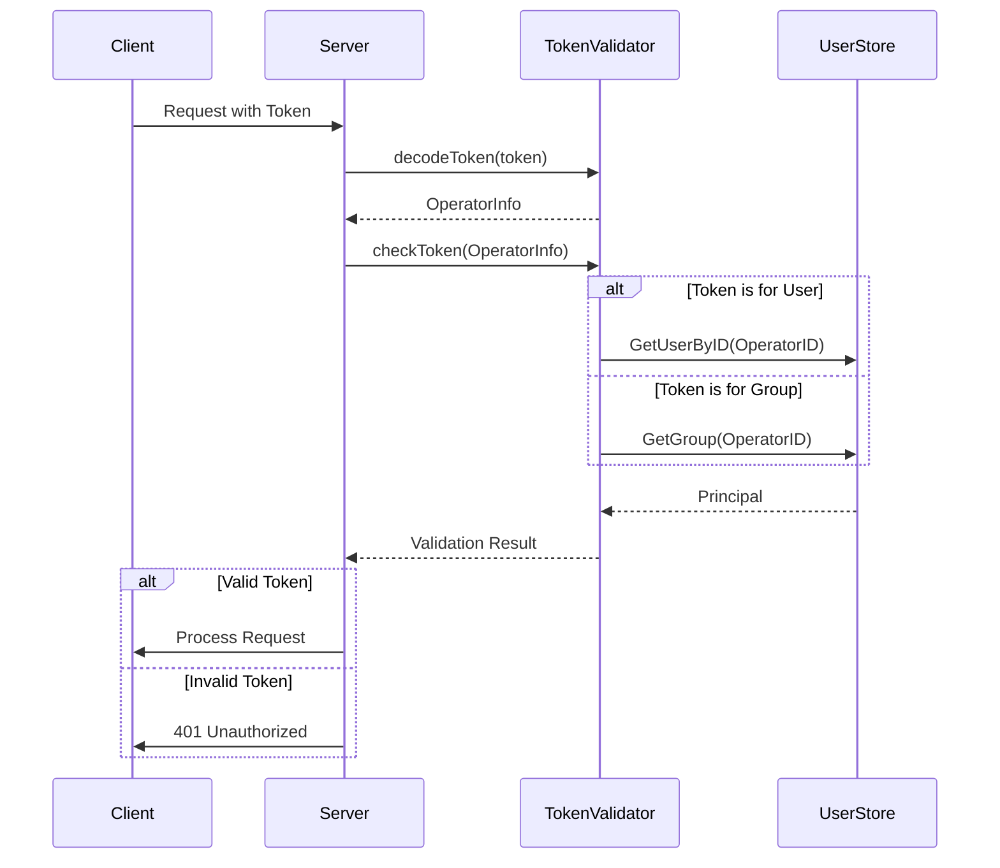

# User and Group Management

<cite>
**Referenced Files in This Document**   
- [group.go](file://plugin/access_control/auth/user/group.go)
- [user.go](file://plugin/access_control/auth/user/user.go)
- [policy.go](file://plugin/access_control/auth/policy/policy.go)
- [token.go](file://plugin/access_control/auth/user/token.go)
</cite>

## Table of Contents
1. [User and Group Management](#user-and-group-management)
2. [User Creation and Authentication](#user-creation-and-authentication)
3. [Group Management](#group-management)
4. [Role Assignment and Policy Inheritance](#role-assignment-and-policy-inheritance)
5. [Token-Based Authentication](#token-based-authentication)
6. [CRUD Operations for Users and Groups](#crud-operations-for-users-and-groups)
7. [Service Accounts and API Keys](#service-accounts-and-api-keys)
8. [Password Policies and Token Expiration](#password-policies-and-token-expiration)
9. [Audit Logging](#audit-logging)
10. [Security Best Practices](#security-best-practices)

## User Creation and Authentication

User creation and authentication in the system follows a structured approach to ensure secure access control. Users are created through the `CreateUser` function, which validates the user's name and owner relationship before storing the user data. The system uses bcrypt to hash passwords, ensuring that plain text passwords are never stored. Upon creation, a unique token is generated for the user, which is used for subsequent authentication.

Authentication is performed via token verification. The `CheckCredential` function decodes and validates the provided token, checking its validity and extracting user information. If the token is invalid or disabled, access is denied. The system supports both user tokens and group tokens, allowing for flexible authentication mechanisms. During authentication, the system also checks if the user is an owner or has administrative privileges, which affects their access rights.

The authentication process includes a fallback mechanism for non-strict mode, where invalid tokens can be downgraded to anonymous access for certain modules, except for access control and maintenance modules which always require valid credentials.

**Section sources**
- [user.go](file://plugin/access_control/auth/user/user.go#L150-L250)
- [token.go](file://plugin/access_control/auth/user/token.go#L20-L100)

## Group Management

Groups are managed as collections of users, allowing for centralized access control. Groups are created using the `CreateGroup` function, which ensures that each group has a unique name within the owner's scope. When a group is created, a default policy is automatically generated, granting the group specific permissions. The group creation process is transactional, ensuring data consistency.

Users can be added to groups during group creation or through subsequent updates. The system validates that all users referenced in a group exist before establishing the relationship. Groups can be updated to modify their metadata, comment, or token enablement status. The system prevents updates to immutable fields and ensures that only authorized users can modify group properties.

Groups can be deleted, but only if they are not referenced by any policies. When a group is deleted, all associated policies are cleaned up to maintain referential integrity. The deletion process is also transactional, ensuring that both the group and its policies are removed atomically.

**Section sources**
- [group.go](file://plugin/access_control/auth/user/group.go#L30-L150)
- [group.go](file://plugin/access_control/auth/user/group.go#L300-L400)

## Role Assignment and Policy Inheritance

Role assignment is implemented through policies that define access rights for users and groups. Policies are created using the `CreatePolicy` function, which associates principals (users or groups) with specific resources and actions. Each policy has an action type (e.g., READ_WRITE) and can be marked as default, which means it cannot be deleted.

Policy inheritance is implemented through the principal hierarchy. When a user belongs to a group that has a policy, the user inherits the group's permissions. The system evaluates policies by checking both direct user policies and group membership policies. This allows for a flexible permission model where users can have individual permissions while also inheriting group-level permissions.

Permissions can be escalated through policy chaining, where multiple policies apply to the same resource. The system uses a least-privilege approach by default, requiring explicit permission grants. However, administrators can create policies that grant broader access when needed. The policy system supports conditional access based on metadata and other attributes, allowing for fine-grained control.

```mermaid
classDiagram
class User {
+string ID
+string Name
+string Token
+bool TokenEnable
+UserRoleType Type
}
class Group {
+string ID
+string Name
+string Token
+bool TokenEnable
+map[string]struct{} UserIds
}
class Policy {
+string ID
+string Name
+AuthAction Action
+bool Default
+[]Principal Principals
+[]StrategyResource Resources
}
class Principal {
+string PrincipalID
+PrincipalType PrincipalType
+string Name
}
class StrategyResource {
+string StrategyID
+int ResType
+string ResID
}
User "1" -- "*" Principal : implements
Group "1" -- "*" Principal : implements
Policy "1" -- "*" Principal : has
Policy "1" -- "*" StrategyResource : controls
User "1" -- "*" Group : memberOf
```

**Diagram sources**
- [policy.go](file://plugin/access_control/auth/policy/policy.go#L100-L200)
- [user.go](file://plugin/access_control/auth/user/user.go#L50-L80)
- [group.go](file://plugin/access_control/auth/user/group.go#L50-L80)

## Token-Based Authentication

Token-based authentication is the primary mechanism for user and group identification. Tokens are created using the `CreateToken` function, which generates a cryptographically secure token containing the user or group identifier. The token is encrypted using AES with a server-defined salt, ensuring that tokens cannot be forged or tampered with.

Tokens are validated through the `decodeToken` and `checkToken` functions. The decoding process extracts the principal type and identifier from the token, while the validation process checks that the token matches the current token stored for the principal. This prevents token reuse and ensures that token revocation is effective.

Token expiration is managed through token rotation rather than time-based expiration. When a user or group token is reset using `ResetUserToken` or `ResetGroupToken`, a new token is generated, and the old token becomes invalid. This approach provides immediate revocation capability without relying on expiration timers.

The system supports both user tokens and group tokens, allowing services to authenticate as either individual users or groups. Group tokens are particularly useful for service accounts that need to perform actions on behalf of a team or department.



**Diagram sources**
- [token.go](file://plugin/access_control/auth/user/token.go#L20-L150)
- [user.go](file://plugin/access_control/auth/user/user.go#L500-L550)

## CRUD Operations for Users and Groups

The system provides comprehensive CRUD (Create, Read, Update, Delete) operations for both users and groups through dedicated API endpoints. These operations are implemented as batch operations to improve efficiency and reduce network overhead.

User CRUD operations include:
- **CreateUsers**: Creates multiple users in a single transaction
- **UpdateUsers**: Updates user metadata and passwords
- **DeleteUsers**: Removes users, with safeguards to prevent deletion of owner accounts with sub-accounts
- **GetUsers**: Retrieves user information with filtering capabilities

Group CRUD operations include:
- **CreateGroups**: Creates multiple groups with associated user relationships
- **UpdateGroups**: Modifies group properties and membership
- **DeleteGroups**: Removes groups and associated policies
- **GetGroups**: Retrieves group information with user count

Each operation includes comprehensive validation and error handling. For example, user creation checks for name uniqueness, while group updates validate that referenced users exist. The operations are designed to be idempotent where possible, allowing for safe retry in case of network failures.

All CRUD operations are logged for audit purposes, recording the operator, timestamp, and details of the change. This provides a complete history of user and group modifications.

**Section sources**
- [user.go](file://plugin/access_control/auth/user/user.go#L150-L400)
- [group.go](file://plugin/access_control/auth/user/group.go#L30-L300)

## Service Accounts and API Keys

Service accounts are implemented as special users with specific roles and permissions. These accounts are created through the same user creation process but with a service account role. The system distinguishes between regular users and service accounts through the `UserRoleType` field, which can be set to `SubAccountUserRole` for service accounts.

API keys are implemented as tokens, leveraging the same token infrastructure used for user authentication. Service accounts can have their tokens reset using the `ResetUserToken` function, which generates a new API key. The system supports enabling and disabling tokens through the `EnableUserToken` function, allowing for temporary deactivation of service accounts without deleting them.

The system provides specific endpoints for managing service account tokens:
- `GetUserToken`: Retrieves the current token for a service account
- `ResetUserToken`: Generates a new token, invalidating the previous one
- `EnableUserToken`: Activates or deactivates token-based authentication

Service accounts follow the same permission model as regular users, with policies defining their access to resources. This allows for fine-grained control over what services can access, implementing the principle of least privilege.

**Section sources**
- [user.go](file://plugin/access_control/auth/user/user.go#L450-L550)
- [token.go](file://plugin/access_control/auth/user/token.go#L100-L150)

## Password Policies and Token Expiration

Password policies are enforced during user creation and password updates. The system uses bcrypt with the default cost factor to hash passwords, ensuring strong cryptographic protection. Password strength is validated through the `CheckPassword` function, which enforces minimum length and complexity requirements.

When users update their passwords, the system requires the current password for verification, preventing unauthorized password changes. The `UpdateUserPassword` function handles password updates, comparing the provided current password with the stored hash before applying the new password.

Token expiration is managed through token rotation rather than time-based expiration. Tokens do not have an explicit expiration time but can be immediately invalidated by resetting the token. This approach provides better security than time-based expiration, as compromised tokens can be revoked instantly.

The system supports token enablement control through the `EnableUserToken` and `EnableGroupToken` functions. This allows administrators to temporarily disable token access without deleting the user or group, providing a quick way to respond to security incidents.

All password and token operations are logged for audit purposes, including the operator and timestamp. This provides visibility into credential management activities and helps detect suspicious behavior.

**Section sources**
- [user.go](file://plugin/access_control/auth/user/user.go#L350-L450)
- [token.go](file://plugin/access_control/auth/user/token.go#L150-L190)

## Audit Logging

Audit logging is implemented for all user and group management operations. The system creates audit records for create, update, delete, and token operations, capturing essential information about each change. Audit entries are created using helper functions like `userRecordEntry` and `userGroupRecordEntry`, which populate standardized record structures.

Each audit log entry includes:
- **ResourceType**: The type of resource modified (user, group, policy)
- **ResourceName**: The name and ID of the modified resource
- **OperationType**: The type of operation performed
- **Operator**: The user who performed the operation
- **Detail**: A JSON representation of the request
- **HappenTime**: The timestamp of the operation

Audit logs are stored in the system's history module and can be queried through the audit API. The logs provide a complete history of changes, enabling forensic analysis and compliance reporting. The system ensures that audit logging occurs even if the primary operation fails, providing visibility into attempted changes.

The audit system supports filtering and pagination through the `GetUsers` and `GetGroups` functions, which accept filter parameters to narrow down the results. This allows administrators to investigate specific events or time periods efficiently.

**Section sources**
- [user.go](file://plugin/access_control/auth/user/user.go#L600-L650)
- [group.go](file://plugin/access_control/auth/user/group.go#L550-L590)

## Security Best Practices

The system implements several security best practices to protect user and group management functionality:

1. **Least Privilege Principle**: Users and groups are granted only the minimum permissions necessary to perform their functions. Default policies are conservative, requiring explicit grants for additional access.

2. **Administrative Account Protection**: Owner accounts have special protections, including prevention of self-deletion and requirements to remove sub-accounts before deletion. Administrative actions are logged and can be audited.

3. **Secure Credential Storage**: Passwords are hashed with bcrypt, and tokens are encrypted with AES. Plain text credentials are never stored in the database.

4. **Input Validation**: All user inputs are validated to prevent injection attacks and ensure data integrity. The system uses parameterized queries to prevent SQL injection.

5. **Transaction Safety**: Critical operations are performed within database transactions, ensuring atomicity and consistency. This prevents partial updates that could leave the system in an inconsistent state.

6. **Rate Limiting**: Although not detailed in the provided code, the system structure suggests integration with rate limiting mechanisms to prevent brute force attacks on authentication endpoints.

7. **Secure Token Generation**: Tokens are generated using cryptographically secure random number generators and include sufficient entropy to prevent guessing attacks.

8. **Comprehensive Logging**: All security-relevant operations are logged, providing an audit trail for compliance and incident response.

These security measures work together to create a robust user and group management system that protects against common threats while providing the flexibility needed for enterprise environments.

**Section sources**
- [user.go](file://plugin/access_control/auth/user/user.go#L50-L100)
- [group.go](file://plugin/access_control/auth/user/group.go#L50-L100)
- [policy.go](file://plugin/access_control/auth/policy/policy.go#L50-L100)