# Architecture & Design

<cite>
**Referenced Files in This Document**   
- [main.go](file://main.go)
- [start.go](file://cmd/start.go)
- [server.go](file://bootstrap/server.go)
- [config.go](file://bootstrap/config/config.go)
- [pole-server.yaml](file://deploy/conf/pole-server.yaml)
- [pole-apiserver.yaml](file://deploy/conf/pole-apiserver.yaml)
- [eventhub.go](file://pkg/common/eventhub/eventhub.go)
- [server.go](file://pkg/service/server.go)
- [service.go](file://pkg/cache/service/service.go)
- [cache.go](file://pkg/cache/cache.go)
- [store.go](file://apis/store/store.go)
- [apiserver.go](file://apis/apiserver/apiserver.go)
- [plugin.go](file://plugin.go)
</cite>

## Table of Contents
1. [Introduction](#introduction)
2. [System Context](#system-context)
3. [Container Architecture](#container-architecture)
4. [Layered Architecture](#layered-architecture)
5. [Plugin Architecture](#plugin-architecture)
6. [Interceptor Pattern](#interceptor-pattern)
7. [Event-Driven Design](#event-driven-design)
8. [Component Interactions](#component-interactions)
9. [Critical Design Decisions](#critical-design-decisions)
10. [Scalability, Reliability and Extensibility](#scalability-reliability-and-extensibility)
11. [Technology Stack](#technology-stack)

## Introduction
The pole-server system is a service mesh control plane that provides service discovery, configuration management, and traffic governance capabilities. It follows a layered architectural pattern with clear separation of concerns between API layer, business logic layer, cache layer, and storage layer. The system is designed for high performance, reliability, and extensibility, supporting multiple protocols and storage backends through a plugin architecture. This document details the architectural design, component interactions, and key technical decisions that enable pole-server to serve as a robust service governance platform.

## System Context
The pole-server system operates as a central control plane in a microservices architecture, providing service discovery, configuration management, and traffic governance capabilities to client applications. It interacts with various external systems and supports multiple client protocols.

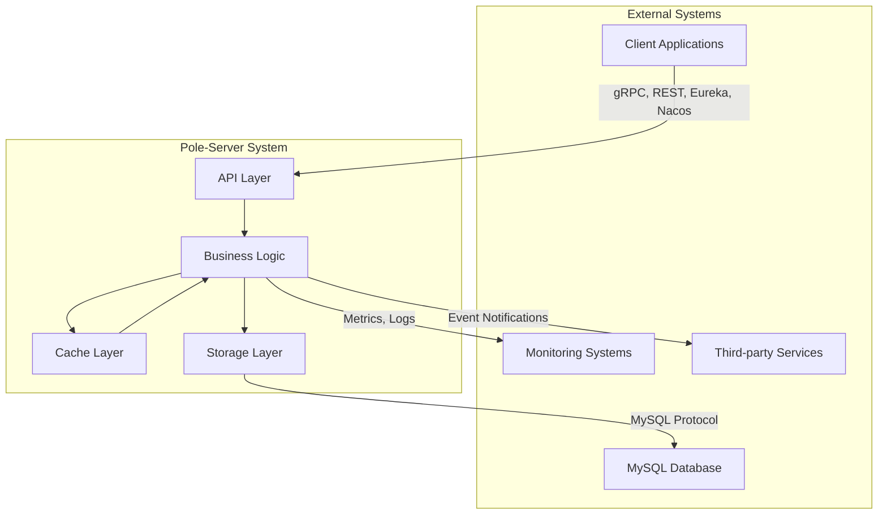

**Diagram sources**
- [pole-server.yaml](file://deploy/conf/pole-server.yaml#L1-L173)
- [pole-apiserver.yaml](file://deploy/conf/pole-apiserver.yaml#L1-L128)

## Container Architecture
The pole-server system is deployed as a single containerized application with multiple internal components that handle different aspects of service governance. The container exposes multiple network endpoints for different protocols and integrates with external storage and monitoring systems.

```mermaid
graph TD
subgraph "pole-server Container"
A[HTTP Server] --> D[Business Logic]
B[gRPC Server] --> D
C[Eureka Server] --> D
N[Nacos Server] --> D
X[XDS Server] --> D
Y[Apollo Server] --> D
D --> E[Cache Layer]
D --> F[Storage Layer]
E --> |In-memory Data| G[Redis/Memory]
F --> |Database| H[MySQL]
I[Event Hub] <- --> D
J[Health Checker] --> D
K[Admin Services] --> D
end
subgraph "External"
H
L[Client Applications]
M[Monitoring]
end
L --> A
L --> B
L --> C
L --> N
L --> X
L --> Y
D --> |Metrics| M
D --> |Logs| M
```

**Diagram sources**
- [server.go](file://bootstrap/server.go#L0-L717)
- [pole-server.yaml](file://deploy/conf/pole-server.yaml#L1-L173)

## Layered Architecture
The pole-server system follows a clean layered architecture with well-defined boundaries between components. Each layer has specific responsibilities and communicates with adjacent layers through well-defined interfaces.

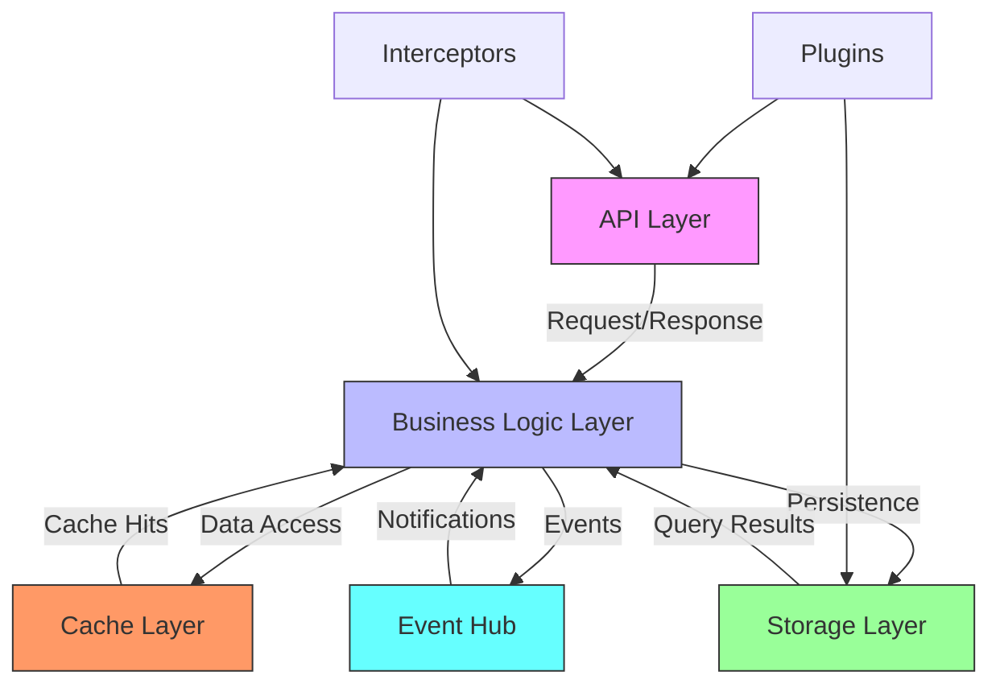

**Diagram sources**
- [server.go](file://bootstrap/server.go#L0-L717)
- [apiserver.go](file://apis/apiserver/apiserver.go#L1-L50)
- [store.go](file://apis/store/store.go#L1-L30)

**Section sources**
- [server.go](file://bootstrap/server.go#L0-L717)
- [config.go](file://bootstrap/config/config.go#L0-L127)

### API Layer
The API layer handles incoming requests from clients using various protocols including REST, gRPC, Eureka, Nacos, and XDS. It serves as the entry point for all client interactions and is responsible for protocol translation and request routing.

**Section sources**
- [apiserver.go](file://apis/apiserver/apiserver.go#L1-L100)
- [pole-apiserver.yaml](file://deploy/conf/pole-apiserver.yaml#L1-L128)

### Business Logic Layer
The business logic layer contains the core functionality for service discovery, configuration management, and traffic governance. It processes requests from the API layer, enforces business rules, and coordinates interactions between other layers.

**Section sources**
- [server.go](file://pkg/service/server.go#L0-L133)
- [goverrule](file://pkg/goverrule#L1-L50)
- [config](file://pkg/config#L1-L50)

### Cache Layer
The cache layer provides high-performance in-memory storage for frequently accessed data, reducing latency and database load. It implements an eventual consistency model with periodic synchronization from the storage layer.

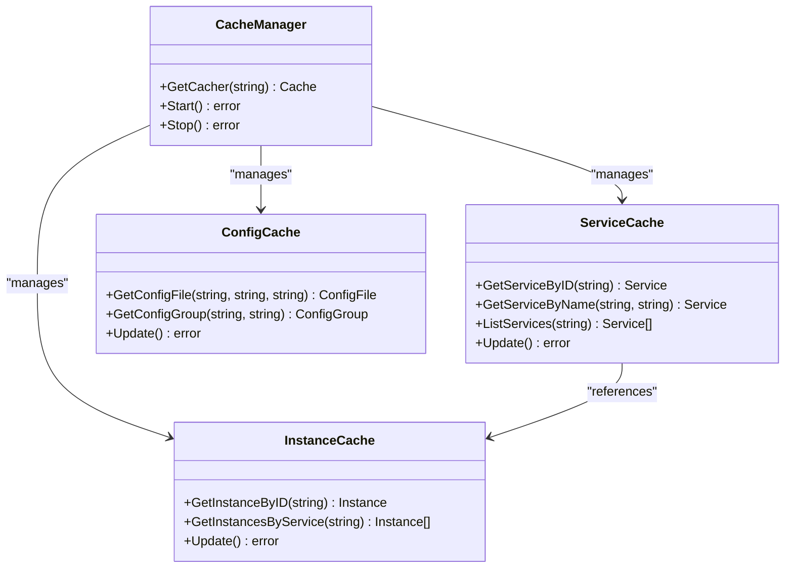

**Diagram sources**
- [cache.go](file://pkg/cache/cache.go#L1-L50)
- [service.go](file://pkg/cache/service/service.go#L0-L799)

**Section sources**
- [cache.go](file://pkg/cache/cache.go#L1-L100)
- [service.go](file://pkg/cache/service/service.go#L0-L799)

### Storage Layer
The storage layer provides persistent storage for all system data using MySQL as the primary database. It implements a plugin interface that could support other storage backends, though MySQL is the only implemented option.

**Section sources**
- [store.go](file://apis/store/store.go#L1-L100)
- [mysql](file://plugin/store/mysql#L1-L50)

## Plugin Architecture
The pole-server system features a flexible plugin architecture that enables extensibility for both API servers and storage backends. Plugins are configured through YAML files and loaded at startup, allowing the system to support multiple protocols without code changes.

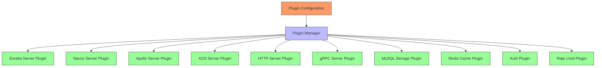

**Diagram sources**
- [plugin.go](file://plugin.go#L1-L50)
- [pole-apiserver.yaml](file://deploy/conf/pole-apiserver.yaml#L1-L128)
- [pole-server.yaml](file://deploy/conf/pole-server.yaml#L1-L173)

**Section sources**
- [plugin.go](file://plugin.go#L1-L100)
- [apiserver.go](file://apis/apiserver/apiserver.go#L1-L100)

### API Server Plugins
API server plugins implement support for different client protocols, allowing pole-server to integrate with various service mesh ecosystems. Each plugin handles protocol-specific details while presenting a consistent interface to the business logic layer.

**Section sources**
- [eurekaserver](file://plugin/apiserver/eurekaserver#L1-L50)
- [nacosserver](file://plugin/apiserver/nacosserver#L1-L50)
- [xdsserverv3](file://plugin/apiserver/xdsserverv3#L1-L50)

### Storage Backend Plugins
Storage backend plugins provide an abstraction layer for persistent data storage. While the current implementation only supports MySQL, the plugin interface allows for future integration with other database systems.

**Section sources**
- [store.go](file://apis/store/store.go#L1-L100)
- [mysql](file://plugin/store/mysql#L1-L50)

## Interceptor Pattern
The interceptor pattern is used throughout the pole-server system to handle cross-cutting concerns such as authentication, rate limiting, and input validation. Interceptors are chained together and executed before and after request processing in the business logic layer.

```mermaid
flowchart LR
A[Incoming Request] --> B[Authentication Interceptor]
B --> C[Rate Limiting Interceptor]
C --> D[Input Validation Interceptor]
D --> E[Whitelist Interceptor]
E --> F[Business Logic Processing]
F --> G[Response]
G --> H[Logging Interceptor]
H --> I[Outgoing Response]
style B fill:#f96,stroke:#333
style C fill:#f96,stroke:#333
style D fill:#f96,stroke:#333
style E fill:#f96,stroke:#333
style H fill:#f96,stroke:#333
```

**Diagram sources**
- [auth.go](file://pkg/service/interceptor/auth/server.go#L1-L50)
- [paramcheck.go](file://pkg/service/interceptor/paramcheck/server.go#L1-L50)
- [ratelimit.go](file://plugin/access_control/ratelimit/token/limiter.go#L1-L50)

**Section sources**
- [auth.go](file://pkg/service/interceptor/auth/server.go#L1-L100)
- [paramcheck.go](file://pkg/service/interceptor/paramcheck/server.go#L1-L100)

## Event-Driven Design
The pole-server system uses an event-driven architecture for internal communication between components. The eventhub module provides a publish-subscribe mechanism that enables loose coupling and asynchronous processing of system events.

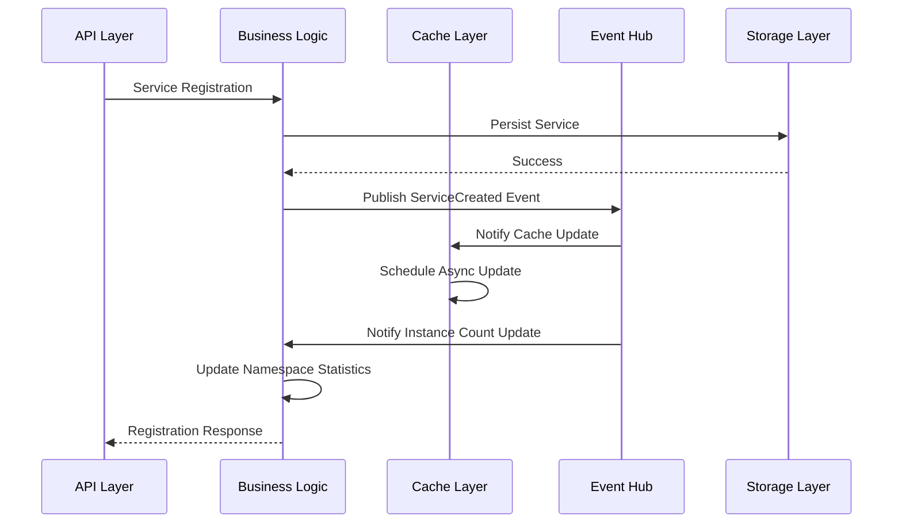

**Diagram sources**
- [eventhub.go](file://pkg/common/eventhub/eventhub.go#L0-L154)
- [server.go](file://pkg/service/server.go#L0-L133)

**Section sources**
- [eventhub.go](file://pkg/common/eventhub/eventhub.go#L0-L154)
- [server.go](file://pkg/service/server.go#L0-L133)

### Event Hub Implementation
The event hub implementation provides a thread-safe publish-subscribe mechanism with support for multiple topics and asynchronous event processing. It is initialized at startup and used throughout the system for internal communication.

**Section sources**
- [eventhub.go](file://pkg/common/eventhub/eventhub.go#L0-L154)

## Component Interactions
This section illustrates the detailed interactions between components during key system operations: service registration, configuration retrieval, and rule updates.

### Service Registration Flow
The service registration flow demonstrates how a new service instance is registered with the system, stored persistently, cached for performance, and made available to consumers.

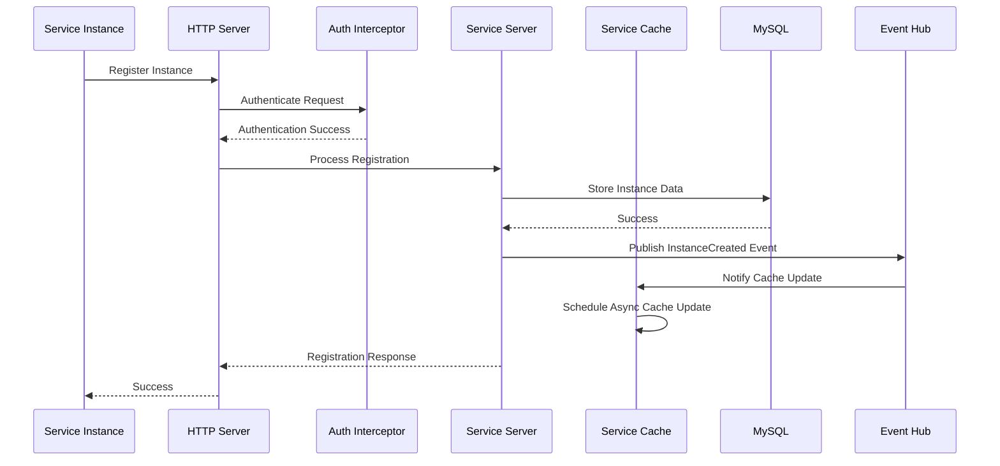

**Diagram sources**
- [server.go](file://pkg/service/server.go#L0-L133)
- [service.go](file://pkg/cache/service/service.go#L0-L799)
- [store.go](file://apis/store/store.go#L1-L30)

**Section sources**
- [server.go](file://pkg/service/server.go#L0-L133)
- [service.go](file://pkg/cache/service/service.go#L0-L799)

### Configuration Retrieval Flow
The configuration retrieval flow shows how client applications obtain configuration data from the system, with responses served from cache when possible to minimize latency.

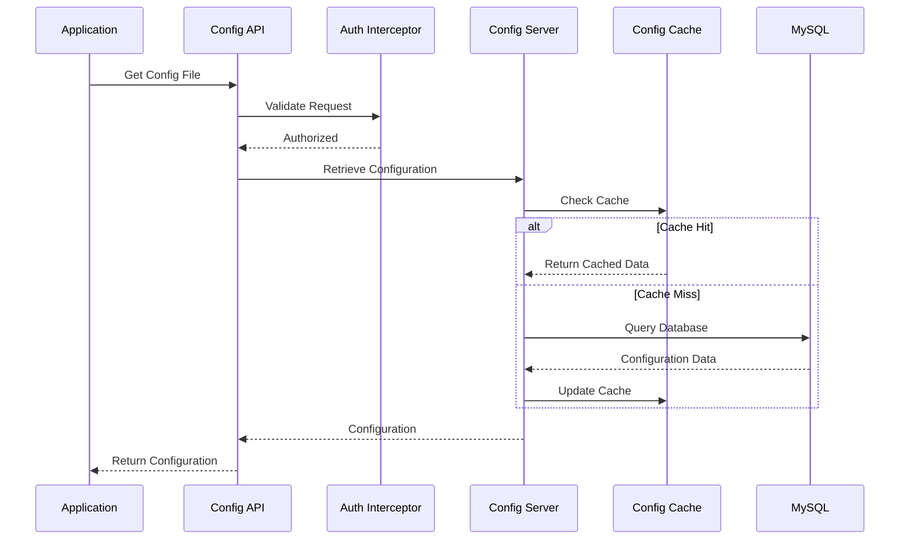

**Diagram sources**
- [config.go](file://pkg/config/server.go#L1-L50)
- [config_cache.go](file://pkg/cache/config/config_file.go#L1-L50)
- [store.go](file://apis/store/store.go#L1-L30)

**Section sources**
- [config.go](file://pkg/config/server.go#L1-L100)
- [config_file.go](file://pkg/cache/config/config_file.go#L1-L100)

### Rule Update Flow
The rule update flow illustrates how governance rules (such as circuit breaker or rate limiting configurations) are updated in the system and propagated to relevant components.

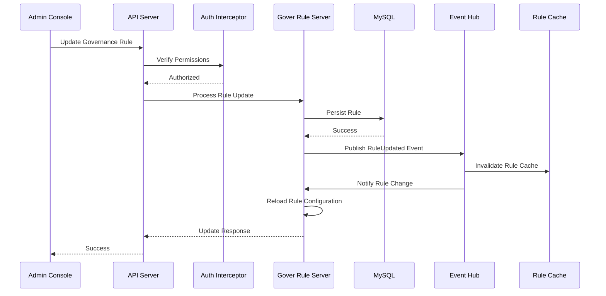

**Diagram sources**
- [goverrule.go](file://pkg/goverrule/server.go#L1-L50)
- [rules_cache.go](file://pkg/cache/rules/router_rule.go#L1-L50)
- [eventhub.go](file://pkg/common/eventhub/eventhub.go#L0-L154)

**Section sources**
- [goverrule.go](file://pkg/goverrule/server.go#L1-L100)
- [router_rule.go](file://pkg/cache/rules/router_rule.go#L1-L100)

## Critical Design Decisions
This section explains the key architectural decisions that shape the pole-server system's behavior and performance characteristics.

### In-Memory Caching with Eventual Persistence
The system employs an in-memory caching strategy with eventual persistence to storage, optimizing for read performance while ensuring data durability. Cache updates are performed asynchronously to avoid blocking request processing.

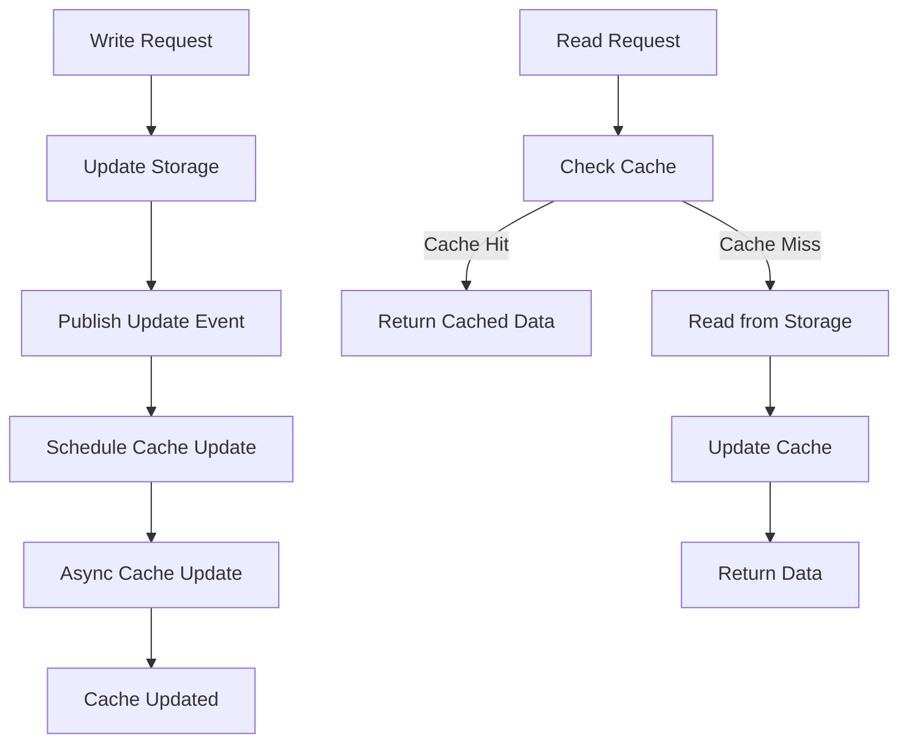

**Section sources**
- [cache.go](file://pkg/cache/cache.go#L1-L100)
- [service.go](file://pkg/cache/service/service.go#L0-L799)

### Protocol Translation Layer
The protocol translation layer enables the system to support multiple client protocols (Eureka, Nacos, etc.) while maintaining a consistent internal API. This abstraction allows client applications to use familiar interfaces while benefiting from a unified backend.

**Section sources**
- [apiserver.go](file://apis/apiserver/apiserver.go#L1-L100)
- [eurekaserver](file://plugin/apiserver/eurekaserver#L1-L50)
- [nacosserver](file://plugin/apiserver/nacosserver#L1-L50)

### Multi-Tenancy via Namespaces
Multi-tenancy is implemented through namespaces, which provide logical isolation between different teams or applications. The system supports both explicit namespace creation and automatic namespace creation based on configuration.

**Section sources**
- [namespace.go](file://pkg/namespace/server.go#L1-L50)
- [pole-server.yaml](file://deploy/conf/pole-server.yaml#L1-L173)

## Scalability, Reliability and Extensibility
This section addresses the system's capabilities in terms of scalability, reliability, and extensibility.

### Scalability Through Horizontal Scaling and Caching
The pole-server system supports horizontal scaling and employs multiple caching strategies to handle high request volumes. The architecture allows multiple instances to operate behind a load balancer, with shared storage ensuring consistency.

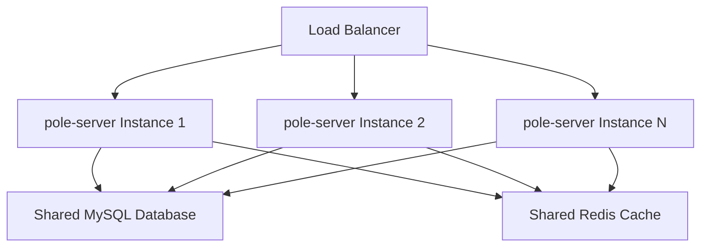

**Section sources**
- [server.go](file://bootstrap/server.go#L0-L717)
- [pole-server.yaml](file://deploy/conf/pole-server.yaml#L1-L173)

### Reliability via Health Checking
Reliability is ensured through comprehensive health checking mechanisms that monitor both client instances and the pole-server system itself. The health checker component periodically verifies instance availability and updates service status accordingly.

**Section sources**
- [healthchecker.go](file://pkg/service/healthcheck/server.go#L1-L50)
- [healthcheck](file://bootstrap/config/config.go#L1-L127)

### Extensibility via Plugin Interfaces
The system's extensibility is achieved through well-defined plugin interfaces that allow new functionality to be added without modifying the core codebase. This design enables the integration of new protocols, storage backends, and features.

**Section sources**
- [plugin.go](file://plugin.go#L1-L100)
- [apiserver.go](file://apis/apiserver/apiserver.go#L1-L100)

## Technology Stack
The pole-server system is built using a modern technology stack that combines Go's performance and concurrency features with established protocols and data storage solutions.

**Table: Technology Stack Components**

| Category | Technology | Purpose | Configuration File |
|---------|-----------|---------|-------------------|
| Programming Language | Go | Core implementation language | go.mod |
| RPC Framework | gRPC | Internal service communication and client API | pole-apiserver.yaml |
| Web Framework | REST | HTTP-based client API | pole-apiserver.yaml |
| Data Storage | MySQL | Persistent data storage | pole-server.yaml |
| Caching | In-memory | High-performance data access | pole-server.yaml |
| Service Discovery | Eureka, Nacos, Apollo | Integration with multiple service discovery systems | pole-apiserver.yaml |
| Configuration Management | Custom | Dynamic configuration management | pole-server.yaml |
| Observability | Prometheus, Logging | Monitoring and troubleshooting | pole-server.yaml |
| Security | TLS, Authentication | Secure communication and access control | pole-server.yaml |

**Section sources**
- [go.mod](file://go.mod#L1-L50)
- [pole-server.yaml](file://deploy/conf/pole-server.yaml#L1-L173)
- [pole-apiserver.yaml](file://deploy/conf/pole-apiserver.yaml#L1-L128)