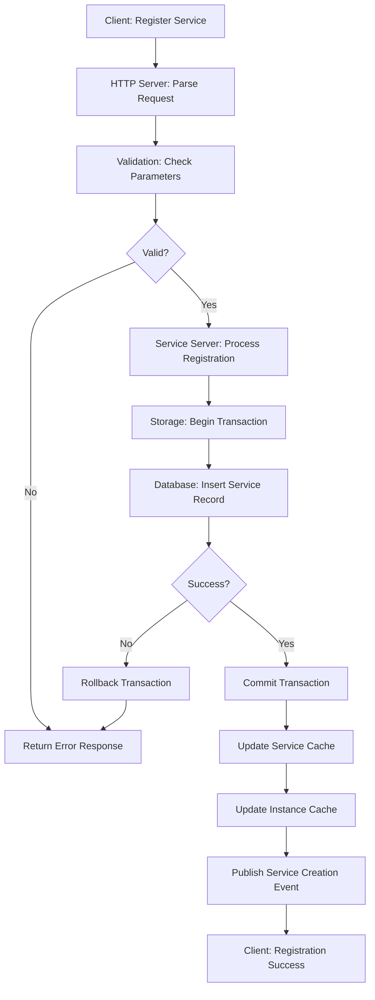
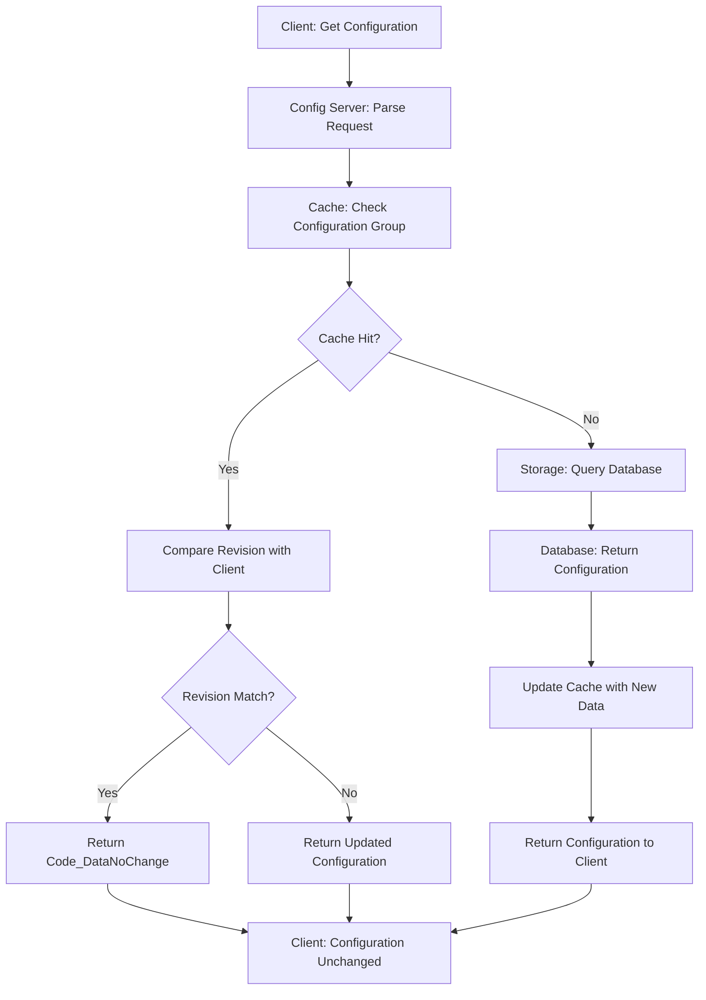
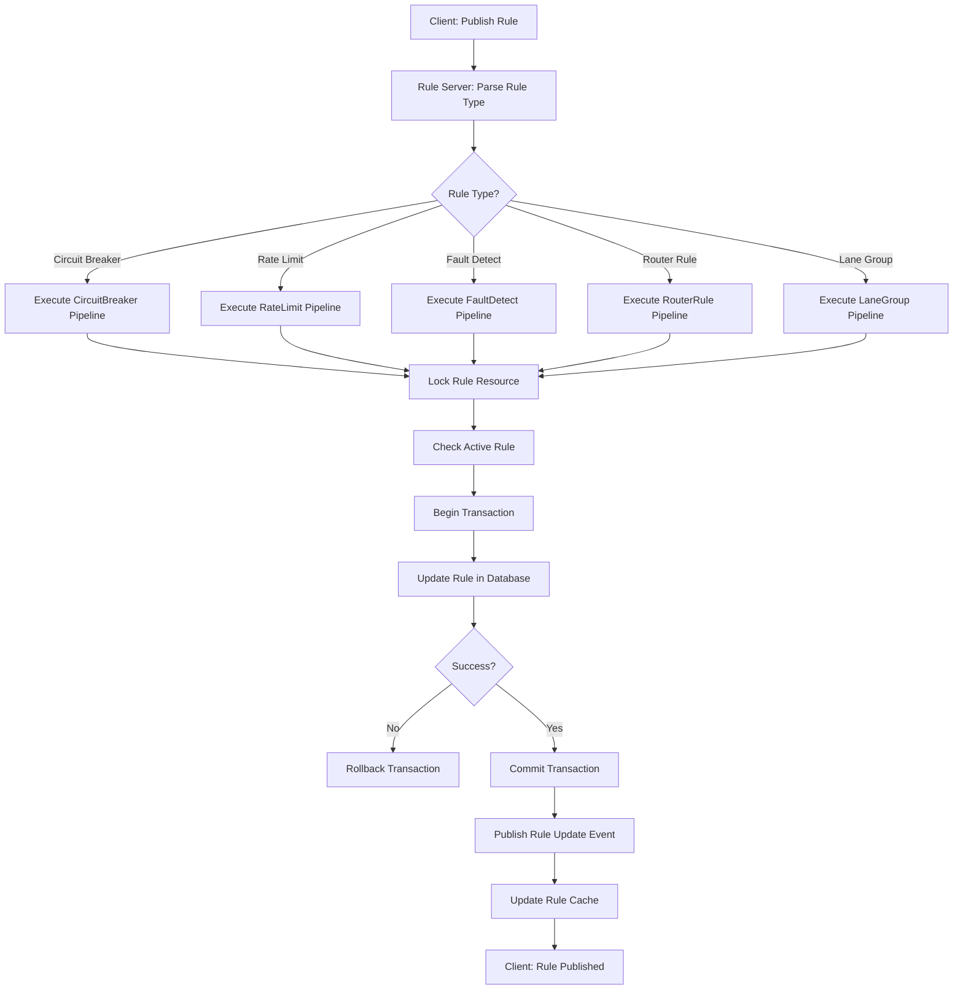
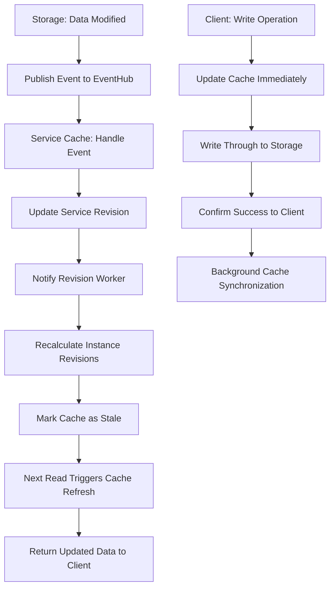
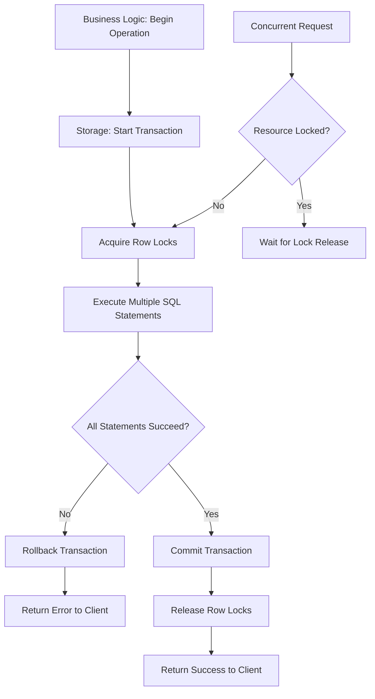
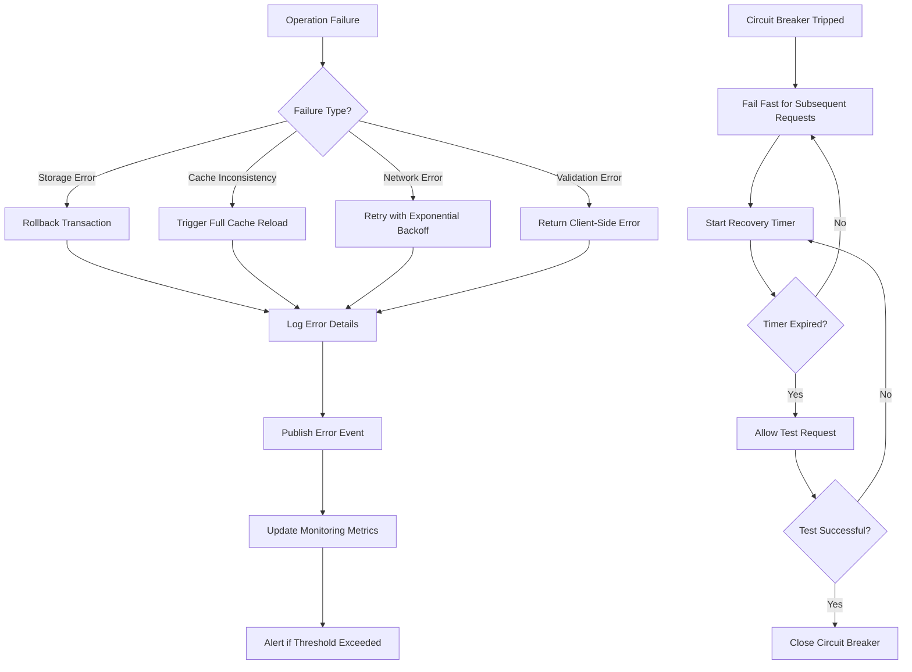
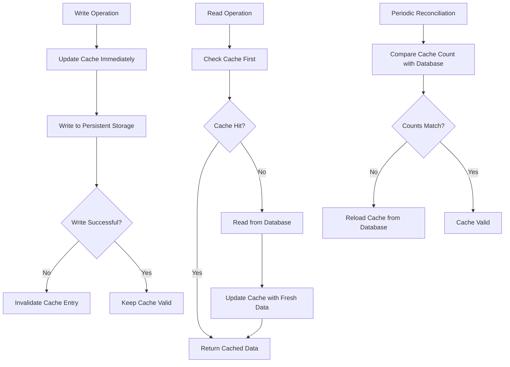
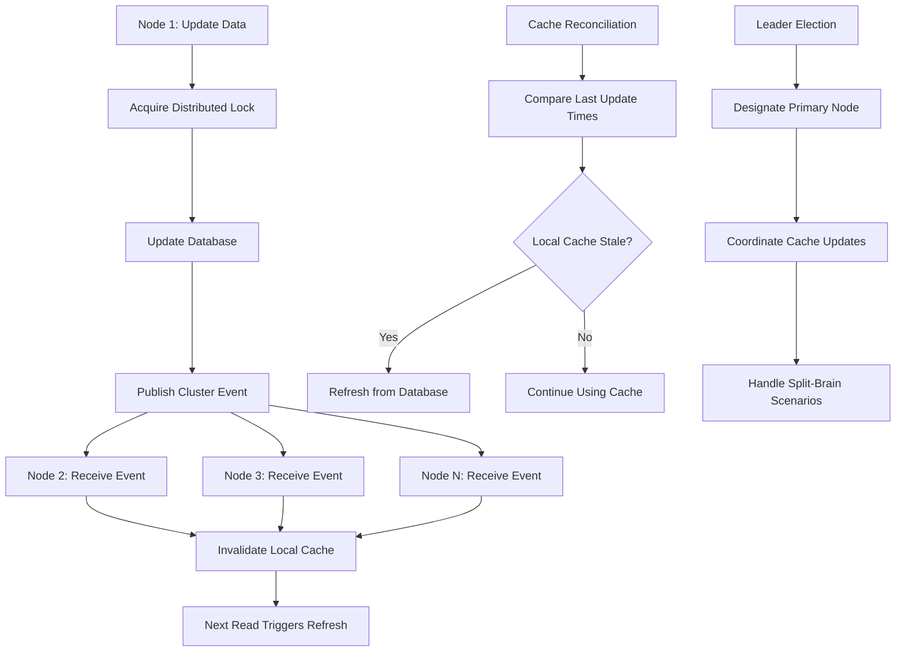

# Data Flow Mechanisms

<cite>
**Referenced Files in This Document**   
- [service.go](file://pkg/service/service.go)
- [server.go](file://pkg/service/server.go)
- [instance.go](file://pkg/cache/service/instance.go)
- [service.go](file://pkg/cache/service/service.go)
- [config.go](file://pkg/config/server.go)
- [client.go](file://pkg/config/client.go)
- [releases.go](file://pkg/goverrule/releases.go)
- [server.go](file://pkg/goverrule/server.go)
- [service_contract.go](file://pkg/service/service_contract.go)
- [service_contract.go](file://plugin/store/mysql/service_contract.go)
- [circuitbreaker_access.go](file://plugin/apiserver/httpserver/discover/circuitbreaker_access.go)
</cite>

## Table of Contents
1. [Service Registration Data Flow](#service-registration-data-flow)
2. [Configuration Retrieval Data Flow](#configuration-retrieval-data-flow)
3. [Governance Rules Management](#governance-rules-management)
4. [Cache Invalidation Strategies](#cache-invalidation-strategies)
5. [Storage Transaction Boundaries](#storage-transaction-boundaries)
6. [Error Recovery Mechanisms](#error-recovery-mechanisms)
7. [Cache Consistency Models](#cache-consistency-models)
8. [Clustered Cache Coherence](#clustered-cache-coherence)

## Service Registration Data Flow

The service registration process begins with an API request that is processed through a series of validation, storage, and distribution steps. The flow starts in the HTTP server layer, proceeds through business logic processing, persists to storage with transactional integrity, updates in-memory caches, and finally publishes events to notify interested parties.

**Diagram sources**
- [service.go](file://pkg/service/service.go#L120-L151)
- [server.go](file://pkg/service/server.go#L120-L151)

**Section sources**
- [service.go](file://pkg/service/service.go#L120-L151)
- [server.go](file://pkg/service/server.go#L120-L151)

## Configuration Retrieval Data Flow

Configuration retrieval follows a hierarchical lookup pattern that prioritizes cache performance while ensuring data consistency. The process begins with a client request that first checks the in-memory cache for the requested configuration. If the cache contains the data and the client's revision matches, a "no change" response is returned. Otherwise, the system falls back to persistent storage and updates the cache with fresh data.

**Diagram sources**
- [client.go](file://pkg/config/client.go#L205-L243)
- [server.go](file://pkg/config/server.go#L205-L243)

**Section sources**
- [client.go](file://pkg/config/client.go#L205-L243)
- [server.go](file://pkg/config/server.go#L205-L243)

## Governance Rules Management

Governance rules management follows a publish-subscribe pattern with transactional guarantees. The system supports various rule types including circuit breaking, rate limiting, fault detection, routing, and lane management. Each rule publication goes through a standardized pipeline that ensures atomic updates, proper locking to prevent race conditions, and event publishing for cache invalidation.

**Diagram sources**
- [releases.go](file://pkg/goverrule/releases.go#L204-L252)
- [server.go](file://pkg/goverrule/server.go#L204-L252)

**Section sources**
- [releases.go](file://pkg/goverrule/releases.go#L204-L252)
- [server.go](file://pkg/goverrule/server.go#L204-L252)

## Cache Invalidation Strategies

The system employs multiple cache invalidation strategies to maintain data consistency across distributed components. For service and instance data, cache updates are triggered by storage layer events through the eventhub system. When a service or instance is modified, the corresponding cache entries are invalidated and scheduled for refresh. The system uses a revision-based approach where changes to services automatically trigger recalculation of instance revisions, ensuring clients receive updated data.

**Section sources**
- [instance.go](file://pkg/cache/service/instance.go#L120-L167)
- [service.go](file://pkg/cache/service/service.go#L120-L167)

## Storage Transaction Boundaries

Storage operations use explicit transaction boundaries to ensure data consistency and atomicity. The system wraps related database operations in transactions that either commit completely or roll back on failure. Transactions are initiated at the storage layer and managed through a transaction interface that provides commit, rollback, and read view creation capabilities. Critical operations like service contract management use transactions to ensure that related data (such as service metadata and interface details) are updated atomically.

**Section sources**
- [service_contract.go](file://plugin/store/mysql/service_contract.go#L172-L215)
- [service_contract.go](file://plugin/store/mysql/service_contract.go#L217-L253)
- [service_contract.go](file://plugin/store/mysql/service_contract.go#L255-L289)

## Error Recovery Mechanisms

The system implements comprehensive error recovery mechanisms at multiple levels. For storage operations, transactions provide automatic rollback on failure, ensuring data consistency. The cache layer includes reconciliation processes that detect and correct inconsistencies between cache and persistent storage. When cache data becomes stale or inconsistent, the system automatically falls back to direct database queries and rebuilds the cache. The system also includes retry mechanisms for transient failures and circuit breakers to prevent cascading failures in distributed scenarios.

**Section sources**
- [service.go](file://pkg/service/service.go#L120-L151)
- [releases.go](file://pkg/goverrule/releases.go#L425-L460)

## Cache Consistency Models

The system employs a hybrid cache consistency model that combines write-through caching for critical data with periodic refresh for high-read scenarios. For service and instance data, the system uses an event-driven invalidation model where changes to the underlying data immediately invalidate the corresponding cache entries. Configuration data uses a revision-based consistency model where clients include their current revision in requests, allowing the server to quickly determine if data has changed without transferring the full dataset.

**Section sources**
- [instance.go](file://pkg/cache/service/instance.go#L120-L167)
- [service.go](file://pkg/cache/service/service.go#L120-L167)

## Clustered Cache Coherence

In clustered deployments, the system maintains cache coherence through a combination of distributed events and shared storage. When a node updates data, it publishes events through the eventhub system that are received by all cluster nodes, triggering local cache invalidation. The system also uses database-based locking mechanisms to coordinate updates across nodes, preventing race conditions. For high-frequency updates, the system employs batching and deduplication to reduce network overhead while maintaining consistency.

**Section sources**
- [instance.go](file://pkg/cache/service/instance.go#L120-L167)
- [service.go](file://pkg/cache/service/service.go#L120-L167)
- [server.go](file://pkg/service/server.go#L120-L151)