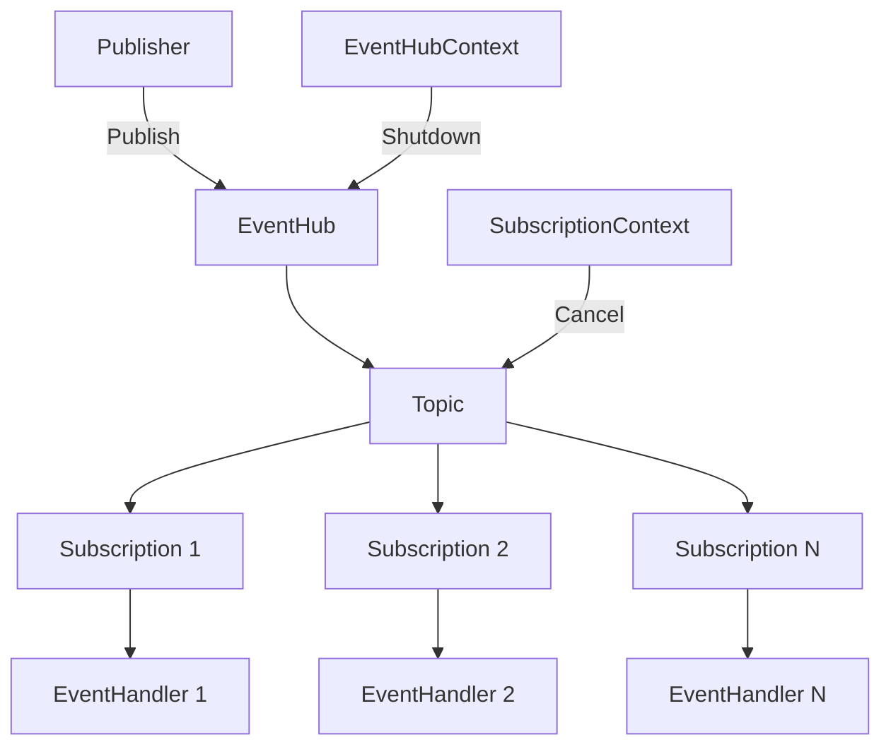
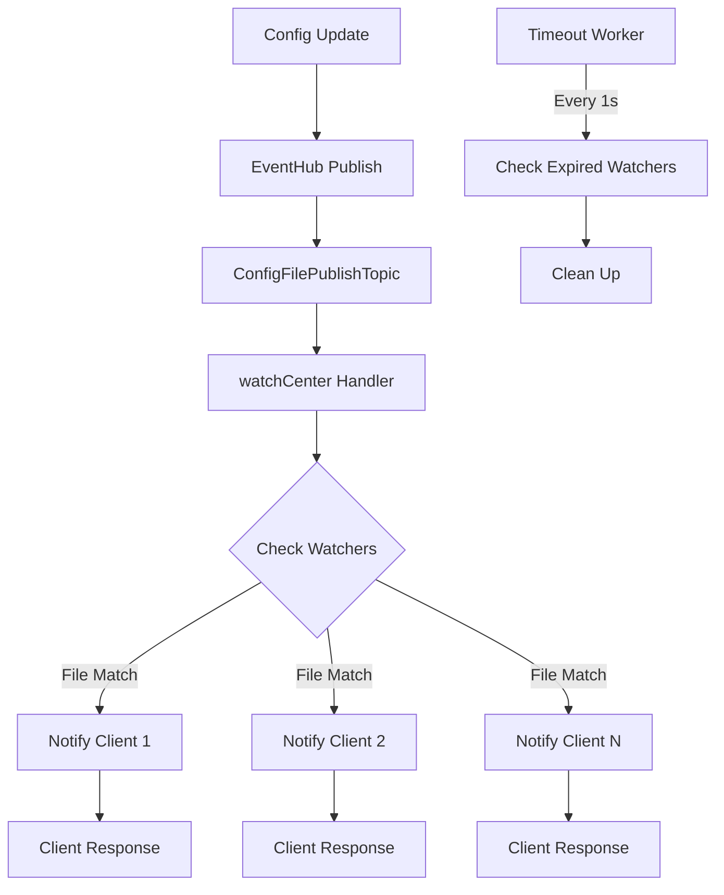
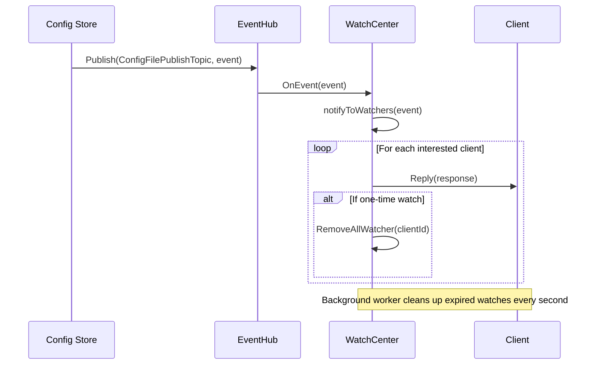
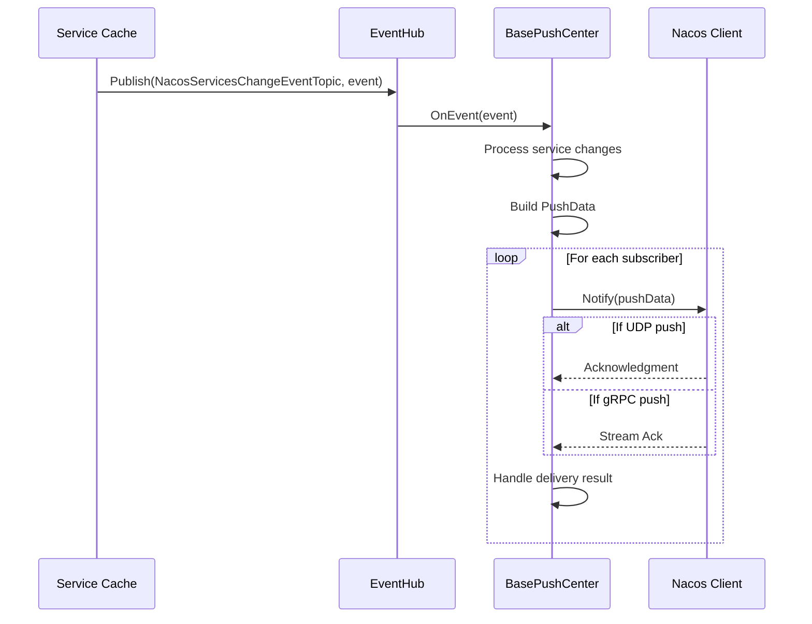

# Event-Driven Design

<cite>
**Referenced Files in This Document**   
- [eventhub.go](file://pkg/common/eventhub/eventhub.go)
- [topic.go](file://pkg/common/eventhub/topic.go)
- [subscription.go](file://pkg/common/eventhub/subscription.go)
- [types.go](file://pkg/common/eventhub/types.go)
- [watcher.go](file://pkg/config/watcher.go)
- [push.go](file://plugin/apiserver/nacosserver/core/push.go)
- [subscribe.go](file://plugin/apiserver/nacosserver/v2/discover/subscribe.go)
- [grpc_push.go](file://plugin/apiserver/nacosserver/v2/discover/grpc_push.go)
- [event.go](file://pkg/service/event.go)
- [instance.go](file://apis/pkg/types/service/instance.go)
</cite>

## Table of Contents
1. [Introduction](#introduction)
2. [EventHub Architecture](#eventhub-architecture)
3. [Core Event Types](#core-event-types)
4. [Configuration Change Propagation](#configuration-change-propagation)
5. [Service Instance Event Handling](#service-instance-event-handling)
6. [Nacos Server Push Mechanisms](#nacos-server-push-mechanisms)
7. [Event Subscription Patterns](#event-subscription-patterns)
8. [Error Handling and Reliability](#error-handling-and-reliability)
9. [Sequence Diagrams](#sequence-diagrams)

## Introduction
The pole-server implements an event-driven architecture using the eventhub system to facilitate internal communication between components through publish-subscribe semantics. This document details how the pkg/common/eventhub package enables real-time notifications for configuration changes, service instance updates, and governance rule modifications. The system provides reliable event delivery with configurable queue sizes, supports multiple subscription patterns, and ensures proper cleanup of resources through context cancellation. The architecture enables loose coupling between components while maintaining high performance and reliability in distributed service management scenarios.

## EventHub Architecture
The eventhub system in pole-server implements a publish-subscribe messaging pattern that enables decoupled communication between components. The architecture centers around the eventHub struct which manages topics and their subscriptions. Each topic maintains a queue of events and a collection of subscribers, with events being dispatched to all active subscriptions when published. The system uses Go channels for internal message passing and employs RWMutex for thread-safe access to shared data structures. Topics are created on-demand when first accessed, and each runs in its own goroutine to process incoming events and distribute them to subscribers.

**Diagram sources**
- [eventhub.go](file://pkg/common/eventhub/eventhub.go#L53-L105)
- [topic.go](file://pkg/common/eventhub/topic.go#L0-L54)

**Section sources**
- [eventhub.go](file://pkg/common/eventhub/eventhub.go#L0-L153)
- [topic.go](file://pkg/common/eventhub/topic.go#L0-L134)

## Core Event Types
The pole-server system defines several core event types that represent changes in the system state. Configuration events include ConfigFilePublishTopic which signals updates to configuration files, carrying PublishConfigFileEvent objects with details about the modified file. Service instance events are represented by InstanceEvent objects that capture changes to service instances, including creation, updates, and health status changes. Governance rule events track modifications to circuit breaker rules, rate limiting configurations, and routing rules. Service events include ServiceEvent objects that represent changes to service metadata or settings. These event types enable components to react to changes in the system without tight coupling to the components that generate these changes.

**Section sources**
- [types.go](file://pkg/common/eventhub/types.go#L0-L23)
- [instance.go](file://apis/pkg/types/service/instance.go#L445-L593)

## Configuration Change Propagation
The configuration change propagation system in pole-server uses the eventhub to notify clients of configuration updates. The watchCenter component subscribes to the ConfigFilePublishTopic and acts as an event handler, receiving notifications when configuration files are published. When an event is received, the watchCenter identifies all clients that have registered interest in the modified configuration file and sends them notifications. Clients register their interest through the AddWatcher method, specifying which configuration files they want to monitor. The system supports both long-polling and push-based notification models, with the watchCenter managing the lifecycle of watch contexts and automatically cleaning up expired subscriptions through a background worker that runs every second.

**Diagram sources**
- [watcher.go](file://pkg/config/watcher.go#L204-L239)
- [watcher.go](file://pkg/config/watcher.go#L370-L410)

**Section sources**
- [watcher.go](file://pkg/config/watcher.go#L0-L411)

## Service Instance Event Handling
Service instance event handling in pole-server is implemented through the BaseInstanceEventHandler which processes InstanceEvent objects published to the eventhub. The handler performs preprocessing by resolving service names from service IDs before the main event processing occurs. This resolution is necessary because events may initially contain only service IDs without the corresponding namespace and service name information. The event handler uses a service resolver function to look up service details from the cache. Instance events include various types such as instance registration, health status changes, and deregistration. The system also tracks metadata about events, allowing contextual information to be passed through the event processing pipeline.

**Section sources**
- [event.go](file://pkg/service/event.go#L41-L68)
- [instance.go](file://apis/pkg/types/service/instance.go#L494-L548)

## Nacos Server Push Mechanisms
The Nacos server push mechanisms in pole-server implement real-time notification of service instance changes to connected clients. The GrpcPushCenter component subscribes to the NacosServicesChangeEventTopic and processes NacosServicesChangeEvent objects that contain information about service changes. When an event is received, the push center identifies all subscribers interested in the affected service and sends push notifications through their established gRPC streams. The system uses a BasePushCenter that maintains a registry of clients and their subscriptions, organized by namespace and service key. Push notifications include service metadata and instance information, with data compressed when necessary to reduce network overhead. The push system also tracks inflight requests and handles acknowledgments from clients to ensure reliable delivery.

**Section sources**
- [push.go](file://plugin/apiserver/nacosserver/core/push.go#L225-L266)
- [grpc_push.go](file://plugin/apiserver/nacosserver/v2/discover/grpc_push.go#L0-L46)

## Event Subscription Patterns
The eventhub system supports multiple subscription patterns to accommodate different use cases. The primary pattern uses the Subscribe function which takes a topic name and an EventHandler implementation, returning a SubscriptionContext that can be used to cancel the subscription. A convenience pattern is provided through SubscribeWithFunc which allows using a simple function as an event handler instead of implementing the full Handler interface. Subscribers can configure their queue size using the WithQueueSize option, which determines how many events can be buffered when the handler is slow to process them. The system also supports one-time subscriptions through the IsOnce method in the WatchContext interface, which automatically cancels the subscription after the first notification is delivered.

**Section sources**
- [eventhub.go](file://pkg/common/eventhub/eventhub.go#L53-L105)
- [subscription.go](file://pkg/common/eventhub/subscription.go#L0-L51)

## Error Handling and Reliability
The eventhub system implements several reliability mechanisms to ensure robust event delivery. Each subscription has its own error handling, with the system logging errors that occur during event processing but continuing to process subsequent events. The use of buffered channels with configurable sizes provides backpressure handling, allowing temporary spikes in event production without losing messages. The system handles context cancellation gracefully, with both subscription and eventhub shutdown procedures ensuring proper cleanup of resources. For configuration watches, the system includes timeout handling through a background worker that identifies and cleans up expired watch contexts, sending appropriate responses to clients before removing them. The push mechanisms in the Nacos server include acknowledgment handling and retry logic for failed deliveries.

**Section sources**
- [subscription.go](file://pkg/common/eventhub/subscription.go#L107-L151)
- [watcher.go](file://pkg/config/watcher.go#L370-L410)

## Sequence Diagrams

### Configuration Change to Client Notification

**Diagram sources**
- [eventhub.go](file://pkg/common/eventhub/eventhub.go#L107-L152)
- [watcher.go](file://pkg/config/watcher.go#L322-L368)

### Service Instance Change to Nacos Push

**Diagram sources**
- [push.go](file://plugin/apiserver/nacosserver/core/push.go#L225-L266)
- [subscribe.go](file://plugin/apiserver/nacosserver/v2/discover/subscribe.go#L83-L102)