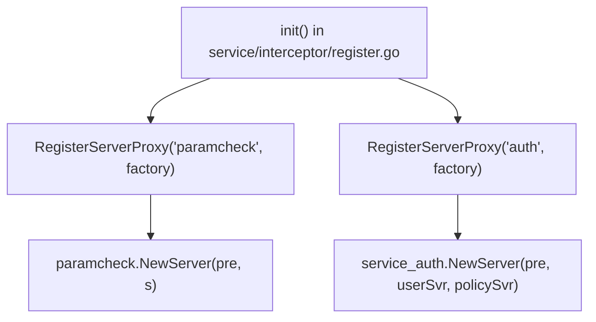
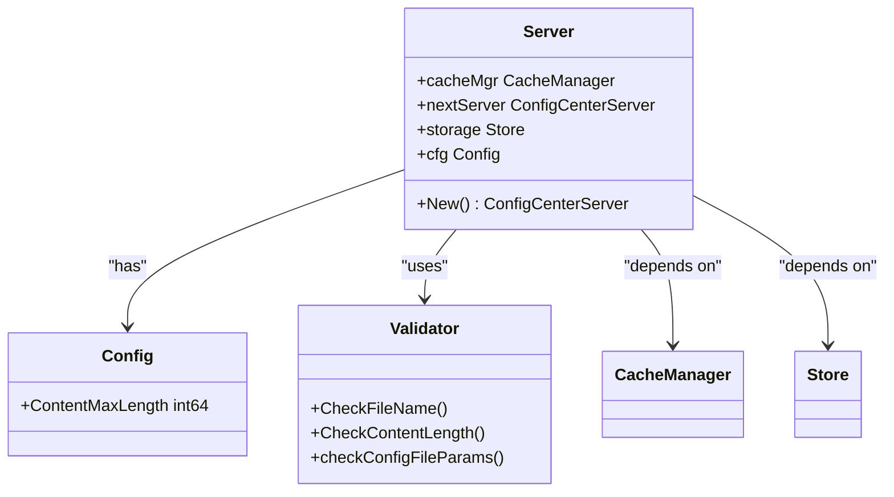
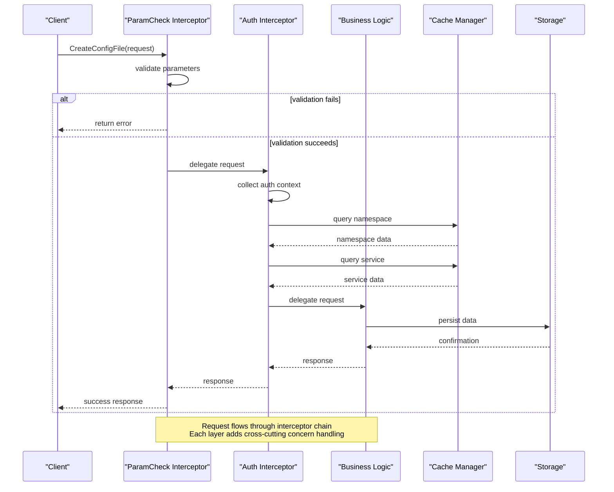

# Interceptor Pattern

<cite>
**Referenced Files in This Document**   
- [pkg/service/interceptor/auth/server.go](file://pkg/service/interceptor/auth/server.go)
- [pkg/config/interceptor/paramcheck/server.go](file://pkg/config/interceptor/paramcheck/server.go)
- [pkg/service/interceptor/register.go](file://pkg/service/interceptor/register.go)
- [pkg/config/interceptor/register.go](file://pkg/config/interceptor/register.go)
- [pkg/goverrule/interceptor/register.go](file://pkg/goverrule/interceptor/register.go)
</cite>

## Table of Contents
1. [Introduction](#introduction)
2. [Interceptor Architecture Overview](#interceptor-architecture-overview)
3. [Interceptor Registration Mechanism](#interceptor-registration-mechanism)
4. [Execution Chain and Request Flow](#execution-chain-and-request-flow)
5. [Concrete Examples of Interceptor Implementation](#concrete-examples-of-interceptor-implementation)
6. [Sequence Diagram: Request Processing Flow](#sequence-diagram-request-processing-flow)
7. [Best Practices for Custom Interceptors](#best-practices-for-custom-interceptors)
8. [Performance Considerations](#performance-considerations)
9. [Conclusion](#conclusion)

## Introduction
The interceptor pattern in pole-server provides a modular mechanism for implementing cross-cutting concerns across major system modules including service management, configuration management, and governance rules. This documentation details how interceptors handle authentication, parameter validation, and audit logging through a chain-of-responsibility design pattern. The system enables transparent injection of pre-processing and post-processing logic without modifying core business logic, promoting separation of concerns and code reuse across the service, config, and goverrule modules.

## Interceptor Architecture Overview
The interceptor architecture in pole-server follows a proxy-based chain pattern where each interceptor wraps the next component in the chain, forming a layered processing pipeline. Each major module (service, config, goverrule) implements its own interceptor chain that processes requests before they reach the business logic layer. The architecture separates concerns into distinct interceptor types:

- **Authentication interceptors**: Handle identity verification and authorization checks
- **Parameter validation interceptors**: Validate request parameters and enforce data constraints
- **Audit logging interceptors**: Record operation details for compliance and monitoring

The interceptors operate on a proxy pattern where each interceptor receives a reference to the next server in the chain, allowing it to perform pre-processing, delegate to the next handler, and optionally perform post-processing.

**Section sources**
- [pkg/service/interceptor/auth/server.go](file://pkg/service/interceptor/auth/server.go#L1-L50)
- [pkg/config/interceptor/paramcheck/server.go](file://pkg/config/interceptor/paramcheck/server.go#L1-L50)

## Interceptor Registration Mechanism
Interceptor registration occurs through module-specific `register.go` files that use the `init()` function to register interceptor factories with their respective modules. Each module provides a `RegisterServerProxy` function that accepts a name and factory function for creating interceptor instances.

The registration process follows these steps:
1. Each interceptor module contains a `register.go` file with an `init()` function
2. During package initialization, the `init()` function registers one or more interceptors
3. The registration associates a string identifier with a factory function
4. Factory functions create interceptor instances that wrap the next server in the chain

For example, the service module registers both parameter checking and authentication interceptors:

**Diagram sources**
- [pkg/service/interceptor/register.go](file://pkg/service/interceptor/register.go#L10-L50)
- [pkg/config/interceptor/register.go](file://pkg/config/interceptor/register.go#L10-L35)

**Section sources**
- [pkg/service/interceptor/register.go](file://pkg/service/interceptor/register.go#L1-L54)
- [pkg/config/interceptor/register.go](file://pkg/config/interceptor/register.go#L1-L55)
- [pkg/goverrule/interceptor/register.go](file://pkg/goverrule/interceptor/register.go#L1-L52)

## Execution Chain and Request Flow
The interceptor execution chain follows a nested proxy pattern where each interceptor wraps the next component in the processing pipeline. When a request enters the system, it passes through each interceptor in sequence, with each layer potentially modifying the request, performing validation, or enforcing security policies before delegating to the next handler.

The execution flow follows this pattern:
1. Request enters the outermost interceptor
2. Interceptor performs pre-processing (validation, authentication, logging)
3. If processing should continue, interceptor delegates to the next server in the chain
4. Inner interceptors repeat the process
5. Core business logic executes at the end of the chain
6. Control returns through the chain in reverse order for post-processing

This creates a layered security and validation model where cross-cutting concerns are handled consistently across all operations.

**Section sources**
- [pkg/service/interceptor/auth/server.go](file://pkg/service/interceptor/auth/server.go#L50-L100)
- [pkg/config/interceptor/paramcheck/server.go](file://pkg/config/interceptor/paramcheck/server.go#L50-L100)

## Concrete Examples of Interceptor Implementation

### Authentication Interceptor Example
The authentication interceptor in `pkg/service/interceptor/auth/server.go` demonstrates how identity and authorization are enforced. It collects authentication context by querying the cache for namespace and service information, then constructs an `AcquireContext` with resource entries for authorization checking.

The interceptor uses dependency injection to receive the next server in the chain (`nextSvr`), user service (`userSvr`), and policy service (`policySvr`). During request processing, it gathers resource information and delegates authorization decisions to the policy server.

### Parameter Validation Interceptor Example
The parameter validation interceptor in `pkg/config/interceptor/paramcheck/server.go` shows how input validation is implemented. It validates configuration file parameters including namespace, group, name, and content length against configurable limits.

The interceptor receives configuration parameters through its constructor, allowing maximum content length to be configured externally. It implements specific validation functions like `CheckFileName` and `CheckContentLength` that return appropriate error responses when validation fails.

**Diagram sources**
- [pkg/config/interceptor/paramcheck/server.go](file://pkg/config/interceptor/paramcheck/server.go#L20-L50)

**Section sources**
- [pkg/service/interceptor/auth/server.go](file://pkg/service/interceptor/auth/server.go#L1-L263)
- [pkg/config/interceptor/paramcheck/server.go](file://pkg/config/interceptor/paramcheck/server.go#L1-L178)

## Sequence Diagram: Request Processing Flow
The following sequence diagram illustrates how a configuration management request flows through multiple interceptors before reaching the business logic:

**Diagram sources**
- [pkg/service/interceptor/auth/server.go](file://pkg/service/interceptor/auth/server.go#L100-L150)
- [pkg/config/interceptor/paramcheck/server.go](file://pkg/config/interceptor/paramcheck/server.go#L100-L150)

## Best Practices for Custom Interceptors
When implementing custom interceptors in the pole-server framework, follow these best practices:

1. **Follow the proxy pattern**: Always accept the next server in the chain as a constructor parameter
2. **Use dependency injection**: Receive required services through constructor parameters rather than global access
3. **Maintain request context**: Preserve and enhance the request context as it flows through the chain
4. **Handle errors consistently**: Return standardized error responses appropriate for the operation
5. **Minimize side effects**: Keep interceptor logic focused on cross-cutting concerns
6. **Support configuration**: Allow behavior to be configured through external configuration where appropriate
7. **Implement proper logging**: Use the system's logging framework to record important operations and errors

Custom interceptors should focus on single responsibilities such as validation, authentication, logging, or rate limiting, avoiding complex business logic that belongs in the core service layer.

**Section sources**
- [pkg/service/interceptor/auth/server.go](file://pkg/service/interceptor/auth/server.go#L1-L263)
- [pkg/config/interceptor/paramcheck/server.go](file://pkg/config/interceptor/paramcheck/server.go#L1-L178)

## Performance Considerations
When chaining multiple interceptors, consider the following performance implications:

1. **Chain length**: Each additional interceptor adds overhead to request processing. Evaluate whether all interceptors are necessary for each operation.
2. **Caching strategies**: Interceptors that query data (like the auth interceptor querying cache) should consider caching results when appropriate to avoid redundant lookups.
3. **Early termination**: Validate and reject invalid requests as early as possible in the chain to avoid unnecessary processing.
4. **Asynchronous operations**: Consider whether certain interceptor operations (like audit logging) can be performed asynchronously to reduce request latency.
5. **Configuration tuning**: Parameters like maximum content length should be configurable to balance security and performance requirements.

The current implementation shows attention to performance through the use of set data structures for efficient namespace tracking and careful management of cache lookups.

**Section sources**
- [pkg/service/interceptor/auth/server.go](file://pkg/service/interceptor/auth/server.go#L150-L263)
- [pkg/config/interceptor/paramcheck/server.go](file://pkg/config/interceptor/paramcheck/server.go#L150-L178)

## Conclusion
The interceptor pattern in pole-server provides a robust mechanism for implementing cross-cutting concerns across the service, config, and goverrule modules. By using a proxy-based chain pattern with centralized registration through `register.go` files, the system achieves consistent application of authentication, parameter validation, and other concerns without coupling them to business logic. The examples from `pkg/service/interceptor/auth/server.go` and `pkg/config/interceptor/paramcheck/server.go` demonstrate how interceptors can modify request flow while maintaining separation of concerns. When implementing custom interceptors, developers should follow the established patterns of dependency injection, consistent error handling, and focused responsibility to ensure compatibility with the existing architecture.