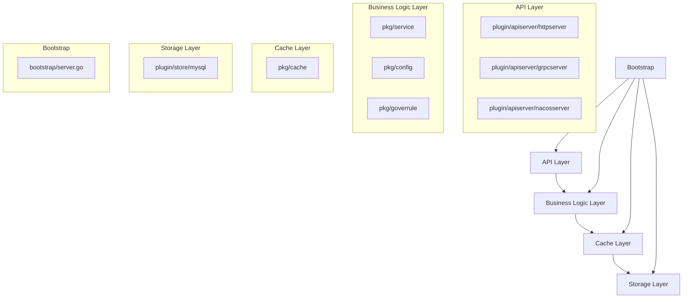
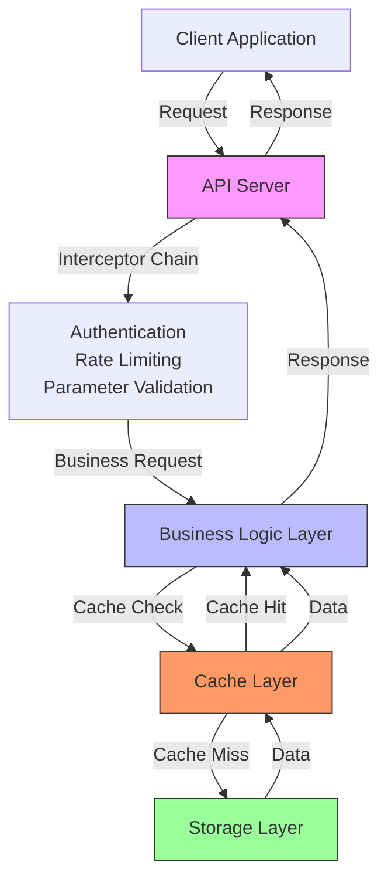
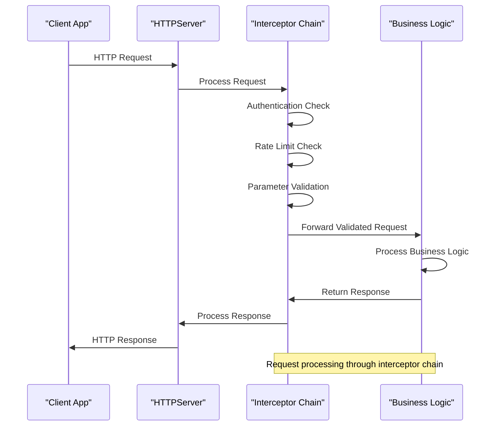
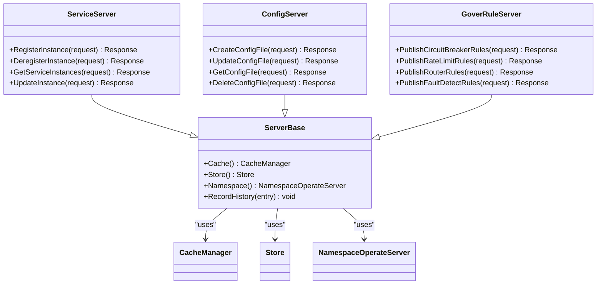
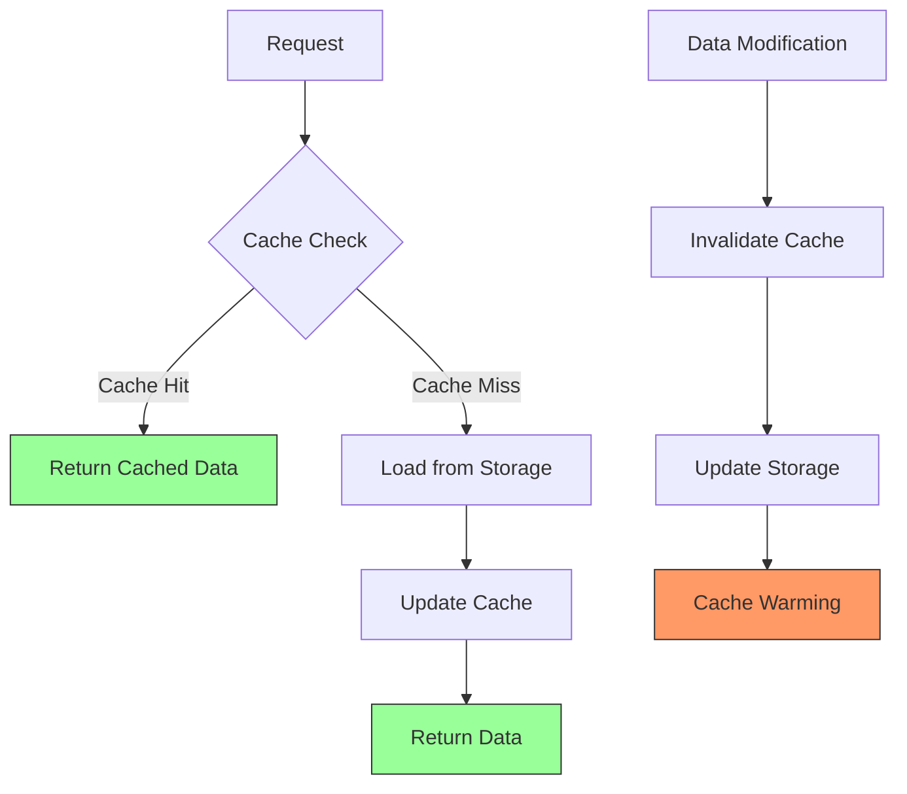
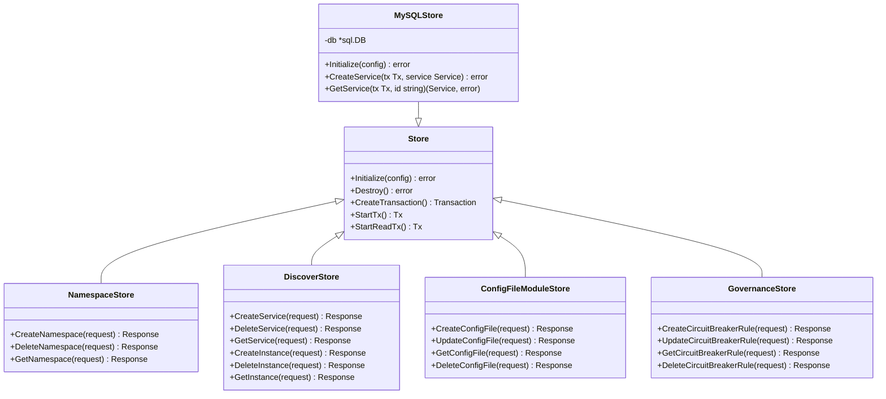
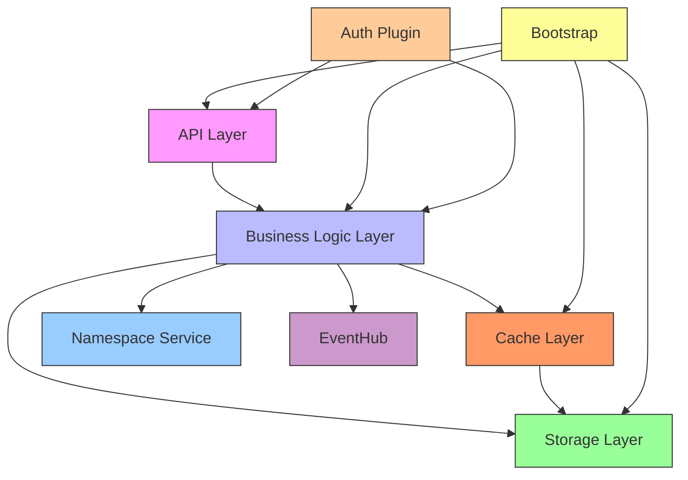

# Layered Architecture

<cite>
**Referenced Files in This Document**   
- [bootstrap/server.go](file://bootstrap/server.go)
- [pkg/service/server.go](file://pkg/service/server.go)
- [pkg/config/server.go](file://pkg/config/server.go)
- [pkg/goverrule/server.go](file://pkg/goverrule/server.go)
- [pkg/cache/default.go](file://pkg/cache/default.go)
- [apis/store/api.go](file://apis/store/api.go)
- [plugin/apiserver/httpserver/server.go](file://plugin/apiserver/httpserver/server.go)
- [pkg/goverrule/releases.go](file://pkg/goverrule/releases.go)
- [pkg/goverrule/api.go](file://pkg/goverrule/api.go)
</cite>

## Table of Contents
1. [Introduction](#introduction)
2. [Project Structure](#project-structure)
3. [Core Components](#core-components)
4. [Architecture Overview](#architecture-overview)
5. [Detailed Component Analysis](#detailed-component-analysis)
6. [Dependency Analysis](#dependency-analysis)
7. [Performance Considerations](#performance-considerations)
8. [Troubleshooting Guide](#troubleshooting-guide)
9. [Conclusion](#conclusion)

## Introduction
This document provides comprehensive architectural documentation for the layered architecture of pole-server, a service governance platform. The system follows a strict separation of concerns across multiple layers: API layer (plugin/apiserver), business logic layer (pkg/service, pkg/config, pkg/goverrule), cache layer (pkg/cache), and storage layer (plugin/store). This layered design enables clear boundaries between components, facilitating maintainability, scalability, and testability. The architecture implements an in-memory first strategy with eventual consistency, stateless API servers, and a sophisticated interceptor-based request processing pipeline. This document details the request flow from API servers through interceptors into business logic, then to cache and storage components, with specific focus on service registration and configuration retrieval workflows.

## Project Structure
The pole-server project follows a modular, layered architecture with clear separation between components. The directory structure organizes code by functional responsibility, with distinct packages for different architectural layers. The API layer resides in plugin/apiserver, handling protocol-specific request processing. Business logic is distributed across pkg/service (service discovery), pkg/config (configuration management), and pkg/goverrule (governance rules). The cache layer is implemented in pkg/cache, providing in-memory data access, while storage plugins are located in plugin/store for persistence. Bootstrap components in the bootstrap directory orchestrate the initialization of all system components, ensuring proper dependency ordering and startup sequence.

**Diagram sources**
- [bootstrap/server.go](file://bootstrap/server.go#L124-L175)
- [pkg/service/server.go](file://pkg/service/server.go#L25-L45)

**Section sources**
- [bootstrap/server.go](file://bootstrap/server.go#L124-L175)
- [pkg/service/server.go](file://pkg/service/server.go#L25-L45)

## Core Components
The pole-server architecture consists of several core components that work together to provide service governance capabilities. The API layer components handle incoming requests from various protocols including HTTP, gRPC, Nacos, and Eureka. Business logic components in pkg/service, pkg/config, and pkg/goverrule implement the core functionality for service discovery, configuration management, and governance rules respectively. The cache layer in pkg/cache provides high-performance in-memory data access with support for various cache types including service, instance, and configuration data. The storage layer in plugin/store implements persistence through pluggable storage backends, currently supporting MySQL. The bootstrap component orchestrates the initialization sequence of all components, ensuring proper dependency resolution and startup order.

**Section sources**
- [pkg/service/server.go](file://pkg/service/server.go#L25-L45)
- [pkg/config/server.go](file://pkg/config/server.go#L25-L45)
- [pkg/goverrule/server.go](file://pkg/goverrule/server.go#L25-L45)

## Architecture Overview
The pole-server architecture implements a clean layered design with well-defined interfaces between components. At the top layer, API servers receive incoming requests and pass them through a chain of interceptors for authentication, rate limiting, and parameter validation. The processed requests are then forwarded to the appropriate business logic component based on the operation type. Business logic components interact with the cache layer for high-speed data access, falling back to the storage layer when data is not available in cache. The cache layer implements an in-memory first strategy, maintaining eventual consistency with the persistent storage layer. All components are initialized and orchestrated by the bootstrap component, which ensures proper startup sequence and dependency resolution.

**Diagram sources**
- [plugin/apiserver/httpserver/server.go](file://plugin/apiserver/httpserver/server.go#L382-L426)
- [pkg/service/server.go](file://pkg/service/server.go#L25-L45)

## Detailed Component Analysis

### API Layer Analysis
The API layer in pole-server is implemented as pluggable components in the plugin/apiserver directory, supporting multiple protocols including HTTP, gRPC, Nacos, and Eureka. Each API server implements the Apiserver interface, providing standardized methods for initialization, execution, and shutdown. The HTTP server acts as a central entry point, routing requests to appropriate handlers based on URL paths and API configurations. API servers are stateless and can be scaled horizontally, with all state maintained in the underlying cache and storage layers. The layer uses interceptor chains to implement cross-cutting concerns such as authentication, rate limiting, and parameter validation before requests reach the business logic layer.

**Diagram sources**
- [plugin/apiserver/httpserver/server.go](file://plugin/apiserver/httpserver/server.go#L382-L426)
- [apis/apiserver/apiserver.go](file://apis/apiserver/apiserver.go#L40-L80)

**Section sources**
- [plugin/apiserver/httpserver/server.go](file://plugin/apiserver/httpserver/server.go#L382-L426)
- [apis/apiserver/apiserver.go](file://apis/apiserver/apiserver.go#L40-L80)

### Business Logic Layer Analysis
The business logic layer in pole-server is divided into three main components: service management (pkg/service), configuration management (pkg/config), and governance rules (pkg/goverrule). Each component implements specific business functionality while sharing common patterns for initialization, caching, and storage access. The service component handles service registration, discovery, and health checking. The configuration component manages configuration files, groups, and releases. The governance rules component implements circuit breaking, rate limiting, routing, and fault detection rules. All business logic components follow a similar pattern of receiving requests, validating parameters, checking cache, accessing storage if needed, updating cache, and returning responses.

**Diagram sources**
- [pkg/service/server.go](file://pkg/service/server.go#L25-L45)
- [pkg/config/server.go](file://pkg/config/server.go#L25-L45)
- [pkg/goverrule/server.go](file://pkg/goverrule/server.go#L25-L45)

**Section sources**
- [pkg/service/server.go](file://pkg/service/server.go#L25-L45)
- [pkg/config/server.go](file://pkg/config/server.go#L25-L45)
- [pkg/goverrule/server.go](file://pkg/goverrule/server.go#L25-L45)

### Cache Layer Analysis
The cache layer in pole-server implements an in-memory first strategy with eventual consistency, providing high-performance data access for frequently requested information. The layer is implemented in pkg/cache and provides specialized cache types for different data categories including service, instance, configuration, and governance rules. Cache entries are automatically invalidated based on time-to-live policies and explicit invalidation events triggered by data modifications. The cache layer uses ARC (Adaptive Replacement Cache) eviction algorithms to optimize memory usage and cache hit rates. Cache warming is performed during startup to preload frequently accessed data, reducing initial latency for client requests.

**Diagram sources**
- [pkg/cache/default.go](file://pkg/cache/default.go#L68-L89)
- [pkg/cache/base/types.go](file://pkg/cache/base/types.go#L180-L198)

**Section sources**
- [pkg/cache/default.go](file://pkg/cache/default.go#L68-L89)
- [pkg/cache/base/types.go](file://pkg/cache/base/types.go#L180-L198)

### Storage Layer Analysis
The storage layer in pole-server provides persistent data storage through pluggable storage backends, currently supporting MySQL. The layer is implemented in plugin/store and provides a unified interface for data access regardless of the underlying storage technology. The storage layer handles all CRUD operations for service, configuration, and governance rule data, ensuring data consistency and integrity through transactional operations. Data access patterns are optimized for the specific query patterns of the business logic layer, with appropriate indexing and query optimization. The layer implements a translation layer between internal data structures and database schemas, abstracting database-specific details from higher layers.

**Diagram sources**
- [apis/store/api.go](file://apis/store/api.go#L27-L57)
- [plugin/store/mysql](file://plugin/store/mysql)

**Section sources**
- [apis/store/api.go](file://apis/store/api.go#L27-L57)
- [plugin/store/mysql](file://plugin/store/mysql)

## Dependency Analysis
The pole-server architecture follows a strict dependency hierarchy where higher layers depend on lower layers, but not vice versa. The API layer depends on the business logic layer, which in turn depends on the cache and storage layers. The bootstrap component orchestrates the initialization of all components, ensuring that dependencies are resolved in the correct order. The business logic components share common dependencies on the cache manager, storage interface, and namespace service, promoting code reuse and consistent behavior across different functional areas. Circular dependencies are avoided through the use of interfaces and dependency injection patterns.

**Diagram sources**
- [bootstrap/server.go](file://bootstrap/server.go#L124-L175)
- [pkg/service/server.go](file://pkg/service/server.go#L25-L45)

**Section sources**
- [bootstrap/server.go](file://bootstrap/server.go#L124-L175)
- [pkg/service/server.go](file://pkg/service/server.go#L25-L45)

## Performance Considerations
The layered architecture of pole-server introduces several performance implications that are mitigated through various optimization strategies. The in-memory first cache strategy significantly reduces latency for read operations by serving data from memory when possible. The eventual consistency model allows for high write throughput by decoupling cache updates from storage operations. Stateless API servers enable horizontal scaling to handle increased request loads. The interceptor chain is optimized to minimize processing overhead for each request. Batch operations are supported for bulk data modifications to reduce round-trip times. Connection pooling is used for database access to minimize connection establishment overhead. The architecture balances performance, consistency, and availability according to the specific requirements of service governance workloads.

**Section sources**
- [pkg/cache/default.go](file://pkg/cache/default.go#L68-L89)
- [pkg/service/server.go](file://pkg/service/server.go#L25-L45)

## Troubleshooting Guide
When troubleshooting issues in the pole-server architecture, it is important to follow the request flow through the layers to identify the source of problems. For API-related issues, check the interceptor chain for authentication, rate limiting, or parameter validation failures. For data consistency issues, verify the cache invalidation logic and storage transaction boundaries. Performance bottlenecks can be identified by monitoring cache hit rates, database query times, and request processing latencies. The bootstrap process should be examined for component initialization failures. Log files from each layer should be reviewed in sequence to trace the flow of requests and identify failure points. The debug endpoints provided by the API servers can be used to inspect the state of various components.

**Section sources**
- [bootstrap/server.go](file://bootstrap/server.go#L124-L175)
- [plugin/apiserver/httpserver/server.go](file://plugin/apiserver/httpserver/server.go#L424-L471)

## Conclusion
The layered architecture of pole-server provides a robust foundation for service governance with clear separation of concerns between API, business logic, cache, and storage layers. The design enables scalability, maintainability, and extensibility through well-defined interfaces and dependency management. The in-memory first strategy with eventual consistency delivers high performance for read-heavy workloads while ensuring data durability through persistent storage. Stateless API servers allow for horizontal scaling to meet varying demand. The interceptor-based request processing pipeline enables flexible implementation of cross-cutting concerns. The bootstrap component ensures reliable startup and initialization of all system components. This architecture effectively balances performance, consistency, and availability requirements for service governance scenarios.