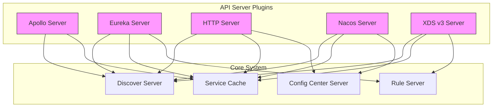
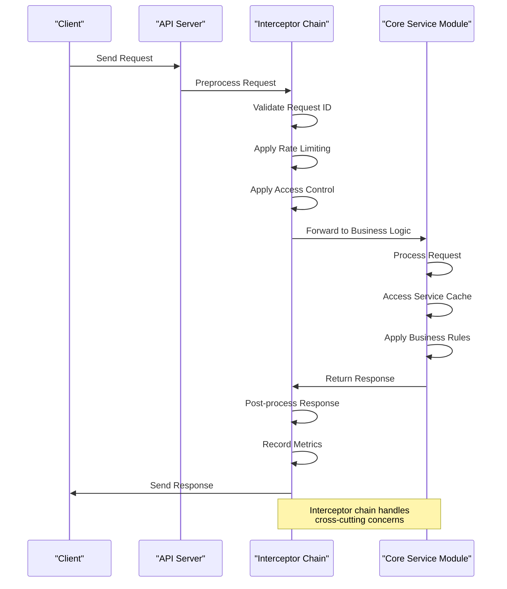
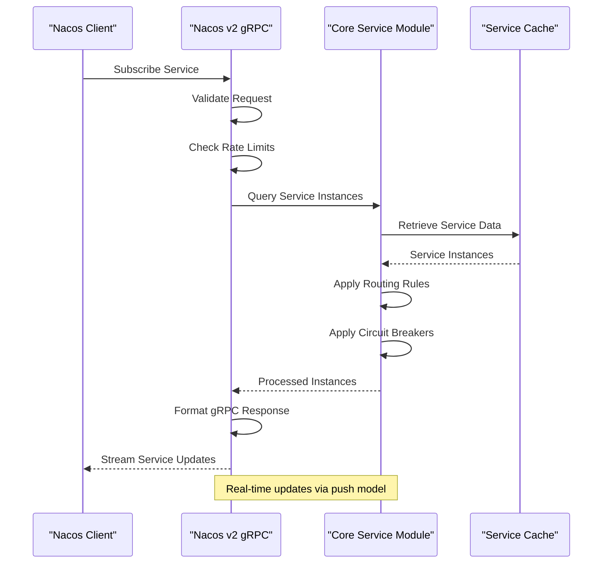
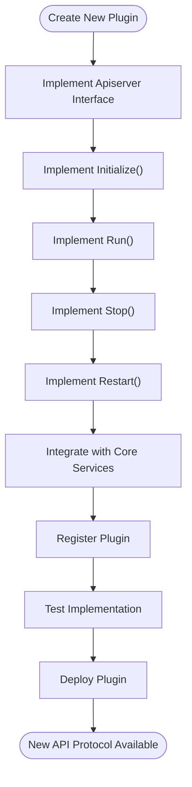

# API Server Plugins

<cite>
**Referenced Files in This Document**   
- [plugin/apiserver/apolloserver/server.go](file://plugin/apiserver/apolloserver/server.go)
- [plugin/apiserver/eurekaserver/server.go](file://plugin/apiserver/eurekaserver/server.go)
- [plugin/apiserver/httpserver/server.go](file://plugin/apiserver/httpserver/server.go)
- [plugin/apiserver/nacosserver/server.go](file://plugin/apiserver/nacosserver/server.go)
- [plugin/apiserver/xdsserverv3/server.go](file://plugin/apiserver/xdsserverv3/server.go)
- [apis/apiserver/apiserver.go](file://apis/apiserver/apiserver.go)
</cite>

## Table of Contents
1. [Introduction](#introduction)
2. [Plugin Architecture Overview](#plugin-architecture-overview)
3. [Core Interface Contracts](#core-interface-contracts)
4. [API Server Implementations](#api-server-implementations)
5. [Request Processing Flow](#request-processing-flow)
6. [Configuration Options](#configuration-options)
7. [Service Discovery Flow Example](#service-discovery-flow-example)
8. [Extension Points](#extension-points)
9. [Best Practices](#best-practices)

## Introduction
The pole-server implements a pluggable API server architecture that supports multiple service discovery and configuration protocols including Eureka, Nacos, Apollo, gRPC, HTTP, and XDS v3. This modular design allows the server to expose its core service discovery and configuration management capabilities through various industry-standard interfaces, enabling seamless integration with different service mesh and microservices ecosystems. Each API server plugin operates as an independent module that implements a common interface contract while providing protocol-specific handling for incoming requests.

## Plugin Architecture Overview



**Diagram sources**
- [plugin/apiserver/apolloserver/server.go](file://plugin/apiserver/apolloserver/server.go#L1-L350)
- [plugin/apiserver/eurekaserver/server.go](file://plugin/apiserver/eurekaserver/server.go#L1-L655)
- [plugin/apiserver/httpserver/server.go](file://plugin/apiserver/httpserver/server.go#L1-L674)
- [plugin/apiserver/nacosserver/server.go](file://plugin/apiserver/nacosserver/server.go#L1-L238)
- [plugin/apiserver/xdsserverv3/server.go](file://plugin/apiserver/xdsserverv3/server.go#L1-L483)

**Section sources**
- [plugin/apiserver/apolloserver/server.go](file://plugin/apiserver/apolloserver/server.go#L1-L350)
- [plugin/apiserver/eurekaserver/server.go](file://plugin/apiserver/eurekaserver/server.go#L1-L655)

## Core Interface Contracts

```mermaid
classDiagram
class Apiserver {
<<interface>>
+GetProtocol() string
+GetPort() uint32
+Initialize(ctx Context, option map[string]interface{}, api map[string]APIConfig) error
+Run(errCh chan error)
+Stop()
+Restart(option map[string]interface{}, api map[string]APIConfig, errCh chan error) error
}
class EnrichApiserver {
<<interface>>
+DebugHandlers() []DebugHandler
}
class APIConfig {
+Enable bool
+Include []string
}
Apiserver <|-- ApolloServer
Apiserver <|-- EurekaServer
Apiserver <|-- HTTPServer
Apiserver <|-- NacosServer
Apiserver <|-- XDSServer
EnrichApiserver <|-- HTTPServer
EnrichApiserver <|-- XDSServer
Apiserver ..> APIConfig : uses
```

**Diagram sources**
- [apis/apiserver/apiserver.go](file://apis/apiserver/apiserver.go#L41-L65)

**Section sources**
- [apis/apiserver/apiserver.go](file://apis/apiserver/apiserver.go#L41-L65)

## API Server Implementations

### Apollo Server Implementation
The Apollo server plugin provides compatibility with the Apollo configuration center protocol over HTTP. It implements the Apiserver interface and handles configuration retrieval and watching operations. The server uses RESTful APIs to serve configuration requests and integrates with the core config center server for data access.

**Section sources**
- [plugin/apiserver/apolloserver/server.go](file://plugin/apiserver/apolloserver/server.go#L1-L350)

### Eureka Server Implementation
The Eureka server plugin implements the Netflix Eureka protocol for service discovery. It supports both v1 and v2 endpoints and handles service registration, heartbeat, deregistration, and instance retrieval operations. The implementation includes replication capabilities for multi-node deployments and integrates with the core discover server for service data.

**Section sources**
- [plugin/apiserver/eurekaserver/server.go](file://plugin/apiserver/eurekaserver/server.go#L1-L655)

### HTTP Server Implementation
The HTTP server serves as the primary REST API interface for pole-server, providing comprehensive access to both service discovery and configuration management features. It supports multiple API groups including admin, console, and client interfaces, with configurable endpoints through the APIConfig structure.

**Section sources**
- [plugin/apiserver/httpserver/server.go](file://plugin/apiserver/httpserver/server.go#L1-L674)

### Nacos Server Implementation
The Nacos server plugin provides dual-protocol support through both HTTP and gRPC interfaces. It implements the Nacos v1 and v2 APIs, allowing clients to register services and retrieve service instances. The implementation includes a shared data storage layer that synchronizes between the two protocol versions.

**Section sources**
- [plugin/apiserver/nacosserver/server.go](file://plugin/apiserver/nacosserver/server.go#L1-L238)

### XDS v3 Server Implementation
The XDS v3 server implements the Envoy xDS v3 API specification, enabling integration with Envoy-based service meshes. It provides CDS, EDS, LDS, RDS, and VHDS services through a gRPC interface and maintains an active synchronization task that updates the xDS resource cache when service data changes.

**Section sources**
- [plugin/apiserver/xdsserverv3/server.go](file://plugin/apiserver/xdsserverv3/server.go#L1-L483)

## Request Processing Flow



**Diagram sources**
- [plugin/apiserver/httpserver/server.go](file://plugin/apiserver/httpserver/server.go#L1-L674)
- [plugin/apiserver/apolloserver/server.go](file://plugin/apiserver/apolloserver/server.go#L1-L350)

**Section sources**
- [plugin/apiserver/httpserver/server.go](file://plugin/apiserver/httpserver/server.go#L1-L674)
- [plugin/apiserver/apolloserver/server.go](file://plugin/apiserver/apolloserver/server.go#L1-L350)

## Configuration Options

### Protocol Configuration Parameters
| Protocol | Configuration Options | Endpoint Bindings | Security Settings |
|----------|----------------------|-------------------|-------------------|
| Apollo | listenIP, listenPort, connLimit, metaServer | /configfiles, /watch | TLS, Connection Limits |
| Eureka | listenIP, listenPort, connLimit, tls, namespace | /eureka/apps/{app} | TLS, Connection Limits |
| HTTP | listenIP, listenPort, connLimit, tls, enablePprof, enableSwagger | /v1/naming, /v1/config | TLS, Connection Limits |
| Nacos | listenIP, httpPort, grpcPort, connLimit, tls | /nacos/v1, /grpc-nacos/v2 | TLS, Connection Limits |
| XDS v3 | listenIP, listenPort, connLimit | gRPC Services (CDS, EDS, etc.) | Connection Limits |

**Section sources**
- [plugin/apiserver/apolloserver/server.go](file://plugin/apiserver/apolloserver/server.go#L1-L350)
- [plugin/apiserver/eurekaserver/server.go](file://plugin/apiserver/eurekaserver/server.go#L1-L655)
- [plugin/apiserver/httpserver/server.go](file://plugin/apiserver/httpserver/server.go#L1-L674)
- [plugin/apiserver/nacosserver/server.go](file://plugin/apiserver/nacosserver/server.go#L1-L238)
- [plugin/apiserver/xdsserverv3/server.go](file://plugin/apiserver/xdsserverv3/server.go#L1-L483)

## Service Discovery Flow Example



**Diagram sources**
- [plugin/apiserver/nacosserver/server.go](file://plugin/apiserver/nacosserver/server.go#L1-L238)
- [plugin/apiserver/nacosserver/v2](file://plugin/apiserver/nacosserver/v2)

**Section sources**
- [plugin/apiserver/nacosserver/server.go](file://plugin/apiserver/nacosserver/server.go#L1-L238)

## Extension Points

### Adding New API Protocols
To add a new API protocol to pole-server, implement the Apiserver interface with the following steps:
1. Create a new package under plugin/apiserver for the protocol
2. Implement all methods of the Apiserver interface
3. Register the server in the plugin initialization process
4. Implement protocol-specific request handlers
5. Integrate with core service modules as needed



**Diagram sources**
- [apis/apiserver/apiserver.go](file://apis/apiserver/apiserver.go#L47-L60)
- [plugin/apiserver/xdsserverv3/server.go](file://plugin/apiserver/xdsserverv3/server.go#L1-L483)

**Section sources**
- [apis/apiserver/apiserver.go](file://apis/apiserver/apiserver.go#L47-L60)

## Best Practices

### Backward Compatibility
When modifying existing API server plugins, follow these best practices to maintain backward compatibility:
- Never remove existing endpoints without a deprecation period
- Use versioned APIs when introducing breaking changes
- Maintain support for deprecated parameters during transition periods
- Provide clear migration documentation for clients
- Use feature flags for new functionality
- Test against multiple client versions

### Performance Considerations
- Implement efficient caching strategies for frequently accessed data
- Use connection pooling for backend service access
- Apply rate limiting at both IP and API levels
- Optimize serialization/deserialization of protocol messages
- Monitor and optimize garbage collection patterns
- Use streaming responses for large datasets

**Section sources**
- [plugin/apiserver/httpserver/server.go](file://plugin/apiserver/httpserver/server.go#L1-L674)
- [plugin/apiserver/xdsserverv3/server.go](file://plugin/apiserver/xdsserverv3/server.go#L1-L483)