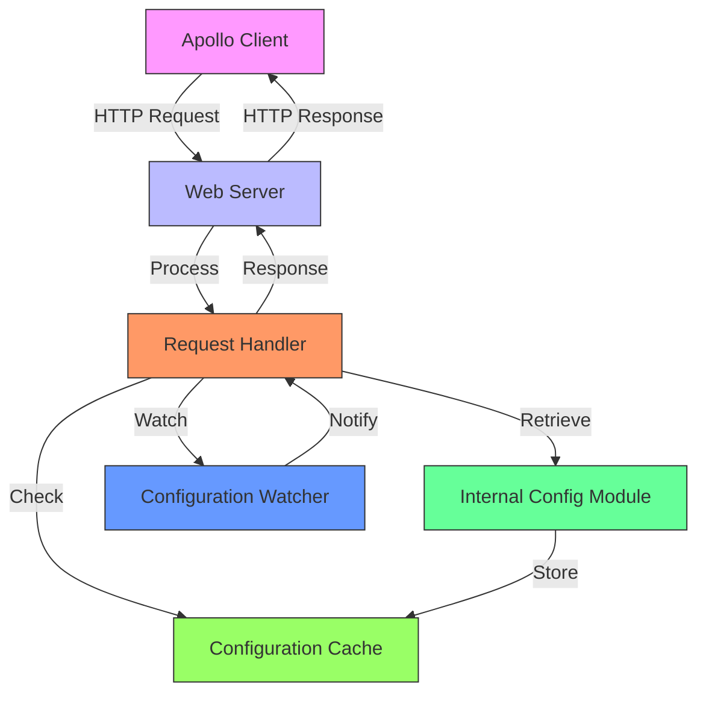
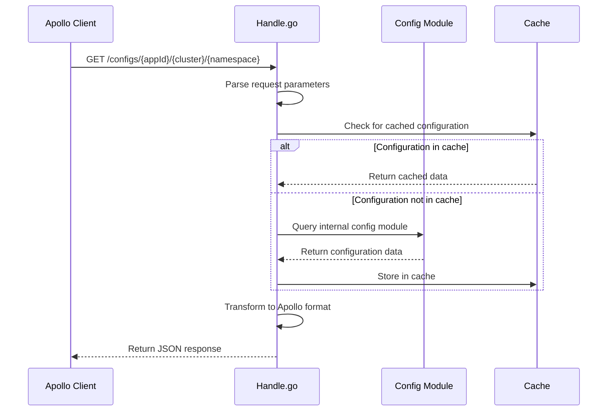
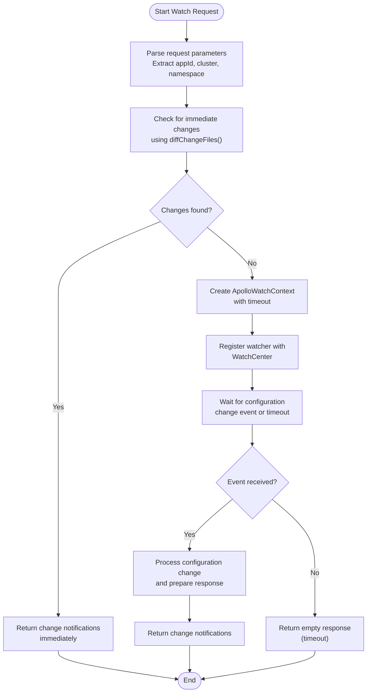
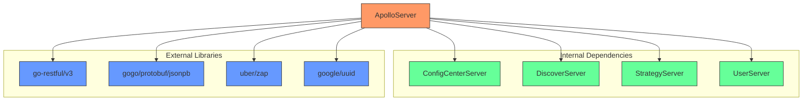

# Apollo Server Plugin

<cite>
**Referenced Files in This Document**   
- [config.go](file://plugin/apiserver/apolloserver/config.go)
- [handle.go](file://plugin/apiserver/apolloserver/handle.go)
- [watch.go](file://plugin/apiserver/apolloserver/watch.go)
- [types.go](file://plugin/apiserver/apolloserver/types.go)
- [server.go](file://plugin/apiserver/apolloserver/server.go)
- [access.go](file://plugin/apiserver/apolloserver/access.go)
- [docs.go](file://plugin/apiserver/apolloserver/docs.go)
</cite>

## Table of Contents
1. [Introduction](#introduction)
2. [Project Structure](#project-structure)
3. [Core Components](#core-components)
4. [Architecture Overview](#architecture-overview)
5. [Detailed Component Analysis](#detailed-component-analysis)
6. [Dependency Analysis](#dependency-analysis)
7. [Performance Considerations](#performance-considerations)
8. [Troubleshooting Guide](#troubleshooting-guide)
9. [Conclusion](#conclusion)

## Introduction
The Apollo server plugin provides a compatibility layer that enables Apollo clients to retrieve configuration data from the pole-server configuration center. This implementation supports Apollo's configuration retrieval model, change notification mechanism, and namespace mapping while integrating with pole-server's internal configuration management system. The plugin implements long-polling for real-time configuration updates and transforms responses into Apollo's expected format.

## Project Structure
The Apollo server plugin is located in the `plugin/apiserver/apolloserver` directory and consists of several key files that handle different aspects of the Apollo compatibility layer.

```mermaid
graph TD
subgraph "Apollo Server Plugin"
config[config.go<br>Configuration Options]
server[server.go<br>Server Lifecycle]
access[access.go<br>HTTP Routing]
handle[handle.go<br>Request Handling]
watch[watch.go<br>Long-Polling Logic]
types[types.go<br>Data Structures]
docs[docs.go<br>Model Mapping]
end
access --> handle : Routes Requests
handle --> watch : Uses Watcher
handle --> server : Accesses Server
config --> server : Provides Options
docs --> handle : Guides Mapping
```

**Diagram sources**
- [config.go](file://plugin/apiserver/apolloserver/config.go#L1-L13)
- [server.go](file://plugin/apiserver/apolloserver/server.go#L1-L350)
- [access.go](file://plugin/apiserver/apolloserver/access.go#L1-L214)
- [handle.go](file://plugin/apiserver/apolloserver/handle.go#L1-L228)
- [watch.go](file://plugin/apiserver/apolloserver/watch.go#L1-L202)
- [types.go](file://plugin/apiserver/apolloserver/types.go#L1-L106)
- [docs.go](file://plugin/apiserver/apolloserver/docs.go#L1-L28)

**Section sources**
- [config.go](file://plugin/apiserver/apolloserver/config.go#L1-L13)
- [server.go](file://plugin/apiserver/apolloserver/server.go#L1-L350)
- [access.go](file://plugin/apiserver/apolloserver/access.go#L1-L214)

## Core Components
The Apollo server plugin consists of several core components that work together to provide Apollo-compatible configuration management. The main components include the server implementation, request handlers, long-polling mechanism, and data structure definitions. The plugin routes requests to the internal configuration module and transforms responses into Apollo's expected format.

**Section sources**
- [server.go](file://plugin/apiserver/apolloserver/server.go#L1-L350)
- [handle.go](file://plugin/apiserver/apolloserver/handle.go#L1-L228)
- [watch.go](file://plugin/apiserver/apolloserver/watch.go#L1-L202)

## Architecture Overview
The Apollo server plugin architecture consists of a web server that handles HTTP requests from Apollo clients, processes them through request handlers, and interacts with the internal configuration management system. The plugin supports long-polling for real-time configuration updates and implements a caching strategy to improve performance.



**Diagram sources**
- [server.go](file://plugin/apiserver/apolloserver/server.go#L1-L350)
- [handle.go](file://plugin/apiserver/apolloserver/handle.go#L1-L228)
- [watch.go](file://plugin/apiserver/apolloserver/watch.go#L1-L202)

## Detailed Component Analysis

### Configuration Retrieval and Transformation
The Apollo server plugin implements handlers that route `/configfiles` requests to the internal configuration module and transform responses into Apollo's expected format. The `GetConfigFile` method in `handle.go` handles configuration retrieval requests and processes them according to Apollo's configuration model.



**Diagram sources**
- [handle.go](file://plugin/apiserver/apolloserver/handle.go#L1-L228)
- [access.go](file://plugin/apiserver/apolloserver/access.go#L1-L214)

**Section sources**
- [handle.go](file://plugin/apiserver/apolloserver/handle.go#L1-L228)
- [access.go](file://plugin/apiserver/apolloserver/access.go#L1-L214)

### Long-Polling Mechanism
The long-polling mechanism in `watch.go` allows clients to receive real-time configuration updates. The `WatchConfigFile` method implements the long-polling logic, which checks for configuration changes and either returns immediately with changes or holds the request until changes occur or a timeout is reached.



**Diagram sources**
- [watch.go](file://plugin/apiserver/apolloserver/watch.go#L1-L202)
- [handle.go](file://plugin/apiserver/apolloserver/handle.go#L1-L228)

**Section sources**
- [watch.go](file://plugin/apiserver/apolloserver/watch.go#L1-L202)
- [handle.go](file://plugin/apiserver/apolloserver/handle.go#L1-L228)

### Namespace Mapping
The plugin implements a mapping between Apollo's app+namespace model and pole-server's configuration groups. According to the documentation in `docs.go`, the mapping is as follows: Apollo's Cluster or DataCenter maps to Pole's Namespace, Apollo's AppId maps to Pole's Group, and Apollo's Namespace maps to Pole's ConfigFile.

```mermaid
classDiagram
class ApolloModel {
+AppId : string
+Cluster : string
+DataCenter : string
+Namespace : string
}
class PoleModel {
+Namespace : string
+Group : string
+ConfigFile : string
}
ApolloModel --> PoleModel : Maps to
note right of ApolloModel
Mapping Rules :
1. Apollo Cluster/DataCenter → Pole Namespace
2. Apollo AppId → Pole Group
3. Apollo Namespace → Pole ConfigFile
end note
```

**Diagram sources**
- [docs.go](file://plugin/apiserver/apolloserver/docs.go#L1-L28)
- [handle.go](file://plugin/apiserver/apolloserver/handle.go#L1-L228)

**Section sources**
- [docs.go](file://plugin/apiserver/apolloserver/docs.go#L1-L28)
- [handle.go](file://plugin/apiserver/apolloserver/handle.go#L1-L228)

### Configuration Options
The plugin provides several configuration options in `config.go` for customizing endpoint behavior and security settings. These include options for listen IP, listen port, connection limit, and meta server configuration.

```mermaid
erDiagram
CONFIG_OPTIONS {
string optionListenIP PK
string optionListenPort PK
string optionConnLimit PK
string optionMetaServer PK
string DefaultListenIP
string DefaultListenPort
}
CONFIG_OPTIONS ||--o{ SERVER : "used by"
SERVER }|--|| CONFIG_OPTIONS : "reads"
note right of CONFIG_OPTIONS
Configuration Options:
- optionListenIP: IP to bind to
- optionListenPort: Port to listen on
- optionConnLimit: Connection limit settings
- optionMetaServer: Environment server config
- Default values provided
end note
```

**Diagram sources**
- [config.go](file://plugin/apiserver/apolloserver/config.go#L1-L13)
- [server.go](file://plugin/apiserver/apolloserver/server.go#L1-L350)

**Section sources**
- [config.go](file://plugin/apiserver/apolloserver/config.go#L1-L13)
- [server.go](file://plugin/apiserver/apolloserver/server.go#L1-L350)

## Dependency Analysis
The Apollo server plugin has dependencies on several internal components and external libraries. The main dependencies include the configuration center server, service discovery server, authentication components, and various utility packages.



**Diagram sources**
- [server.go](file://plugin/apiserver/apolloserver/server.go#L1-L350)
- [handle.go](file://plugin/apiserver/apolloserver/handle.go#L1-L228)

**Section sources**
- [server.go](file://plugin/apiserver/apolloserver/server.go#L1-L350)
- [handle.go](file://plugin/apiserver/apolloserver/handle.go#L1-L228)

## Performance Considerations
The Apollo server plugin implements several performance optimizations, including caching of configuration data, connection keep-alive support, and rate limiting to prevent abuse. The long-polling mechanism reduces the number of requests by holding connections open until changes occur, which improves efficiency compared to regular polling.

The plugin also supports connection limiting through the `connLimitConfig` option, which can be configured to prevent excessive resource usage. The use of a cache layer for configuration data reduces the load on the underlying storage system and improves response times for frequently accessed configurations.

## Troubleshooting Guide
This section provides guidance for common issues encountered when using the Apollo server plugin.

**Configuration Refresh Delays**
If clients experience delays in receiving configuration updates:
1. Check the watch timeout setting in the server configuration
2. Verify that the configuration watcher system is properly integrated
3. Ensure that the cache invalidation mechanism is working correctly
4. Check for network issues between the client and server

**Namespace Resolution Errors**
If namespace resolution fails:
1. Verify the mapping between Apollo's model and pole-server's model
2. Check that the namespace, group, and config file names are correctly specified
3. Ensure that the requested configuration exists in the system
4. Validate that the client has proper permissions to access the configuration

**Connection Issues**
For connection-related problems:
1. Check the listen IP and port configuration
2. Verify that the connection limit settings are not too restrictive
3. Ensure that the server is properly bound to the specified IP address
4. Check firewall rules and network connectivity

**Section sources**
- [server.go](file://plugin/apiserver/apolloserver/server.go#L1-L350)
- [handle.go](file://plugin/apiserver/apolloserver/handle.go#L1-L228)
- [watch.go](file://plugin/apiserver/apolloserver/watch.go#L1-L202)

## Conclusion
The Apollo server plugin provides a comprehensive implementation of the Apollo configuration center API, enabling seamless integration between Apollo clients and the pole-server configuration management system. The plugin supports all key Apollo features including configuration retrieval, long-polling for real-time updates, and proper namespace mapping. With its modular design and clear separation of concerns, the plugin offers a robust solution for organizations looking to leverage Apollo's client ecosystem with pole-server's configuration management capabilities.