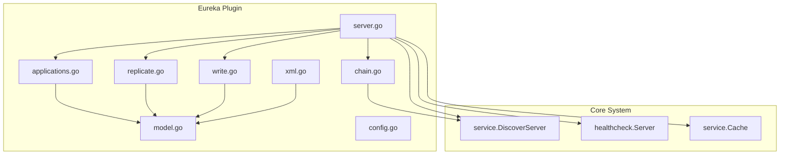
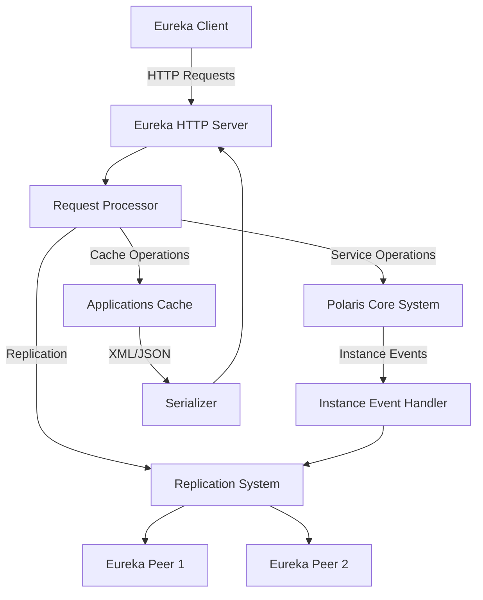
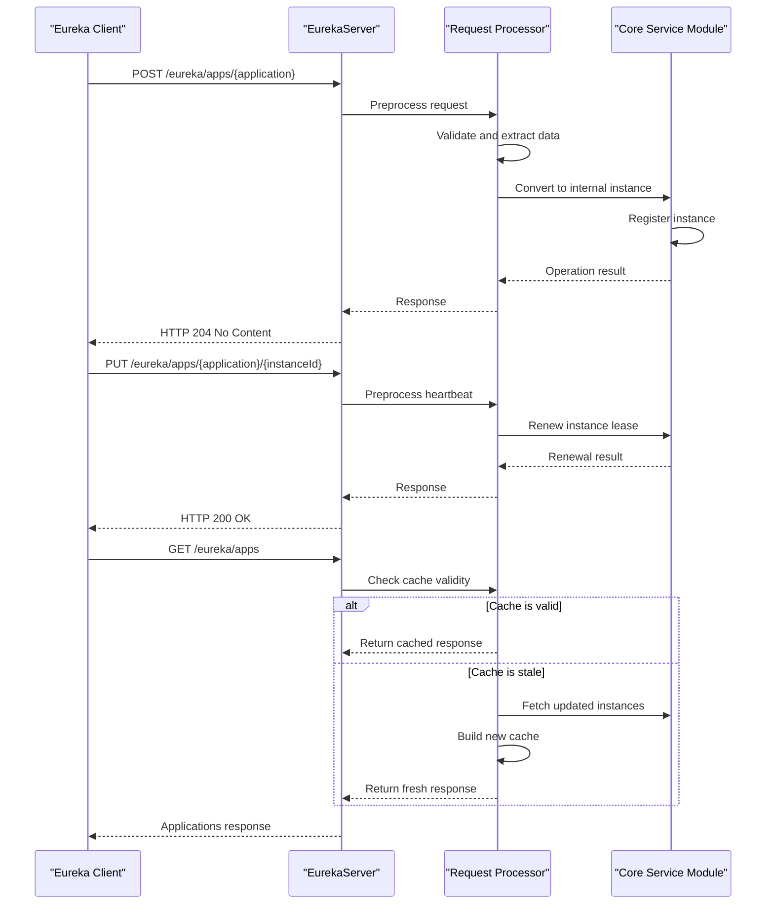
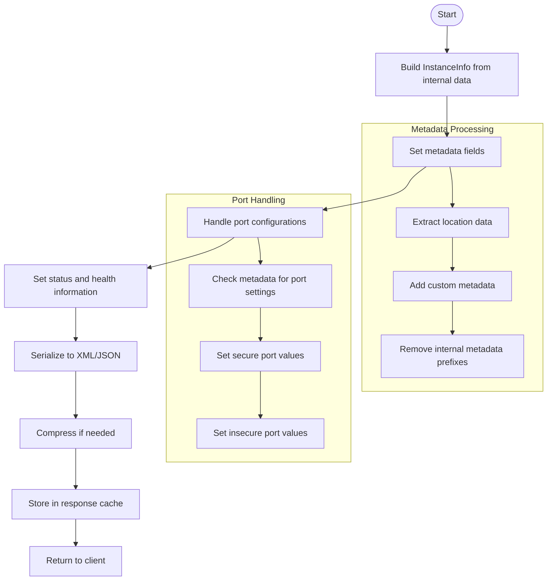
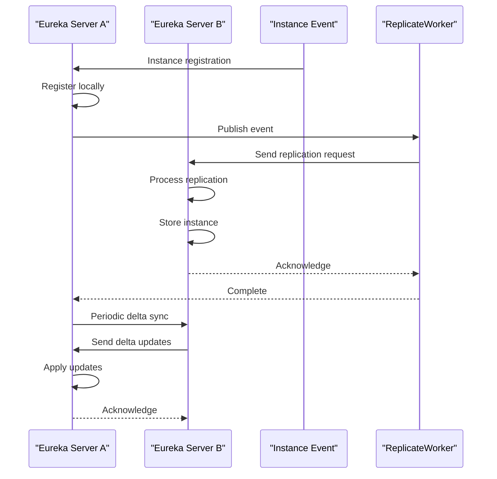
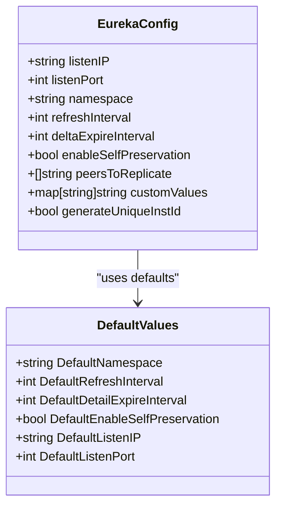
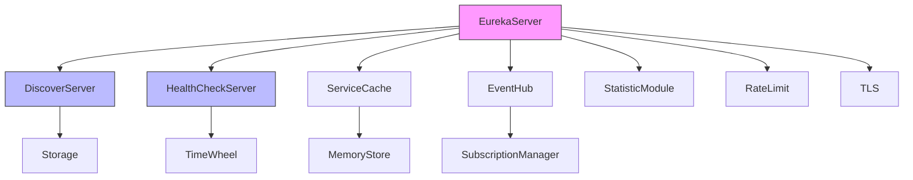

# Eureka Server Plugin

<cite>
**Referenced Files in This Document**   
- [server.go](file://plugin/apiserver/eurekaserver/server.go)
- [applications.go](file://plugin/apiserver/eurekaserver/applications.go)
- [config.go](file://plugin/apiserver/eurekaserver/config.go)
- [replicate.go](file://plugin/apiserver/eurekaserver/replicate.go)
- [write.go](file://plugin/apiserver/eurekaserver/write.go)
- [model.go](file://plugin/apiserver/eurekaserver/model.go)
- [xml.go](file://plugin/apiserver/eurekaserver/xml.go)
- [chain.go](file://plugin/apiserver/eurekaserver/chain.go)
</cite>

## Table of Contents
1. [Introduction](#introduction)
2. [Project Structure](#project-structure)
3. [Core Components](#core-components)
4. [Architecture Overview](#architecture-overview)
5. [Detailed Component Analysis](#detailed-component-analysis)
6. [Dependency Analysis](#dependency-analysis)
7. [Performance Considerations](#performance-considerations)
8. [Troubleshooting Guide](#troubleshooting-guide)
9. [Conclusion](#conclusion)

## Introduction
The Eureka Server Plugin provides Eureka-compatible API endpoints for service registration, discovery, and replication in the Polaris service mesh. This implementation enables seamless integration with applications built on the Netflix Eureka ecosystem while maintaining compatibility with Polaris's core service discovery functionality. The plugin supports both XML and JSON serialization formats, handles service instance heartbeats, and implements a distributed replication mechanism between Eureka server instances. It also provides configuration options for self-preservation mode, replication peers, and custom metadata handling.

## Project Structure
The Eureka server plugin is organized within the `plugin/apiserver/eurekaserver` directory and consists of multiple Go source files that handle different aspects of the Eureka protocol implementation. The plugin integrates with the core Polaris service discovery system while providing a compatible interface for Eureka clients.

**Diagram sources**
- [server.go](file://plugin/apiserver/eurekaserver/server.go)
- [applications.go](file://plugin/apiserver/eurekaserver/applications.go)
- [replicate.go](file://plugin/apiserver/eurekaserver/replicate.go)

**Section sources**
- [server.go](file://plugin/apiserver/eurekaserver/server.go)
- [applications.go](file://plugin/apiserver/eurekaserver/applications.go)

## Core Components
The Eureka Server Plugin consists of several core components that work together to provide Eureka-compatible service discovery functionality. The main components include the EurekaServer struct that handles HTTP requests, the ApplicationsBuilder that manages service instance caching, the replication system that synchronizes state between Eureka server instances, and the serialization components that handle XML and JSON formatting. The plugin integrates with Polaris's core service discovery system through the DiscoverServer interface while maintaining Eureka-specific data structures and behaviors.

**Section sources**
- [server.go](file://plugin/apiserver/eurekaserver/server.go#L1-L100)
- [applications.go](file://plugin/apiserver/eurekaserver/applications.go#L1-L50)

## Architecture Overview
The Eureka Server Plugin architecture follows a layered approach with clear separation of concerns. At the top layer, the HTTP server handles incoming REST API requests from Eureka clients. Below this, the request processing layer translates Eureka API calls into operations on the underlying Polaris service discovery system. The caching layer maintains optimized representations of service instances for efficient retrieval, while the replication layer ensures consistency across multiple Eureka server instances. The plugin also includes a chain of responsibility pattern for handling instance lifecycle events and a serialization layer for converting between Eureka's XML format and internal data structures.

**Diagram sources**
- [server.go](file://plugin/apiserver/eurekaserver/server.go#L1-L20)
- [replicate.go](file://plugin/apiserver/eurekaserver/replicate.go#L1-L20)
- [applications.go](file://plugin/apiserver/eurekaserver/applications.go#L1-L20)

## Detailed Component Analysis

### Request Handling Flow
The Eureka server plugin implements REST endpoints for service registration, discovery, and management. When a client sends a request to endpoints like `/apps` or `/instances`, the request is processed through a series of steps that translate Eureka-specific operations into calls on the internal service module.

**Diagram sources**
- [server.go](file://plugin/apiserver/eurekaserver/server.go#L150-L300)
- [write.go](file://plugin/apiserver/eurekaserver/write.go#L1-L50)

### Service Instance Serialization
The plugin handles serialization of service instances into Eureka's XML format through the applications.go and xml.go files. When responding to client requests, the system converts internal service instance representations into the Eureka-compatible XML structure.

**Diagram sources**
- [applications.go](file://plugin/apiserver/eurekaserver/applications.go#L200-L400)
- [xml.go](file://plugin/apiserver/eurekaserver/xml.go#L1-L50)
- [model.go](file://plugin/apiserver/eurekaserver/model.go#L1-L50)

### Replication Mechanism
The Eureka server plugin implements a distributed replication mechanism that synchronizes service instance state between multiple Eureka server instances. This ensures high availability and consistency across the service discovery system.

**Diagram sources**
- [replicate.go](file://plugin/apiserver/eurekaserver/replicate.go#L1-L100)
- [server.go](file://plugin/apiserver/eurekaserver/server.go#L500-L600)

### Configuration Options
The Eureka server plugin provides several configuration options to customize its behavior and enable compatibility with existing Eureka deployments.

**Diagram sources**
- [config.go](file://plugin/apiserver/eurekaserver/config.go#L1-L50)
- [server.go](file://plugin/apiserver/eurekaserver/server.go#L100-L200)

## Dependency Analysis
The Eureka Server Plugin has dependencies on several core components of the Polaris system, creating a well-defined integration architecture.

**Diagram sources**
- [server.go](file://plugin/apiserver/eurekaserver/server.go#L50-L100)
- [go.mod](file://go.mod#L1-L20)

**Section sources**
- [server.go](file://plugin/apiserver/eurekaserver/server.go#L50-L150)
- [go.mod](file://go.mod#L1-L30)

## Performance Considerations
The Eureka Server Plugin implements several performance optimizations to handle high volumes of service discovery requests efficiently. The system uses a caching mechanism to reduce database queries, with the ApplicationsBuilder maintaining pre-serialized XML and JSON responses. The replication system uses asynchronous processing to avoid blocking request handling, and the HTTP server implements connection limiting and rate limiting to prevent resource exhaustion. The plugin also uses atomic operations and efficient data structures to minimize lock contention in high-concurrency scenarios.

## Troubleshooting Guide
Common issues with the Eureka Server Plugin include client heartbeat mismatches and replication conflicts. For heartbeat issues, verify that the client's renewal interval matches the server's configuration (default 30 seconds) and that network connectivity is stable. For replication conflicts, check that all server instances have consistent configuration, particularly regarding namespace settings and peer replication lists. Monitor the server logs for warnings about failed replication attempts, which may indicate network issues or authentication problems between server instances. Ensure that the self-preservation mode is configured appropriately for your environment, as it can affect how the server responds to heartbeat failures.

**Section sources**
- [replicate.go](file://plugin/apiserver/eurekaserver/replicate.go#L100-L200)
- [write.go](file://plugin/apiserver/eurekaserver/write.go#L200-L300)
- [server.go](file://plugin/apiserver/eurekaserver/server.go#L400-L500)

## Conclusion
The Eureka Server Plugin provides a comprehensive implementation of the Eureka API for service registration, discovery, and replication. It successfully bridges the gap between the Eureka ecosystem and the Polaris service mesh, enabling organizations to leverage existing Eureka-based applications while benefiting from Polaris's advanced service discovery features. The plugin's modular architecture, with clear separation between request handling, caching, replication, and serialization components, makes it maintainable and extensible. Its integration with the core Polaris system ensures consistency and reliability, while its configuration options allow for flexible deployment in various environments.