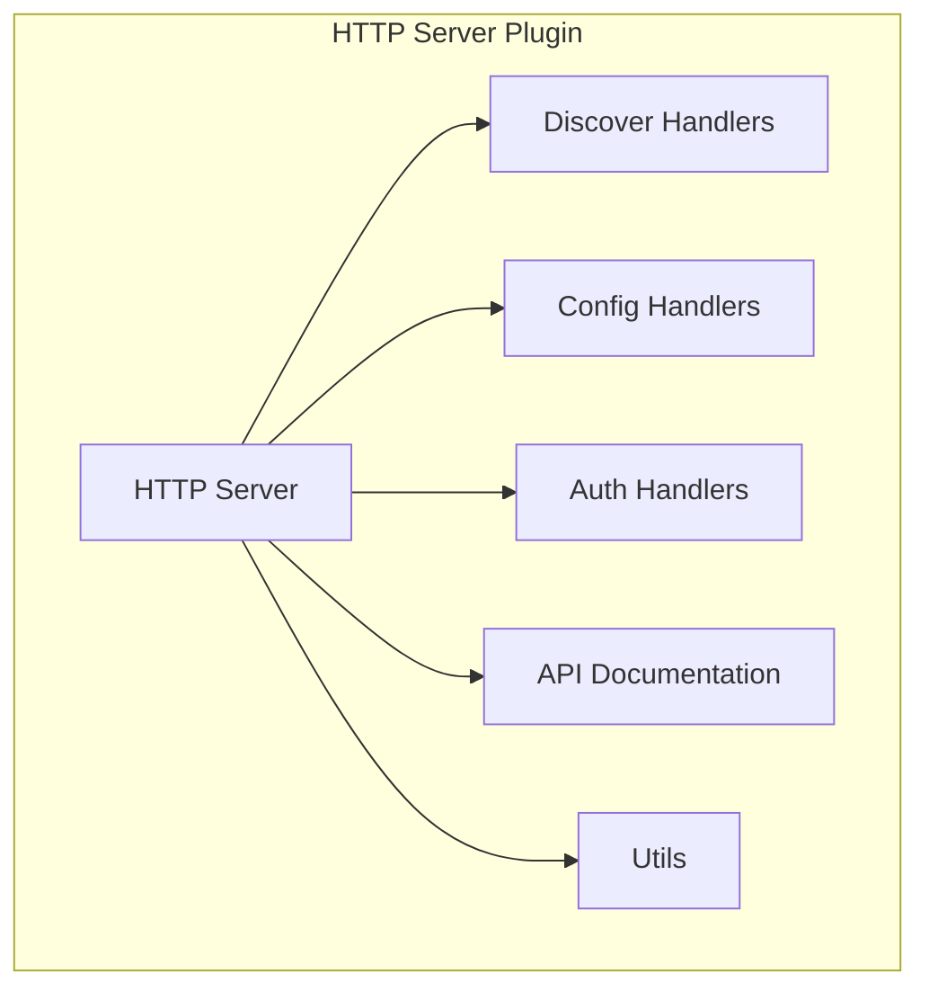
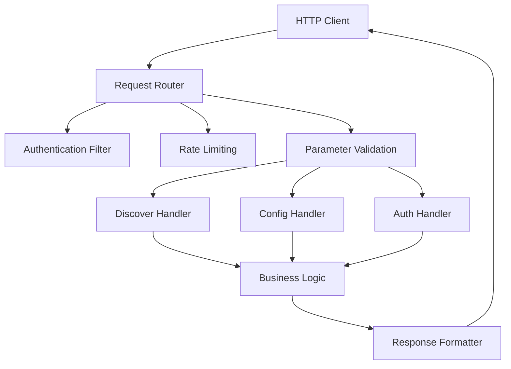
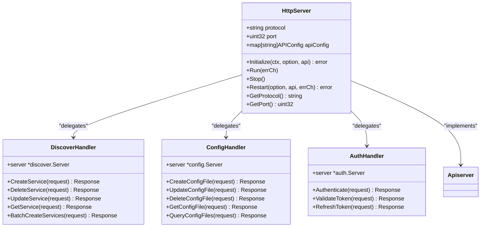
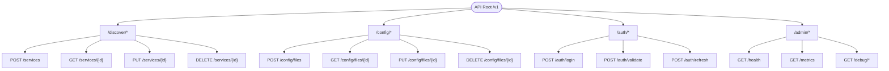
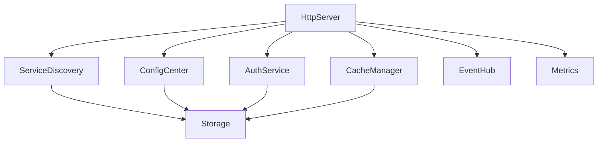

# HTTP Server Plugin

<cite>
**Referenced Files in This Document**   
- [server.go](file://plugin/apiserver/httpserver/server.go)
- [handler.go](file://plugin/apiserver/httpserver/discover/server.go)
- [config/server.go](file://pkg/config/server.go)
- [discover/server.go](file://plugin/apiserver/httpserver/discover/server.go)
- [apidoc.go](file://plugin/apiserver/httpserver/docs/core_console_apidoc.go)
- [apiserver.go](file://apis/apiserver/apiserver.go)
- [bootstrap/server.go](file://bootstrap/server.go)
</cite>

## Table of Contents
1. [Introduction](#introduction)
2. [Project Structure](#project-structure)
3. [Core Components](#core-components)
4. [Architecture Overview](#architecture-overview)
5. [Detailed Component Analysis](#detailed-component-analysis)
6. [Dependency Analysis](#dependency-analysis)
7. [Performance Considerations](#performance-considerations)
8. [Troubleshooting Guide](#troubleshooting-guide)
9. [Conclusion](#conclusion)

## Introduction
The HTTP Server Plugin in the Polaris server implements a RESTful API layer using the go-restful/v3 framework to expose service discovery, configuration management, and administrative operations. This document details the implementation of the HTTP server plugin, focusing on API design, request handling pipeline, endpoint organization, error handling, and documentation generation. The plugin supports multiple API versions and functional domains including discovery, configuration, and authentication, with built-in security features such as input validation and rate limiting.

## Project Structure
The HTTP server plugin is organized across multiple directories with clear separation of concerns. The core HTTP server implementation resides in the `plugin/apiserver/httpserver` directory, with specialized handlers for different functional domains. Configuration and discovery operations are handled by dedicated server implementations that process JSON requests and responses.



**Diagram sources**
- [server.go](file://plugin/apiserver/httpserver/server.go#L1-L50)
- [discover/server.go](file://plugin/apiserver/httpserver/discover/server.go#L1-L30)
- [config/server.go](file://pkg/config/server.go#L1-L30)

**Section sources**
- [server.go](file://plugin/apiserver/httpserver/server.go#L1-L100)
- [bootstrap/server.go](file://bootstrap/server.go#L1-L50)

## Core Components
The HTTP server plugin consists of several core components that work together to provide a robust RESTful API interface. The main server component handles HTTP request routing and lifecycle management, while specialized handler components process domain-specific operations for service discovery and configuration management. The plugin integrates with the go-restful/v3 framework to provide structured API endpoints with consistent error handling and response formatting.

**Section sources**
- [server.go](file://plugin/apiserver/httpserver/server.go#L25-L150)
- [discover/server.go](file://plugin/apiserver/httpserver/discover/server.go#L15-L80)
- [config/server.go](file://pkg/config/server/server.go#L10-L70)

## Architecture Overview
The HTTP server plugin follows a modular architecture with clear separation between the server core, domain-specific handlers, and supporting utilities. The architecture is designed to support multiple API versions and functional domains while maintaining consistency in request processing and error handling.



**Diagram sources**
- [server.go](file://plugin/apiserver/httpserver/server.go#L50-L100)
- [discover/server.go](file://plugin/apiserver/httpserver/discover/server.go#L30-L60)
- [config/server.go](file://pkg/config/server.go#L30-L60)

## Detailed Component Analysis

### HTTP Server Implementation
The HTTP server implementation provides the foundation for RESTful API services in the Polaris system. It uses the go-restful/v3 framework to define routes, handle requests, and generate responses in a structured manner.

#### Class Diagram for HTTP Server Components


**Diagram sources**
- [server.go](file://plugin/apiserver/httpserver/server.go#L100-L200)
- [discover/server.go](file://plugin/apiserver/httpserver/discover/server.go#L60-L90)
- [config/server.go](file://pkg/config/server.go#L60-L90)

### Request Handling Pipeline
The request handling pipeline processes incoming HTTP requests through a series of stages including authentication, rate limiting, parameter validation, and business logic execution.

#### Sequence Diagram for Request Processing
```mermaid
sequenceDiagram
participant Client as "HTTP Client"
participant Server as "HttpServer"
participant Filter as "Access Control"
participant Validator as "Parameter Validator"
participant Handler as "Domain Handler"
participant Business as "Business Logic"
participant Response as "Response Formatter"
Client->>Server : HTTP Request
Server->>Filter : Authenticate Request
alt Authentication Failed
Filter-->>Client : 401 Unauthorized
return
end
Filter->>Filter : Apply Rate Limiting
alt Rate Limit Exceeded
Filter-->>Client : 429 Too Many Requests
return
end
Filter->>Validator : Validate Parameters
alt Validation Failed
Validator-->>Client : 400 Bad Request
return
end
Validator->>Handler : Route to Handler
Handler->>Business : Execute Business Logic
Business-->>Handler : Result
Handler->>Response : Format Response
Response-->>Client : HTTP Response (JSON)
```

**Diagram sources**
- [server.go](file://plugin/apiserver/httpserver/server.go#L200-L300)
- [discover/server.go](file://plugin/apiserver/httpserver/discover/server.go#L90-L120)
- [config/server.go](file://pkg/config/server.go#L90-L120)

### API Versioning and Endpoint Organization
The API is organized by functionality with separate endpoints for discovery, configuration, and authentication operations. Each functional domain has its own versioned API endpoints to support backward compatibility and evolutionary development.

#### Flowchart for API Organization


**Diagram sources**
- [server.go](file://plugin/apiserver/httpserver/server.go#L300-L400)
- [discover/server.go](file://plugin/apiserver/httpserver/discover/server.go#L120-L150)
- [config/server.go](file://pkg/config/server.go#L120-L150)

## Dependency Analysis
The HTTP server plugin depends on several core components of the Polaris system, including the service discovery module, configuration center, and authentication system. These dependencies are injected during initialization and used throughout the request processing pipeline.



**Diagram sources**
- [bootstrap/server.go](file://bootstrap/server.go#L100-L200)
- [server.go](file://plugin/apiserver/httpserver/server.go#L400-L500)

**Section sources**
- [bootstrap/server.go](file://bootstrap/server.go#L50-L300)
- [apiserver.go](file://apis/apiserver/apiserver.go#L1-L80)

## Performance Considerations
The HTTP server plugin is designed with performance in mind, utilizing caching, connection pooling, and asynchronous processing where appropriate. The request handling pipeline is optimized to minimize latency while maintaining security and correctness. Rate limiting is implemented at the HTTP layer to prevent abuse and ensure system stability under heavy load.

## Troubleshooting Guide
When troubleshooting issues with the HTTP server plugin, check the following common problem areas:
- Ensure the server is properly registered in the bootstrap configuration
- Verify that API endpoints are correctly registered and accessible
- Check authentication tokens and permissions for access denied errors
- Monitor rate limiting counters for throttled requests
- Review parameter validation errors in request payloads
- Examine server logs for initialization errors or dependency failures

**Section sources**
- [server.go](file://plugin/apiserver/httpserver/server.go#L500-L600)
- [bootstrap/server.go](file://bootstrap/server.go#L300-L400)

## Conclusion
The HTTP Server Plugin provides a comprehensive RESTful API interface for the Polaris service mesh, implementing a well-structured request handling pipeline with robust security features and clear endpoint organization. By leveraging the go-restful/v3 framework, the plugin delivers consistent API behavior across multiple functional domains including service discovery, configuration management, and authentication. The modular architecture supports easy extension and maintenance, while built-in features like API documentation generation and rate limiting enhance usability and system stability.