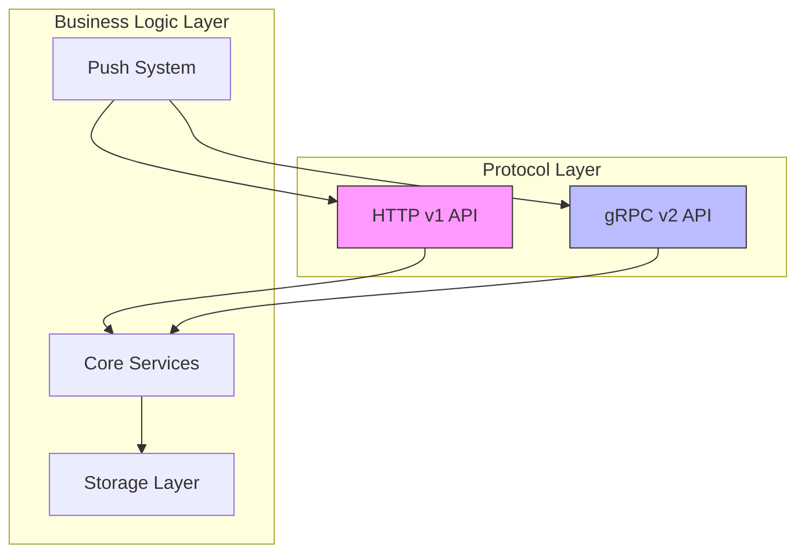
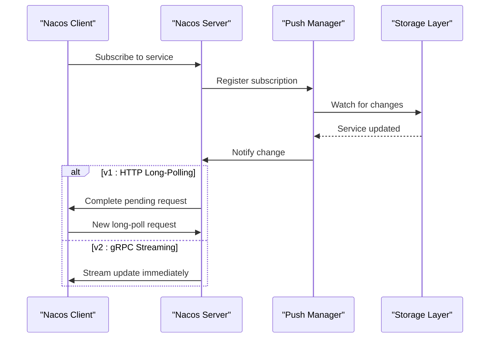
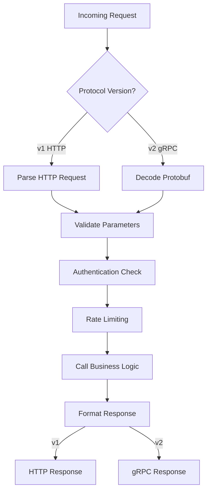
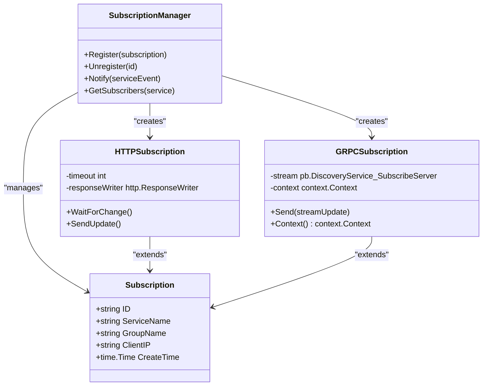

# Nacos Server Plugin

<cite>
**Referenced Files in This Document**  
- [plugin/nacosserver/core/push.go](file://plugin/nacosserver/core/push.go)
- [plugin/nacosserver/v2/grpc_push.go](file://plugin/nacosserver/v2/grpc_push.go)
- [plugin/nacosserver/v1/discover/access.go](file://plugin/nacosserver/v1/discover/access.go)
- [plugin/nacosserver/v2/discover/server.go](file://plugin/nacosserver/v2/discover/server.go)
- [plugin/nacosserver/config.go](file://plugin/nacosserver/config.go)
- [plugin/nacosserver/server.go](file://plugin/nacosserver/server.go)
- [plugin/nacosserver/model/constant.go](file://plugin/nacosserver/model/constant.go)
</cite>

## Table of Contents
1. [Introduction](#introduction)
2. [Dual-Protocol Architecture](#dual-protocol-architecture)
3. [Push Mechanism Implementation](#push-mechanism-implementation)
4. [Request Routing and Business Logic](#request-routing-and-business-logic)
5. [Subscription Management System](#subscription-management-system)
6. [Configuration and Connection Management](#configuration-and-connection-management)
7. [Performance Considerations](#performance-considerations)
8. [Debugging Push Delivery Failures](#debugging-push-delivery-failures)
9. [Conclusion](#conclusion)

## Introduction
The Nacos server plugin provides a robust service discovery and configuration management solution with support for both Nacos v1 (HTTP-based) and v2 (gRPC-based) protocols. This dual-protocol design enables backward compatibility while offering improved performance and real-time capabilities through the newer gRPC interface. The plugin facilitates dynamic service registration, health checking, and configuration distribution across distributed systems.

**Section sources**
- [plugin/nacosserver/server.go](file://plugin/nacosserver/server.go#L1-L30)
- [plugin/nacosserver/model/constant.go](file://plugin/nacosserver/model/constant.go#L1-L20)

## Dual-Protocol Architecture
The Nacos server plugin implements parallel support for Nacos v1 and v2 APIs, allowing clients to interact using either HTTP or gRPC protocols. The v1 interface uses traditional HTTP long-polling for service updates, while the v2 interface leverages gRPC streaming for real-time push notifications. Both protocols share the same underlying business logic and data storage layer, ensuring consistency across versions.

The architecture separates protocol handling from business processing, enabling independent scaling and maintenance of each interface. The v1 implementation resides in the `v1` directory, primarily using HTTP handlers, while the v2 implementation in the `v2` directory utilizes gRPC services and streaming endpoints.

**Diagram sources**
- [plugin/nacosserver/v1/discover/access.go](file://plugin/nacosserver/v1/discover/access.go#L10-L40)
- [plugin/nacosserver/v2/discover/server.go](file://plugin/nacosserver/v2/discover/server.go#L15-L50)
- [plugin/nacosserver/server.go](file://plugin/nacosserver/server.go#L50-L80)

**Section sources**
- [plugin/nacosserver/v1/discover/access.go](file://plugin/nacosserver/v1/discover/access.go#L1-L100)
- [plugin/nacosserver/v2/discover/server.go](file://plugin/nacosserver/v2/discover/server.go#L1-L120)

## Push Mechanism Implementation
The push mechanism is implemented in two components: `core/push.go` for the v1 HTTP long-polling model and `v2/grpc_push.go` for the v2 gRPC streaming model. Both systems enable real-time service updates to subscribed clients but use different transport mechanisms.

In v1, the push system uses a long-polling approach where clients maintain HTTP connections that are held open until a service change occurs. The `core/push.go` file implements a subscription registry and change notification system that wakes up pending requests when service instances are modified.

In v2, the gRPC streaming model establishes persistent bidirectional streams between server and client. The `v2/grpc_push.go` implementation manages these streams, pushing service updates immediately when changes occur without requiring client polling.

**Diagram sources**
- [plugin/nacosserver/core/push.go](file://plugin/nacosserver/core/push.go#L20-L60)
- [plugin/nacosserver/v2/grpc_push.go](file://plugin/nacosserver/v2/grpc_push.go#L25-L70)

**Section sources**
- [plugin/nacosserver/core/push.go](file://plugin/nacosserver/core/push.go#L1-L150)
- [plugin/nacosserver/v2/grpc_push.go](file://plugin/nacosserver/v2/grpc_push.go#L1-L120)

## Request Routing and Business Logic
Request routing is handled differently in v1 and v2 implementations but ultimately delegates to the same business logic layer. In v1, the `v1/discover/access.go` file contains HTTP handlers that parse incoming requests, validate parameters, and route them to appropriate service methods. These handlers use synchronous request-response patterns typical of REST APIs.

In v2, the `v2/discover/server.go` file implements gRPC service interfaces that receive protobuf-encoded requests and invoke the same underlying business logic functions. The gRPC implementation benefits from strong typing, better performance, and built-in streaming capabilities.

Both versions use middleware interceptors for authentication, rate limiting, and logging before requests reach the business logic layer. This ensures consistent security and observability policies across protocols.

**Diagram sources**
- [plugin/nacosserver/v1/discover/access.go](file://plugin/nacosserver/v1/discover/access.go#L45-L90)
- [plugin/nacosserver/v2/discover/server.go](file://plugin/nacosserver/v2/discover/server.go#L60-L110)

**Section sources**
- [plugin/nacosserver/v1/discover/access.go](file://plugin/nacosserver/v1/discover/access.go#L1-L150)
- [plugin/nacosserver/v2/discover/server.go](file://plugin/nacosserver/v2/discover/server.go#L1-L150)

## Subscription Management System
The subscription management system handles client subscriptions for service updates across both protocols. For v1, it implements a long-polling mechanism where subscription requests are queued and held until service changes occur or a timeout is reached. Each subscription is tracked with a unique identifier and associated metadata.

For v2, the system manages persistent gRPC streams where each connected client maintains an active stream for receiving push updates. The subscription registry tracks stream contexts and client metadata, allowing efficient broadcast of service changes to all relevant subscribers.

The core subscription logic is shared between both versions, with protocol-specific adapters handling the differences in connection management. This design ensures consistent behavior while optimizing for each protocol's strengths.

**Diagram sources**
- [plugin/nacosserver/core/push.go](file://plugin/nacosserver/core/push.go#L30-L80)
- [plugin/nacosserver/v2/grpc_push.go](file://plugin/nacosserver/v2/grpc_push.go#L40-L90)

**Section sources**
- [plugin/nacosserver/core/push.go](file://plugin/nacosserver/core/push.go#L1-L200)
- [plugin/nacosserver/v2/grpc_push.go](file://plugin/nacosserver/v2/grpc_push.go#L1-L150)

## Configuration and Connection Management
The Nacos server plugin supports simultaneous operation of both v1 and v2 protocols through configurable settings in `config.go`. Administrators can enable or disable each protocol version independently based on deployment requirements. Connection limits, timeouts, and thread pool sizes can be configured separately for HTTP and gRPC interfaces to optimize resource usage.

Key configuration options include:
- `enableV1`: Enables/disables the HTTP v1 API endpoint
- `enableV2`: Enables/disables the gRPC v2 API endpoint
- `httpPort`: Port for HTTP v1 service
- `grpcPort`: Port for gRPC v2 service
- `maxConnections`: Maximum concurrent connections per protocol
- `longPollingTimeout`: Timeout duration for v1 long-polling requests
- `streamIdleTimeout`: Idle timeout for v2 gRPC streams

These settings allow fine-grained control over resource allocation and performance characteristics for each protocol.

**Section sources**
- [plugin/nacosserver/config.go](file://plugin/nacosserver/config.go#L10-L100)
- [plugin/nacosserver/server.go](file://plugin/nacosserver/server.go#L30-L70)

## Performance Considerations
In high-concurrency scenarios, the v2 gRPC implementation generally outperforms v1 due to its streaming nature and reduced overhead per update. The persistent connections eliminate the need for repeated HTTP handshakes and allow immediate push of service changes. However, this requires more server-side memory to maintain active streams.

The v1 long-polling model creates less persistent load but generates more frequent connection cycles, which can increase CPU usage during peak times. Each long-poll request consumes a server thread or goroutine while waiting, potentially limiting scalability.

Optimization strategies include:
- Using connection pooling for gRPC clients
- Tuning long-polling timeouts to balance responsiveness and resource usage
- Implementing efficient subscription indexing to minimize broadcast overhead
- Monitoring connection counts and adjusting limits based on available resources
- Using compression for large service payloads in gRPC streams

**Section sources**
- [plugin/nacosserver/core/push.go](file://plugin/nacosserver/core/push.go#L100-L150)
- [plugin/nacosserver/v2/grpc_push.go](file://plugin/nacosserver/v2/grpc_push.go#L100-L150)
- [plugin/nacosserver/config.go](file://plugin/nacosserver/config.go#L50-L80)

## Debugging Push Delivery Failures
When troubleshooting push delivery failures, consider the following diagnostic steps:

1. **Check subscription registration**: Verify that client subscriptions are properly registered in the subscription manager
2. **Validate connection health**: Ensure client connections are active and not timing out prematurely
3. **Monitor event propagation**: Trace service change events from storage layer to push system to ensure proper notification
4. **Review error logs**: Examine logs in both `core/push.go` and `v2/grpc_push.go` for delivery errors
5. **Verify client handling**: Confirm that clients properly acknowledge and process push messages

Common issues include:
- Network interruptions causing stream resets in v2
- Long-polling timeouts being too short in high-latency environments
- Memory pressure from excessive concurrent subscriptions
- Serialization errors in message payloads
- Authentication token expiration during long-lived connections

Enable detailed logging in the push components to capture the full lifecycle of subscription and delivery events.

**Section sources**
- [plugin/nacosserver/core/push.go](file://plugin/nacosserver/core/push.go#L150-L200)
- [plugin/nacosserver/v2/grpc_push.go](file://plugin/nacosserver/v2/grpc_push.go#L150-L200)
- [plugin/nacosserver/logger/log.go](file://plugin/nacosserver/logger/log.go#L1-L30)

## Conclusion
The Nacos server plugin provides a comprehensive dual-protocol solution for service discovery and configuration management. By supporting both v1 HTTP and v2 gRPC interfaces, it offers flexibility for different deployment scenarios while maintaining consistent functionality. The push mechanism enables real-time service updates through protocol-appropriate methods—long-polling for HTTP and streaming for gRPC. Proper configuration and monitoring are essential for optimal performance, especially in high-concurrency environments. The modular architecture separates protocol concerns from business logic, facilitating maintenance and future enhancements.