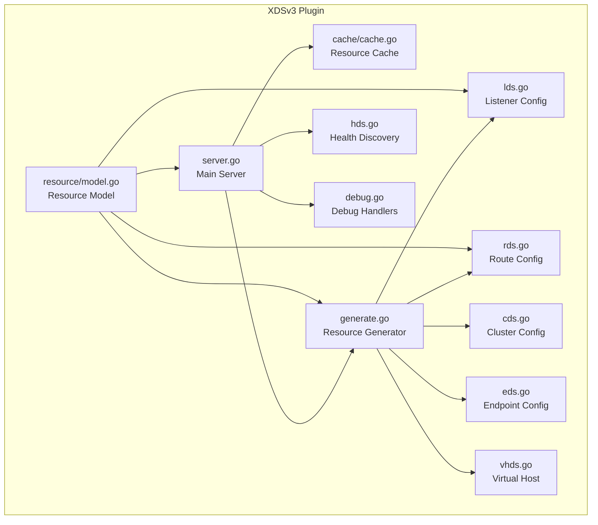
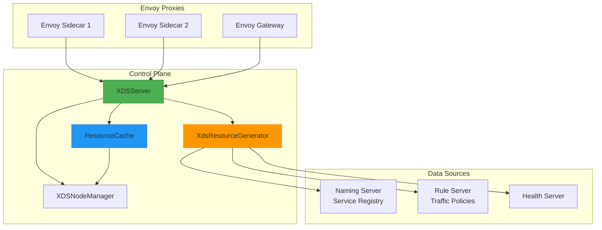
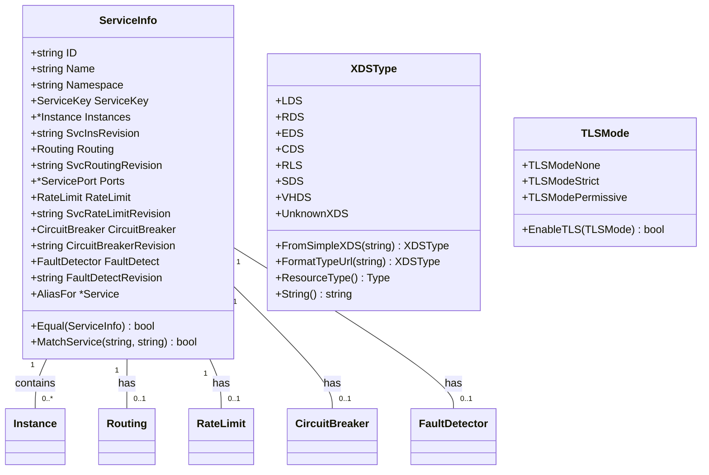
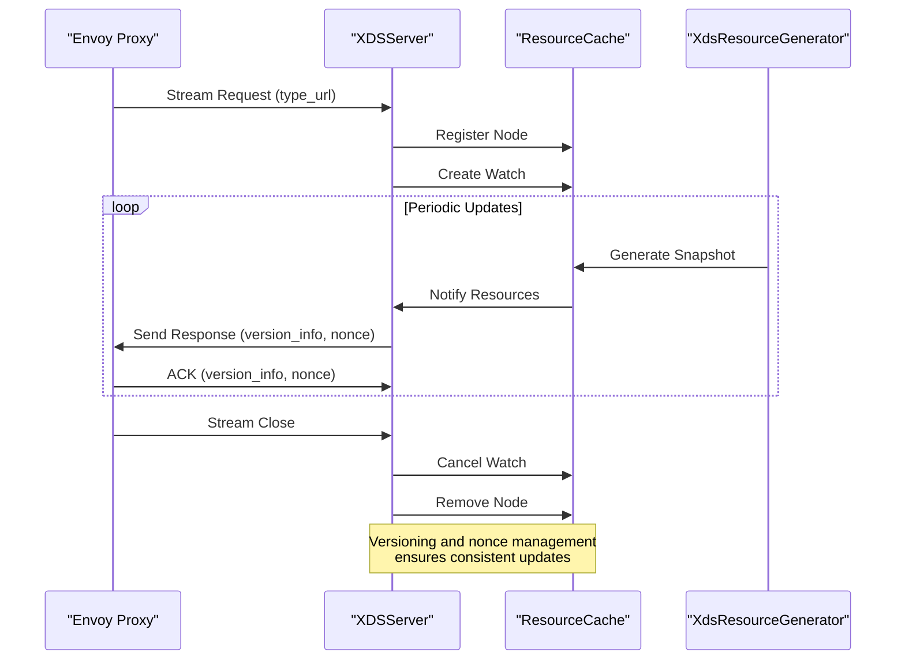
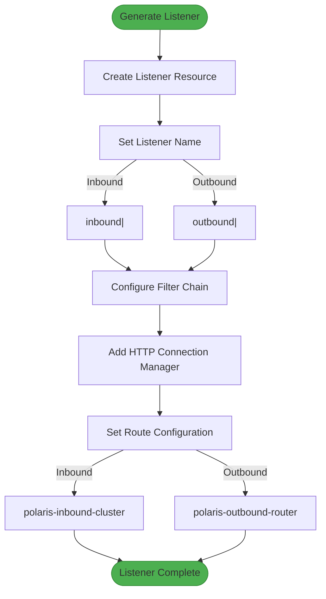
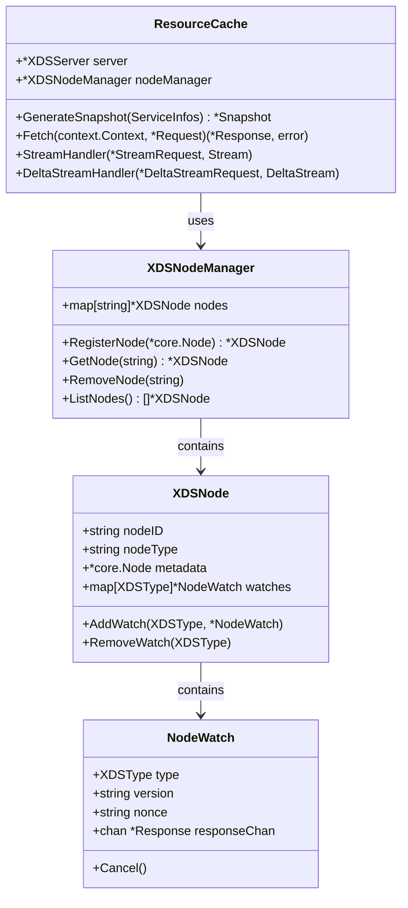
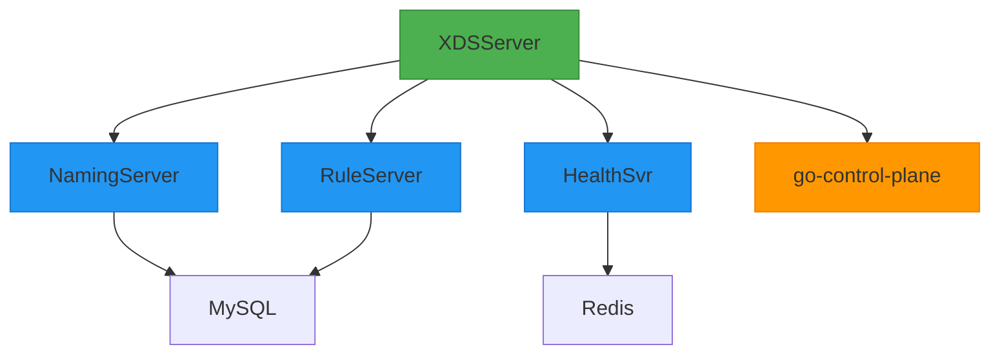
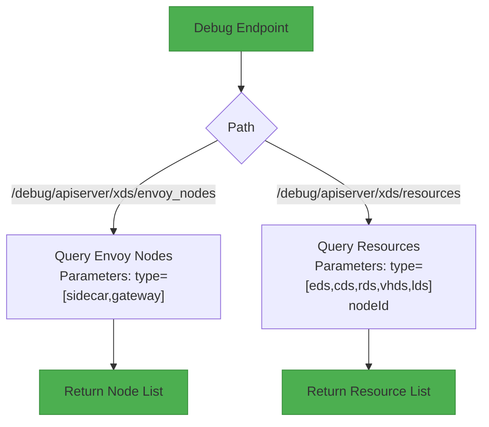

# XDS Server v3 Plugin

<cite>
**Referenced Files in This Document**   
- [server.go](file://plugin/apiserver/xdsserverv3/server.go)
- [resource/model.go](file://plugin/apiserver/xdsserverv3/resource/model.go)
- [lds.go](file://plugin/apiserver/xdsserverv3/lds.go)
- [rds.go](file://plugin/apiserver/xdsserverv3/rds.go)
- [cache/cache.go](file://plugin/apiserver/xdsserverv3/cache/cache.go)
- [generate.go](file://plugin/apiserver/xdsserverv3/generate.go)
- [cds.go](file://plugin/apiserver/xdsserverv3/cds.go)
- [eds.go](file://plugin/apiserver/xdsserverv3/eds.go)
- [vhds.go](file://plugin/apiserver/xdsserverv3/vhds.go)
- [hds.go](file://plugin/apiserver/xdsserverv3/hds.go)
</cite>

## Table of Contents
1. [Introduction](#introduction)
2. [Project Structure](#project-structure)
3. [Core Components](#core-components)
4. [Architecture Overview](#architecture-overview)
5. [Detailed Component Analysis](#detailed-component-analysis)
6. [Dependency Analysis](#dependency-analysis)
7. [Performance Considerations](#performance-considerations)
8. [Troubleshooting Guide](#troubleshooting-guide)
9. [Conclusion](#conclusion)

## Introduction
The XDS Server v3 Plugin implements the Envoy xDS v3 APIs to support service mesh sidecar configuration. This document details the implementation of CDS, RDS, LDS, EDS, VHDS, and HDS services, the resource model for service routing, the streaming xDS protocol handling, and cache mechanisms for client subscriptions. The plugin integrates with the Polaris service mesh to deliver dynamic configuration updates for traffic management, security policies, and health discovery.

## Project Structure
The XDS v3 server plugin is located in the `plugin/apiserver/xdsserverv3` directory and implements the full suite of Envoy xDS APIs. The structure follows a modular design with separate files for each xDS resource type and core functionality.

**Diagram sources**
- [server.go](file://plugin/apiserver/xdsserverv3/server.go#L1-L50)
- [resource/model.go](file://plugin/apiserver/xdsserverv3/resource/model.go#L1-L50)

**Section sources**
- [server.go](file://plugin/apiserver/xdsserverv3/server.go#L1-L50)
- [resource/model.go](file://plugin/apiserver/xdsserverv3/resource/model.go#L1-L50)

## Core Components
The XDS v3 plugin implements the core Envoy xDS APIs for service mesh configuration. The system is built around a resource model that transforms service routing rules into Envoy-compatible configurations. The streaming xDS protocol handles DiscoveryRequests with versioning and nonce management through the go-control-plane library. The cache mechanism tracks client subscriptions and manages incremental updates for efficient configuration distribution.

**Section sources**
- [server.go](file://plugin/apiserver/xdsserverv3/server.go#L41-L76)
- [resource/model.go](file://plugin/apiserver/xdsserverv3/resource/model.go#L77-L150)

## Architecture Overview
The XDS v3 server architecture follows the Envoy control plane pattern, implementing the Aggregated Discovery Service (ADS) and individual xDS services. The server maintains a resource cache and generates dynamic configurations based on service registry data and traffic management policies.

**Diagram sources**
- [server.go](file://plugin/apiserver/xdsserverv3/server.go#L41-L76)
- [cache/cache.go](file://plugin/apiserver/xdsserverv3/cache/cache.go#L1-L20)

## Detailed Component Analysis

### Resource Model Implementation
The resource model in `resource/model.go` defines the ServiceInfo structure that represents service instances and their associated policies. This model serves as the foundation for generating Envoy configurations from service mesh data.

**Diagram sources**
- [resource/model.go](file://plugin/apiserver/xdsserverv3/resource/model.go#L77-L150)

**Section sources**
- [resource/model.go](file://plugin/apiserver/xdsserverv3/resource/model.go#L77-L150)

### Streaming xDS Protocol Implementation
The xDS protocol implementation in `server.go` handles DiscoveryRequests with versioning and nonce management through the go-control-plane library. The server implements the full set of xDS services and manages client connections with proper lifecycle handling.

**Diagram sources**
- [server.go](file://plugin/apiserver/xdsserverv3/server.go#L166-L207)

**Section sources**
- [server.go](file://plugin/apiserver/xdsserverv3/server.go#L17-L41)

### Listener and Route Configuration Generation
The listener and route configuration generation in `lds.go` and `rds.go` transforms service routing rules into Envoy-compatible configurations. The implementation handles both inbound and outbound traffic with appropriate route configuration names.

**Diagram sources**
- [lds.go](file://plugin/apiserver/xdsserverv3/lds.go#L1-L20)
- [rds.go](file://plugin/apiserver/xdsserverv3/rds.go#L1-L20)

**Section sources**
- [lds.go](file://plugin/apiserver/xdsserverv3/lds.go#L1-L50)
- [rds.go](file://plugin/apiserver/xdsserverv3/rds.go#L1-L50)

### Cache Mechanism for Client Subscriptions
The cache mechanism in `cache/cache.go` tracks client subscriptions and manages incremental updates. The ResourceCache maintains snapshots of configuration state and handles watch registration for efficient change propagation.

**Diagram sources**
- [cache/cache.go](file://plugin/apiserver/xdsserverv3/cache/cache.go#L1-L20)

**Section sources**
- [cache/cache.go](file://plugin/apiserver/xdsserverv3/cache/cache.go#L1-L50)

## Dependency Analysis
The XDS v3 plugin has dependencies on several core components of the Polaris service mesh, including the naming server for service registry data, the rule server for traffic management policies, and the health server for instance health status.

**Diagram sources**
- [server.go](file://plugin/apiserver/xdsserverv3/server.go#L41-L76)

**Section sources**
- [server.go](file://plugin/apiserver/xdsserverv3/server.go#L41-L76)

## Performance Considerations
The XDS v3 implementation includes several performance optimizations:
- Connection limiting via connlimit package to prevent resource exhaustion
- Single-flight pattern to avoid duplicate service discovery calls
- Efficient cache synchronization with 5-second ticker for configuration updates
- Atomic operations for thread-safe version number management
- Pre-computed route configuration names for inbound and outbound traffic

The system is designed to handle high volumes of Envoy proxies with minimal latency in configuration updates. The use of the go-control-plane library ensures compatibility with Envoy's streaming xDS protocol requirements.

## Troubleshooting Guide
The XDS v3 plugin provides debug endpoints to assist with troubleshooting configuration issues:

**Diagram sources**
- [server.go](file://plugin/apiserver/xdsserverv3/server.go#L470-L483)

**Section sources**
- [server.go](file://plugin/apiserver/xdsserverv3/server.go#L470-L483)

## Conclusion
The XDS v3 Server Plugin provides a comprehensive implementation of the Envoy xDS APIs for service mesh configuration. By leveraging the go-control-plane library and integrating with Polaris service registry and policy systems, it delivers dynamic configuration updates for sidecar proxies. The resource model in `resource/model.go` effectively transforms service routing rules into Envoy-compatible configurations, while the cache mechanism ensures efficient distribution of incremental updates. The implementation supports all major xDS resources (CDS, RDS, LDS, EDS, VHDS, HDS) and includes debugging capabilities for operational visibility.