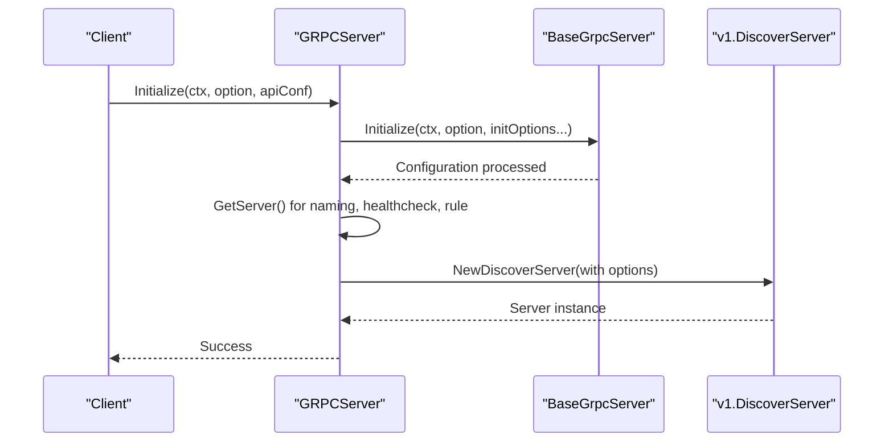
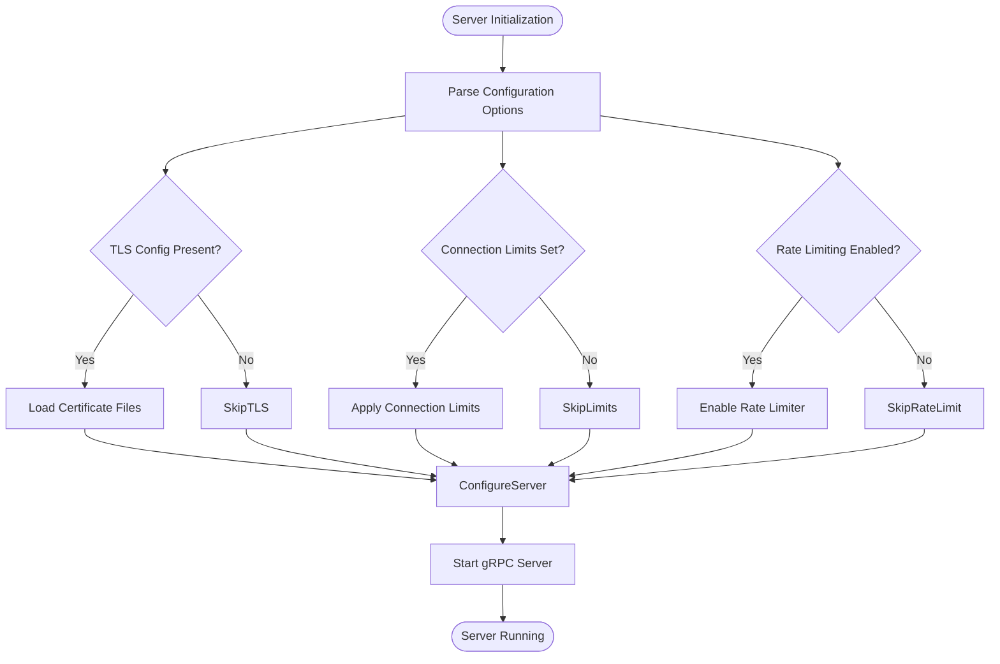
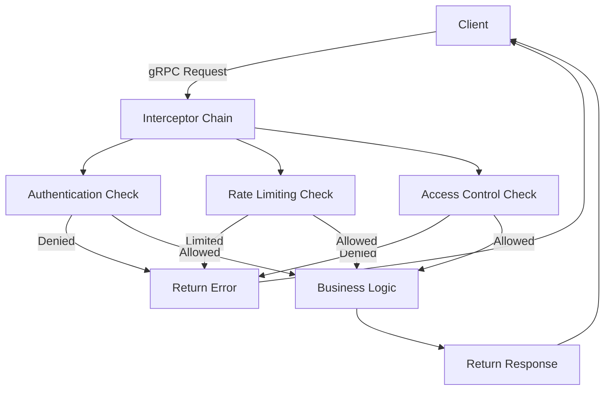

# gRPC Server Plugin

<cite>
**Referenced Files in This Document**   
- [base.go](file://plugin/apiserver/grpcserver/base.go)
- [server.go](file://plugin/apiserver/grpcserver/discover/server.go)
- [server_test.go](file://plugin/apiserver/grpcserver/discover/server_test.go)
</cite>

## Table of Contents
1. [Introduction](#introduction)
2. [gRPC Service Definitions in discover/v1](#grpc-service-definitions-in-discoverv1)
3. [Server Initialization Process](#server-initialization-process)
4. [Request Transformation and Processing](#request-transformation-and-processing)
5. [Streaming Support for Real-Time Updates](#streaming-support-for-real-time-updates)
6. [Configuration Options](#configuration-options)
7. [gRPC Error Codes](#grpc-error-codes)
8. [gRPC Gateway Integration](#grpc-gateway-integration)

## Introduction
The gRPC server plugin provides a high-performance, scalable interface for service discovery and configuration operations within the Pole.io platform. Built on Google's gRPC framework, it enables efficient communication between clients and the core service mesh using Protocol Buffers for serialization. This document details the implementation of the gRPC server plugin, focusing on service definitions, initialization, request handling, streaming capabilities, configuration options, error semantics, and integration with security and rate-limiting systems.

## gRPC Service Definitions in discover/v1
The `discover/v1` package defines the core gRPC service interface for service discovery operations. It maps directly to internal business logic for managing service instances, configurations, and health states. The service supports multiple discovery types including INSTANCE, SERVICES, and RATE_LIMIT, each corresponding to specific data models and operational workflows. These service definitions are implemented through the `DiscoverServer` struct, which acts as a facade to underlying core services such as naming, health checking, and rule management.

**Section sources**
- [server.go](file://plugin/apiserver/grpcserver/discover/server.go#L61-L106)

## Server Initialization Process
The gRPC server initialization begins with the `Initialize` method of the `GRPCServer` struct, which configures network settings, security parameters, and dependency injections. The process follows a layered approach:

1. Configuration parsing from provided options map
2. Network binding parameters (listenIP, listenPort) extraction
3. Connection limit configuration via `connlimit.ParseConnLimitConfig`
4. TLS configuration setup using `secure.ParseTLSConfig`
5. Dependency injection of core services (naming, healthcheck, rule server)
6. Construction of the v1 DiscoverServer with appropriate options

The base initialization is handled by `BaseGrpcServer.Initialize`, which processes connection limits and TLS settings before delegating to protocol-specific initialization logic.

**Diagram sources**
- [base.go](file://plugin/apiserver/grpcserver/base.go#L73-L124)
- [server.go](file://plugin/apiserver/grpcserver/discover/server.go#L61-L106)

**Section sources**
- [base.go](file://plugin/apiserver/grpcserver/base.go#L73-L124)
- [server.go](file://plugin/apiserver/grpcserver/discover/server.go#L61-L106)

## Request Transformation and Processing
Protobuf requests are transformed into internal data models through a structured processing pipeline. When a request arrives, the gRPC framework routes it through unary or stream interceptors before reaching the appropriate handler method. The transformation process involves:

1. Deserialization of protobuf messages into Go structs
2. Validation and preprocessing via interceptor chain
3. Mapping to internal service models using wrapper functions
4. Execution of business logic through core service interfaces
5. Conversion of results back to protobuf responses
6. Post-processing and response serialization

The `discoverCacheConvert` function demonstrates this transformation pattern, converting `DiscoverResponse` objects into cacheable `CacheObject` structures with appropriate type identification and key generation.

**Section sources**
- [server_test.go](file://plugin/apiserver/grpcserver/discover/server_test.go#L32-L180)

## Streaming Support for Real-Time Updates
The gRPC server implements streaming capabilities to support real-time service updates and health check reporting. While the current implementation focuses on unary RPCs, the architecture includes provisions for bidirectional streaming through the `RequestBiStream` handler registration pattern observed in related Nacos server implementations. The streaming framework allows clients to maintain persistent connections for receiving push-based updates about service instance changes, configuration modifications, and health status transitions without polling.

The connection management system tracks active streams and provides hooks for monitoring connection lifecycle events, enabling real-time metrics collection and resource cleanup.

## Configuration Options
The gRPC server supports several key configuration options for security, performance, and reliability:

- **TLS Configuration**: Enabled via `tls` section in configuration, supporting CertFile, KeyFile, and TrustedCAFile
- **Max Message Size**: Configured through gRPC server options (default handled by gRPC framework)
- **Concurrency Limits**: Managed through `connLimit` configuration with MaxConnPerHost and MaxConnLimit parameters
- **Rate Limiting**: Integrated via `ratelimit.GetRatelimit()` with per-method throttling
- **Connection Tracking**: Enabled through `connCounterHook` for monitoring client connections

These options are parsed during initialization and applied to the gRPC server instance before it starts accepting connections.

**Diagram sources**
- [base.go](file://plugin/apiserver/grpcserver/base.go#L73-L124)
- [base.go](file://plugin/apiserver/grpcserver/base.go#L126-L171)

**Section sources**
- [base.go](file://plugin/apiserver/grpcserver/base.go#L73-L124)

## gRPC Error Codes
The server uses a comprehensive error handling system that maps internal operation results to standard gRPC status codes. Common error codes include:

- **OK (0)**: Operation completed successfully
- **INVALID_ARGUMENT (3)**: Malformed request or invalid parameters
- **NOT_FOUND (5)**: Requested resource not found
- **ALREADY_EXISTS (6)**: Resource already exists when creating
- **PERMISSION_DENIED (7)**: Authentication/authorization failure
- **UNAVAILABLE (14)**: Service temporarily unavailable
- **INTERNAL (13)**: Internal server error

Custom application-level errors are encoded in the response's `Code` field using the `apimodel.Code` enumeration, allowing fine-grained error reporting while maintaining gRPC compatibility. The interceptor system handles error translation and ensures consistent error responses across all methods.

## gRPC Gateway Integration
The gRPC server integrates with authentication and rate limiting systems through a modular interceptor architecture. The `unaryInterceptor` and `streamInterceptor` functions provide hooks for cross-cutting concerns:

1. **Authentication**: The `AllowAccess` method checks if a method is permitted based on configuration
2. **Rate Limiting**: Integrated via `enterRateLimit` function passed to DiscoverServer
3. **Access Control**: Uses `allowAccess` function to determine method accessibility
4. **Connection Monitoring**: `connCounterHook` tracks active connections for metrics

The integration follows a dependency injection pattern where the gRPC server receives references to security and rate limiting components during initialization, ensuring loose coupling and testability.

**Diagram sources**
- [base.go](file://plugin/apiserver/grpcserver/base.go#L173-L226)
- [base.go](file://plugin/apiserver/grpcserver/base.go#L429-L474)

**Section sources**
- [base.go](file://plugin/apiserver/grpcserver/base.go#L173-L226)
- [base.go](file://plugin/apiserver/grpcserver/base.go#L429-L474)