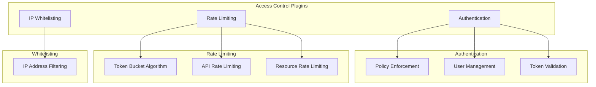
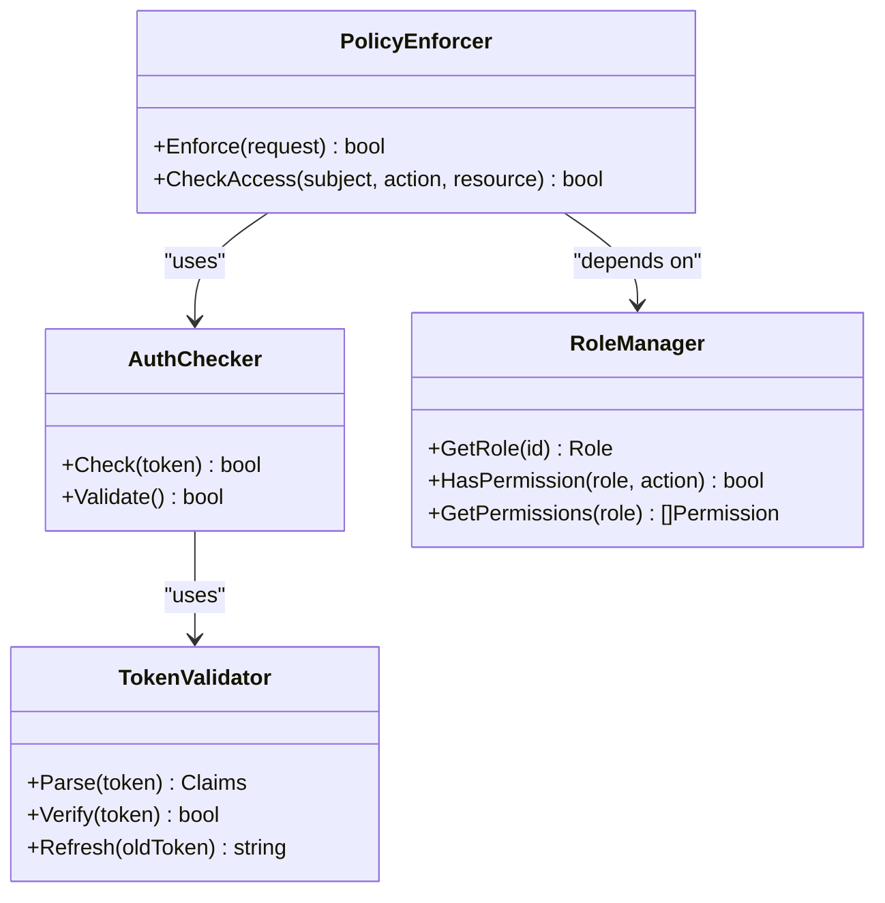
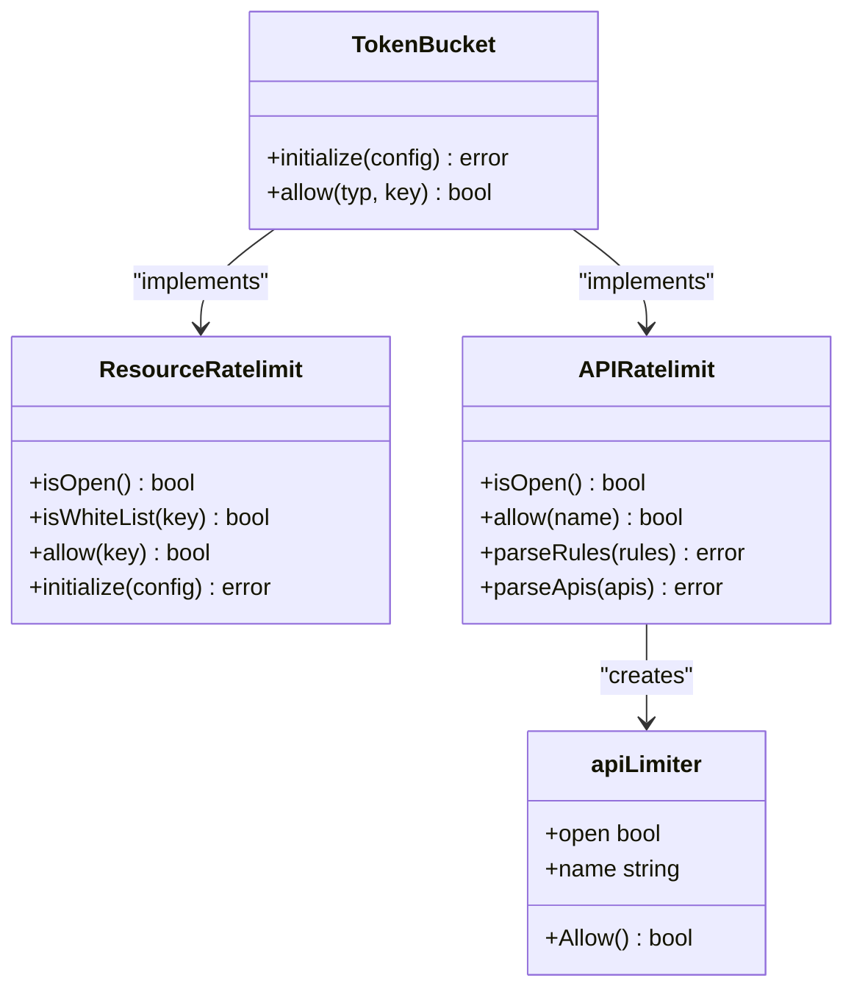
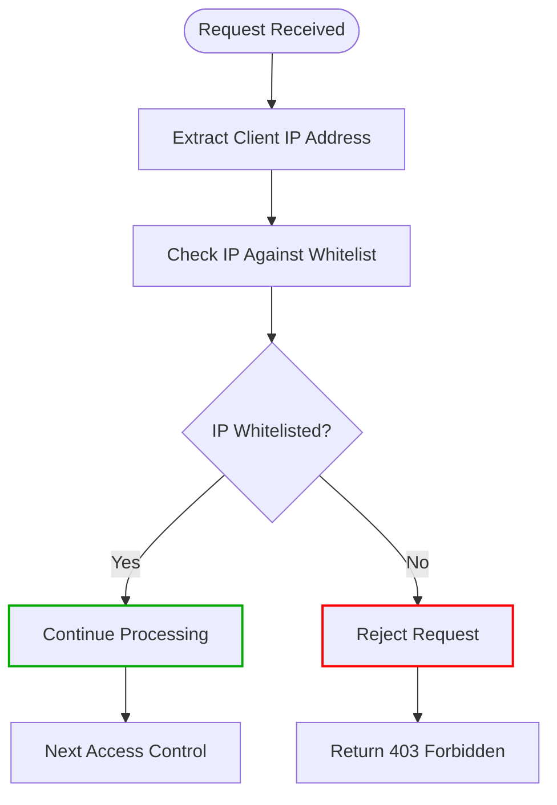
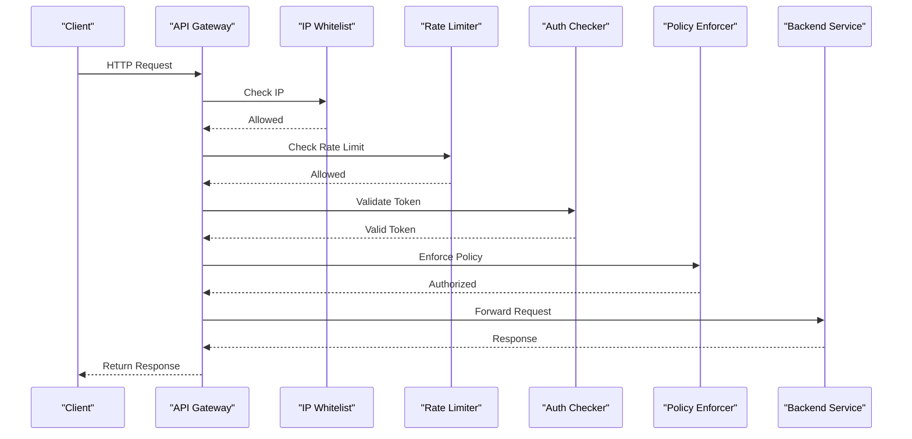
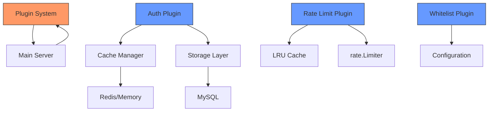

# Access Control Plugins

<cite>
**Referenced Files in This Document**   
- [plugin.go](file://plugin.go)
- [apis/access_control/auth/auth.go](file://apis/access_control/auth/auth.go)
- [plugin/access_control/auth/policy/policy.go](file://plugin/access_control/auth/policy/policy.go)
- [plugin/access_control/auth/user/token.go](file://plugin/access_control/auth/user/token.go)
- [plugin/access_control/ratelimit/token/implement.go](file://plugin/access_control/ratelimit/token/implement.go)
- [plugin/access_control/ratelimit/token/resource_limiter.go](file://plugin/access_control/ratelimit/token/resource_limiter.go)
- [plugin/access_control/ratelimit/token/api_limit.go](file://plugin/access_control/ratelimit/token/api_limit.go)
- [plugin/access_control/whitelist/ip/ip_whitelist.go](file://plugin/access_control/whitelist/ip/ip_whitelist.go)
</cite>

## Table of Contents
1. [Introduction](#introduction)
2. [Project Structure](#project-structure)
3. [Core Components](#core-components)
4. [Architecture Overview](#architecture-overview)
5. [Detailed Component Analysis](#detailed-component-analysis)
6. [Dependency Analysis](#dependency-analysis)
7. [Performance Considerations](#performance-considerations)
8. [Troubleshooting Guide](#troubleshooting-guide)
9. [Conclusion](#conclusion)

## Introduction
The pole-server access control plugin system provides a modular security framework for implementing pluggable extensions including authentication, rate limiting, and IP whitelisting. This document details the policy enforcement mechanisms, token validation, role-based access control, token bucket algorithm implementation, and request filtering capabilities. The system is designed to be extensible, supporting custom authentication schemes and integration with external identity providers.

## Project Structure
The access control plugin system is organized into modular components under the plugin/access_control directory, with each security feature implemented as a separate pluggable extension. The core components include authentication, rate limiting, and IP whitelisting modules, each with their own implementation files and test suites.

**Diagram sources**
- [plugin.go](file://plugin.go)
- [plugin/access_control/auth/policy/policy.go](file://plugin/access_control/auth/policy/policy.go)
- [plugin/access_control/ratelimit/token/implement.go](file://plugin/access_control/ratelimit/token/implement.go)
- [plugin/access_control/whitelist/ip/ip_whitelist.go](file://plugin/access_control/whitelist/ip/ip_whitelist.go)

**Section sources**
- [plugin.go](file://plugin.go)
- [plugin/access_control](file://plugin/access_control)

## Core Components
The access control system consists of three primary modular components: authentication, rate limiting, and IP whitelisting. Each component is implemented as a pluggable extension that can be independently configured and managed. The authentication module handles token validation and role-based access control through policy enforcement. The rate limiting module implements the token bucket algorithm for controlling request rates at various levels. The IP whitelisting module provides request filtering at the API gateway level based on IP addresses.

**Section sources**
- [plugin/access_control/auth/policy/policy.go](file://plugin/access_control/auth/policy/policy.go)
- [plugin/access_control/ratelimit/token/implement.go](file://plugin/access_control/ratelimit/token/implement.go)
- [plugin/access_control/whitelist/ip/ip_whitelist.go](file://plugin/access_control/whitelist/ip/ip_whitelist.go)

## Architecture Overview
The access control plugin system follows a modular architecture where security components are loaded as pluggable extensions. The system initializes these plugins during startup, registering them with the core server. Each plugin implements a common interface while providing specialized functionality for its security domain. The plugins are chained together in a specific order during request processing, allowing multiple access control mechanisms to be applied sequentially.

```mermaid
graph LR
Client[Client Request] --> APIGateway[API Gateway]
APIGateway --> IPWhitelist[IP Whitelisting]
IPWhitelist --> RateLimit[Rate Limiting]
RateLimit --> Authentication[Authentication]
Authentication --> Policy[Policy Enforcement]
Policy --> Authorization[Authorization Decision]
Authorization --> Backend[Backend Service]
Backend --> Response[Response]
style Client fill:#f9f,stroke:#333
style Backend fill:#bbf,stroke:#333
```

**Diagram sources**
- [plugin.go](file://plugin.go)
- [apis/access_control/auth/auth.go](file://apis/access_control/auth/auth.go)
- [plugin/access_control/whitelist/ip/ip_whitelist.go](file://plugin/access_control/whitelist/ip/ip_whitelist.go)

## Detailed Component Analysis

### Authentication and Policy Enforcement
The authentication system implements token validation and role-based access control through policy enforcement. The auth/user module handles user authentication and token management, while the auth/policy module enforces access policies based on user roles and permissions.

**Diagram sources**
- [plugin/access_control/auth/user/token.go](file://plugin/access_control/auth/user/token.go)
- [plugin/access_control/auth/policy/policy.go](file://plugin/access_control/auth/policy/policy.go)

**Section sources**
- [plugin/access_control/auth/user/token.go](file://plugin/access_control/auth/user/token.go)
- [plugin/access_control/auth/policy/policy.go](file://plugin/access_control/auth/policy/policy.go)

### Rate Limiting Implementation
The rate limiting system implements the token bucket algorithm to control request rates. It supports multiple rate limiting types including IP-based, API-level, and resource-level limiting. The implementation uses Go's x/time/rate package for the underlying rate limiting logic.

**Diagram sources**
- [plugin/access_control/ratelimit/token/implement.go](file://plugin/access_control/ratelimit/token/implement.go)
- [plugin/access_control/ratelimit/token/resource_limiter.go](file://plugin/access_control/ratelimit/token/resource_limiter.go)
- [plugin/access_control/ratelimit/token/api_limit.go](file://plugin/access_control/ratelimit/token/api_limit.go)

**Section sources**
- [plugin/access_control/ratelimit/token/implement.go](file://plugin/access_control/ratelimit/token/implement.go)
- [plugin/access_control/ratelimit/token/resource_limiter.go](file://plugin/access_control/ratelimit/token/resource_limiter.go)
- [plugin/access_control/ratelimit/token/api_limit.go](file://plugin/access_control/ratelimit/token/api_limit.go)

### IP Whitelisting Mechanism
The IP whitelisting component filters requests at the API gateway level by checking client IP addresses against a configured whitelist. This provides a first line of defense by allowing only trusted IP addresses to access the system.

**Diagram sources**
- [plugin/access_control/whitelist/ip/ip_whitelist.go](file://plugin/access_control/whitelist/ip/ip_whitelist.go)

**Section sources**
- [plugin/access_control/whitelist/ip/ip_whitelist.go](file://plugin/access_control/whitelist/ip/ip_whitelist.go)

### Request Processing Flow
The access control plugins are chained together during request processing, with each plugin performing its specific security check before passing the request to the next component in the chain.

**Diagram sources**
- [plugin.go](file://plugin.go)
- [apis/access_control/auth/auth.go](file://apis/access_control/auth/auth.go)
- [plugin/access_control/whitelist/ip/ip_whitelist.go](file://plugin/access_control/whitelist/ip/ip_whitelist.go)
- [plugin/access_control/ratelimit/token/implement.go](file://plugin/access_control/ratelimit/token/implement.go)

## Dependency Analysis
The access control plugins have well-defined dependencies on core system components while maintaining loose coupling between individual plugins. The plugin system relies on the main server's plugin registration mechanism and shares common dependencies for logging and configuration management.

**Diagram sources**
- [plugin.go](file://plugin.go)
- [plugin/access_control/auth/policy/helper.go](file://plugin/access_control/auth/policy/helper.go)
- [plugin/access_control/ratelimit/token/resource_limiter.go](file://plugin/access_control/ratelimit/token/resource_limiter.go)

**Section sources**
- [plugin.go](file://plugin.go)
- [plugin/access_control/auth/policy/helper.go](file://plugin/access_control/auth/policy/helper.go)
- [plugin/access_control/ratelimit/token/resource_limiter.go](file://plugin/access_control/ratelimit/token/resource_limiter.go)

## Performance Considerations
The access control system is designed with performance in mind, using efficient data structures and algorithms to minimize overhead. The rate limiting implementation uses LRU caches to store rate limiter instances, reducing memory usage and improving lookup performance. The authentication system caches user roles and permissions to avoid repeated database queries.

**Section sources**
- [plugin/access_control/ratelimit/token/resource_limiter.go](file://plugin/access_control/ratelimit/token/resource_limiter.go)
- [plugin/access_control/auth/policy/policy.go](file://plugin/access_control/auth/policy/policy.go)

## Troubleshooting Guide
Common issues with the access control plugins typically involve configuration errors, connectivity problems with external services, or performance bottlenecks under high load. Monitoring logs from the individual plugin components can help identify the source of issues.

**Section sources**
- [plugin/access_control/ratelimit/token/log.go](file://plugin/access_control/ratelimit/token/log.go)
- [plugin/access_control/auth/policy/log.go](file://plugin/access_control/auth/policy/log.go)

## Conclusion
The pole-server access control plugin system provides a flexible and extensible framework for implementing security controls. By modularizing authentication, rate limiting, and IP whitelisting into pluggable components, the system allows for easy customization and extension. The token bucket algorithm implementation provides effective rate limiting with configurable parameters, while the policy enforcement mechanisms support fine-grained access control based on user roles and permissions. The system's architecture supports integration with external identity providers and can be extended to support custom authentication schemes.