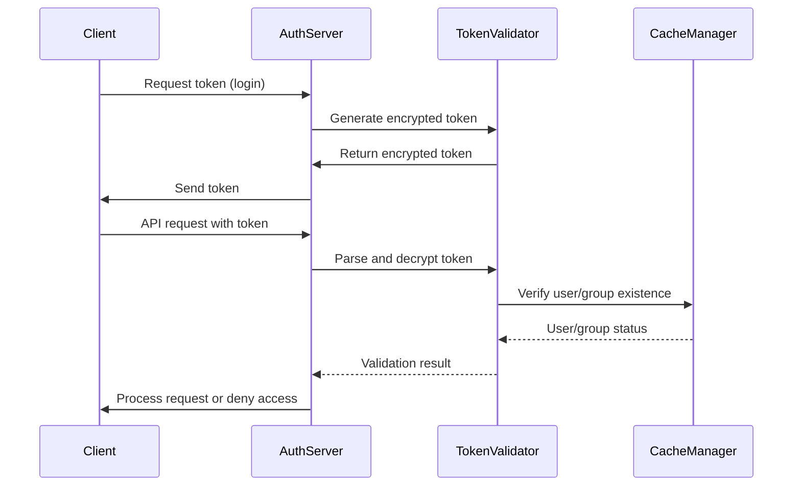
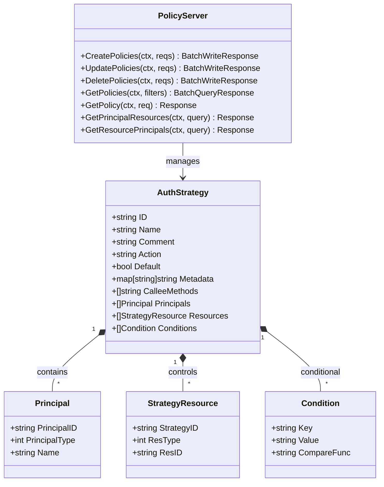
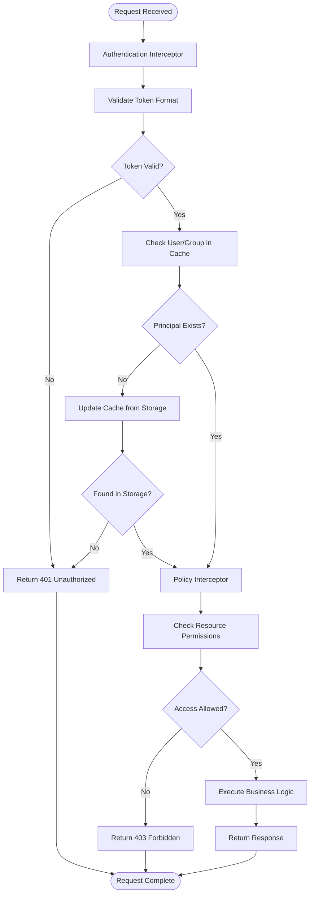

# Authentication Plugin

<cite>
**Referenced Files in This Document**   
- [token.go](file://plugin/access_control/auth/user/token.go)
- [policy.go](file://plugin/access_control/auth/policy/policy.go)
- [default.go](file://plugin/access_control/auth/user/default.go)
- [auth_checker.go](file://plugin/access_control/auth/policy/auth_checker.go)
- [server.go](file://plugin/access_control/auth/user/inteceptor/auth/server.go)
- [server.go](file://plugin/access_control/auth/policy/inteceptor/server.go)
</cite>

## Table of Contents
1. [Introduction](#introduction)
2. [Token-Based Authentication Implementation](#token-based-authentication-implementation)
3. [Role-Based Access Control (RBAC) System](#role-based-access-control-rbac-system)
4. [Interceptor Chain Integration](#interceptor-chain-integration)
5. [API Endpoint Policy Application](#api-endpoint-policy-application)
6. [User Management and Policy Enforcement Relationship](#user-management-and-policy-enforcement-relationship)
7. [Common Issues and Solutions](#common-issues-and-solutions)
8. [Extending with External Identity Providers](#extending-with-external-identity-providers)
9. [Conclusion](#conclusion)

## Introduction
The authentication plugin in pole-server provides a comprehensive security framework for user authentication and authorization. The system implements token-based authentication using custom token formats with AES encryption, combined with a robust role-based access control (RBAC) system. This documentation details the implementation of user authentication via token validation, the RBAC system for access control, interceptor chain integration for request validation, and guidance for extending the system with external identity providers.

## Token-Based Authentication Implementation

The token-based authentication system in pole-server is implemented in the `token.go` module, providing secure token generation, parsing, and validation mechanisms. The system uses AES encryption with CFB mode to protect token data and implements a custom token format that includes user or group identifiers.

**Diagram sources**
- [token.go](file://plugin/access_control/auth/user/token.go#L41-L86)
- [user.go](file://plugin/access_control/auth/user/user.go#L396-L415)

The token generation process follows these steps:
1. Create a random prefix using UUID
2. Format the principal identifier (user or group) with type indicator
3. Combine components using the pattern `{random}::{type}/{id}`
4. Encrypt the token using AES-CFB with a server-defined salt
5. Base64 encode the encrypted result

Token validation involves:
1. Base64 decoding the token
2. Decrypting with the server salt
3. Parsing the token structure
4. Verifying the principal exists in the cache
5. Checking if the principal is disabled

The system handles both user tokens and group tokens, distinguishing between them through the token format. Token expiration is managed through the cache system rather than embedded expiration timestamps, allowing for more flexible token lifecycle management.

**Section sources**
- [token.go](file://plugin/access_control/auth/user/token.go#L0-L195)

## Role-Based Access Control (RBAC) System

The RBAC system in pole-server is implemented in the `policy.go` module, providing fine-grained access control based on user roles, groups, and custom policies. The system allows administrators to define authorization strategies that specify which principals (users, groups, or roles) can access specific resources and perform certain actions.

**Diagram sources**
- [policy.go](file://plugin/access_control/auth/policy/policy.go#L575-L609)
- [policy.go](file://plugin/access_control/auth/policy/policy.go#L409-L453)

Key components of the RBAC system include:

- **AuthStrategy**: Represents an authorization policy with a name, action (allow/deny), principals (users/groups/roles), resources, and optional conditions
- **Principal**: Represents an entity that can be granted permissions (user, group, or role)
- **StrategyResource**: Links a policy to specific resources by type and ID
- **Condition**: Optional constraints that must be satisfied for the policy to apply

The system supports several operations:
- Create, update, and delete authorization policies
- Query policies from user or resource perspectives
- Retrieve all resources accessible to a principal
- Determine all principals with access to a specific resource

Policy evaluation follows a hierarchical approach:
1. Check if the requesting user is the resource owner
2. Verify if the user belongs to any groups with access
3. Evaluate role-based permissions
4. Apply conditional logic if specified

The system also implements special handling for default strategies and enforces ownership requirements for policy modifications.

**Section sources**
- [policy.go](file://plugin/access_control/auth/policy/policy.go#L0-L799)

## Interceptor Chain Integration

The authentication system integrates with the request processing pipeline through interceptor chains implemented in the `auth/user/inteceptor` and `auth/policy/inteceptor` modules. These interceptors validate credentials and enforce policies before business logic execution, ensuring that unauthorized requests are rejected early in the processing cycle.

**Diagram sources**
- [default.go](file://plugin/access_control/auth/user/default.go#L30-L88)
- [server.go](file://plugin/access_control/auth/user/inteceptor/auth/server.go#L0-L100)

The interceptor chain is constructed during server initialization using a proxy factory pattern. The `BuildServer` function in `default.go` creates the chain by registering interceptor factories and applying them in a defined order. Currently, the system applies interceptors in this sequence:

1. **Auth Interceptor**: Handles token validation and principal identification
2. **Paramcheck Interceptor**: Validates request parameters and performs additional security checks

Each interceptor wraps the previous server implementation, creating a layered processing pipeline. The auth interceptor extracts and validates the token from the request, populates the acquisition context with user information, and passes control to the next interceptor in the chain. If token validation fails, the request is terminated immediately without proceeding to subsequent interceptors or business logic.

The policy interceptor evaluates the authenticated user's permissions against the requested resource, enforcing the RBAC rules defined in the system. This separation of concerns allows for modular security processing while maintaining performance through early rejection of unauthorized requests.

**Section sources**
- [default.go](file://plugin/access_control/auth/user/default.go#L0-L89)

## API Endpoint Policy Application

Authentication policies are applied to API endpoints through the interceptor chain, which automatically validates credentials and enforces access control rules before business logic execution. The system uses context propagation to maintain authentication state throughout the request processing pipeline.

When an API request is received, the following sequence occurs:

1. The HTTP server extracts authentication information (typically from headers)
2. The auth interceptor processes the request, validating tokens and identifying the principal
3. The policy interceptor checks if the principal has permission to access the requested resource
4. If both authentication and authorization succeed, the request proceeds to business logic
5. If either step fails, an appropriate error response is returned

The system supports different authentication modes based on the request context:
- Console access: Requires valid user tokens with appropriate permissions
- Client access: May use service tokens or API keys
- Administrative operations: Require elevated privileges

Policy application can be customized through metadata and conditions attached to authorization strategies. For example, a policy might include time-based restrictions, IP address requirements, or other contextual constraints that must be satisfied for access to be granted.

The system also supports wildcard resource patterns, allowing administrators to define broad access rules that apply to multiple resources simultaneously. This reduces configuration overhead while maintaining security through principle of least privilege.

**Section sources**
- [server.go](file://plugin/access_control/auth/policy/inteceptor/server.go#L0-L200)
- [auth_checker.go](file://plugin/access_control/auth/policy/auth_checker.go#L0-L150)

## User Management and Policy Enforcement Relationship

The authentication system establishes a clear relationship between user management, token issuance, and policy enforcement. User and group management operations directly impact the authentication and authorization processes, creating a cohesive security model.

When a user is created or modified, the system:
1. Generates or updates authentication tokens
2. Updates the user cache to reflect current status
3. Propagates changes to all connected services
4. Invalidates previous tokens if security policies require

The cache manager plays a critical role in this relationship, maintaining up-to-date information about users, groups, and policies. When token validation occurs, the system first checks the cache for user information. If the user is not found, it triggers a cache update from persistent storage, ensuring that authentication decisions are based on current data.

Policy enforcement relies on this same cache infrastructure to determine:
- Which policies apply to a given user or group
- The resources accessible to a principal
- The effective permissions for a specific operation

This tight integration between user management and policy enforcement ensures that security decisions reflect the current state of the system. For example, when a user is disabled, their tokens become invalid immediately because the cache reflects their disabled status. Similarly, when group membership changes, affected users' access rights are automatically updated without requiring token regeneration.

The system also maintains audit trails for all authentication and authorization operations, recording policy changes and access attempts for security monitoring and compliance purposes.

**Section sources**
- [user.go](file://plugin/access_control/auth/user/user.go#L396-L415)
- [policy.go](file://plugin/access_control/auth/policy/policy.go#L0-L799)

## Common Issues and Solutions

### Token Revocation
The system does not implement traditional token revocation lists. Instead, it relies on the cache-based validation approach where disabled users and groups are immediately denied access. To revoke a token:
1. Disable the associated user or group
2. The next authentication attempt will fail due to disabled status
3. No further action is required as the token itself cannot be reactivated

For immediate revocation without disabling the user, administrators should reset the user's token, which generates a new token and invalidates the previous one.

### Role Hierarchy Misconfigurations
The current implementation does not support role hierarchies (e.g., admin inherits from user). To avoid misconfigurations:
1. Define comprehensive roles that include all necessary permissions
2. Use groups to manage collections of users with similar access requirements
3. Regularly audit policies to ensure they reflect current business requirements
4. Test policy changes in non-production environments before deployment

### Performance Impacts of Frequent Auth Checks
The interceptor-based architecture minimizes performance impacts by:
1. Caching user, group, and policy information
2. Early termination of unauthorized requests
3. Efficient token parsing and validation
4. Batch operations for policy retrieval

To further optimize performance:
1. Ensure adequate cache sizing and eviction policies
2. Monitor authentication latency metrics
3. Consider read replicas for high-traffic deployments
4. Implement client-side caching for static resources when appropriate

The system includes logging and monitoring capabilities to track authentication performance and identify potential bottlenecks.

**Section sources**
- [token.go](file://plugin/access_control/auth/user/token.go#L0-L195)
- [policy.go](file://plugin/access_control/auth/policy/policy.go#L0-L799)

## Extending with External Identity Providers

The authentication system can be extended to support external identity providers such as OAuth2 and OpenID Connect through several integration points:

1. **Custom Token Validator**: Implement a new token validation strategy that accepts tokens from external providers
2. **User Synchronization**: Create connectors that sync user information from external directories
3. **Federation Adapter**: Develop an adapter that translates external identity tokens to the internal format

To implement OAuth2/OpenID Connect support:

1. Add a new interceptor that handles OAuth2 flows:
   - Redirect users to the identity provider for authentication
   - Handle callback responses and token exchange
   - Map external identities to internal users or create new accounts

2. Extend the token generation system to accept JWT tokens from trusted providers:
   - Validate JWT signatures using provider public keys
   - Extract user information from standard claims
   - Map claims to internal user attributes

3. Implement refresh token handling for long-lived sessions:
   - Store refresh tokens securely
   - Automatically renew access tokens before expiration
   - Handle token revocation from the identity provider

4. Support multiple identity providers through a pluggable architecture:
   - Configure providers through the system settings
   - Allow users to choose their preferred provider
   - Maintain consistent user experience across providers

The system's modular design facilitates these extensions while maintaining security and performance. Custom implementations should follow the existing interceptor pattern to ensure seamless integration with the authentication pipeline.

**Section sources**
- [server.go](file://plugin/access_control/auth/user/inteceptor/auth/server.go#L0-L100)
- [server.go](file://plugin/access_control/auth/policy/inteceptor/server.go#L0-L100)

## Conclusion
The authentication plugin in pole-server provides a robust, extensible security framework that combines token-based authentication with comprehensive role-based access control. The interceptor-based architecture ensures that security checks are performed consistently across all API endpoints while maintaining performance through efficient caching and early request termination. The system's modular design allows for future extensions, including support for external identity providers, while the tight integration between user management and policy enforcement ensures that security decisions reflect the current state of the system. By following the patterns and practices documented here, administrators and developers can effectively manage security in their pole-server deployments.