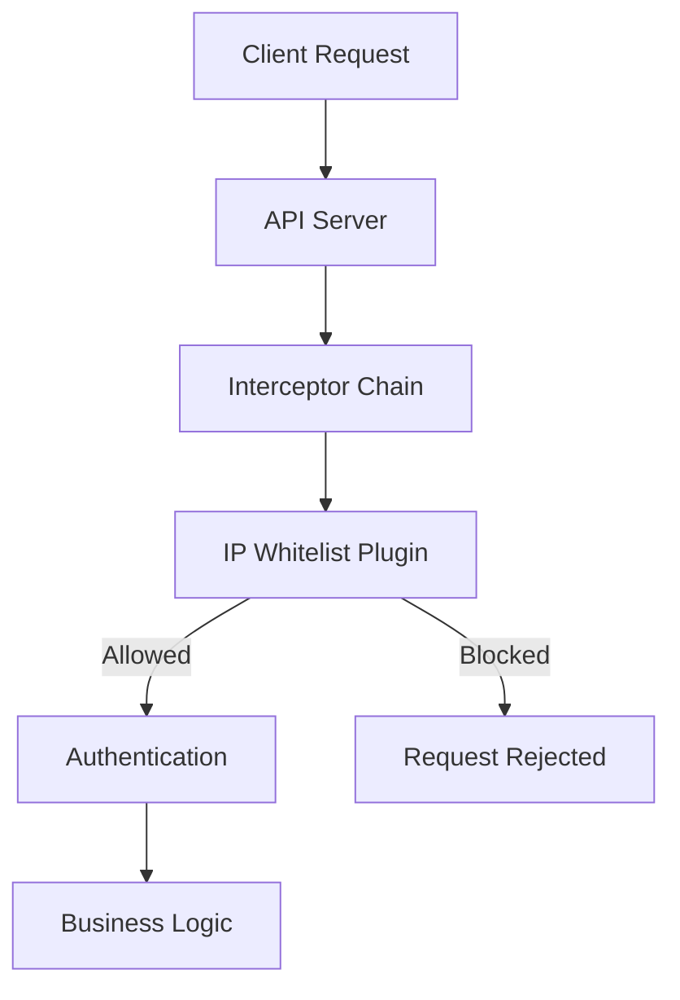
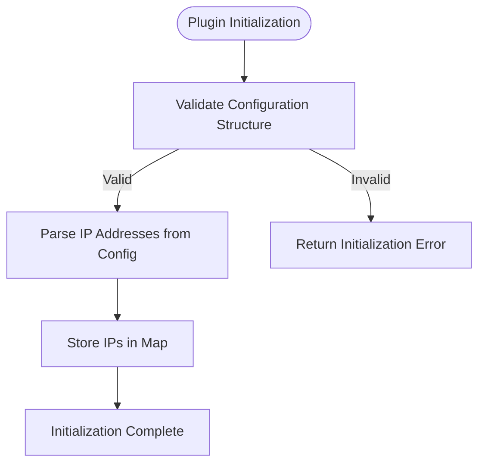

# IP Whitelisting Plugin

<cite>
**Referenced Files in This Document**   
- [ip_whitelist.go](file://plugin/access_control/whitelist/ip/ip_whitelist.go)
- [match.go](file://pkg/common/utils/match/match.go)
- [whitelist.go](file://apis/access_control/whitelist/whitelist.go)
- [plugin.go](file://apis/plugin.go)
</cite>

## Table of Contents
1. [Introduction](#introduction)
2. [Core Components](#core-components)
3. [Architecture Overview](#architecture-overview)
4. [Detailed Component Analysis](#detailed-component-analysis)
5. [Configuration Examples](#configuration-examples)
6. [Performance Considerations](#performance-considerations)
7. [Use Cases](#use-cases)
8. [Troubleshooting Guide](#troubleshooting-guide)

## Introduction
The IP Whitelisting Plugin in pole-server provides a security mechanism to filter incoming requests by validating client IP addresses against a predefined allowlist. This plugin operates as part of the access control system, ensuring that only requests from authorized IP addresses can proceed through the API server's interceptor chain. The implementation supports both exact IP matching and CIDR notation for subnet-based access control.

## Core Components

The IP whitelisting functionality is implemented through several key components that work together to provide secure and efficient IP address validation. The core logic resides in the `ip_whitelist.go` module, which implements the whitelist interface and provides methods for initialization, IP validation, and plugin lifecycle management.

**Section sources**
- [ip_whitelist.go](file://plugin/access_control/whitelist/ip/ip_whitelist.go#L1-L66)
- [whitelist.go](file://apis/access_control/whitelist/whitelist.go#L1-L39)

## Architecture Overview

The IP whitelisting plugin integrates into the pole-server architecture as an access control component that operates within the API server's interceptor chain. It is registered as a plugin and initialized with configuration data containing the allowed IP addresses. When a request arrives, the plugin checks the client's IP address against the allowlist before allowing the request to proceed to authentication and business logic layers.



**Diagram sources**
- [ip_whitelist.go](file://plugin/access_control/whitelist/ip/ip_whitelist.go#L1-L66)
- [plugin.go](file://apis/plugin.go#L70-L111)

## Detailed Component Analysis

### IP Whitelist Implementation
The `ipWhitelist` struct implements the core functionality of the IP whitelisting plugin. It maintains an in-memory map of allowed IP addresses for O(1) lookup performance. The plugin follows the standard plugin interface with methods for initialization, name retrieval, type identification, and destruction.

#### Initialization Process
The plugin is initialized with configuration data that contains the list of allowed IP addresses. During initialization, the IP addresses are parsed and stored in a map for efficient lookup. The configuration must provide the IP addresses as an array of strings; otherwise, initialization fails.



**Diagram sources**
- [ip_whitelist.go](file://plugin/access_control/whitelist/ip/ip_whitelist.go#L30-L45)

#### IP Matching Logic
The `Contain` method performs the actual IP validation by checking if the provided IP address exists in the allowlist map. The method accepts an interface{} parameter and attempts to cast it to a string representing the IP address.

```mermaid
classDiagram
class ipWhitelist {
+ips map[string]bool
+Name() string
+Initialize(conf *ConfigEntry) error
+Type() PluginType
+Destroy() error
+Contain(entry interface{}) bool
}
class ConfigEntry {
+Name string
+Option map[string]interface{}
}
class Plugin {
<<interface>>
+Name() string
+Initialize(conf *ConfigEntry) error
+Destroy() error
}
ipWhitelist --> Plugin : implements
ipWhitelist --> ConfigEntry : uses
```

**Diagram sources**
- [ip_whitelist.go](file://plugin/access_control/whitelist/ip/ip_whitelist.go#L20-L66)

## Configuration Examples

### Basic IP Allowlist Configuration
The plugin is configured through the server's configuration system using the "whitelist" configuration entry. The following example shows how to define a basic IP allowlist:

```yaml
whitelist:
  name: whitelist
  option:
    ip:
      - "127.0.0.1"
      - "192.168.0.1"
      - "10.0.0.0/8"
```

This configuration allows requests from localhost, a specific internal IP, and any IP in the 10.0.0.0/8 private network range.

### Service-Specific IP Restrictions
For more granular control, IP restrictions can be applied to specific services or endpoints by combining the whitelist plugin with other access control mechanisms. The configuration can be extended to include service-specific rules:

```yaml
whitelist:
  name: whitelist
  option:
    ip:
      - "203.0.113.0/24"  # Third-party integration network
      - "198.51.100.10"   # Partner API endpoint
      - "127.0.0.1"       # Local administration
```

**Section sources**
- [ip_whitelist.go](file://plugin/access_control/whitelist/ip/ip_whitelist.go#L30-L45)
- [plugin.go](file://apis/plugin.go#L70-L111)

## Performance Considerations

The IP whitelisting plugin is designed for high-performance operation with minimal impact on request processing latency. The key performance characteristics include:

- **O(1) Lookup Time**: IP addresses are stored in a hash map, enabling constant-time lookups regardless of the size of the allowlist.
- **In-Memory Storage**: The allowlist is maintained in memory after initialization, eliminating the need for disk I/O or database queries during request processing.
- **Efficient Initialization**: The plugin parses and stores all allowed IPs during server startup, avoiding repeated parsing operations.
- **Low Memory Overhead**: Each IP address requires minimal storage space in the map, making the memory footprint proportional to the number of allowed IPs.

The current implementation does not support CIDR notation directly in the allowlist, meaning that subnet checks would require additional processing. For large subnets, it may be more efficient to use a specialized data structure like a trie or implement CIDR matching logic.

**Section sources**
- [ip_whitelist.go](file://plugin/access_control/whitelist/ip/ip_whitelist.go#L50-L60)

## Use Cases

### Restricting Admin APIs to Internal Networks
A common use case is restricting administrative APIs to internal network addresses only. This prevents external access to sensitive management endpoints:

```yaml
whitelist:
  option:
    ip:
      - "172.16.0.0/12"  # Internal corporate network
      - "10.0.0.0/8"     # Private network
      - "192.168.0.0/16" # Local network
```

### Allowing Third-Party Integrations from Known IPs
For integrations with trusted third-party services, specific IP addresses or ranges can be added to the allowlist:

```yaml
whitelist:
  option:
    ip:
      - "203.0.113.25"   # Payment processor
      - "198.51.100.0/24" # Analytics service
      - "44.224.0.0/12"  # AWS US East region
```

### Development and Testing Environments
During development, the whitelist can be configured to allow access from developer workstations and testing infrastructure:

```yaml
whitelist:
  option:
    ip:
      - "127.0.0.1"      # Local development
      - "192.168.1.100"  # Developer workstation
      - "10.10.0.0/16"   # Testing network
```

**Section sources**
- [ip_whitelist.go](file://plugin/access_control/whitelist/ip/ip_whitelist.go#L50-L60)

## Troubleshooting Guide

### Incorrect Subnet Definitions
The current implementation only supports exact IP matching and does not natively support CIDR notation. If CIDR ranges are specified in the configuration, they will be treated as literal IP addresses and will not match addresses within the subnet.

**Solution**: For subnet-based access control, consider implementing a custom matcher or using a different plugin that supports CIDR notation.

### IPv6 Compatibility
The plugin does not have specific IPv6 handling code, but it should work with IPv6 addresses as long as they are properly formatted in the configuration:

```yaml
whitelist:
  option:
    ip:
      - "::1"                    # IPv6 localhost
      - "2001:db8::/32"         # Documentation prefix
      - "fe80::1%lo0"            # Link-local address
```

Ensure that IPv6 addresses are correctly formatted and that the network infrastructure supports IPv6 traffic.

### Bypass Scenarios
Certain scenarios may result in IP checks being bypassed:

1. **Configuration Errors**: If the configuration is malformed or the "ip" field is not an array, initialization will fail and the plugin may not be properly registered.
2. **Missing Plugin Registration**: If the plugin is not properly registered in the interceptor chain, IP checks will not be performed.
3. **Proxy Headers**: When running behind a proxy, the client IP may be obscured. Ensure that proxy headers (like X-Forwarded-For) are properly handled by the API server before reaching the whitelist plugin.

**Verification Steps**:
1. Check server logs for plugin initialization errors
2. Verify that the plugin is registered in the interceptor chain
3. Test with known allowed and disallowed IPs to confirm expected behavior
4. Review configuration syntax and structure

**Section sources**
- [ip_whitelist.go](file://plugin/access_control/whitelist/ip/ip_whitelist.go#L30-L45)
- [ip_whitelist_test.go](file://plugin/access_control/whitelist/ip/ip_whitelist_test.go#L47-L115)