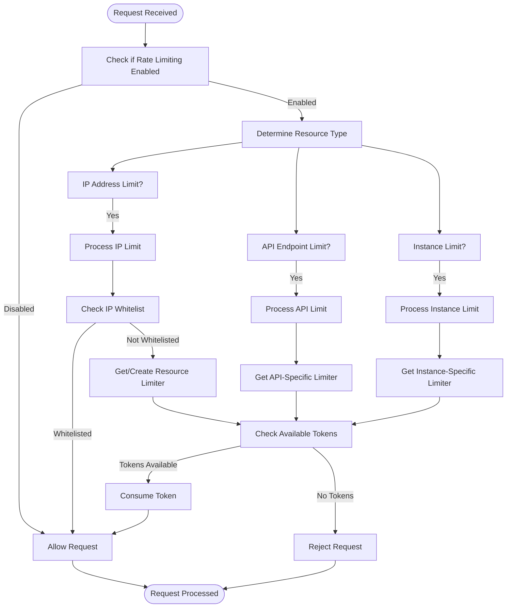
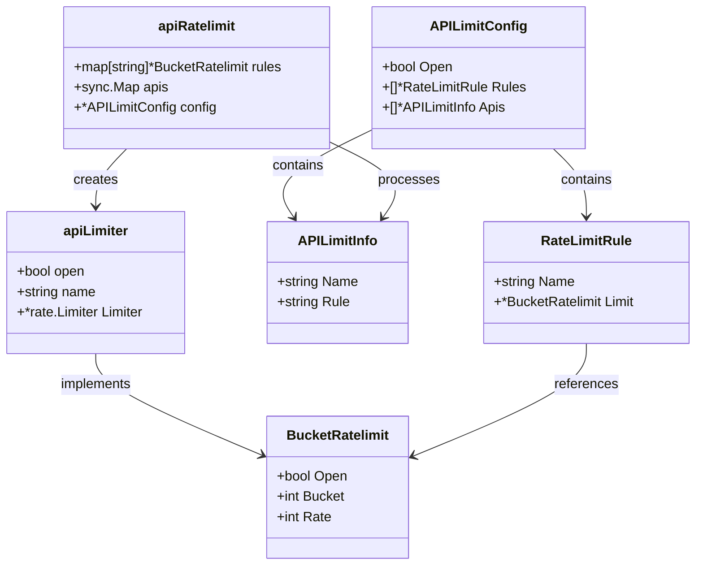
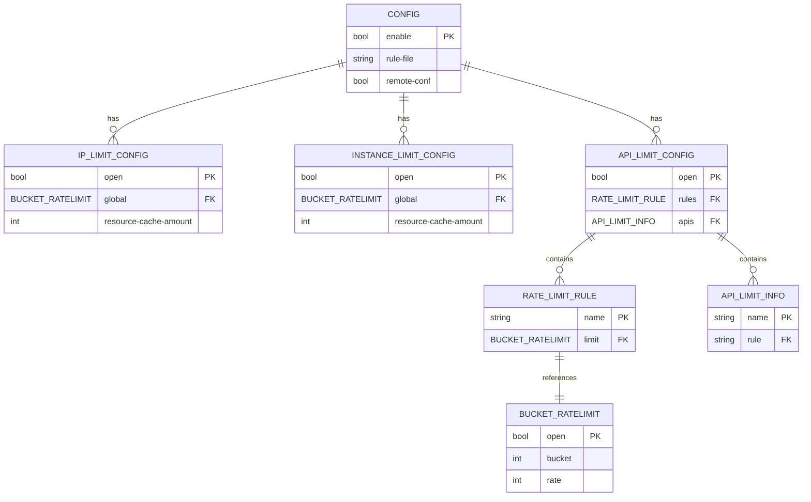
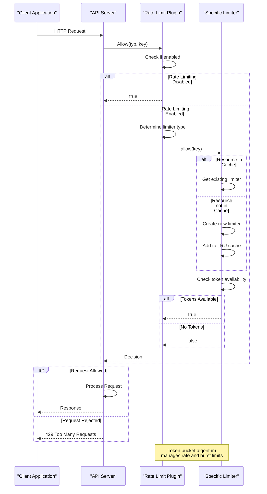

# Rate Limiting Plugin

<cite>
**Referenced Files in This Document**   
- [limiter.go](file://plugin/access_control/ratelimit/token/limiter.go)
- [resource_limiter.go](file://plugin/access_control/ratelimit/token/resource_limiter.go)
- [api_limit.go](file://plugin/access_control/ratelimit/token/api_limit.go)
- [config.go](file://plugin/access_control/ratelimit/token/config.go)
- [invoke.go](file://plugin/access_control/ratelimit/token/invoke.go)
- [implement.go](file://plugin/access_control/ratelimit/token/implement.go)
- [register.go](file://plugin/access_control/ratelimit/token/register.go)
- [rule.yaml](file://deploy/conf/plugin/ratelimit/rule.yaml)
- [ratelimit_rule.go](file://pkg/goverrule/ratelimit_rule.go)
- [ratelimit_config.go](file://pkg/cache/rules/ratelimit_config.go)
</cite>

## Table of Contents
1. [Introduction](#introduction)
2. [Token Bucket Algorithm Implementation](#token-bucket-algorithm-implementation)
3. [API-Level Rate Limit Configuration](#api-level-rate-limit-configuration)
4. [Configuration Structure](#configuration-structure)
5. [Request Processing Pipeline Integration](#request-processing-pipeline-integration)
6. [Caching Strategy for Distributed Environments](#caching-strategy-for-distributed-environments)
7. [Common Pitfalls and Performance Considerations](#common-pitfalls-and-performance-considerations)
8. [Best Practices for Tuning Rate Limits](#best-practices-for-tuning-rate-limits)
9. [Conclusion](#conclusion)

## Introduction
The rate limiting plugin in pole-server implements a token bucket algorithm to control the rate of incoming requests across various dimensions including IP addresses, API endpoints, and service instances. This document provides a comprehensive analysis of the plugin's architecture, configuration, and operational characteristics, focusing on its implementation details and integration patterns within the system.

**Section sources**
- [register.go](file://plugin/access_control/ratelimit/token/register.go#L0-L28)

## Token Bucket Algorithm Implementation

The rate limiting plugin employs the token bucket algorithm through two primary implementations: `resourceRatelimit` for resource-based limiting (IP, instance) and `apiRatelimit` for API-level limiting. The core implementation leverages Go's `golang.org/x/time/rate` package to manage the token bucket mechanics.

For resource-based limiting, the `resourceRatelimit` struct uses an LRU (Least Recently Used) cache from `github.com/hashicorp/golang-lru` to efficiently track individual resources (such as IP addresses) and their corresponding rate limiters. Each resource is associated with a `rate.Limiter` instance that enforces the configured refill rate and burst capacity.

The algorithm works by initializing a token bucket with a specified capacity (burst) and refill rate. When a request arrives, the system attempts to consume a token from the bucket. If tokens are available, the request is allowed; otherwise, it is rejected. Tokens are replenished at the configured rate, up to the maximum bucket size.



**Diagram sources**
- [resource_limiter.go](file://plugin/access_control/ratelimit/token/resource_limiter.go#L0-L117)
- [api_limit.go](file://plugin/access_control/ratelimit/token/api_limit.go#L0-L179)

**Section sources**
- [resource_limiter.go](file://plugin/access_control/ratelimit/token/resource_limiter.go#L0-L117)
- [api_limit.go](file://plugin/access_control/ratelimit/token/api_limit.go#L0-L179)
- [limiter.go](file://plugin/access_control/ratelimit/token/limiter.go#L0-L23)

## API-Level Rate Limit Configuration

API-level rate limits are configured through the `api-limit` section in the plugin configuration, which defines reusable rate limit rules and maps them to specific API endpoints. The configuration structure allows for fine-grained control over different API operations based on their expected load and importance.

The `APILimitConfig` struct defines the overall API rate limiting configuration, containing a collection of `RateLimitRule` objects that specify the refill rate and burst capacity for different categories of API calls. These rules are then associated with specific API endpoints through the `APILimitInfo` struct, which maps API names (formatted as HTTP method + URL path) to their corresponding rate limit rules.

For example, in the provided configuration file, separate rules are defined for read and write operations, with write operations having more restrictive limits (1,000 requests per second with a burst of 1,000) compared to read operations (2,000 requests per second with a burst of 2,000). This differentiation allows the system to protect critical write operations while maintaining high availability for read operations.

The mapping between APIs and rules is established during plugin initialization, where the `parseApis` function validates that each API references an existing rule and creates the appropriate `apiLimiter` instances for each endpoint.



**Diagram sources**
- [api_limit.go](file://plugin/access_control/ratelimit/token/api_limit.go#L0-L179)
- [config.go](file://plugin/access_control/ratelimit/token/config.go#L0-L118)

**Section sources**
- [api_limit.go](file://plugin/access_control/ratelimit/token/api_limit.go#L0-L179)
- [config.go](file://plugin/access_control/ratelimit/token/config.go#L0-L118)
- [rule.yaml](file://deploy/conf/plugin/ratelimit/rule.yaml#L0-L47)

## Configuration Structure

The rate limiting plugin's configuration structure is designed to provide fine-grained control over rate limits across multiple dimensions: service, method, and client identity. The configuration is defined in the `Config` struct, which supports both inline configuration and external file-based configuration through the `RuleFile` parameter.

The configuration hierarchy consists of several key components:
- Global enable/disable switch (`Enable`)
- IP-level rate limiting configuration (`IPLimitConf`)
- API-level rate limiting configuration (`APILimitConf`)
- Instance-level rate limiting configuration (`InstanceLimitConf`)
- External rule file specification (`RuleFile`)
- Remote configuration support flag (`RemoteConf`)

Each rate limiting dimension shares a common configuration pattern with a `ResourceLimitConfig` that includes:
- `Open`: Whether the specific rate limiting type is enabled
- `Global`: The `BucketRatelimit` configuration with rate and bucket parameters
- `MaxResourceCacheAmount`: Maximum number of resources to cache
- `WhiteList`: List of resources that are exempt from rate limiting

The configuration can be loaded from multiple sources, with file-based configuration taking precedence over inline configuration. This allows operators to manage complex rate limiting policies through external configuration files while maintaining a simple default configuration within the main configuration.



**Diagram sources**
- [config.go](file://plugin/access_control/ratelimit/token/config.go#L0-L118)
- [rule.yaml](file://deploy/conf/plugin/ratelimit/rule.yaml#L0-L47)

**Section sources**
- [config.go](file://plugin/access_control/ratelimit/token/config.go#L0-L118)
- [rule.yaml](file://deploy/conf/plugin/ratelimit/rule.yaml#L0-L47)

## Request Processing Pipeline Integration

The rate limiting plugin integrates into the request processing pipeline through the `Allow` interface method, which is called for each incoming request to determine whether it should be accepted or rejected based on the configured limits. The integration follows a plugin architecture pattern where the rate limiter is registered with the system and invoked at appropriate points in the request flow.

The plugin implements the `Plugin` interface with methods for initialization, destruction, and the core `Allow` function that performs the actual rate limiting decision. During initialization, the plugin parses the configuration and sets up the necessary limiters for each supported rate limiting type (IP, API, instance).

When a request arrives, the system calls the `Allow` method with the appropriate rate limiting type and a key that identifies the resource being limited (e.g., client IP address, API endpoint). The method first checks if rate limiting is globally enabled, then delegates to the appropriate limiter based on the rate limiting type.

The integration is designed to be non-blocking and efficient, with minimal overhead for requests that are well within their limits. For requests that exceed their limits, the plugin returns a rejection decision, which the calling system can use to return an appropriate HTTP status code (typically 429 Too Many Requests) to the client.



**Diagram sources**
- [invoke.go](file://plugin/access_control/ratelimit/token/invoke.go#L0-L56)
- [implement.go](file://plugin/access_control/ratelimit/token/implement.go#L0-L88)

**Section sources**
- [invoke.go](file://plugin/access_control/ratelimit/token/invoke.go#L0-L56)
- [implement.go](file://plugin/access_control/ratelimit/token/implement.go#L0-L88)
- [register.go](file://plugin/access_control/ratelimit/token/register.go#L0-L28)

## Caching Strategy for Distributed Environments

The rate limiting plugin employs a multi-layered caching strategy to efficiently track usage counters in distributed environments while minimizing memory consumption and ensuring consistent behavior across multiple nodes.

For resource-based rate limiting (IP, instance), the plugin uses an LRU (Least Recently Used) cache implemented with `github.com/hashicorp/golang-lru` to store rate limiters for individual resources. The cache size is configurable through the `MaxResourceCacheAmount` parameter, allowing operators to balance memory usage against the need to maintain state for frequently accessed resources.

The LRU cache ensures that the most recently used resources remain in memory, while less frequently accessed resources are evicted when the cache reaches its capacity. When a resource is evicted and later reappears, a new rate limiter is created, effectively resetting its token bucket. This behavior is generally acceptable for rate limiting purposes, as it tends to favor established, legitimate clients while limiting the impact of potential attackers.

For API-level rate limiting, the plugin uses a `sync.Map` to store limiters for each API endpoint. Since the number of distinct API endpoints is typically much smaller and more stable than the number of client IPs or instances, this approach provides efficient lookup without the need for eviction.

In distributed deployments, each node maintains its own rate limiting state, which means that the effective rate limit is multiplied by the number of nodes in the cluster. This design choice prioritizes availability and performance over strict rate enforcement, as coordinating rate limiting state across nodes would introduce significant latency and complexity.

```mermaid
graph TD
A[Incoming Request] --> B{Rate Limit Type}
B --> |IP Limit| C[Check LRU Cache]
B --> |Instance Limit| C[Check LRU Cache]
B --> |API Limit| D[Check sync.Map]
C --> E{Resource in Cache?}
E --> |Yes| F[Use Existing Limiter]
E --> |No| G[Create New Limiter]
G --> H[Add to LRU Cache]
H --> I{Cache Full?}
I --> |Yes| J[Evict Least Recently Used]
I --> |No| K[Store in Cache]
D --> L{API in Map?}
L --> |Yes| M[Use Existing Limiter]
L --> |No| N[Create New Limiter]
N --> O[Store in sync.Map]
F --> P[Check Token Availability]
M --> P[Check Token Availability]
K --> P[Check Token Availability]
O --> P[Check Token Availability]
P --> Q{Tokens Available?}
Q --> |Yes| R[Consume Token]
Q --> |No| S[Reject Request]
R --> T[Allow Request]
S --> U[Return 429]
T --> V[Response]
U --> V[Response]
style C fill:#f9f,stroke:#333
style D fill:#f9f,stroke:#333
style H fill:#bbf,stroke:#333
style O fill:#bbf,stroke:#333
style J fill:#f96,stroke:#333
Note over C,H: LRU Cache for IP/Instance<br>Configurable size with eviction
Note over D,O: sync.Map for API endpoints<br>No eviction, stable keys
Note over J: Eviction resets token bucket<br>Favors active legitimate clients
```

**Diagram sources**
- [resource_limiter.go](file://plugin/access_control/ratelimit/token/resource_limiter.go#L0-L117)
- [api_limit.go](file://plugin/access_control/ratelimit/token/api_limit.go#L0-L179)

**Section sources**
- [resource_limiter.go](file://plugin/access_control/ratelimit/token/resource_limiter.go#L0-L117)
- [api_limit.go](file://plugin/access_control/ratelimit/token/api_limit.go#L0-L179)
- [config.go](file://plugin/access_control/ratelimit/token/config.go#L0-L118)

## Common Pitfalls and Performance Considerations

Several common pitfalls and performance considerations should be addressed when deploying and configuring the rate limiting plugin in production environments.

Clock drift in multi-node setups can lead to inconsistent rate limiting behavior, as each node maintains its own independent rate limiting state. Since tokens are replenished based on the local system clock, significant clock differences between nodes can result in some nodes being more permissive than others. This can be mitigated by ensuring proper NTP synchronization across all nodes in the cluster.

Misconfigured burst limits can lead to either overly restrictive or insufficient protection. Setting the burst capacity too low can cause legitimate traffic spikes to be blocked, while setting it too high can allow denial-of-service attacks to succeed. The burst capacity should be set based on the expected traffic patterns and the system's ability to handle short-term load spikes.

Performance overhead under high load is primarily determined by the efficiency of the underlying data structures and the cost of cache lookups. The use of LRU caches and sync.Map structures provides good performance characteristics, but the memory footprint can grow significantly under high cardinality scenarios (e.g., many unique IP addresses). Monitoring memory usage and adjusting the cache sizes accordingly is essential for maintaining system stability.

Another consideration is the interaction between different rate limiting dimensions. When multiple rate limits are applied to the same request (e.g., both IP and API limits), the most restrictive limit will effectively govern the request rate. Understanding these interactions is crucial for designing effective rate limiting policies.

Finally, the current implementation does not support distributed rate limiting state, meaning that the effective rate limit is multiplied by the number of nodes in the cluster. For use cases requiring strict rate enforcement across the entire system, additional coordination mechanisms would be needed, potentially at the cost of increased latency.

**Section sources**
- [resource_limiter.go](file://plugin/access_control/ratelimit/token/resource_limiter.go#L0-L117)
- [api_limit.go](file://plugin/access_control/ratelimit/token/api_limit.go#L0-L179)
- [config.go](file://plugin/access_control/ratelimit/token/config.go#L0-L118)

## Best Practices for Tuning Rate Limits

Effective tuning of rate limits requires understanding the service's SLAs (Service Level Agreements) and typical traffic patterns. The following best practices can help optimize rate limiting configurations:

1. **Start with conservative limits**: Begin with relatively restrictive limits and gradually increase them based on observed traffic patterns and system capacity. This approach helps prevent overload while allowing for controlled expansion.

2. **Differentiate between read and write operations**: Write operations typically have greater impact on system resources and data consistency, so they should have more restrictive limits than read operations.

3. **Consider client types and priorities**: Different client types (e.g., internal services, partner integrations, public API consumers) may require different rate limiting policies based on their expected usage patterns and business importance.

4. **Monitor and adjust based on metrics**: Regularly review rate limiting metrics to identify false positives (legitimate requests being blocked) and adjust limits accordingly. The system should provide visibility into rate limiting decisions for troubleshooting and optimization.

5. **Use appropriate burst capacities**: Set burst capacities based on expected traffic patterns, allowing for reasonable spikes while preventing sustained overload. A good starting point is to set the burst capacity to 2-3 times the per-second rate limit.

6. **Implement gradual ramp-up for new services**: When introducing rate limits for new services or APIs, consider implementing a gradual ramp-up period where limits are initially set high and then progressively tightened as traffic patterns become clearer.

7. **Document and communicate limits**: Clearly document rate limits for API consumers and provide meaningful error messages when requests are rejected, helping clients understand and adapt to the limitations.

8. **Plan for emergency overrides**: Implement mechanisms to temporarily adjust or disable rate limits in emergency situations, such as during incident response or critical maintenance operations.

**Section sources**
- [config.go](file://plugin/access_control/ratelimit/token/config.go#L0-L118)
- [rule.yaml](file://deploy/conf/plugin/ratelimit/rule.yaml#L0-L47)
- [ratelimit_rule.go](file://pkg/goverrule/ratelimit_rule.go#L208-L243)

## Conclusion
The rate limiting plugin in pole-server provides a flexible and efficient mechanism for controlling request rates across multiple dimensions. By implementing the token bucket algorithm with configurable refill rates and burst capacities, the plugin can effectively protect services from overload while accommodating legitimate traffic patterns.

The plugin's architecture supports fine-grained control through a hierarchical configuration structure that allows operators to define different limits for various API endpoints, client types, and service instances. The integration into the request processing pipeline is designed to be efficient and non-blocking, minimizing the performance impact on legitimate requests.

While the current implementation provides effective rate limiting within individual nodes, operators should be aware of the implications of distributed deployments where rate limiting state is not coordinated across nodes. Careful tuning of rate limits based on service SLAs and traffic patterns, along with ongoing monitoring and adjustment, is essential for achieving the right balance between protection and availability.