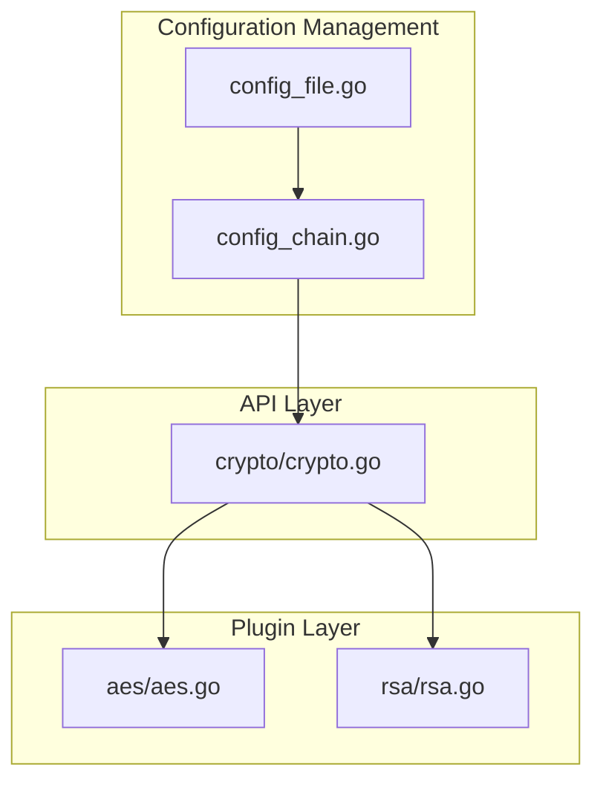
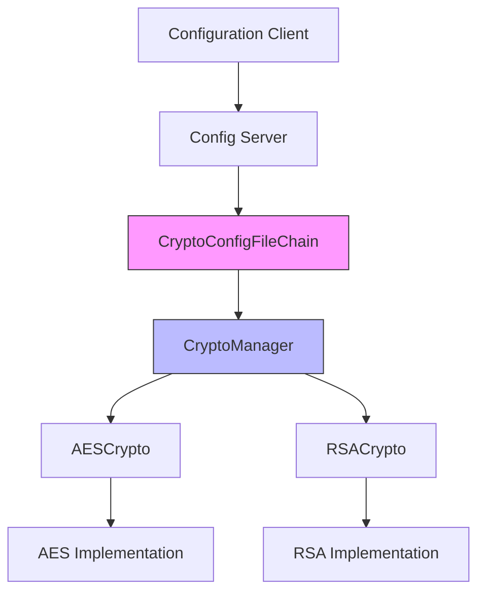
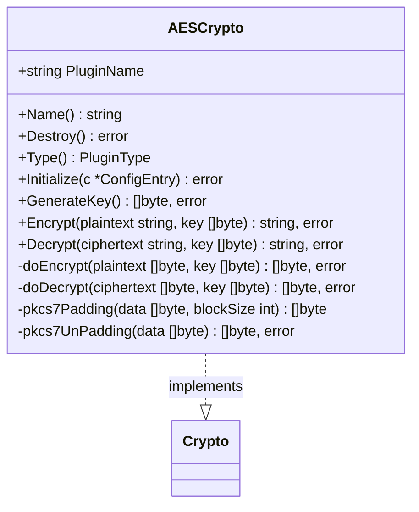
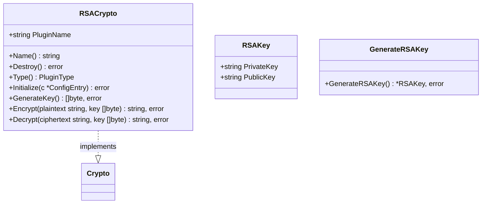
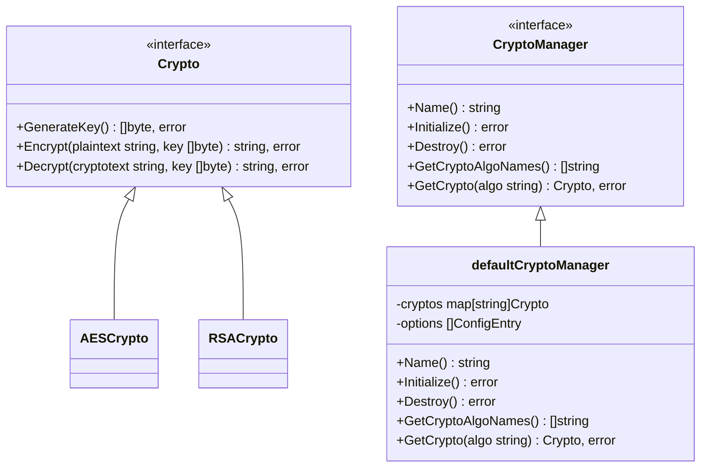
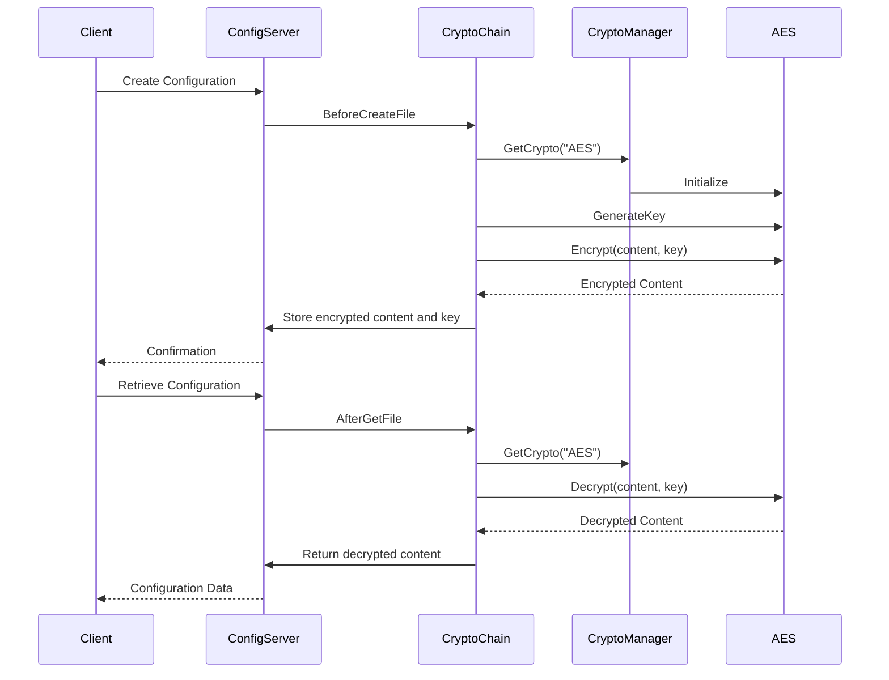
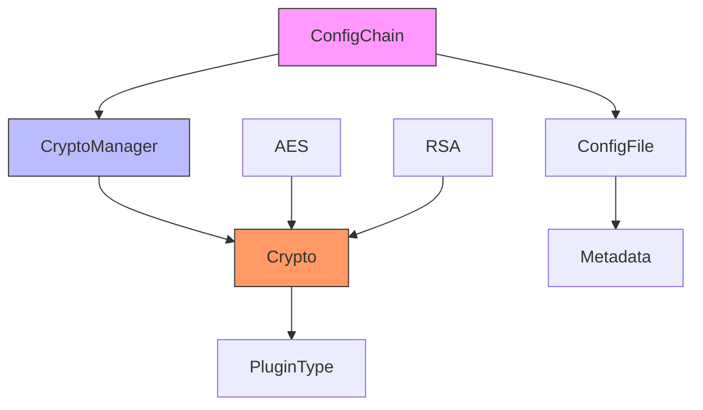

# Cryptographic Plugins

<cite>
**Referenced Files in This Document**   
- [aes.go](file://plugin/crypto/aes/aes.go)
- [rsa.go](file://plugin/crypto/rsa/rsa.go)
- [crypto.go](file://apis/crypto/crypto.go)
- [config_chain.go](file://pkg/config/config_chain.go)
- [config_file.go](file://apis/pkg/types/config/config_file.go)
</cite>

## Table of Contents
1. [Introduction](#introduction)
2. [Project Structure](#project-structure)
3. [Core Components](#core-components)
4. [Architecture Overview](#architecture-overview)
5. [Detailed Component Analysis](#detailed-component-analysis)
6. [Dependency Analysis](#dependency-analysis)
7. [Performance Considerations](#performance-considerations)
8. [Troubleshooting Guide](#troubleshooting-guide)
9. [Conclusion](#conclusion)

## Introduction
The cryptographic plugin system in pole-server provides a pluggable security framework for protecting sensitive configuration data. This document details the implementation of AES and RSA encryption algorithms as modular components, the key management practices, and the encryption workflows used to secure data at rest and during transmission. The system is designed with extensibility in mind, allowing for cryptographic algorithm substitution through a well-defined interface abstraction. Security best practices, key rotation strategies, and compliance considerations are also addressed to ensure robust cryptographic implementations.

## Project Structure
The cryptographic functionality is organized within the plugin/crypto directory, with separate implementations for AES and RSA algorithms. The core cryptographic interface is defined in the apis/crypto package, while the configuration management system in pkg/config handles the integration of encryption into the configuration lifecycle.

**Diagram sources**
- [aes.go](file://plugin/crypto/aes/aes.go)
- [rsa.go](file://plugin/crypto/rsa/rsa.go)
- [crypto.go](file://apis/crypto/crypto.go)
- [config_chain.go](file://pkg/config/config_chain.go)
- [config_file.go](file://apis/pkg/types/config/config_file.go)

**Section sources**
- [aes.go](file://plugin/crypto/aes/aes.go)
- [rsa.go](file://plugin/crypto/rsa/rsa.go)
- [crypto.go](file://apis/crypto/crypto.go)
- [config_chain.go](file://pkg/config/config_chain.go)
- [config_file.go](file://apis/pkg/types/config/config_file.go)

## Core Components
The cryptographic system consists of several core components that work together to provide secure data protection. The AES and RSA plugins implement the actual encryption algorithms, while the CryptoManager interface provides a unified way to access these algorithms. The configuration management system integrates with these components to automatically encrypt and decrypt configuration data as needed.

**Section sources**
- [aes.go](file://plugin/crypto/aes/aes.go)
- [rsa.go](file://plugin/crypto/rsa/rsa.go)
- [crypto.go](file://apis/crypto/crypto.go)

## Architecture Overview
The cryptographic plugin system follows a modular architecture where encryption algorithms are implemented as pluggable components. The system uses a manager pattern to handle the lifecycle of these plugins and provides a consistent interface for encryption operations. When configuration data needs to be protected, the system routes the request through the appropriate plugin based on the configured algorithm.

**Diagram sources**
- [crypto.go](file://apis/crypto/crypto.go)
- [config_chain.go](file://pkg/config/config_chain.go)
- [aes.go](file://plugin/crypto/aes/aes.go)
- [rsa.go](file://plugin/crypto/rsa/rsa.go)

## Detailed Component Analysis

### AES Encryption Implementation
The AES encryption implementation provides symmetric encryption using the AES algorithm in CBC mode with PKCS7 padding. It handles both encryption and decryption of configuration data, with proper key management and error handling.

#### AES Class Diagram

**Diagram sources**
- [aes.go](file://plugin/crypto/aes/aes.go)

**Section sources**
- [aes.go](file://plugin/crypto/aes/aes.go)

### RSA Encryption Implementation
The RSA encryption implementation provides asymmetric encryption capabilities for secure key exchange. It uses RSA with PKCS1v15 padding and supports key pair generation for public/private key operations.

#### RSA Class Diagram

**Diagram sources**
- [rsa.go](file://plugin/crypto/rsa/rsa.go)

**Section sources**
- [rsa.go](file://plugin/crypto/rsa/rsa.go)

### Cryptographic Interface Abstraction
The cryptographic system uses an interface-based abstraction that allows for algorithm substitution. This design enables the system to support multiple encryption algorithms while providing a consistent API for consumers.

#### Crypto Interface Diagram

**Diagram sources**
- [crypto.go](file://apis/crypto/crypto.go)

**Section sources**
- [crypto.go](file://apis/crypto/crypto.go)

### Configuration Encryption Workflow
The system integrates cryptographic operations into the configuration management lifecycle, automatically encrypting and decrypting configuration data as needed.

#### Configuration Encryption Sequence

**Diagram sources**
- [config_chain.go](file://pkg/config/config_chain.go)
- [crypto.go](file://apis/crypto/crypto.go)
- [aes.go](file://plugin/crypto/aes/aes.go)

**Section sources**
- [config_chain.go](file://pkg/config/config_chain.go)

## Dependency Analysis
The cryptographic system has a well-defined dependency structure that ensures loose coupling between components. The plugin architecture allows for independent development and testing of encryption algorithms while maintaining a consistent interface.

**Diagram sources**
- [crypto.go](file://apis/crypto/crypto.go)
- [config_chain.go](file://pkg/config/config_chain.go)
- [aes.go](file://plugin/crypto/aes/aes.go)
- [rsa.go](file://plugin/crypto/rsa/rsa.go)
- [config_file.go](file://apis/pkg/types/config/config_file.go)

**Section sources**
- [crypto.go](file://apis/crypto/crypto.go)
- [config_chain.go](file://pkg/config/config_chain.go)
- [aes.go](file://plugin/crypto/aes/aes.go)
- [rsa.go](file://plugin/crypto/rsa/rsa.go)
- [config_file.go](file://apis/pkg/types/config/config_file.go)

## Performance Considerations
The cryptographic implementation considers performance implications of encryption operations. Symmetric encryption with AES is used for bulk data protection due to its efficiency, while asymmetric encryption with RSA is reserved for secure key exchange scenarios. The system caches cryptographic managers to avoid repeated initialization overhead, and uses efficient padding schemes to minimize data expansion.

## Troubleshooting Guide
When troubleshooting cryptographic issues, check the following common problems:
- Ensure the correct encryption algorithm is configured in the system settings
- Verify that cryptographic plugins are properly registered and initialized
- Check that encryption keys are properly formatted and accessible
- Validate that configuration metadata contains the required encryption tags

**Section sources**
- [aes.go](file://plugin/crypto/aes/aes.go)
- [rsa.go](file://plugin/crypto/rsa/rsa.go)
- [crypto.go](file://apis/crypto/crypto.go)
- [config_chain.go](file://pkg/config/config_chain.go)

## Conclusion
The cryptographic plugin system in pole-server provides a robust and extensible framework for protecting sensitive configuration data. By implementing AES and RSA encryption as pluggable components, the system offers flexibility in cryptographic algorithm selection while maintaining a consistent interface. The integration with the configuration management system ensures that data is automatically encrypted at rest, and the use of proper key management practices enhances overall security. This design supports security best practices, facilitates key rotation, and helps meet compliance requirements for cryptographic implementations.