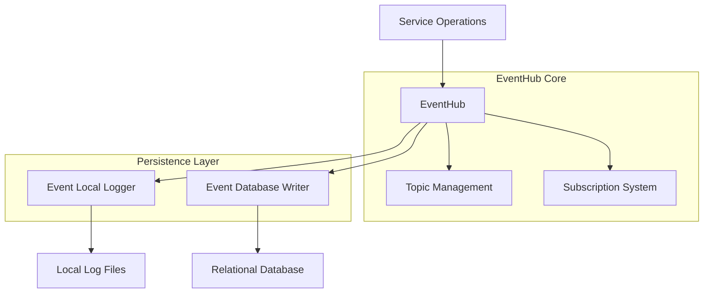
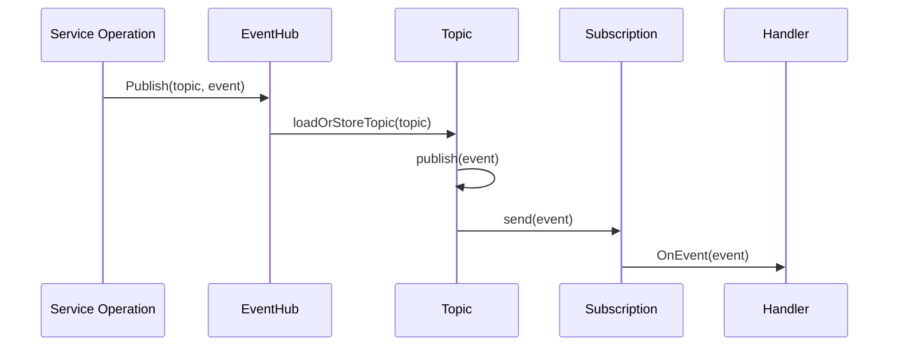
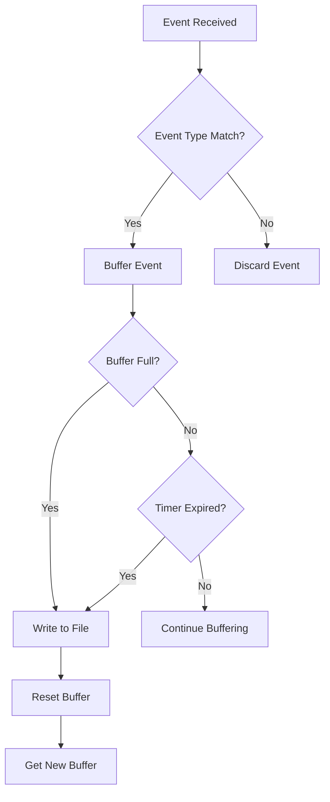
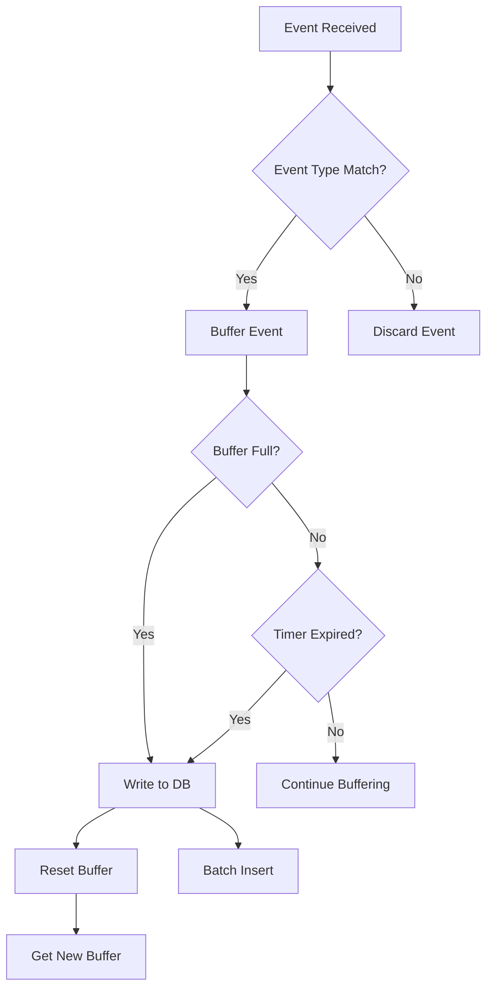
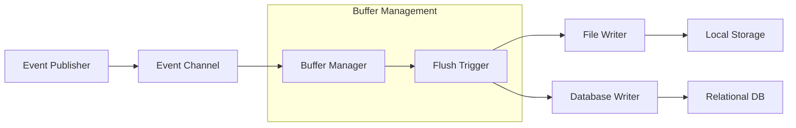

# Event Publishing

<cite>
**Referenced Files in This Document**   
- [eventhub.go](file://pkg/common/eventhub/eventhub.go)
- [topic.go](file://pkg/common/eventhub/topic.go)
- [subscription.go](file://pkg/common/eventhub/subscription.go)
- [event_local.go](file://plugin/observability/discoverevent/logger/event_local.go)
- [event_db.go](file://plugin/observability/discoverevent/rds/event_db.go)
- [event.go](file://pkg/service/event.go)
- [instance.go](file://pkg/service/instance.go)
</cite>

## Table of Contents
1. [Introduction](#introduction)
2. [Event Publishing Architecture](#event-publishing-architecture)
3. [Event Generation and Emission](#event-generation-and-emission)
4. [Dual-Write Persistence Mechanism](#dual-write-persistence-mechanism)
5. [Asynchronous Processing Pipeline](#asynchronous-processing-pipeline)
6. [Configuration Options](#configuration-options)
7. [Common Issues and Durability Strategies](#common-issues-and-durability-strategies)
8. [Conclusion](#conclusion)

## Introduction
The event publishing system in pole-server provides a robust mechanism for capturing and distributing service discovery events such as registration, deregistration, and health status changes. Built on an event-driven architecture, the system uses an eventhub to route events from service operations to multiple consumers. The dual-write mechanism ensures events are persisted both locally via event_local.go and in relational databases through event_db.go, providing redundancy and durability. This document details the architecture, implementation, and configuration of this event system, along with strategies for handling high-load scenarios and ensuring event durability.

## Event Publishing Architecture



**Diagram sources**
- [eventhub.go](file://pkg/common/eventhub/eventhub.go#L0-L153)
- [event_local.go](file://plugin/observability/discoverevent/logger/event_local.go#L0-L230)
- [event_db.go](file://plugin/observability/discoverevent/rds/event_db.go#L0-L358)

**Section sources**
- [eventhub.go](file://pkg/common/eventhub/eventhub.go#L0-L153)
- [event_local.go](file://plugin/observability/discoverevent/logger/event_local.go#L0-L230)
- [event_db.go](file://plugin/observability/discoverevent/rds/event_db.go#L0-L358)

## Event Generation and Emission

Service discovery events are generated by various service operations within the pole-server system. The eventhub serves as the central routing mechanism, allowing publishers to emit events to specific topics and subscribers to receive them asynchronously.



Events are emitted from service operations such as instance creation, deletion, and updates. For example, when a service instance is created, an `EventInstanceOnline` event is generated and published to the eventhub:

```go
event := &svctypes.InstanceEvent{
    Id:         req.GetId().GetValue(),
    Namespace:  svc.Namespace,
    Service:    svc.Name,
    Instance:   instanceProto,
    EType:      svctypes.EventInstanceOnline,
    CreateTime: time.Now(),
}
event.InjectMetadata(ctx)
s.sendDiscoverEvent(event)
```

The eventhub provides a global publishing interface that routes events to all interested subscribers. The system supports both direct handler subscriptions and function-based subscriptions through the `Subscribe` and `SubscribeWithFunc` methods.

**Section sources**
- [instance.go](file://pkg/service/instance.go#L0-L1149)
- [event.go](file://pkg/service/event.go#L0-L69)
- [eventhub.go](file://pkg/common/eventhub/eventhub.go#L0-L153)

## Dual-Write Persistence Mechanism

The event system implements a dual-write mechanism that persists events to both local storage and a relational database, ensuring redundancy and durability.

### Local Event Logging

The `discoverEventLocal` plugin handles local event logging through a buffered approach:



**Diagram sources**
- [event_local.go](file://plugin/observability/discoverevent/logger/event_local.go#L0-L230)

Events are written to local log files with structured JSON format, including the event ID, resource, timestamp, and server information. The system uses a buffer pool to minimize memory allocation overhead.

### Database Persistence

The `discoverEventDB` plugin handles database persistence with similar buffering logic but writes to a MySQL database:



**Diagram sources**
- [event_db.go](file://plugin/observability/discoverevent/rds/event_db.go#L0-L358)

The database writer implements several key features:
- **Partitioned tables**: The `discover_event` table is partitioned by time to improve query performance
- **Automatic partition management**: A background task checks and creates partitions for future months
- **Batch insertion**: Events are inserted in batches to minimize database round trips
- **Table creation**: The system automatically creates the event table if it doesn't exist

Both persistence mechanisms use identical buffering strategies with a default buffer size of 1024 events, flushing either when the buffer is full or every 10 seconds via a timer.

**Section sources**
- [event_local.go](file://plugin/observability/discoverevent/logger/event_local.go#L0-L230)
- [event_db.go](file://plugin/observability/discoverevent/rds/event_db.go#L0-L358)

## Asynchronous Processing Pipeline

The event processing pipeline is fully asynchronous, allowing for high throughput and non-blocking operation.



**Diagram sources**
- [event_local.go](file://plugin/observability/discoverevent/logger/event_local.go#L0-L230)
- [event_db.go](file://plugin/observability/discoverevent/rds/event_db.go#L0-L358)

The pipeline operates as follows:
1. Events are published to a channel with configurable queue size
2. Events are buffered in memory using a circular buffer implementation
3. The buffer is flushed when either:
   - It reaches capacity (default 1024 events)
   - A timer expires (default 10 seconds)
4. Flushed events are processed by the appropriate handler (file or database)
5. The buffer is reset and returned to the pool for reuse

The system uses Go routines to handle blocking operations like file I/O and database writes, preventing them from blocking the main event processing loop. This allows the system to continue accepting new events even when persistence operations are slow.

**Section sources**
- [event_local.go](file://plugin/observability/discoverevent/logger/event_local.go#L0-L230)
- [event_db.go](file://plugin/observability/discoverevent/rds/event_db.go#L0-L358)

## Configuration Options

The event publishing system provides several configuration options to tune performance and behavior.

### Buffering Configuration

The system supports configurable buffering parameters:

```go
// Default buffer size
const defaultBufferSize = 1024

// Flush interval
syncInterval := time.NewTicker(time.Duration(10) * time.Second)
```

The local event logger allows configuration of the queue size through the plugin configuration:

```go
el.eventCh = make(chan event.DiscoverEvent, config.QueueSize)
```

### Event Filtering

Both persistence plugins filter events based on type, only processing specific service discovery events:

```go
var subscribeEvents = map[string]struct{}{
    string(svctypes.EventInstanceCloseIsolate): {},
    string(svctypes.EventInstanceOpenIsolate):  {},
    string(svctypes.EventInstanceOffline):      {},
    string(svctypes.EventInstanceOnline):       {},
    string(svctypes.EventInstanceTurnHealth):   {},
    string(svctypes.EventInstanceTurnUnHealth): {},
}
```

### Database Configuration

The database plugin requires configuration of the database connection:

```go
func (el *discoverEventDB) Initialize(conf *apis.ConfigEntry) error {
    dns := conf.Option["dns"].(string)
    if dns == "" {
        return errors.New("dns is required for discoverEventDB plugin")
    }
    // ... database initialization
}
```

The system expects a MySQL connection string in the plugin configuration to establish the database connection.

**Section sources**
- [event_local.go](file://plugin/observability/discoverevent/logger/event_local.go#L0-L230)
- [event_db.go](file://plugin/observability/discoverevent/rds/event_db.go#L0-L358)

## Common Issues and Durability Strategies

### Event Loss Under High Load

The system may experience event loss under high load due to non-blocking channel operations:

```go
func (el *discoverEventDB) PublishEvent(event event.DiscoverEvent) {
    select {
    case el.eventCh <- event:
        return
    default:
        // do nothing
    }
}
```

When the event channel is full, new events are silently dropped rather than blocking the publisher. This design prioritizes system responsiveness over guaranteed delivery.

### Durability Strategies

The system employs several strategies to ensure event durability:

1. **Dual-write redundancy**: Events are written to both local files and database
2. **Buffer pooling**: Reduces memory allocation overhead and GC pressure
3. **Batch operations**: Minimizes I/O operations for both file and database writes
4. **Automatic recovery**: The system automatically recreates database tables and partitions

However, the non-blocking nature of event publication means that during periods of extreme load, some events may be lost. The system does not provide mechanisms for event replay or guaranteed delivery.

To mitigate event loss, operators should:
- Monitor event queue utilization
- Size the event channel appropriately for expected load
- Ensure adequate storage and database performance
- Monitor buffer flush rates and adjust flush intervals if needed

**Section sources**
- [event_local.go](file://plugin/observability/discoverevent/logger/event_local.go#L0-L230)
- [event_db.go](file://plugin/observability/discoverevent/rds/event_db.go#L0-L358)

## Conclusion
The event publishing system in pole-server provides a comprehensive solution for capturing and persisting service discovery events. The architecture centers around an eventhub that routes events from service operations to multiple consumers. The dual-write mechanism ensures events are persisted to both local storage and relational databases, providing redundancy and durability. The asynchronous processing pipeline enables high throughput while maintaining system responsiveness. While the system provides robust event handling under normal conditions, operators should be aware of the potential for event loss under extreme load due to the non-blocking nature of event publication. Proper configuration and monitoring can help ensure reliable event processing in production environments.