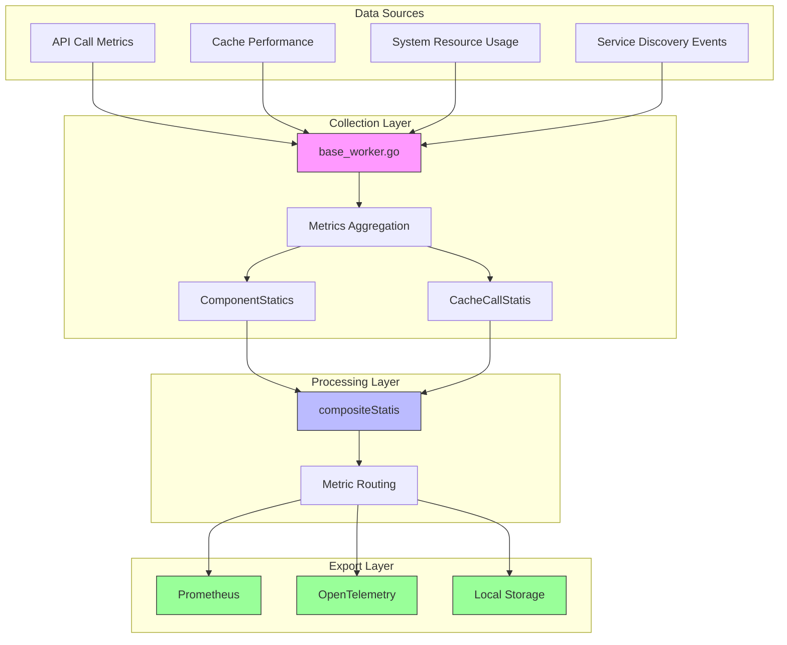
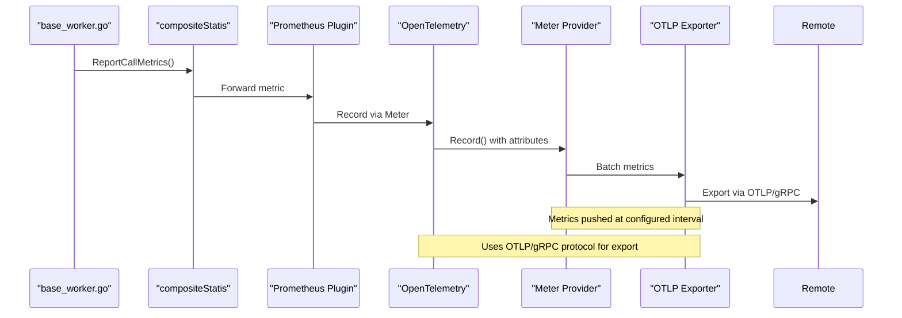
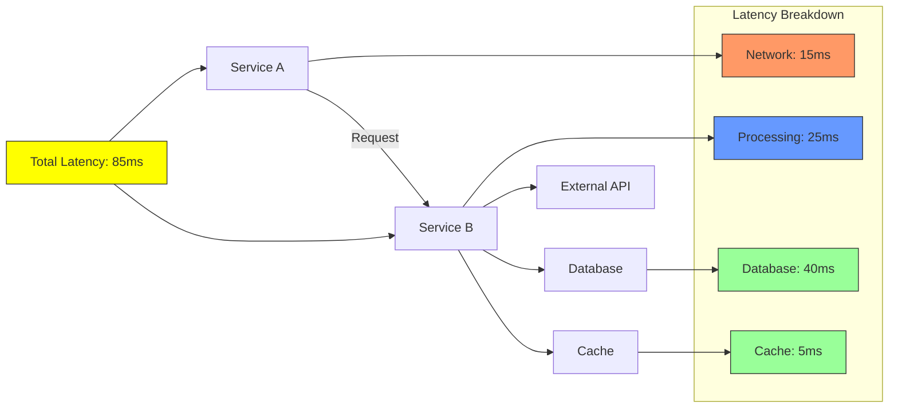
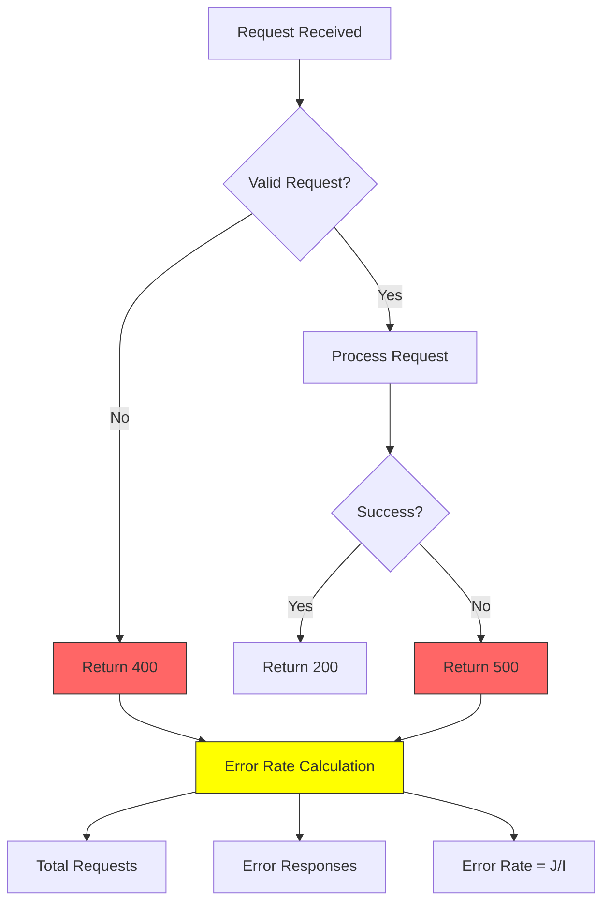

# Metrics Collection

<cite>
**Referenced Files in This Document**   
- [statis.go](file://apis/observability/statis/statis.go)
- [base_worker.go](file://plugin/observability/statis/base/base_worker.go)
- [discovery_handle.go](file://plugin/observability/statis/prometheus/discovery_handle.go)
- [statis.go](file://plugin/observability/statis/prometheus/statis.go)
- [config_handle.go](file://plugin/observability/statis/prometheus/config_handle.go)
- [otel.go](file://pkg/common/otel/otel.go)
- [config.go](file://pkg/common/otel/config.go)
- [client_metrics.go](file://pkg/common/otel/metrics/client_metrics.go)
- [sys_metrics.go](file://pkg/common/otel/metrics/sys_metrics.go)
- [types.go](file://pkg/common/otel/metrics/types.go)
</cite>

## Table of Contents
1. [Introduction](#introduction)
2. [Metrics Pipeline Architecture](#metrics-pipeline-architecture)
3. [Core Components](#core-components)
4. [Prometheus Integration](#prometheus-integration)
5. [OpenTelemetry Integration](#opentelemetry-integration)
6. [Metric Types and Labeling](#metric-types-and-labeling)
7. [Configuration and Scrape Endpoints](#configuration-and-scrape-endpoints)
8. [Performance Monitoring Examples](#performance-monitoring-examples)
9. [Performance Overhead and Tuning](#performance-overhead-and-tuning)
10. [Alerting and SLOs](#alerting-and-slos)
11. [Conclusion](#conclusion)

## Introduction
The metrics collection subsystem in the pole-server implements a comprehensive observability framework for monitoring API call metrics, cache performance, and system resource usage. The statis module serves as the central component for aggregating and exporting metrics through multiple channels, including Prometheus and OpenTelemetry. This document details the architecture, implementation, and configuration of the metrics pipeline from data collection in base_worker.go to export via statis.go and discovery_handle.go, with integration into OpenTelemetry through the pkg/common/otel components.

## Metrics Pipeline Architecture



**Diagram sources**
- [base_worker.go](file://plugin/observability/statis/base/base_worker.go#L1-L104)
- [statis.go](file://apis/observability/statis/statis.go#L1-L161)

**Section sources**
- [base_worker.go](file://plugin/observability/statis/base/base_worker.go#L1-L104)
- [statis.go](file://apis/observability/statis/statis.go#L1-L161)

## Core Components

The metrics collection subsystem is built around several core components that work together to collect, aggregate, and export metrics data. The base_worker.go file implements the BaseWorker struct, which serves as the primary metrics collection agent. This component receives metrics from various sources and routes them to appropriate aggregation structures based on their type.

The Statis interface defined in statis.go provides the contract for all metrics plugins, with methods for reporting different types of metrics including API calls, service discovery events, and configuration center operations. The compositeStatis implementation allows multiple metrics plugins to be chained together, enabling simultaneous export to different destinations.

**Section sources**
- [statis.go](file://apis/observability/statis/statis.go#L1-L161)
- [base_worker.go](file://plugin/observability/statis/base/base_worker.go#L1-L104)

## Prometheus Integration

```mermaid
classDiagram
class StatisWorker {
+discoveryHandler discoveryMetricHandle
+configHandler configMetricHandle
+statisHandler statisMetricHandle
+Initialize(config *ConfigEntry) error
+Destroy() error
+Name() string
+Type() PluginType
}
class discoveryMetricHandle {
+handle(ms []DiscoveryMetric)
}
class configMetricHandle {
+handle(ms []ConfigMetrics)
}
class statisMetricHandle {
+handle(metric CallMetric)
}
StatisWorker --> discoveryMetricHandle : "uses"
StatisWorker --> configMetricHandle : "uses"
StatisWorker --> statisMetricHandle : "uses"
discoveryMetricHandle ..> DiscoveryMetric : "processes"
configMetricHandle ..> ConfigMetrics : "processes"
statisMetricHandle ..> CallMetric : "processes"
note right of StatisWorker
Manages Prometheus metric export
Handles registration and reporting
Integrates with OpenTelemetry meter
end
```

**Diagram sources**
- [discovery_handle.go](file://plugin/observability/statis/prometheus/discovery_handle.go#L1-L197)
- [statis.go](file://plugin/observability/statis/prometheus/statis.go#L1-L150)
- [config_handle.go](file://plugin/observability/statis/prometheus/config_handle.go#L1-L120)

**Section sources**
- [discovery_handle.go](file://plugin/observability/statis/prometheus/discovery_handle.go#L1-L197)
- [config_handle.go](file://plugin/observability/statis/prometheus/config_handle.go#L1-L120)
- [statis.go](file://plugin/observability/statis/prometheus/statis.go#L1-L150)

## OpenTelemetry Integration



**Diagram sources**
- [base_worker.go](file://plugin/observability/statis/base/base_worker.go#L1-L104)
- [statis.go](file://apis/observability/statis/statis.go#L1-L161)
- [otel.go](file://pkg/common/otel/otel.go#L1-L128)

**Section sources**
- [otel.go](file://pkg/common/otel/otel.go#L1-L128)
- [client_metrics.go](file://pkg/common/otel/metrics/client_metrics.go#L1-L80)
- [sys_metrics.go](file://pkg/common/otel/metrics/sys_metrics.go#L1-L65)

## Metric Types and Labeling

The metrics collection subsystem supports several types of metrics with specific labeling strategies:

<table>
  <tr>
    <th>Metric Type</th>
    <th>Description</th>
    <th>Labels</th>
    <th>Source File</th>
  </tr>
  <tr>
    <td>API Call Metrics</td>
    <td>Tracks API invocation statistics including duration, success rate, and traffic direction</td>
    <td>API, Protocol, Code, Component, TrafficDirection</td>
    <td>[base_worker.go](file://plugin/observability/statis/base/base_worker.go#L25-L45)</td>
  </tr>
  <tr>
    <td>Service Discovery Metrics</td>
    <td>Monitors service and instance counts with status breakdowns</td>
    <td>Namespace, Service, Status</td>
    <td>[discovery_handle.go](file://plugin/observability/statis/prometheus/discovery_handle.go#L25-L50)</td>
  </tr>
  <tr>
    <td>Configuration Metrics</td>
    <td>Tracks configuration center operations and performance</td>
    <td>Namespace, Group, File</td>
    <td>[config_handle.go](file://plugin/observability/statis/prometheus/config_handle.go#L20-L40)</td>
  </tr>
  <tr>
    <td>Cache Performance</td>
    <td>Measures cache hit rates and access patterns</td>
    <td>CacheType, Operation</td>
    <td>[base_worker.go](file://plugin/observability/statis/base/base_worker.go#L30-L35)</td>
  </tr>
  <tr>
    <td>System Resource Usage</td>
    <td>Monitors CPU, memory, and other system metrics</td>
    <td>ResourceType, Instance</td>
    <td>[sys_metrics.go](file://pkg/common/otel/metrics/sys_metrics.go#L15-L30)</td>
  </tr>
</table>

**Section sources**
- [types.go](file://pkg/common/otel/metrics/types.go#L1-L100)
- [discovery_handle.go](file://plugin/observability/statis/prometheus/discovery_handle.go#L25-L197)
- [config_handle.go](file://plugin/observability/statis/prometheus/config_handle.go#L1-L120)

## Configuration and Scrape Endpoints

The metrics collection subsystem is configured through the plugin system with support for multiple exporters. The Prometheus integration exposes standard scrape endpoints that can be configured in monitoring systems. The OpenTelemetry integration supports both push and pull models, with configurable endpoints and authentication.

Configuration options include:
- **Scrape interval**: Controls how frequently metrics are collected and exported
- **Endpoint configuration**: Specifies the destination for OpenTelemetry metrics
- **Metric sampling**: Configures which metrics are collected and exported
- **Label filtering**: Controls which labels are included in exported metrics

The system supports dynamic configuration reloading, allowing changes to be applied without restarting the service.

**Section sources**
- [config.go](file://pkg/common/otel/config.go#L1-L85)
- [statis.go](file://apis/observability/statis/statis.go#L80-L150)
- [otel.go](file://pkg/common/otel/otel.go#L60-L120)

## Performance Monitoring Examples

### Service-to-Service Latency Monitoring



**Diagram sources**
- [client_metrics.go](file://pkg/common/otel/metrics/client_metrics.go#L1-L80)
- [base_worker.go](file://plugin/observability/statis/base/base_worker.go#L25-L45)

### Error Rate Monitoring



**Diagram sources**
- [statis.go](file://apis/observability/statis/statis.go#L45-L65)
- [base_worker.go](file://plugin/observability/statis/base/base_worker.go#L30-L40)

## Performance Overhead and Tuning

The metrics collection subsystem is designed to minimize performance overhead while providing comprehensive monitoring capabilities. Key performance considerations include:

- **Collection interval tuning**: The system allows configuration of the metrics collection interval to balance freshness and overhead
- **Asynchronous processing**: Metrics are processed asynchronously to avoid blocking critical paths
- **Batched exports**: Metrics are exported in batches to reduce network overhead
- **Memory efficiency**: Aggregation structures are optimized for memory usage

Best practices for performance tuning:
1. Set appropriate scrape intervals based on monitoring requirements
2. Use metric filtering to reduce the volume of exported data
3. Monitor the metrics collection subsystem itself for performance issues
4. Scale the monitoring infrastructure to handle the expected metrics volume

**Section sources**
- [base_worker.go](file://plugin/observability/statis/base/base_worker.go#L80-L104)
- [otel.go](file://pkg/common/otel/otel.go#L100-L128)
- [config.go](file://pkg/common/otel/config.go#L50-L85)

## Alerting and SLOs

The metrics collection subsystem supports monitoring of key Service Level Objectives (SLOs) and provides data for alerting on critical issues. Recommended alerting rules include:

<table>
  <tr>
    <th>SLO</th>
    <th>Threshold</th>
    <th>Alert Condition</th>
    <th>Metric Source</th>
  </tr>
  <tr>
    <td>API Success Rate</td>
    <td>99.9%</td>
    <td>error_rate{job="pole-server"} &gt; 0.001</td>
    <td>[statis.go](file://apis/observability/statis/statis.go#L45-L55)</td>
  </tr>
  <tr>
    <td>Latency P99</td>
    <td>500ms</td>
    <td>histogram_quantile(0.99, rate(api_duration_seconds_bucket{job="pole-server"}[5m])) &gt; 0.5</td>
    <td>[base_worker.go](file://plugin/observability/statis/base/base_worker.go#L30-L40)</td>
  </tr>
  <tr>
    <td>Service Availability</td>
    <td>99.5%</td>
    <td>service_online_count{job="pole-server"} / service_count{job="pole-server"} &lt; 0.995</td>
    <td>[discovery_handle.go](file://plugin/observability/statis/prometheus/discovery_handle.go#L100-L120)</td>
  </tr>
  <tr>
    <td>Cache Hit Ratio</td>
    <td>95%</td>
    <td>rate(cache_hits{job="pole-server"}[5m]) / rate(cache_requests{job="pole-server"}[5m]) &lt; 0.95</td>
    <td>[base_worker.go](file://plugin/observability/statis/base/base_worker.go#L35-L40)</td>
  </tr>
</table>

**Section sources**
- [statis.go](file://apis/observability/statis/statis.go#L45-L65)
- [discovery_handle.go](file://plugin/observability/statis/prometheus/discovery_handle.go#L100-L120)
- [base_worker.go](file://plugin/observability/statis/base/base_worker.go#L30-L45)

## Conclusion

The metrics collection subsystem in pole-server provides a robust and flexible framework for monitoring system performance and reliability. By integrating with both Prometheus and OpenTelemetry, it supports a wide range of monitoring and observability use cases. The architecture separates concerns between collection, processing, and export, allowing for efficient and scalable metrics handling. With proper configuration and alerting, this system enables effective monitoring of key SLOs and rapid detection of performance issues.