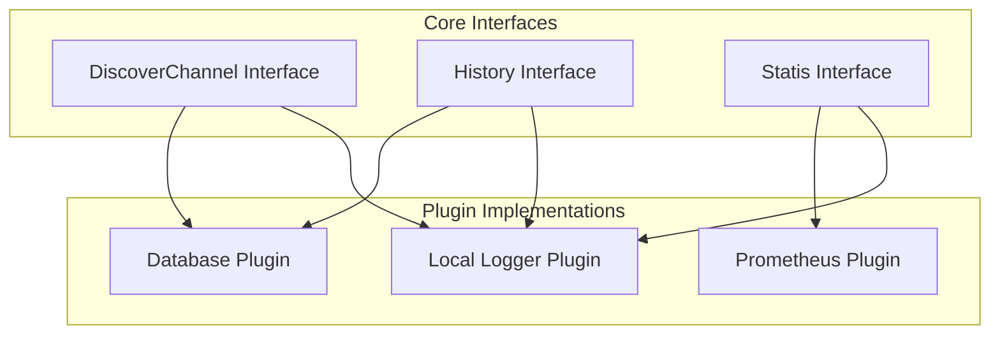
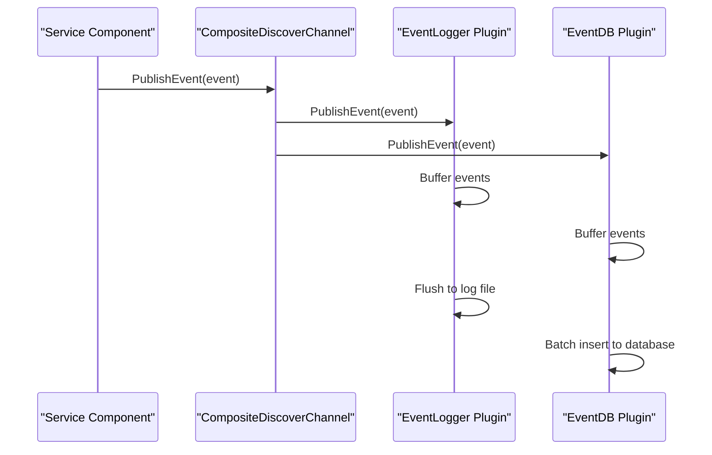
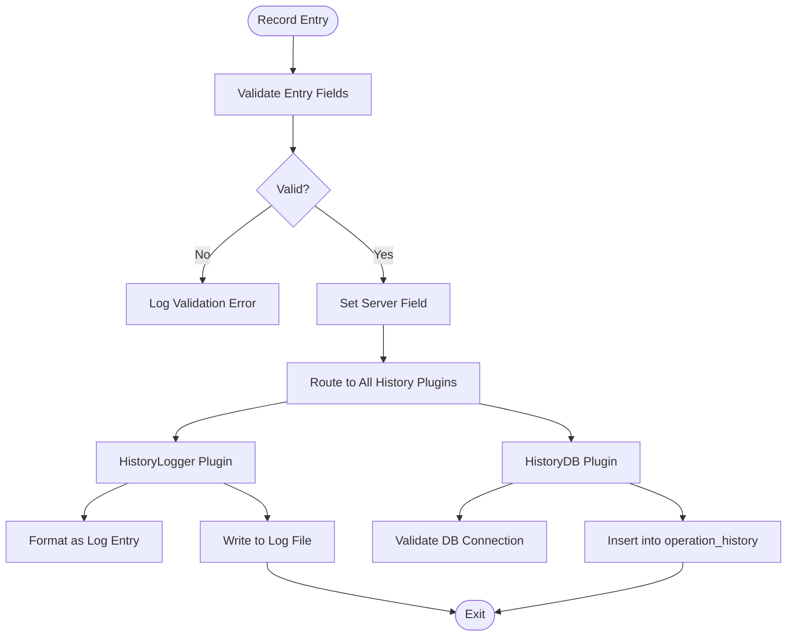
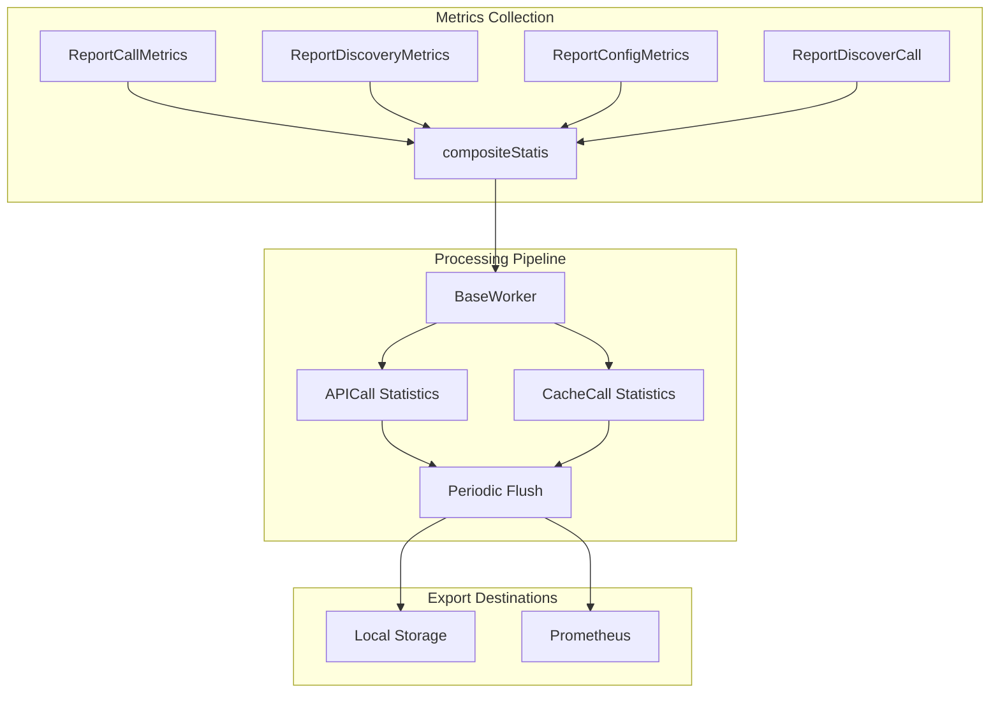

# Observability Plugins

<cite>
**Referenced Files in This Document**   
- [discoverevent.go](file://apis/observability/event/discoverevent.go)
- [history.go](file://apis/observability/history/history.go)
- [statis.go](file://apis/observability/statis/statis.go)
- [event_local.go](file://plugin/observability/discoverevent/logger/event_local.go)
- [event_db.go](file://plugin/observability/discoverevent/rds/event_db.go)
- [history_logger.go](file://plugin/observability/history/logger/history_logger.go)
- [history_db.go](file://plugin/observability/history/rds/history_db.go)
- [base_worker.go](file://plugin/observability/statis/base/base_worker.go)
- [statis.go](file://plugin/observability/statis/prometheus/statis.go)
</cite>

## Table of Contents
1. [Introduction](#introduction)
2. [Core Components](#core-components)
3. [Event Publishing and Routing](#event-publishing-and-routing)
4. [Operational History Tracking](#operational-history-tracking)
5. [Metrics Collection and Aggregation](#metrics-collection-and-aggregation)
6. [Configuration Options](#configuration-options)
7. [Extension Points](#extension-points)
8. [Best Practices](#best-practices)

## Introduction
The observability plugin system in pole-server provides a modular framework for monitoring, auditing, and analyzing system behavior. This document details the implementation of pluggable components for event publishing, operational history tracking, and metrics collection. The architecture enables flexible integration with various backends while maintaining consistent data models and processing pipelines across all observability domains.

**Section sources**
- [discoverevent.go](file://apis/observability/event/discoverevent.go)
- [history.go](file://apis/observability/history/history.go)
- [statis.go](file://apis/observability/statis/statis.go)

## Core Components

The observability system consists of three primary pluggable components: event publishing, operational history tracking, and metrics collection. Each component follows a composite pattern that allows multiple implementations to coexist and process data simultaneously. The core interfaces are defined in the `apis/observability` package, while concrete implementations reside in the `plugin/observability` directory.

**Diagram sources**
- [discoverevent.go](file://apis/observability/event/discoverevent.go)
- [history.go](file://apis/observability/history/history.go)
- [statis.go](file://apis/observability/statis/statis.go)

**Section sources**
- [discoverevent.go](file://apis/observability/event/discoverevent.go)
- [history.go](file://apis/observability/history/history.go)
- [statis.go](file://apis/observability/statis/statis.go)

## Event Publishing and Routing

The event publishing system captures service discovery events through the `DiscoverChannel` interface. Events are published using the `PublishEvent` method, which accepts any object implementing the `DiscoverEvent` interface containing resource ID, event type, resource information, and timestamp. The composite implementation routes events to all registered plugins, enabling simultaneous processing by multiple backends.

Event routing from `discoverevent` to both local logging and database persistence is implemented through asynchronous processing with buffered channels. The `event_local.go` plugin writes events to log files, while the `event_db.go` plugin persists them to a MySQL database with time-based partitioning. Both plugins use a shared buffering mechanism with a default buffer size of 1024 events, flushing either when the buffer is full or every 10 seconds.

**Diagram sources**
- [discoverevent.go](file://apis/observability/event/discoverevent.go)
- [event_local.go](file://plugin/observability/discoverevent/logger/event_local.go)
- [event_db.go](file://plugin/observability/discoverevent/rds/event_db.go)

**Section sources**
- [discoverevent.go](file://apis/observability/event/discoverevent.go)
- [event_local.go](file://plugin/observability/discoverevent/logger/event_local.go)
- [event_db.go](file://plugin/observability/discoverevent/rds/event_db.go)

## Operational History Tracking

Operational history is managed through the `History` interface, which provides a `Record` method for capturing audit entries. The composite implementation routes each record to all registered history plugins, supporting both local logging and database persistence. The `RecordEntry` structure includes resource type, namespace, resource name, operation type, operator, detail, timestamp, and server information.

The `history_logger.go` plugin writes records to log files using structured logging, while the `history_db.go` plugin stores them in a partitioned MySQL table. The database implementation automatically manages monthly partitions, creating new ones as needed and running a daily maintenance task to ensure future partitions exist. This prevents write failures during month boundaries and enables efficient time-based queries.

**Diagram sources**
- [history.go](file://apis/observability/history/history.go)
- [history_logger.go](file://plugin/observability/history/logger/history_logger.go)
- [history_db.go](file://plugin/observability/history/rds/history_db.go)

**Section sources**
- [history.go](file://apis/observability/history/history.go)
- [history_logger.go](file://plugin/observability/history/logger/history_logger.go)
- [history_db.go](file://plugin/observability/history/rds/history_db.go)

## Metrics Collection and Aggregation

Metrics collection is handled by the `Statis` interface, which supports reporting call metrics, discovery metrics, configuration metrics, and client discovery metrics. The composite implementation aggregates metrics across multiple plugins, with built-in support for local processing and Prometheus integration. The metrics pipeline uses a periodic flush mechanism to batch process and export metrics data.

The metrics aggregation pipeline in `statis/prometheus` integrates with OpenTelemetry through the `ReportCallMetrics` and related methods. The `base_worker.go` implementation processes metrics in 60-second intervals, aligning with common monitoring system time windows. API call metrics are stored with detailed information including count, API endpoint, protocol, response code, duration, component type, and traffic direction.

**Diagram sources**
- [statis.go](file://apis/observability/statis/statis.go)
- [base_worker.go](file://plugin/observability/statis/base/base_worker.go)
- [statis.go](file://plugin/observability/statis/prometheus/statis.go)

**Section sources**
- [statis.go](file://apis/observability/statis/statis.go)
- [base_worker.go](file://plugin/observability/statis/base/base_worker.go)
- [statis.go](file://plugin/observability/statis/prometheus/statis.go)

## Configuration Options

The observability system supports various configuration options for sampling rates, retention policies, and export destinations. These are specified in the plugin configuration entries and passed to individual plugins during initialization. The `event_local.go` plugin accepts a `QueueSize` parameter for the event channel, while the `event_db.go` plugin requires a `dns` option specifying the MySQL connection string.

Retention policies are implemented differently across backends. The database plugins use time-based partitioning with automatic cleanup of old partitions, while log-based plugins rely on external log rotation mechanisms. Sampling rates can be controlled through the buffer thresholds and flush intervals, with the default configuration processing events every 10 seconds or when 1024 events are buffered.

Export destinations are configured through plugin-specific options. The `EventDB` and `HistoryDB` plugins use the `dns` parameter to specify the MySQL endpoint, while the `prometheus` plugin automatically exposes metrics on the standard endpoint. Multiple export destinations can be configured simultaneously by listing multiple plugins in the configuration.

**Section sources**
- [event_local.go](file://plugin/observability/discoverevent/logger/event_local.go)
- [event_db.go](file://plugin/observability/discoverevent/rds/event_db.go)
- [history_db.go](file://plugin/observability/history/rds/history_db.go)

## Extension Points

The observability system provides several extension points for custom monitoring backends. New plugins can be registered by implementing one of the core interfaces (`DiscoverChannel`, `History`, or `Statis`) and registering with the plugin system using `apis.RegisterPlugin`. The composite pattern ensures that new plugins are automatically integrated into the existing processing pipeline without requiring changes to the core system.

Custom monitoring backends should follow the same initialization and lifecycle management patterns as the built-in plugins. They must implement the `Initialize` method to process configuration options, the `Destroy` method for cleanup, and the appropriate data processing methods. The `Type` method should return the corresponding plugin type constant to ensure proper registration and discovery.

Extension developers can leverage the existing buffering and batching mechanisms by reusing the `eventBufferHolder` and similar structures. This ensures consistent performance characteristics and reduces implementation complexity. The plugin system supports hot reloading of configuration changes, allowing new plugins to be added or removed without restarting the server.

**Section sources**
- [discoverevent.go](file://apis/observability/event/discoverevent.go)
- [history.go](file://apis/observability/history/history.go)
- [statis.go](file://apis/observability/statis/statis.go)

## Best Practices

For effective observability data management, configure appropriate sampling rates based on system load and monitoring requirements. Use the database backend for long-term retention and complex queries, while relying on local logging for immediate debugging and troubleshooting. Monitor the event channel queue size to detect processing bottlenecks and adjust buffer sizes accordingly.

Implement regular maintenance procedures for database partitions, ensuring that old data is archived or deleted according to organizational policies. Use the built-in partition management features to prevent write failures during month boundaries. For high-volume environments, consider scaling the database backend horizontally or implementing data sharding strategies.

When developing custom plugins, follow the same error handling and recovery patterns as the built-in implementations. Always validate configuration options during initialization and provide meaningful error messages. Use structured logging with consistent field names to enable automated log analysis and correlation across different components.

**Section sources**
- [event_db.go](file://plugin/observability/discoverevent/rds/event_db.go)
- [history_db.go](file://plugin/observability/history/rds/history_db.go)
- [base_worker.go](file://plugin/observability/statis/base/base_worker.go)