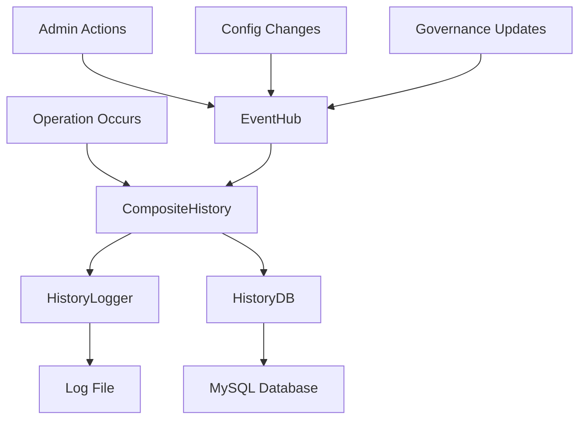
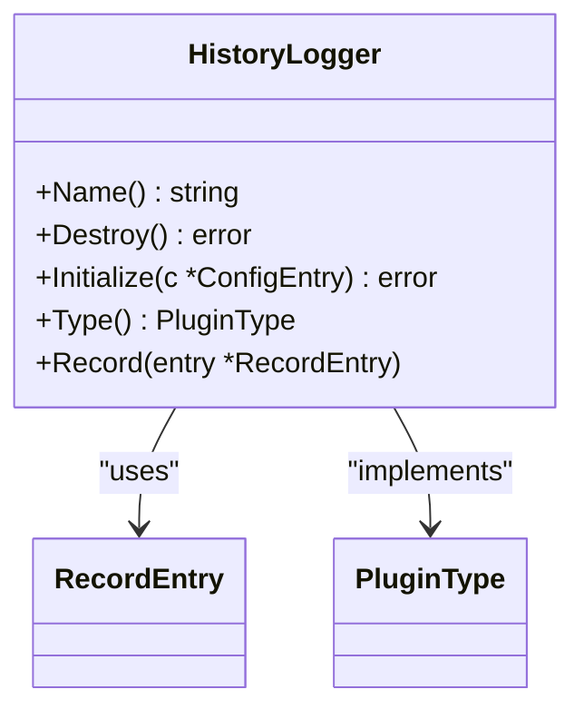
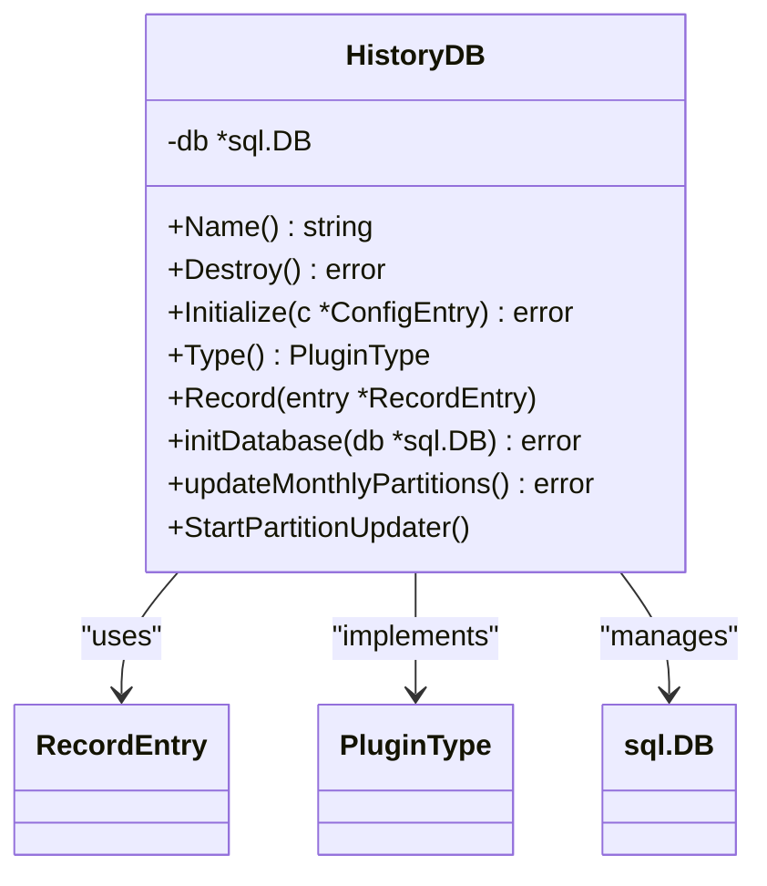
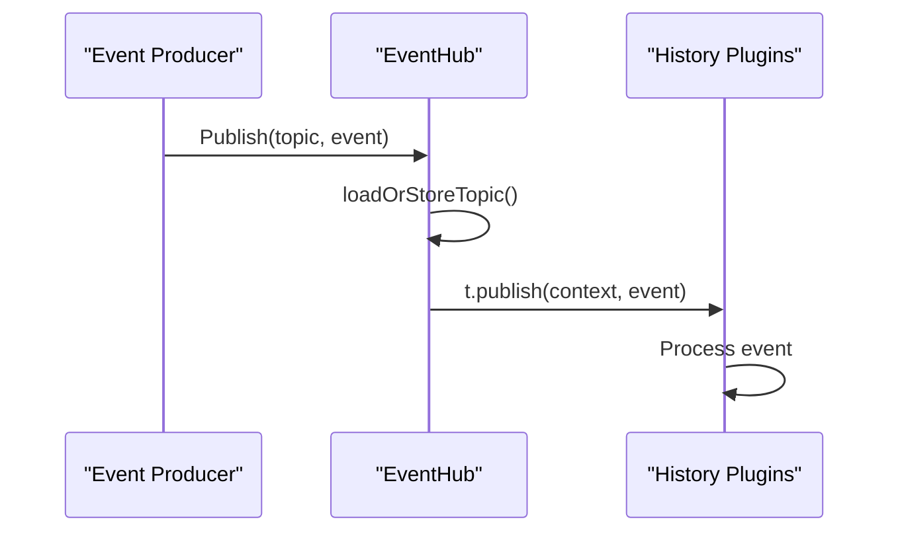
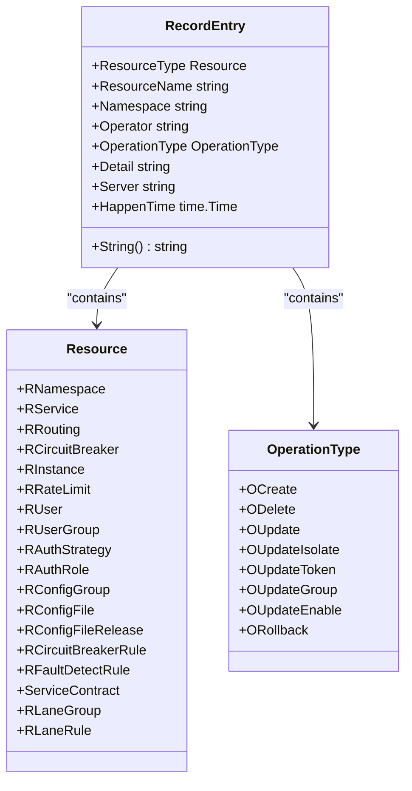
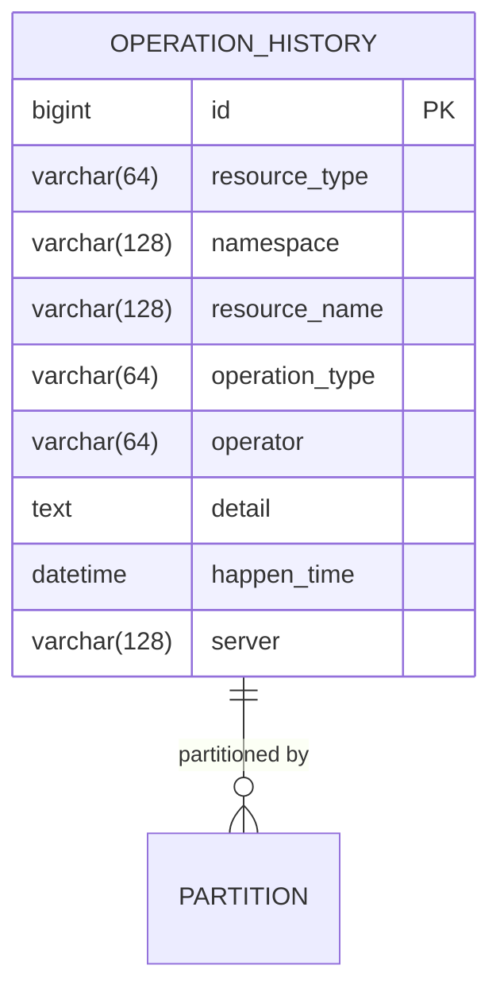
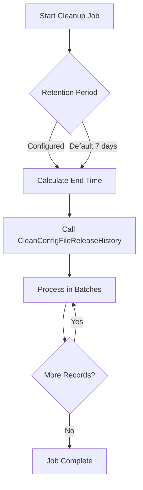

# Operational History

<cite>
**Referenced Files in This Document**   
- [history_logger.go](file://plugin/observability/history/logger/history_logger.go)
- [history_db.go](file://plugin/observability/history/rds/history_db.go)
- [eventhub.go](file://pkg/common/eventhub/eventhub.go)
- [operation.go](file://apis/pkg/types/operation.go)
- [history_clean.go](file://pkg/admin/job/history_clean.go)
- [history.go](file://apis/observability/history/history.go)
</cite>

## Table of Contents
1. [Introduction](#introduction)
2. [Core Components](#core-components)
3. [Architecture Overview](#architecture-overview)
4. [Detailed Component Analysis](#detailed-component-analysis)
5. [Data Schema and Structure](#data-schema-and-structure)
6. [Retention Policies and Cleanup Jobs](#retention-policies-and-cleanup-jobs)
7. [Querying Capabilities](#querying-capabilities)
8. [Performance Considerations](#performance-considerations)
9. [Usage Examples](#usage-examples)
10. [Conclusion](#conclusion)

## Introduction
The Operational History system in the Polaris server provides a comprehensive audit trail for configuration changes, governance rule updates, and administrative actions. This system ensures full traceability of who made changes, when they were made, and what was modified. The implementation supports both in-memory logging and persistent storage through a database backend, with reliable message delivery via an event hub. This document details the architecture, components, data schema, retention policies, querying capabilities, and performance characteristics of the operational history tracking system.

## Core Components
The operational history system consists of multiple components that work together to capture, store, and manage audit records. These include the HistoryLogger for in-memory handling, HistoryDB for persistent storage, and integration with the eventhub for reliable message delivery.

**Section sources**
- [history_logger.go](file://plugin/observability/history/logger/history_logger.go#L1-L67)
- [history_db.go](file://plugin/observability/history/rds/history_db.go#L1-L224)
- [eventhub.go](file://pkg/common/eventhub/eventhub.go#L1-L153)

## Architecture Overview
The operational history system follows a composite pattern where multiple history plugins can be registered and executed in sequence. When an operation occurs, the record is propagated through all registered history plugins, ensuring both immediate logging and durable persistence.



**Diagram sources**
- [history.go](file://apis/observability/history/history.go#L52-L107)
- [history_logger.go](file://plugin/observability/history/logger/history_logger.go#L1-L67)
- [history_db.go](file://plugin/observability/history/rds/history_db.go#L1-L224)

## Detailed Component Analysis

### History Logger Implementation
The HistoryLogger plugin captures operation records and writes them to log files for immediate visibility and debugging purposes. It implements the standard plugin interface with initialization, destruction, and record methods.



**Diagram sources**
- [history_logger.go](file://plugin/observability/history/logger/history_logger.go#L1-L67)

**Section sources**
- [history_logger.go](file://plugin/observability/history/logger/history_logger.go#L1-L67)

### History Database Implementation
The HistoryDB plugin provides persistent storage of operation records in a MySQL database with monthly partitioning for performance optimization. It handles database connection management, table initialization, and automatic partition maintenance.



**Diagram sources**
- [history_db.go](file://plugin/observability/history/rds/history_db.go#L1-L224)

**Section sources**
- [history_db.go](file://plugin/observability/history/rds/history_db.go#L1-L224)

### EventHub Integration
The eventhub system provides a publish-subscribe mechanism for reliable message delivery across components. It enables decoupled communication between services that generate audit events and those that process them.



**Diagram sources**
- [eventhub.go](file://pkg/common/eventhub/eventhub.go#L1-L153)

**Section sources**
- [eventhub.go](file://pkg/common/eventhub/eventhub.go#L1-L153)

## Data Schema and Structure
The operational history system uses a well-defined data model to capture all relevant information about changes to the system.

### Record Entry Structure
The RecordEntry struct defines the schema for all operation records, capturing essential metadata about each change.



**Diagram sources**
- [operation.go](file://apis/pkg/types/operation.go#L76-L85)

**Section sources**
- [operation.go](file://apis/pkg/types/operation.go#L1-L99)

### Database Schema
The persistent storage uses a partitioned MySQL table to optimize query performance and manage data lifecycle.



**Diagram sources**
- [history_db.go](file://plugin/observability/history/rds/history_db.go#L85-L123)

## Retention Policies and Cleanup Jobs
The system implements configurable retention policies to manage the lifecycle of historical records and prevent unbounded growth.

### History Cleanup Job
A scheduled job removes historical records that exceed the configured retention period.



**Diagram sources**
- [history_clean.go](file://pkg/admin/job/history_clean.go#L0-L38)

**Section sources**
- [history_clean.go](file://pkg/admin/job/history_clean.go#L0-L77)

## Querying Capabilities
The operational history system supports efficient querying through multiple access patterns:

- **Time-based queries**: Using the `idx_happen_time` index for date range queries
- **Resource-based queries**: Using the `idx_resource_name` composite index for filtering by resource type and name
- **Operator-based queries**: Using the `idx_operator` index to find all actions by a specific user
- **Combined queries**: Leveraging multiple indexes for complex filtering scenarios

The partitioning strategy by month further enhances query performance by allowing partition pruning for time-based queries.

**Section sources**
- [history_db.go](file://plugin/observability/history/rds/history_db.go#L85-L123)

## Performance Considerations
The operational history system is designed for high performance and scalability in large deployments:

- **Database Connection Pooling**: Configured with 20 max open connections and 10 idle connections
- **Connection Lifetime**: 5-minute maximum lifetime to prevent stale connections
- **Partitioning Strategy**: Monthly partitions to optimize query performance and maintenance
- **Asynchronous Processing**: Non-blocking record insertion to avoid impacting main operations
- **Batch Operations**: Cleanup jobs process records in batches to minimize database load
- **Index Optimization**: Strategic indexing on frequently queried fields

The system automatically maintains database partitions, adding new ones for upcoming months to ensure uninterrupted operation.

**Section sources**
- [history_db.go](file://plugin/observability/history/rds/history_db.go#L49-L83)

## Usage Examples
The following examples demonstrate how to retrieve change history for various scenarios:

### Retrieve Configuration File History
```go
// Query all changes to a specific configuration file
query := "SELECT * FROM operation_history WHERE resource_type = 'ConfigFile' AND resource_name = ? AND namespace = ? ORDER BY happen_time DESC"
```

### Retrieve Service Governance Changes
```go
// Get all routing rule updates in the last 24 hours
query := "SELECT * FROM operation_history WHERE resource_type = 'Routing' AND operation_type = 'Update' AND happen_time >= DATE_SUB(NOW(), INTERVAL 24 HOUR)"
```

### Audit User Actions
```go
// Find all actions performed by a specific administrator
query := "SELECT * FROM operation_history WHERE operator = ? ORDER BY happen_time DESC LIMIT 100"
```

### Analyze System Changes
```go
// Get recent changes across all resource types
query := "SELECT resource_type, COUNT(*) as count FROM operation_history WHERE happen_time >= ? GROUP BY resource_type ORDER BY count DESC"
```

**Section sources**
- [history_db.go](file://plugin/observability/history/rds/history_db.go#L125-L180)

## Conclusion
The Operational History system provides a robust and scalable solution for tracking configuration changes, governance rule updates, and administrative actions. By combining in-memory logging with persistent database storage and leveraging the eventhub for reliable message delivery, the system ensures comprehensive audit capabilities. The partitioned database design, strategic indexing, and automated cleanup jobs enable efficient operation even in large-scale deployments. The well-defined data schema captures all necessary information for auditing purposes, while the flexible querying capabilities support various operational and compliance use cases.