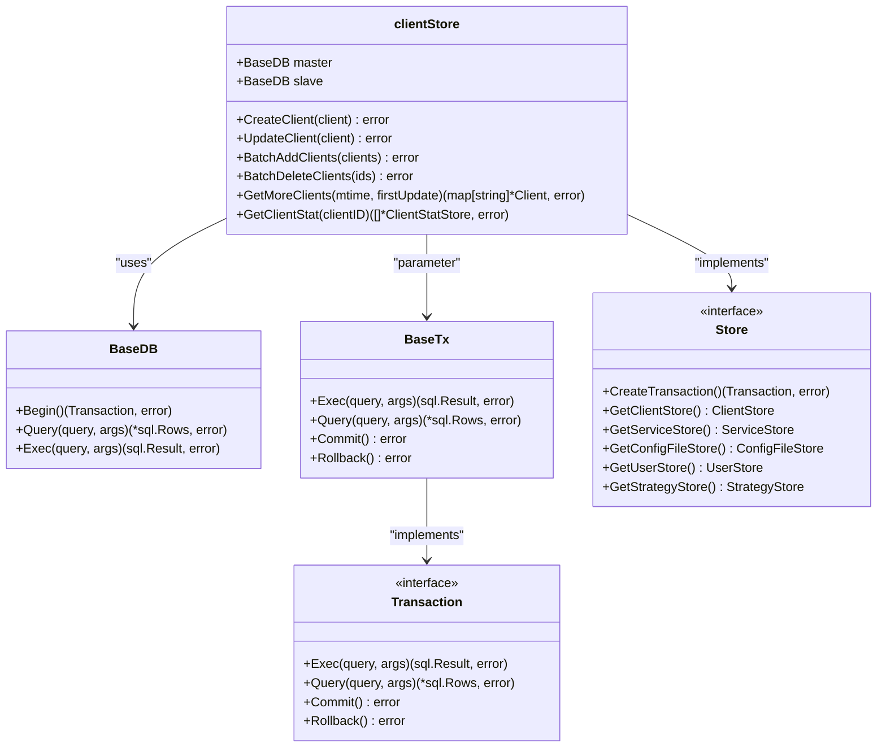
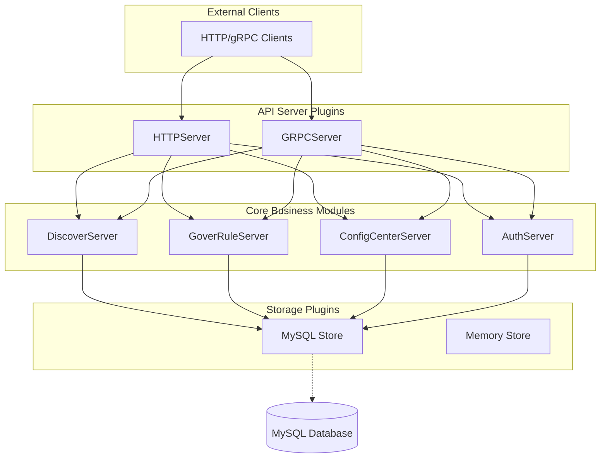

# Plugin Architecture

<cite>
**Referenced Files in This Document**   
- [plugin.go](file://plugin.go)
- [apis/plugin.go](file://apis/plugin.go)
- [bootstrap/server.go](file://bootstrap/server.go)
- [plugin/apiserver/httpserver/server.go](file://plugin/apiserver/httpserver/server.go)
- [plugin/store/mysql/client.go](file://plugin/store/mysql/client.go)
- [plugin/store/mysql/service_contract.go](file://plugin/store/mysql/service_contract.go)
</cite>

## Table of Contents
1. [Introduction](#introduction)
2. [Plugin Interface Contracts](#plugin-interface-contracts)
3. [Plugin Registration and Initialization](#plugin-registration-and-initialization)
4. [Plugin Lifecycle and Dependency Resolution](#plugin-lifecycle-and-dependency-resolution)
5. [API Server Plugin Integration](#api-server-plugin-integration)
6. [Storage Backend Plugin Integration](#storage-backend-plugin-integration)
7. [Component Interaction Diagrams](#component-interaction-diagrams)
8. [Extension Points for Custom Plugins](#extension-points-for-custom-plugins)
9. [Best Practices for Plugin Development](#best-practices-for-plugin-development)
10. [Conclusion](#conclusion)

## Introduction
The pole-server implements a modular plugin architecture that enables extensible functionality for API protocols and storage backends. This architecture allows the system to support multiple service discovery protocols (Eureka, Nacos, Apollo, gRPC, HTTP) and storage solutions (MySQL) through pluggable components. The plugin system is designed with clear interface contracts, a well-defined registration process, and a structured initialization lifecycle that ensures proper dependency resolution. This documentation provides a comprehensive analysis of the plugin architecture, detailing how plugins are defined, registered, initialized, and integrated with the core system.

## Plugin Interface Contracts
The plugin architecture in pole-server is governed by well-defined interface contracts that ensure consistency across different plugin types. The core Plugin interface, defined in apis/plugin.go, establishes the fundamental contract that all plugins must implement. This interface requires plugins to provide a name, type classification, initialization method, and destruction method. The PluginType enumeration categorizes plugins into distinct functional groups including API servers, storage backends, access control mechanisms, observability components, and others. Each plugin type serves a specific purpose within the system, with PluginTypeApiServer handling API protocol implementations and PluginTypeStore managing storage backend integrations. The ConfigEntry structure provides a standardized way to pass configuration options to plugins during initialization, ensuring consistent configuration handling across all plugin types.

**Section sources**
- [apis/plugin.go](file://apis/plugin.go#L50-L112)

## Plugin Registration and Initialization
The plugin registration and initialization process in pole-server follows a systematic approach that begins with package-level imports and concludes with runtime initialization. During the bootstrap phase, the system processes plugin configurations and initializes registered plugins in a controlled manner. The RegisterPlugin function in apis/plugin.go serves as the central registration mechanism, maintaining a global registry of available plugins indexed by their type and name. When the server starts, it loads configuration from YAML files and uses the SetPluginConfig function to make this configuration available to all plugins. The initialization sequence is orchestrated through the StartComponents function in bootstrap/server.go, which initializes core system components in dependency order before activating plugin functionality. API server plugins are initialized through the StartServers function, which processes the APIServers configuration section and activates the corresponding plugin slots based on protocol name.

**Section sources**
- [plugin.go](file://plugin.go#L0-L54)
- [bootstrap/server.go](file://bootstrap/server.go#L150-L200)

## Plugin Lifecycle and Dependency Resolution
The plugin lifecycle in pole-server consists of three distinct phases: registration, initialization, and destruction. Plugins are first registered through package-level imports that execute init functions, adding themselves to the global plugin registry. During the initialization phase, plugins receive their configuration through the Initialize method and establish connections to external systems or allocate necessary resources. The destruction phase, triggered during server shutdown, allows plugins to clean up resources and terminate connections gracefully. Dependency resolution is handled implicitly through the initialization order, with core system components like storage and cache being initialized before plugins that depend on them. The system uses a transaction-based approach to ensure that plugins are properly integrated with the core system, with storage plugins being initialized before other components that require data persistence. This ordered initialization ensures that all dependencies are available before a plugin attempts to use them.

**Section sources**
- [bootstrap/server.go](file://bootstrap/server.go#L100-L150)
- [apis/plugin.go](file://apis/plugin.go#L30-L50)

## API Server Plugin Integration
API server plugins in pole-server provide support for various service discovery protocols and are integrated through the HTTPServer implementation in plugin/apiserver/httpserver/server.go. These plugins handle incoming requests for service discovery, configuration management, and other API operations. The HTTPServer struct maintains references to core business modules such as namingServer, ruleServer, and configServer, which it uses to process requests. During initialization, the HTTPServer establishes connections to these core components and configures request routing based on the enabled API configurations. The createRestfulContainer method sets up the web service endpoints and applies filters for cross-origin resource sharing, request preprocessing, and post-processing. The server implements a modular approach to endpoint registration, with different API groups (admin, console, client) being added conditionally based on configuration. This allows for flexible API surface management and enables different protocol adapters to share common infrastructure while maintaining protocol-specific behavior.

```mermaid
classDiagram
class HTTPServer {
+string listenIP
+uint32 listenPort
+map[string]interface{} option
+map[string]ApiserverAPIConfig openAPI
+bool start
+chan struct{} exitCh
+atomic.Bool enablePprof
+bool enableSwagger
+http.Server server
+AdminOperateServer maintainServer
+NamespaceOperateServer namespaceServer
+DiscoverServer namingServer
+GoverRuleServer ruleServer
+ConfigCenterServer configServer
+Ratelimit rateLimit
+Statis statis
+Whitelist whitelist
+discovery.HTTPServer discoverSvr
+confighttp.HTTPServer configSvr
+auth.HTTPServer authSvr
+map[string]Apiserver apiserverSlots
+GetPort() uint32
+GetProtocol() string
+Initialize(ctx, option, apiConf) error
+Run(errCh)
+Stop()
+Restart(option, apiConf, errCh) error
+createRestfulContainer() (*restful.Container, error)
}
class Apiserver {
<<interface>>
+GetPort() uint32
+GetProtocol() string
+Initialize(ctx, option, apiConf) error
+Run(errCh)
+Stop()
+Restart(option, apiConf, errCh) error
}
class DiscoverServer {
<<interface>>
+RegisterInstance(ctx, req) Response
+DeregisterInstance(ctx, req) Response
+Discover(ctx, req) DiscoverResponse
}
class GoverRuleServer {
<<interface>>
+GetCircuitBreakerRule(ctx, req) Response
+GetRateLimitRule(ctx, req) Response
+GetRouterRule(ctx, req) Response
}
class ConfigCenterServer {
<<interface>>
+GetConfigFile(ctx, req) Response
+CreateConfigFile(ctx, req) Response
+UpdateConfigFile(ctx, req) Response
}
HTTPServer --> Apiserver : "implements"
HTTPServer --> DiscoverServer : "uses"
HTTPServer --> GoverRuleServer : "uses"
HTTPServer --> ConfigCenterServer : "uses"
HTTPServer --> Ratelimit : "uses"
HTTPServer --> Statis : "uses"
HTTPServer --> Whitelist : "uses"
```

**Diagram sources **
- [plugin/apiserver/httpserver/server.go](file://plugin/apiserver/httpserver/server.go#L50-L100)

**Section sources**
- [plugin/apiserver/httpserver/server.go](file://plugin/apiserver/httpserver/server.go#L0-L700)

## Storage Backend Plugin Integration
Storage backend plugins in pole-server provide persistence capabilities through the MySQL implementation in the plugin/store/mysql package. These plugins implement the Store interface defined in apis/store/api.go and provide concrete implementations for data access operations. The clientStore struct in plugin/store/mysql/client.go demonstrates the pattern used for storage plugins, with methods for creating, updating, and querying client information. The implementation uses a master-slave database configuration, directing write operations to the master database and read operations to the slave database for improved performance. Transaction management is handled through the RetryTransaction function, which ensures that database operations are retried in case of transient failures. The storage layer also implements batch operations for efficient processing of multiple records, with methods like BatchAddClients and BatchDeleteClients that optimize database interactions. The service contract storage in plugin/store/mysql/service_contract.go shows how complex data structures are mapped to database tables and queried with proper pagination and filtering.



**Diagram sources **
- [plugin/store/mysql/client.go](file://plugin/store/mysql/client.go#L20-L50)
- [plugin/store/mysql/service_contract.go](file://plugin/store/mysql/service_contract.go#L20-L50)

**Section sources**
- [plugin/store/mysql/client.go](file://plugin/store/mysql/client.go#L0-L463)
- [plugin/store/mysql/service_contract.go](file://plugin/store/mysql/service_contract.go#L0-L500)

## Component Interaction Diagrams
The interaction between plugin components and core business modules in pole-server follows a well-defined architectural pattern that promotes loose coupling and high cohesion. The HTTP server plugin acts as an adapter between external clients and internal business logic, translating protocol-specific requests into calls to core service interfaces. Similarly, the MySQL storage plugin serves as a persistence adapter, converting domain object operations into database transactions. This adapter pattern allows the core business logic to remain independent of specific protocol or storage implementations. The component diagram illustrates how the HTTPServer component depends on various business service interfaces while providing an API endpoint for external clients. The storage components show a similar pattern, with the clientStore implementing the Store interface while depending on database connection objects. This architecture enables easy replacement of components without affecting the rest of the system, supporting the extensibility goals of the plugin architecture.



**Diagram sources **
- [plugin/apiserver/httpserver/server.go](file://plugin/apiserver/httpserver/server.go#L50-L100)
- [plugin/store/mysql/client.go](file://plugin/store/mysql/client.go#L20-L50)

## Extension Points for Custom Plugins
The pole-server plugin architecture provides several extension points for developing custom plugins that integrate with the core system. Developers can create new API server plugins by implementing the Apiserver interface and registering them with the system through package-level imports. Similarly, custom storage backends can be developed by implementing the Store interface and its component stores (ClientStore, ServiceStore, etc.). The plugin system supports configuration through the ConfigEntry structure, allowing custom plugins to receive initialization parameters from the server configuration. The event-driven architecture, demonstrated by the DiscoverEvent plugin type, provides a mechanism for plugins to participate in system events and react to changes in service state. The interceptor pattern used in access control plugins shows how custom logic can be inserted into request processing pipelines. These extension points enable developers to add new functionality without modifying the core system, supporting the extensibility and maintainability goals of the architecture.

**Section sources**
- [apis/plugin.go](file://apis/plugin.go#L50-L112)
- [plugin/apiserver/httpserver/server.go](file://plugin/apiserver/httpserver/server.go#L50-L100)

## Best Practices for Plugin Development
When developing plugins for pole-server, several best practices should be followed to ensure compatibility, reliability, and maintainability. Plugins should implement proper error handling that translates internal errors into standardized error codes and messages that can be understood by the core system. Logging should be integrated using the system's logging infrastructure to ensure consistent log formatting and output. Plugins should manage their resources carefully, releasing database connections, file handles, and other resources during the Destroy phase. Configuration should be validated during initialization, with clear error messages provided for invalid configurations. Performance considerations include using connection pooling for database access, implementing appropriate caching strategies, and optimizing database queries with proper indexing. Thread safety should be considered when implementing plugins that maintain internal state, using appropriate synchronization primitives to protect shared data. Finally, plugins should follow the principle of least privilege, only requesting the permissions and resources necessary for their operation.

**Section sources**
- [plugin/apiserver/httpserver/server.go](file://plugin/apiserver/httpserver/server.go#L600-L650)
- [plugin/store/mysql/client.go](file://plugin/store/mysql/client.go#L400-L450)

## Conclusion
The plugin architecture in pole-server provides a robust and extensible foundation for supporting multiple API protocols and storage backends. Through well-defined interface contracts, a systematic registration and initialization process, and clear extension points, the architecture enables flexible integration of new functionality while maintaining system stability and performance. The separation of concerns between protocol adapters, business logic, and persistence layers promotes maintainability and testability. The use of standard design patterns such as adapters and interceptors ensures consistency across different plugin types. This architecture successfully balances the need for extensibility with the requirements for reliability and performance, making it well-suited for a service discovery and configuration management system that must support diverse deployment scenarios and integration requirements.