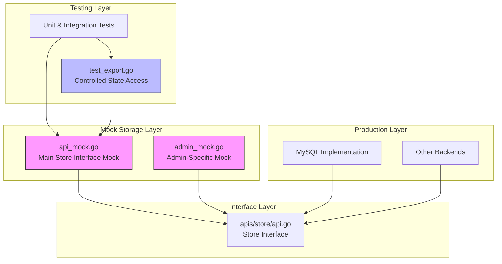
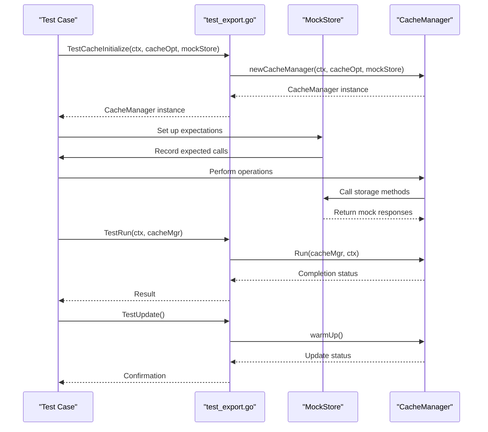

# In-Memory Mock Storage

<cite>
**Referenced Files in This Document**   
- [api_mock.go](file://plugin/store/mock/api_mock.go)
- [admin_mock.go](file://plugin/store/mock/admin_mock.go)
- [api.go](file://apis/store/api.go)
- [test_export.go](file://pkg/cache/test_export.go)
</cite>

## Table of Contents
1. [Introduction](#introduction)
2. [Architecture Overview](#architecture-overview)
3. [Core Components](#core-components)
4. [Interface Implementation and Interchangeability](#interface-implementation-and-interchangeability)
5. [Data Structures and Synchronization](#data-structures-and-synchronization)
6. [Testing Integration and State Validation](#testing-integration-and-state-validation)
7. [Usage in Unit and Integration Testing](#usage-in-unit-and-integration-testing)
8. [Limitations and Constraints](#limitations-and-constraints)
9. [Usage Boundaries](#usage-boundaries)
10. [Conclusion](#conclusion)

## Introduction
The in-memory mock storage system in pole-server provides a lightweight, dependency-free solution for testing and development environments. This documentation details the design and implementation of api_mock.go and admin_mock.go, which simulate persistent data operations while maintaining compatibility with production storage interfaces. The mock storage enables rapid testing cycles by eliminating external database dependencies, allowing developers to focus on business logic validation without infrastructure overhead.

## Architecture Overview
The mock storage system follows a layered architecture that mirrors the production storage interface while operating entirely in memory. It leverages GoMock to generate mock implementations that satisfy the Store interface defined in the core storage package. This architectural approach ensures complete behavioral compatibility with production storage backends while providing full control over test scenarios and data state.



**Diagram sources**
- [api_mock.go](file://plugin/store/mock/api_mock.go)
- [admin_mock.go](file://plugin/store/mock/admin_mock.go)
- [api.go](file://apis/store/api.go)
- [test_export.go](file://pkg/cache/test_export.go)

**Section sources**
- [api_mock.go](file://plugin/store/mock/api_mock.go)
- [admin_mock.go](file://plugin/store/mock/admin_mock.go)

## Core Components
The in-memory mock storage system consists of two primary components: api_mock.go and admin_mock.go. These files provide comprehensive mock implementations of the storage interfaces used throughout the pole-server application. The api_mock.go file implements the core Store interface, covering all major data operations across namespaces, services, configurations, and governance rules. The admin_mock.go file specifically targets administrative operations, including leader election and system maintenance functions.

The mock implementations are generated using GoMock based on the interface definitions in the apis/store package. This code generation approach ensures that the mock implementations remain synchronized with interface changes, automatically adapting to new methods or modified signatures. Both mock files are located in the plugin/store/mock directory, clearly indicating their purpose and scope within the overall architecture.

**Section sources**
- [api_mock.go](file://plugin/store/mock/api_mock.go)
- [admin_mock.go](file://plugin/store/mock/admin_mock.go)

## Interface Implementation and Interchangeability
The mock storage system implements the same interface defined in apis/store/api.go, ensuring complete interchangeability with production storage backends. The Store interface serves as a contract that both mock and production implementations must satisfy, enabling seamless substitution between environments.

```mermaid
classDiagram
class Store {
<<interface>>
+Name() string
+Initialize(c *Config) error
+Destroy() error
+CreateTransaction() (Transaction, error)
+StartTx() (Tx, error)
+StartReadTx() (Tx, error)
}
class NamespaceStore {
<<interface>>
+AddNamespace(namespace *types.Namespace) error
+UpdateNamespace(namespace *types.Namespace) error
+GetNamespace(name string) (*types.Namespace, error)
+GetNamespaces(filter map[string][]string, offset, limit int) ([]*types.Namespace, uint32, error)
+GetMoreNamespaces(mtime time.Time) ([]*types.Namespace, error)
}
class MockStore {
+ctrl *gomock.Controller
+recorder *MockStoreMockRecorder
+EXPECT() *MockStoreMockRecorder
}
class MockLeaderElectionStore {
+ctrl *gomock.Controller
+recorder *MockLeaderElectionStoreMockRecorder
+EXPECT() *MockLeaderElectionStoreMockRecorder
}
Store <|-- MockStore
NamespaceStore <|-- MockStore
Store <|-- MockLeaderElectionStore
NamespaceStore <|-- MockLeaderElectionStore
note right of MockStore
Generated mock implementation
of Store interface
end
note right of MockLeaderElectionStore
Generated mock implementation
of LeaderElectionStore interface
end
```

**Diagram sources**
- [api.go](file://apis/store/api.go)
- [api_mock.go](file://plugin/store/mock/api_mock.go)
- [admin_mock.go](file://plugin/store/mock/admin_mock.go)

**Section sources**
- [api.go](file://apis/store/api.go)
- [api_mock.go](file://plugin/store/mock/api_mock.go)

## Data Structures and Synchronization
The in-memory mock storage utilizes GoMock's built-in mechanisms for state management rather than implementing custom data structures. The mock objects maintain their internal state through the gomock.Controller, which tracks expected method calls and their parameters. This approach eliminates the need for explicit synchronization mechanisms, as the test execution flow controls access to the mock state.

The MockStore and MockLeaderElectionStore structs contain controller and recorder fields that manage the mock behavior and expectations. When a method is called on the mock, the controller verifies that the call matches an expected invocation and returns the predefined response. This design ensures thread-safe operation within test contexts, as each test typically operates with its own mock instance.

The absence of complex data structures simplifies the mock implementation, focusing on behavior simulation rather than data persistence. This aligns with the primary purpose of the mock storage: to validate business logic and method interactions rather than to replicate database semantics.

**Section sources**
- [api_mock.go](file://plugin/store/mock/api_mock.go)
- [admin_mock.go](file://plugin/store/mock/admin_mock.go)

## Testing Integration and State Validation
The mock storage system integrates with testing frameworks through the test_export.go file, which provides controlled access to internal state for validation purposes. This file exports functions that allow test cases to initialize cache managers with mock storage and trigger state updates for verification.



**Diagram sources**
- [test_export.go](file://pkg/cache/test_export.go)
- [api_mock.go](file://plugin/store/mock/api_mock.go)

**Section sources**
- [test_export.go](file://pkg/cache/test_export.go)

## Usage in Unit and Integration Testing
The mock storage system is extensively used in unit and integration testing across various components of the pole-server application. Test cases create mock store instances using NewMockStore and NewMockLeaderElectionStore functions, then set up expectations for specific method calls. This approach allows developers to test both successful execution paths and error conditions by configuring appropriate return values.

Multiple test files across the codebase utilize the mock storage, including user_test.go, client_test.go, circuitbreaker_test.go, ratelimit_config_test.go, instance_test.go, and service_test.go. These tests demonstrate the mock storage's versatility in validating different aspects of the application, from authentication and authorization to service discovery and configuration management.

The mock-based testing approach enables isolated component testing, where individual modules can be verified without requiring a complete system setup. This significantly reduces test execution time and improves reliability by eliminating external dependencies that could introduce flakiness.

**Section sources**
- [api_mock.go](file://plugin/store/mock/api_mock.go)
- [admin_mock.go](file://plugin/store/mock/admin_mock.go)
- [test_export.go](file://pkg/cache/test_export.go)

## Limitations and Constraints
The in-memory mock storage system has several important limitations that define its appropriate use cases. First and foremost, it lacks persistence - all data is lost when the mock instance is destroyed, making it unsuitable for scenarios requiring data durability. The mock storage also has scalability constraints, as it stores all state in memory without optimization for large datasets.

The implementation does not support complex transaction semantics beyond what is necessary for testing. While it provides basic transaction methods, these are primarily stubs that return success without enforcing ACID properties. Additionally, the mock storage does not replicate the performance characteristics of real databases, which can lead to misleading performance assumptions if used outside of testing contexts.

Another limitation is the reliance on GoMock's expectation-based model, which requires test authors to explicitly define expected method calls. This can make tests more brittle when interface implementations change, requiring updates to both the production code and corresponding test expectations.

**Section sources**
- [api_mock.go](file://plugin/store/mock/api_mock.go)
- [admin_mock.go](file://plugin/store/mock/admin_mock.go)

## Usage Boundaries
The mock storage system is strictly intended for testing and development environments, with clear boundaries separating it from production usage. It should never be deployed in production systems, as it lacks the durability, consistency, and fault tolerance required for reliable operation.

The primary usage boundary is enforced through the directory structure and build configuration. The mock implementations are located in the plugin/store/mock directory, clearly indicating their purpose. Build scripts and deployment configurations exclude these files from production builds, ensuring they cannot be accidentally included.

Development environments may use the mock storage for rapid prototyping and feature exploration, but any data created in these contexts should be considered ephemeral. When transitioning features to staging or production, the mock storage must be replaced with a persistent backend implementation.

The test_export.go file provides a controlled mechanism for accessing the mock storage in testing contexts, but these functions are explicitly marked for test use only and should not be called from production code paths.

**Section sources**
- [api_mock.go](file://plugin/store/mock/api_mock.go)
- [admin_mock.go](file://plugin/store/mock/admin_mock.go)
- [test_export.go](file://pkg/cache/test_export.go)

## Conclusion
The in-memory mock storage system in pole-server provides a robust foundation for testing and development, enabling comprehensive validation of application logic without external dependencies. By implementing the same interfaces as production storage backends, the mock storage ensures interchangeability and consistent behavior across environments. Its integration with testing frameworks through controlled state access allows for thorough validation of system behavior under various conditions.

While the mock storage has limitations regarding persistence and scalability, these are intentional design choices that align with its purpose as a testing tool. The clear usage boundaries prevent accidental deployment in production environments, maintaining system reliability. As the pole-server application continues to evolve, the mock storage system will remain a critical component of the development workflow, supporting rapid iteration and high test coverage.