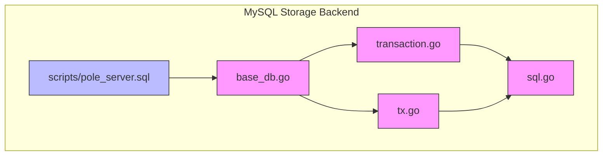
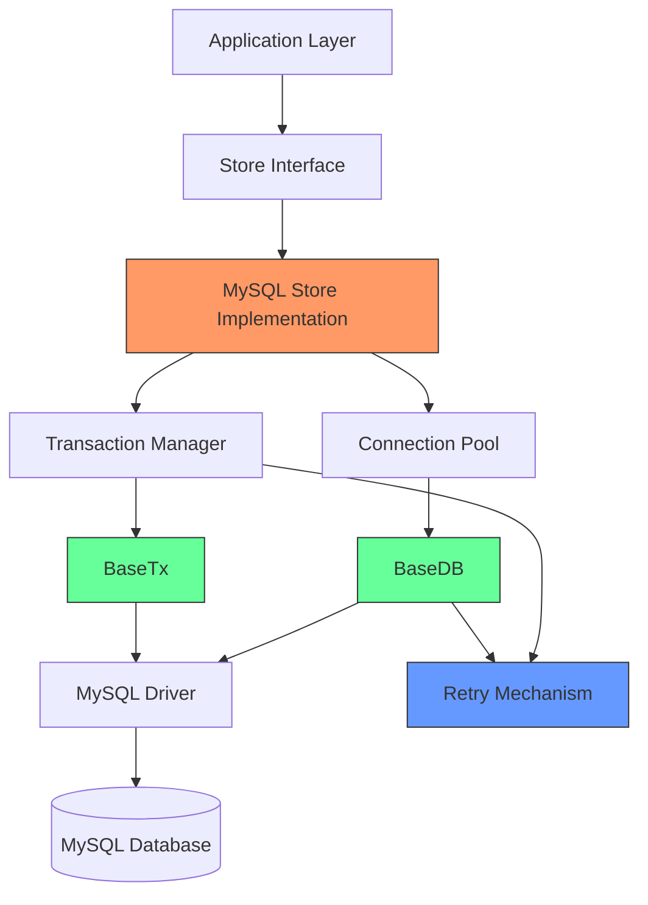
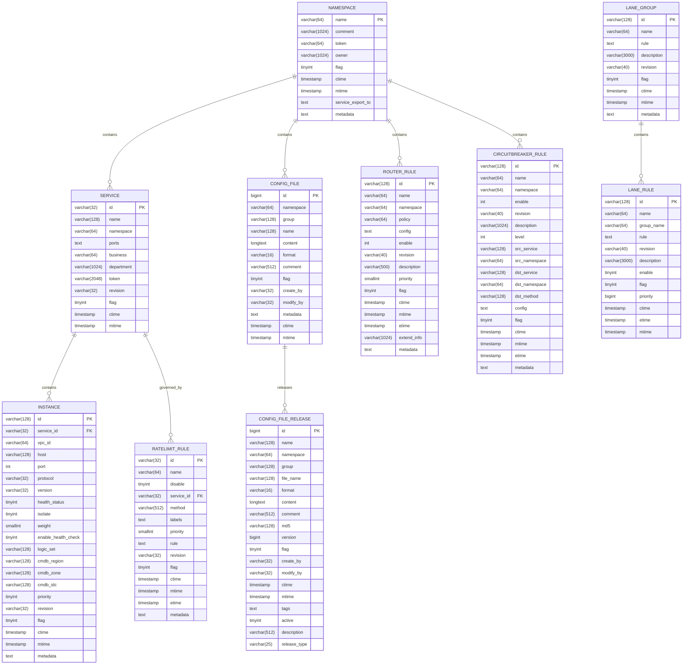
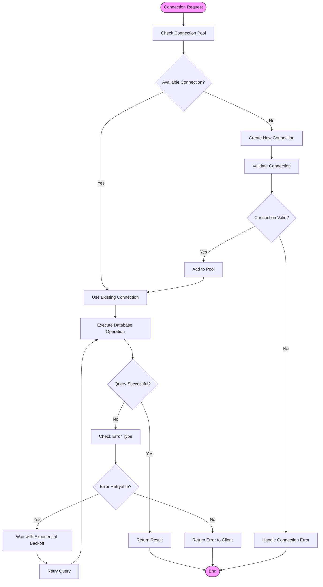
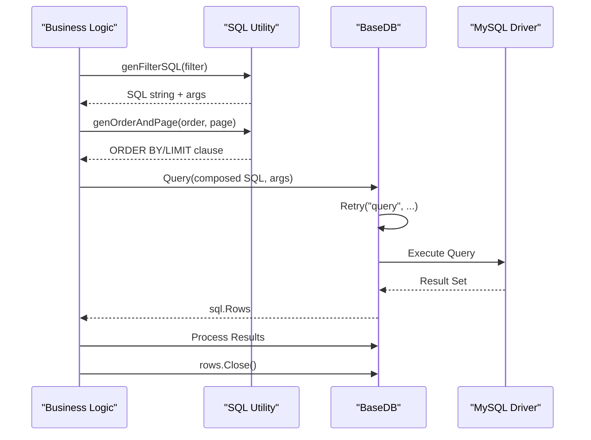
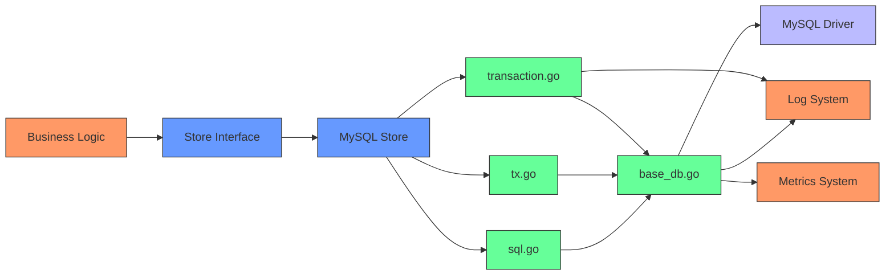
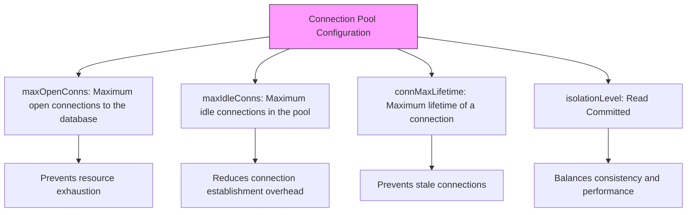
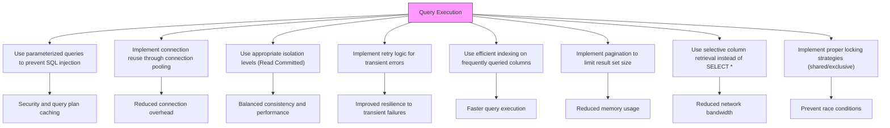
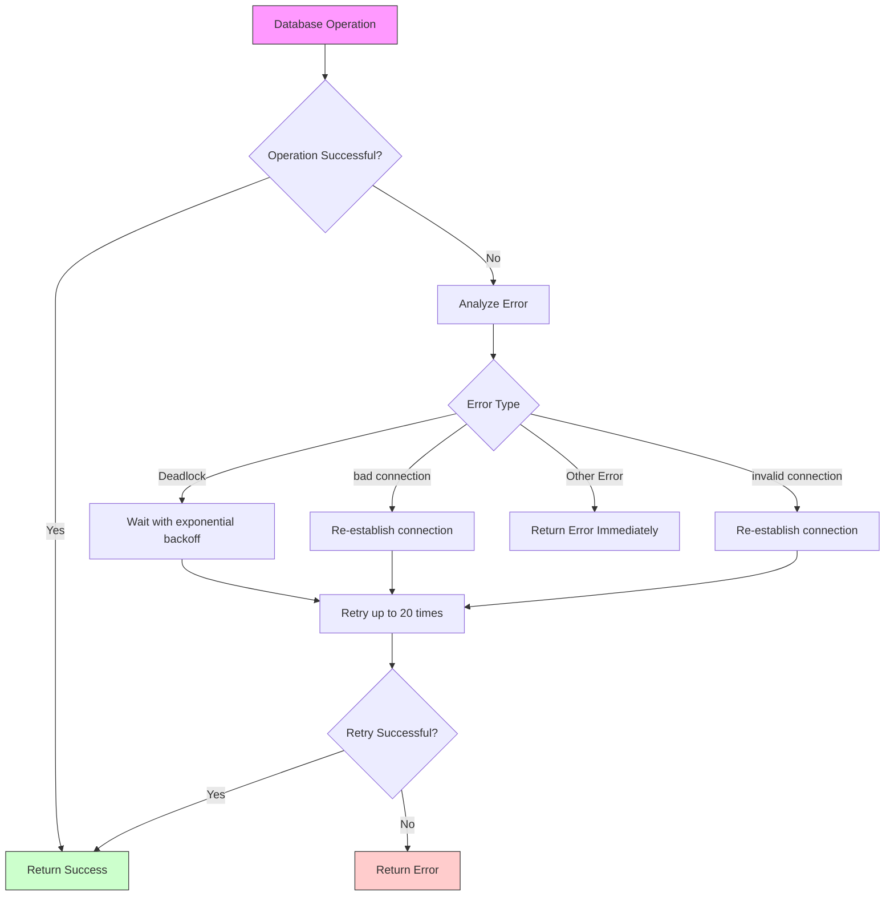

# MySQL Storage Backend

<cite>
**Referenced Files in This Document**   
- [pole_server.sql](file://plugin/store/mysql/scripts/pole_server.sql)
- [transaction.go](file://plugin/store/mysql/transaction.go)
- [tx.go](file://plugin/store/mysql/tx.go)
- [base_db.go](file://plugin/store/mysql/base_db.go)
- [sql.go](file://plugin/store/mysql/sql.go)
- [sql.go](file://apis/store/sql.go)
</cite>

## Table of Contents
1. [Introduction](#introduction)
2. [Project Structure](#project-structure)
3. [Core Components](#core-components)
4. [Architecture Overview](#architecture-overview)
5. [Detailed Component Analysis](#detailed-component-analysis)
6. [Dependency Analysis](#dependency-analysis)
7. [Performance Considerations](#performance-considerations)
8. [Troubleshooting Guide](#troubleshooting-guide)
9. [Conclusion](#conclusion)

## Introduction
This document provides comprehensive documentation for the MySQL storage backend implementation in pole-server. It details the schema design, data access patterns, transaction management, and performance optimization strategies used in the system. The documentation covers entity relationships for services, instances, configurations, and governance rules as defined in the database schema, along with the implementation of CRUD operations and SQL query abstractions.

## Project Structure
The MySQL storage backend is organized within the plugin/store/mysql directory, containing core components for database interaction, transaction management, and SQL abstraction. The implementation follows a layered architecture with clear separation between database connectivity, transaction handling, and business logic operations.



**Diagram sources**
- [base_db.go](file://plugin/store/mysql/base_db.go#L1-L276)
- [transaction.go](file://plugin/store/mysql/transaction.go#L1-L257)
- [tx.go](file://plugin/store/mysql/tx.go#L1-L49)
- [sql.go](file://plugin/store/mysql/sql.go#L1-L245)
- [pole_server.sql](file://plugin/store/mysql/scripts/pole_server.sql#L1-L908)

**Section sources**
- [base_db.go](file://plugin/store/mysql/base_db.go#L1-L50)
- [transaction.go](file://plugin/store/mysql/transaction.go#L1-L30)
- [tx.go](file://plugin/store/mysql/tx.go#L1-L20)

## Core Components
The MySQL storage backend consists of several core components that work together to provide reliable and efficient database operations. These include connection handling in base_db.go, transaction management through transaction.go and tx.go, and SQL query abstraction in sql.go. The implementation provides a robust foundation for data persistence and retrieval operations across various domain models including services, instances, configuration files, and governance rules.

**Section sources**
- [base_db.go](file://plugin/store/mysql/base_db.go#L25-L100)
- [transaction.go](file://plugin/store/mysql/transaction.go#L25-L80)
- [sql.go](file://plugin/store/mysql/sql.go#L15-L60)

## Architecture Overview
The MySQL storage backend architecture is designed with a clear separation of concerns, providing abstraction layers for database connectivity, transaction management, and SQL operations. The system implements connection pooling, retry mechanisms, and consistent transaction handling to ensure reliability and performance in distributed scenarios.



**Diagram sources**
- [base_db.go](file://plugin/store/mysql/base_db.go#L10-L50)
- [transaction.go](file://plugin/store/mysql/transaction.go#L10-L40)
- [tx.go](file://plugin/store/mysql/tx.go#L10-L30)

## Detailed Component Analysis

### Schema Design and Entity Relationships
The database schema is designed to support service discovery, configuration management, and governance rules with proper normalization and indexing strategies. The entity relationships are defined through foreign key constraints and logical associations between tables.



**Diagram sources**
- [pole_server.sql](file://plugin/store/mysql/scripts/pole_server.sql#L1-L908)

### Transaction Management
The transaction management system provides both high-level and low-level transaction interfaces, supporting various locking strategies for concurrent access control. The implementation ensures data consistency through proper isolation levels and error handling.

```mermaid
classDiagram
class transaction {
+tx *BaseTx
+failed bool
+commit bool
+Commit() error
+LockBootstrap(key string, server string) error
+LockNamespace(name string) (*types.Namespace, error)
+RLockNamespace(name string) (*types.Namespace, error)
+DeleteNamespace(name string) error
+LockService(name string, namespace string) (*svctypes.Service, error)
+RLockService(name string, namespace string) (*svctypes.Service, error)
+BatchRLockServices(ids map[string]bool) (map[string]bool, error)
+DeleteService(name string, namespace string) error
+DeleteAliasWithSourceID(sourceServiceID string) error
}
class Tx {
+delegateTx *BaseTx
+Commit() error
+Rollback() error
+GetDelegateTx() interface{}
+CreateReadView() error
}
class BaseTx {
+*sql.Tx
+Commit() error
+Rollback() error
}
transaction --> BaseTx : "uses"
Tx --> BaseTx : "delegates"
BaseTx --> "database/sql" : "wraps"
```

**Diagram sources**
- [transaction.go](file://plugin/store/mysql/transaction.go#L15-L45)
- [tx.go](file://plugin/store/mysql/tx.go#L5-L20)
- [base_db.go](file://plugin/store/mysql/base_db.go#L200-L240)

### Connection Handling and Retry Mechanisms
The connection handling system implements robust connection pooling with configurable parameters for maximum open connections, idle connections, and connection lifetime. The retry mechanism handles transient database errors to improve system resilience.



**Diagram sources**
- [base_db.go](file://plugin/store/mysql/base_db.go#L50-L150)

### SQL Query Abstraction
The SQL abstraction layer provides utility functions for generating parameterized queries with filtering, ordering, and pagination capabilities. This abstraction simplifies database operations across different domain models while maintaining security and performance.



**Diagram sources**
- [sql.go](file://plugin/store/mysql/sql.go#L15-L100)
- [base_db.go](file://plugin/store/mysql/base_db.go#L150-L200)

## Dependency Analysis
The MySQL storage backend components have well-defined dependencies that enable modular design and separation of concerns. The dependency graph shows how different components interact to provide a cohesive data persistence solution.



**Diagram sources**
- [base_db.go](file://plugin/store/mysql/base_db.go#L1-L50)
- [transaction.go](file://plugin/store/mysql/transaction.go#L1-L30)
- [tx.go](file://plugin/store/mysql/tx.go#L1-L20)
- [sql.go](file://plugin/store/mysql/sql.go#L1-L30)

## Performance Considerations
The MySQL storage backend incorporates several performance optimization techniques to ensure efficient database operations under various workloads. These include connection pooling, query optimization, indexing strategies, and retry mechanisms for handling transient failures.

### Connection Pooling Configuration
The system uses configurable connection pooling parameters to balance resource utilization and performance:



**Diagram sources**
- [base_db.go](file://plugin/store/mysql/base_db.go#L70-L100)

### Indexing Strategy
The database schema includes strategic indexes on frequently queried columns to optimize search performance:

```mermaid
erDiagram
SERVICE {
varchar(32) id PK
varchar(128) name
varchar(64) namespace
varchar(32) revision
tinyint flag
timestamp mtime
}
INSTANCE {
varchar(128) id PK
varchar(32) service_id FK
varchar(128) host
tinyint health_status
tinyint isolate
timestamp mtime
}
NAMESPACE {
varchar(64) name PK
tinyint flag
timestamp mtime
}
CONFIG_FILE {
bigint id PK
varchar(64) namespace
varchar(128) group
varchar(128) name
tinyint flag
timestamp mtime
}
SERVICE ||--o{ INSTANCE : contains
NAMESPACE ||--o{ SERVICE : contains
NAMESPACE ||--o{ CONFIG_FILE : contains
classDef indexStyle fill:#ffcccc,stroke:#ff0000
classDef pkStyle fill:#ccffcc,stroke:#00ff00
class "SERVICE.id" pkStyle
class "SERVICE.name, SERVICE.namespace" pkStyle
class "SERVICE.namespace" indexStyle
class "SERVICE.mtime" indexStyle
class "INSTANCE.id" pkStyle
class "INSTANCE.service_id" indexStyle
class "INSTANCE.host" indexStyle
class "INSTANCE.mtime" indexStyle
class "NAMESPACE.name" pkStyle
class "NAMESPACE.mtime" indexStyle
class "CONFIG_FILE.id" pkStyle
class "CONFIG_FILE.namespace, CONFIG_FILE.group, CONFIG_FILE.name" pkStyle
class "CONFIG_FILE.mtime" indexStyle
```

**Diagram sources**
- [pole_server.sql](file://plugin/store/mysql/scripts/pole_server.sql#L50-L500)

### Query Optimization Techniques
The implementation uses several query optimization techniques to improve performance:



**Diagram sources**
- [base_db.go](file://plugin/store/mysql/base_db.go#L150-L250)
- [sql.go](file://plugin/store/mysql/sql.go#L1-L245)

## Troubleshooting Guide
This section addresses common issues and error handling patterns in the MySQL storage backend implementation.

### Error Handling and Retry Mechanisms
The system implements comprehensive error handling with specific retry logic for different types of database errors:



**Section sources**
- [base_db.go](file://plugin/store/mysql/base_db.go#L220-L270)

### Common Issues and Solutions
The following table outlines common issues encountered in the MySQL storage backend and their solutions:

<table>
  <tr>
    <th>Issue</th>
    <th>Possible Causes</th>
    <th>Solutions</th>
  </tr>
  <tr>
    <td>Database connection failures</td>
    <td>Network issues, MySQL server down, incorrect connection parameters</td>
    <td>Verify network connectivity, check MySQL server status, validate connection configuration</td>
  </tr>
  <tr>
    <td>Deadlock errors</td>
    <td>Concurrent transactions accessing resources in different order</td>
    <td>Implement retry logic with exponential backoff, optimize transaction scope</td>
  </tr>
  <tr>
    <td>Performance degradation</td>
    <td>Insufficient connection pool size, missing indexes, complex queries</td>
    <td>Adjust connection pool parameters, add appropriate indexes, optimize queries</td>
  </tr>
  <tr>
    <td>Data inconsistency</td>
    <td>Improper transaction handling, race conditions</td>
    <td>Ensure proper transaction boundaries, use appropriate locking mechanisms</td>
  </tr>
  <tr>
    <td>Memory leaks</td>
    <td>Unclosed database connections, result sets not properly closed</td>
    <td>Ensure proper resource cleanup, use defer statements for cleanup</td>
  </tr>
</table>

**Section sources**
- [base_db.go](file://plugin/store/mysql/base_db.go#L200-L270)
- [transaction.go](file://plugin/store/mysql/transaction.go#L1-L257)

## Conclusion
The MySQL storage backend in pole-server provides a robust and efficient data persistence solution with well-designed schema, comprehensive transaction management, and optimized performance characteristics. The implementation demonstrates several best practices in database interaction, including proper connection pooling, retry mechanisms for transient errors, and strategic indexing for query optimization. The separation of concerns between connection handling, transaction management, and SQL abstraction enables maintainable and extensible code. The system effectively supports the core functionality of service discovery, configuration management, and governance rules with appropriate data models and relationships. Future improvements could include more sophisticated query optimization, enhanced monitoring capabilities, and additional consistency guarantees for distributed scenarios.