# Storage Plugins

<cite>
**Referenced Files in This Document**   
- [api.go](file://apis/store/api.go)
- [base_db.go](file://plugin/store/mysql/base_db.go)
- [transaction.go](file://plugin/store/mysql/transaction.go)
- [instance.go](file://plugin/store/mysql/instance.go)
- [service.go](file://plugin/store/mysql/service.go)
- [namespace.go](file://plugin/store/mysql/namespace.go)
- [config_file.go](file://plugin/store/mysql/config_file.go)
- [admin_mock.go](file://plugin/store/mock/admin_mock.go)
- [api_mock.go](file://plugin/store/mock/api_mock.go)
</cite>

## Table of Contents
1. [Introduction](#introduction)
2. [Storage Plugin Architecture](#storage-plugin-architecture)
3. [Interface Abstraction and Pluggability](#interface-abstraction-and-pluggability)
4. [MySQL Storage Backend Implementation](#mysql-storage-backend-implementation)
5. [In-Memory Mock Storage](#in-memory-mock-storage)
6. [Data Access Patterns](#data-access-patterns)
7. [Transaction Management](#transaction-management)
8. [Service Instance Persistence](#service-instance-persistence)
9. [Performance Considerations](#performance-considerations)
10. [Extension Points and Migration Strategies](#extension-points-and-migration-strategies)

## Introduction
The pole-server storage plugin architecture provides a flexible and extensible framework for data persistence, supporting multiple storage backends through a well-defined interface abstraction. This document details the implementation of the pluggable storage system, focusing on the MySQL storage backend and in-memory mock storage implementations. The architecture enables seamless interchangeability between storage engines while maintaining consistent data access patterns and transaction semantics. The system is designed to support service instance data persistence, configuration management, and metadata storage with high reliability and performance.

## Storage Plugin Architecture
The storage plugin architecture in pole-server follows a modular design that separates the storage interface definition from its concrete implementations. This separation enables the system to support multiple storage backends while maintaining a consistent API for data access operations. The architecture consists of three main components: the storage interface layer, concrete storage implementations, and the storage initialization mechanism.

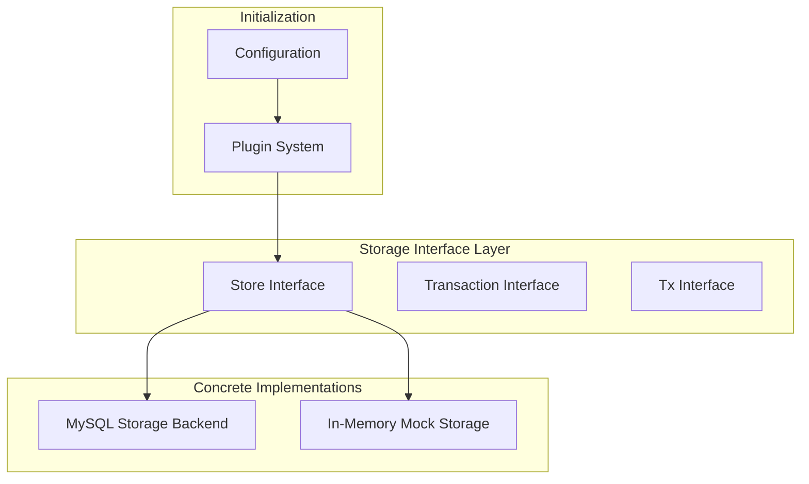

**Diagram sources**
- [api.go](file://apis/store/api.go#L1-L118)

**Section sources**
- [api.go](file://apis/store/api.go#L1-L118)

## Interface Abstraction and Pluggability
The storage engine interchangeability is enabled by the interface abstraction defined in apis/store/api.go. The Store interface serves as the foundation for all storage implementations, defining methods for initialization, transaction management, and various data operations. This interface-based design allows different storage backends to be swapped without affecting the higher-level application logic.

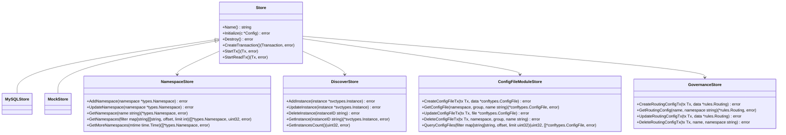

**Diagram sources**
- [api.go](file://apis/store/api.go#L1-L118)

**Section sources**
- [api.go](file://apis/store/api.go#L1-L118)

## MySQL Storage Backend Implementation
The MySQL storage backend provides a production-ready persistence layer with full support for transactions, connection pooling, and database optimization features. Implemented in the plugin/store/mysql package, this backend leverages the Go SQL driver to interact with MySQL databases, providing robust data management capabilities.

### Connection Management and Pooling
The BaseDB type in base_db.go encapsulates the database connection and provides connection pooling functionality. The implementation configures connection limits and lifetime settings to optimize database resource usage and prevent connection exhaustion.

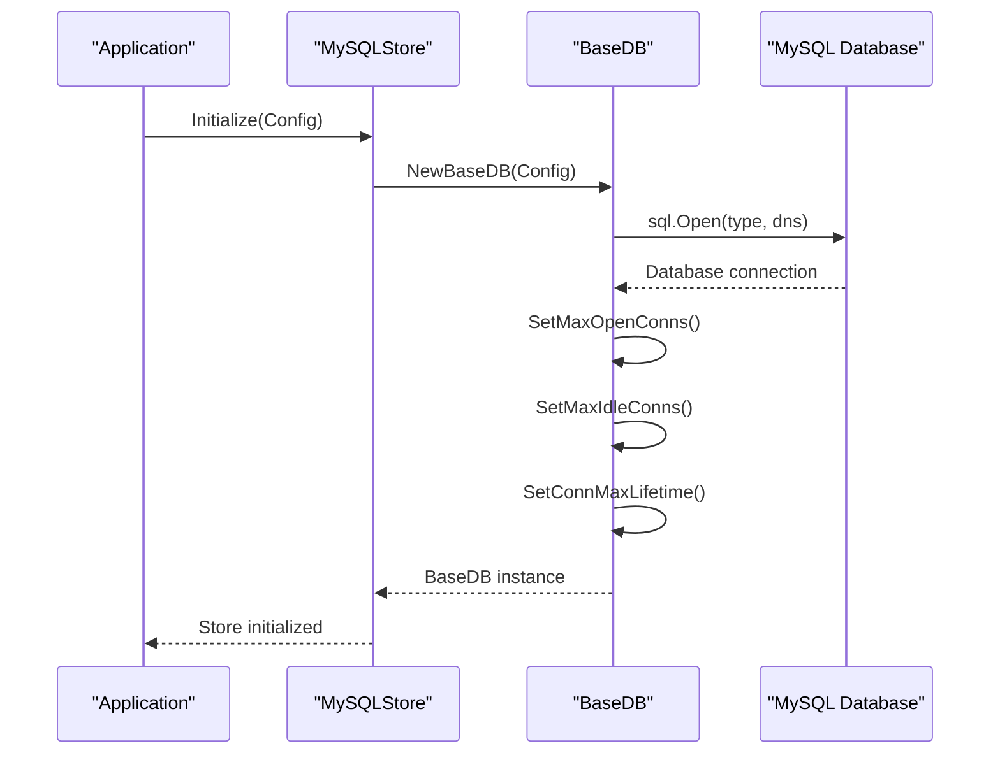

**Diagram sources**
- [base_db.go](file://plugin/store/mysql/base_db.go#L1-L275)

**Section sources**
- [base_db.go](file://plugin/store/mysql/base_db.go#L1-L275)

### Data Access Optimization
The MySQL backend implements several optimization techniques to enhance query performance and reduce database load. These include prepared statement caching, query result batching, and intelligent indexing strategies. The implementation also includes retry logic for handling transient database errors such as deadlocks and connection issues.

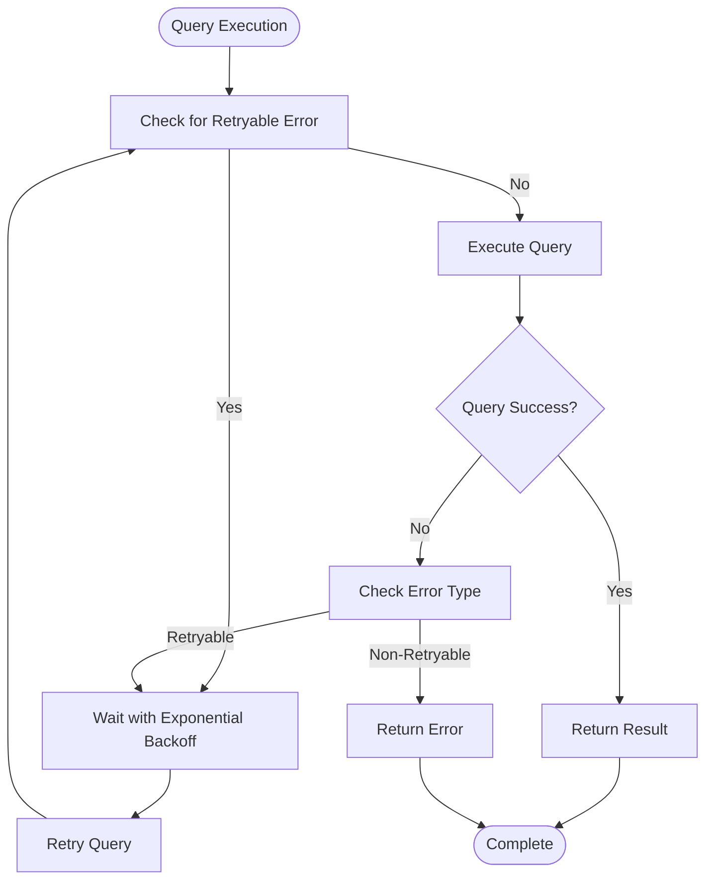

**Diagram sources**
- [base_db.go](file://plugin/store/mysql/base_db.go#L1-L275)

**Section sources**
- [base_db.go](file://plugin/store/mysql/base_db.go#L1-L275)

## In-Memory Mock Storage
The in-memory mock storage implementation provides a lightweight alternative for testing and development environments. Located in the plugin/store/mock package, this implementation stores data in memory rather than persisting to a database, enabling faster operations and easier test isolation.

### Mock Implementation Characteristics
The mock storage backend implements the same Store interface as the MySQL backend but uses in-memory data structures for storage. This allows for rapid data access and manipulation without the overhead of database communication. The implementation is particularly useful for unit testing and integration testing scenarios where database setup would be cumbersome.

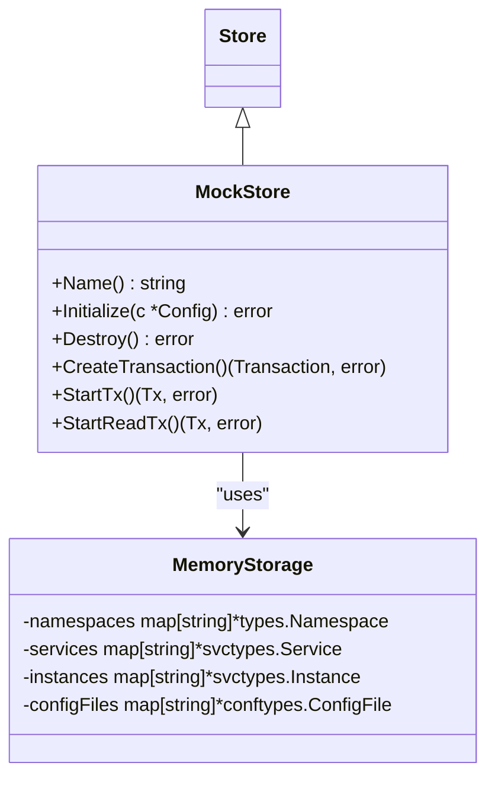

**Diagram sources**
- [api_mock.go](file://plugin/store/mock/api_mock.go)
- [admin_mock.go](file://plugin/store/mock/admin_mock.go)

**Section sources**
- [api_mock.go](file://plugin/store/mock/api_mock.go)
- [admin_mock.go](file://plugin/store/mock/admin_mock.go)

## Data Access Patterns
The storage layer implements consistent data access patterns across different storage backends, ensuring predictable behavior regardless of the underlying persistence mechanism. These patterns include CRUD operations, batch processing, and incremental data retrieval.

### CRUD Operations
The storage interface defines standard Create, Read, Update, and Delete operations for various data entities such as namespaces, services, and instances. Each operation follows a consistent pattern with appropriate error handling and validation.

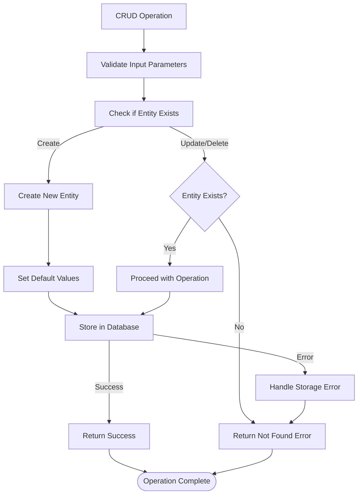

**Section sources**
- [instance.go](file://plugin/store/mysql/instance.go#L1-L799)
- [service.go](file://plugin/store/mysql/service.go#L1-L1234)
- [namespace.go](file://plugin/store/mysql/namespace.go#L1-L281)

### Batch Processing
For operations involving multiple entities, the storage layer provides batch processing capabilities to improve efficiency and reduce database round trips. Batch operations are implemented with transactional semantics to ensure data consistency.

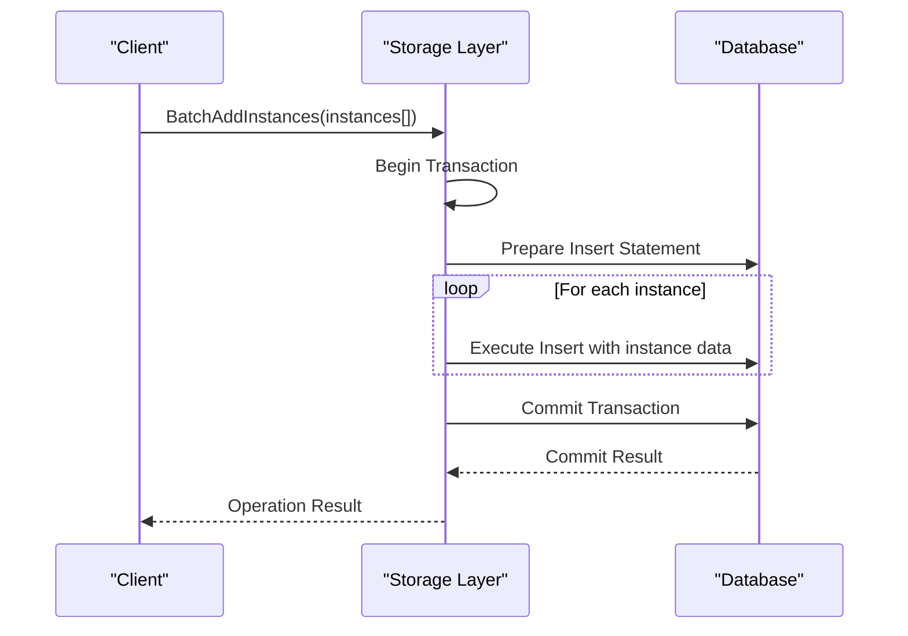

**Diagram sources**
- [instance.go](file://plugin/store/mysql/instance.go#L1-L799)

**Section sources**
- [instance.go](file://plugin/store/mysql/instance.go#L1-L799)

## Transaction Management
The transaction management system in pole-server provides ACID-compliant operations across different storage backends. The implementation supports both explicit transaction management and automatic transaction handling for individual operations.

### Transaction Interface
The transaction system is built around two interfaces: Transaction and Tx. The Transaction interface provides high-level operations such as Commit and Rollback, while the Tx interface represents an active transaction context that can be passed between components.

```mermaid
classDiagram
class Transaction {
+Commit() error
+LockBootstrap(key string, server string) error
+LockNamespace(name string) (*types.Namespace, error)
+DeleteNamespace(name string) error
+LockService(name string, namespace string) (*svctypes.Service, error)
+RLockService(name string, namespace string) (*svctypes.Service, error)
}
class Tx {
+Commit() error
+Rollback() error
+GetDelegateTx() interface{}
+CreateReadView() error
}
Transaction <|-- MySQLTransaction
Tx <|-- MySQLTx
```

**Diagram sources**
- [transaction.go](file://plugin/store/mysql/transaction.go#L1-L256)
- [base_db.go](file://plugin/store/mysql/base_db.go#L1-L275)

**Section sources**
- [transaction.go](file://plugin/store/mysql/transaction.go#L1-L256)

### Transaction Isolation and Locking
The MySQL backend implements row-level locking and transaction isolation to prevent race conditions and ensure data consistency. The system uses shared and exclusive locks to control concurrent access to critical resources such as namespaces and services.

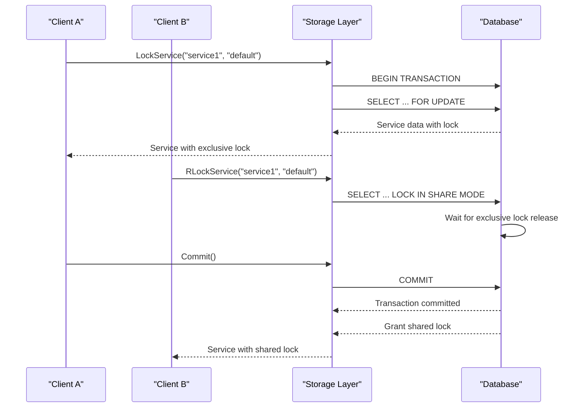

**Diagram sources**
- [transaction.go](file://plugin/store/mysql/transaction.go#L1-L256)

**Section sources**
- [transaction.go](file://plugin/store/mysql/transaction.go#L1-L256)

## Service Instance Persistence
The storage layer provides comprehensive support for service instance data persistence, including creation, update, deletion, and querying operations. The implementation ensures data consistency and integrity through transactional operations and proper indexing.

### Instance Data Model
Service instances are stored in the database with comprehensive metadata, including health status, isolation status, and custom metadata. The data model supports efficient querying by various attributes such as service ID, host, and metadata.

```mermaid
erDiagram
INSTANCE {
string id PK
string service_id FK
string vpc_id
string host
int port
string protocol
string version
int health_status
int isolate
int weight
int enable_health_check
string logic_set
string cmdb_region
string cmdb_zone
string cmdb_idc
int priority
string metadata
string revision
int flag
datetime ctime
datetime mtime
}
HEALTH_CHECK {
string id PK FK
int type
int ttl
}
INSTANCE_MANUAL_METADATA {
string id PK FK
string mkey PK
string mvalue
datetime ctime
datetime mtime
}
SERVICE {
string id PK
string name
string namespace
string reference
string comment
string token
string owner
string revision
int flag
datetime ctime
datetime mtime
string platform_id
}
INSTANCE ||--o{ HEALTH_CHECK : "has"
INSTANCE ||--o{ INSTANCE_MANUAL_METADATA : "has metadata"
SERVICE ||--o{ INSTANCE : "has instances"
```

**Section sources**
- [instance.go](file://plugin/store/mysql/instance.go#L1-L799)
- [service.go](file://plugin/store/mysql/service.go#L1-L1234)

### Instance Operations
The instance storage implementation provides a comprehensive set of operations for managing service instances, including batch operations for improved performance.

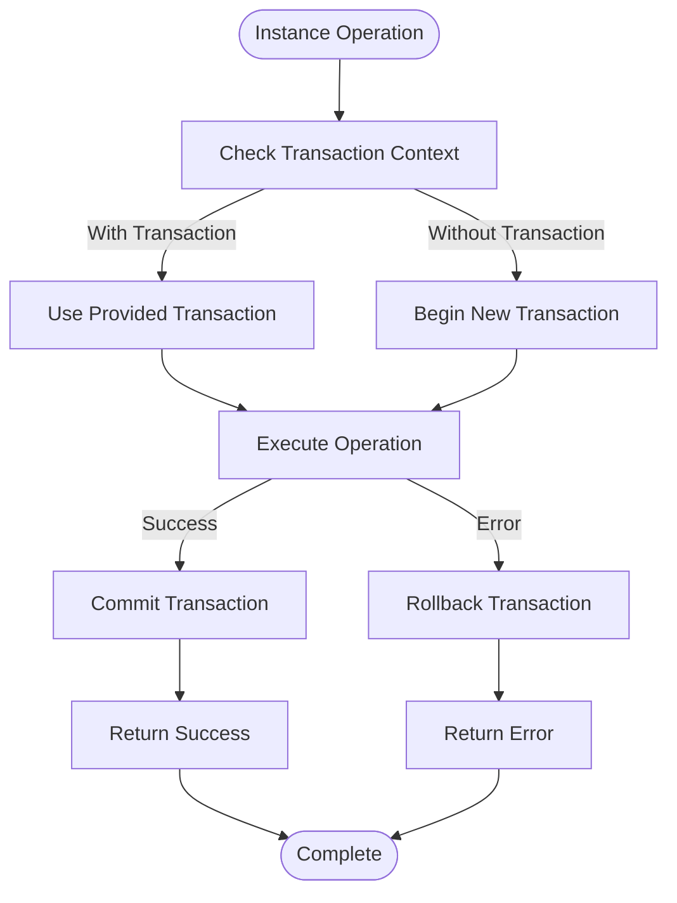

**Section sources**
- [instance.go](file://plugin/store/mysql/instance.go#L1-L799)

## Performance Considerations
The storage implementation includes several performance optimization features to ensure efficient data access and high throughput under various workloads.

### Database Indexing Strategy
The MySQL backend employs a comprehensive indexing strategy to optimize query performance. Indexes are created on frequently queried fields such as service name, namespace, and instance ID to enable fast lookups.

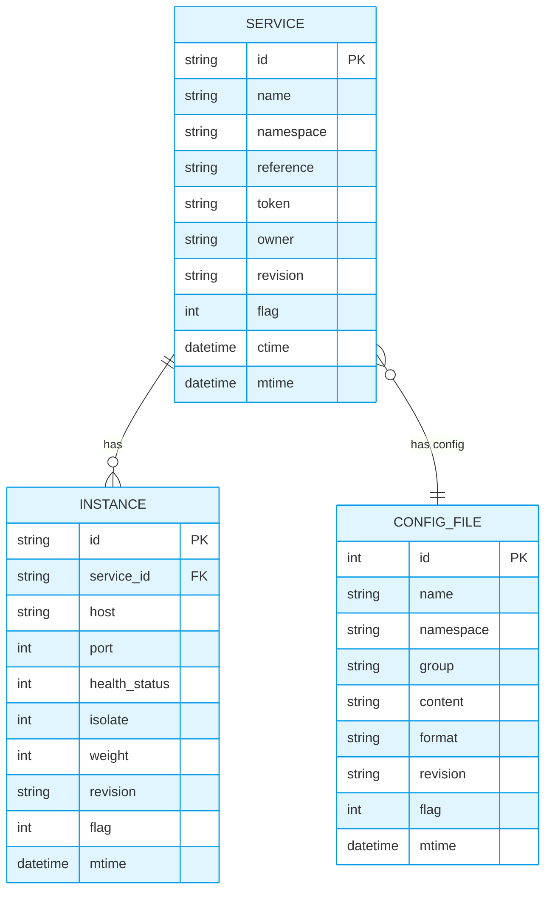

**Section sources**
- [service.go](file://plugin/store/mysql/service.go#L1-L1234)
- [instance.go](file://plugin/store/mysql/instance.go#L1-L799)
- [config_file.go](file://plugin/store/mysql/config_file.go#L1-L314)

### Connection Pooling Configuration
The connection pooling mechanism is configured to balance resource usage and performance. The implementation allows for tuning of key parameters such as maximum open connections, maximum idle connections, and connection lifetime.

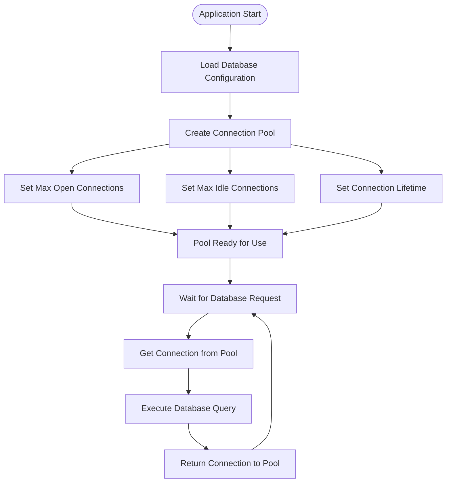

**Section sources**
- [base_db.go](file://plugin/store/mysql/base_db.go#L1-L275)

## Extension Points and Migration Strategies
The storage plugin architecture provides clear extension points for implementing new storage backends and strategies for migrating between different storage engines.

### Implementing New Storage Backends
To implement a new storage backend, developers need to create a struct that implements the Store interface defined in apis/store/api.go. The implementation must provide all required methods for data access, transaction management, and initialization.

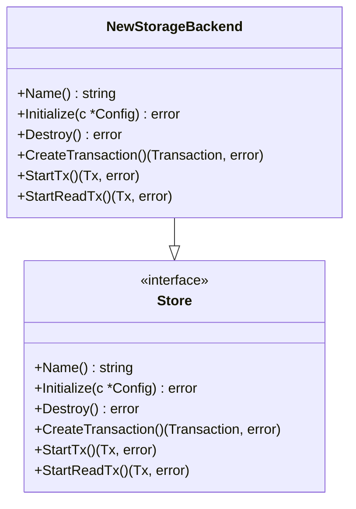

**Section sources**
- [api.go](file://apis/store/api.go#L1-L118)

### Migration Strategies
When migrating between storage engines, several strategies can be employed to ensure data integrity and minimize downtime. These include dual-writing during transition, data synchronization tools, and thorough validation procedures.

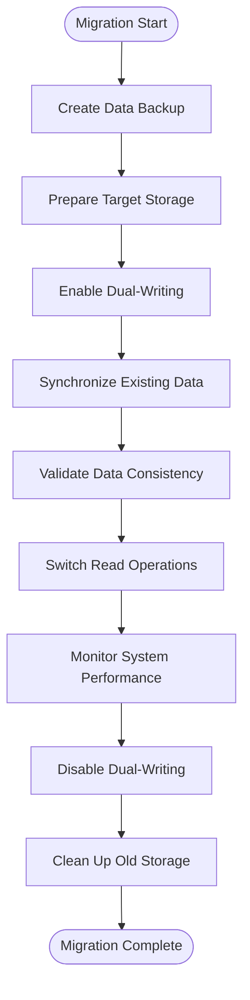

**Section sources**
- [api.go](file://apis/store/api.go#L1-L118)
- [base_db.go](file://plugin/store/mysql/base_db.go#L1-L275)
- [api_mock.go](file://plugin/store/mock/api_mock.go)