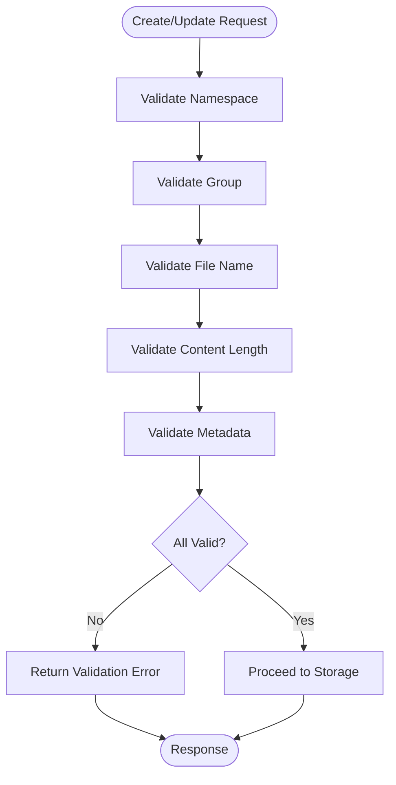
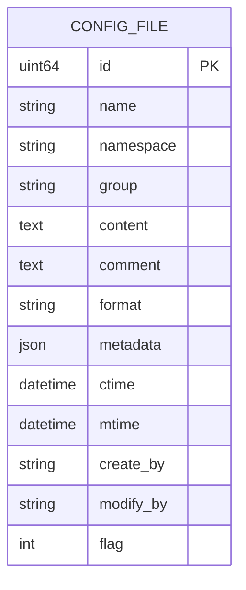

# Configuration Files

<cite>
**Referenced Files in This Document**   
- [config_file.go](file://apis/pkg/types/config/config_file.go)
- [config_file_check.go](file://pkg/config/interceptor/paramcheck/config_file_check.go)
- [config_file.go](file://plugin/store/mysql/config_file.go)
- [config_file.go](file://pkg/cache/config/config_file.go)
</cite>

## Table of Contents
1. [Configuration File Structure](#configuration-file-structure)
2. [CRUD Operations](#crud-operations)
3. [Validation Logic](#validation-logic)
4. [Access Control](#access-control)
5. [Storage Persistence](#storage-persistence)
6. [Caching Strategy](#caching-strategy)
7. [Configuration Formats](#configuration-formats)
8. [Large File Handling](#large-file-handling)
9. [Troubleshooting Guide](#troubleshooting-guide)

## Configuration File Structure

Configuration files in the system are structured around five core attributes: namespace, group, name, content, and format, along with metadata for extended properties. The `ConfigFile` struct defined in [config_file.go](file://apis/pkg/types/config/config_file.go) represents this structure with fields including `Namespace`, `Group`, `Name`, `Content`, `Format`, and `Metadata`. The namespace provides logical isolation for configurations, while the group organizes related configuration files. The name serves as the unique identifier within a namespace-group combination. The content field stores the actual configuration data, which can be in various formats such as YAML, JSON, or plain text. The format field explicitly specifies the content type, enabling proper parsing and validation. Metadata is implemented as a string-to-string map, allowing arbitrary key-value pairs to be attached to configuration files for tagging, categorization, or other purposes.

**Section sources**
- [config_file.go](file://apis/pkg/types/config/config_file.go#L63-L85)

## CRUD Operations

The system provides comprehensive CRUD (Create, Read, Update, Delete) operations for configuration files through both HTTP and gRPC APIs. Creation of configuration files is handled by the `CreateConfigFiles` method, which accepts a batch of configuration file objects and persists them to storage. Reading operations are implemented through `GetConfigFile` and `SearchConfigFiles` methods, allowing retrieval of individual files or filtered lists based on namespace, group, or other criteria. Updates are performed via the `UpdateConfigFiles` method, which modifies existing configuration files while maintaining version history. Deletion is implemented through `DeleteConfigFiles`, which marks files as deleted rather than removing them permanently, preserving audit trails. All operations follow a batch processing pattern, enabling efficient handling of multiple configuration files in a single request.

**Section sources**
- [config_file_check.go](file://pkg/config/interceptor/paramcheck/config_file_check.go#L20-L154)

## Validation Logic

Validation of configuration file parameters is implemented in the `config_file_check.go` interceptor, ensuring data integrity before persistence. The validation process begins with basic field checks, verifying that namespace, group, and file name are non-empty and properly formatted. The `CheckFileName` function validates that file names contain only allowed characters (alphanumeric, hyphen, period, colon, underscore, and forward slash). Content length is validated against a configurable maximum limit defined in the server configuration, preventing excessively large configuration files that could impact system performance. Metadata validation ensures that all tag keys are non-empty. The validation chain is implemented as a middleware interceptor, allowing it to be applied consistently across all configuration file operations. Validation failures return appropriate error codes such as `InvalidNamespaceName`, `InvalidConfigFileGroupName`, or `InvalidConfigFileName` to guide clients in correcting their requests.



**Diagram sources**
- [config_file_check.go](file://pkg/config/interceptor/paramcheck/config_file_check.go#L100-L127)
- [utils.go](file://pkg/config/utils.go#L39-L88)

## Access Control

Access control for configuration files is implemented through authentication interceptors that enforce authorization policies before allowing operations to proceed. The system follows a chain-of-responsibility pattern for access control, with the auth interceptor executing before the parameter validation interceptor in the processing pipeline. Each request is evaluated against the user's permissions, which are derived from their authentication context. The access control system supports fine-grained permissions, allowing different levels of access (read, write, delete) to be granted at the namespace or group level. For client-facing operations, additional authentication mechanisms are in place to verify the identity of configuration consumers. The interceptor architecture allows for flexible extension of access control policies without modifying the core configuration management logic.

**Section sources**
- [config_file_check.go](file://pkg/config/interceptor/paramcheck/config_file_check.go#L20-L154)
- [server.go](file://pkg/config/server.go#L297-L325)

## Storage Persistence

Configuration files are persisted in MySQL through the `config_file.go` implementation in the MySQL plugin. The storage layer provides transactional operations for creating, reading, updating, and deleting configuration files, ensuring data consistency. The `CreateConfigFileTx` method inserts new configuration files into the database, storing content, metadata, and operational information such as creation and modification timestamps. Updates are performed atomically through the `UpdateConfigFileTx` method, which modifies the content and metadata while preserving the file's identity. The storage implementation uses parameterized queries to prevent SQL injection attacks and includes proper error handling for database connectivity issues. The schema includes fields for soft deletion (flag=1) rather than physical deletion, maintaining audit trails and enabling potential recovery of deleted configurations. The storage layer also provides counting and querying capabilities with support for pagination and filtering.



**Diagram sources**
- [config_file.go](file://plugin/store/mysql/config_file.go#L100-L200)

## Caching Strategy

The system employs a sophisticated caching strategy to improve performance and reduce database load for configuration file operations. The cache implementation in `pkg/cache/config/config_file.go` uses a multi-layer approach with in-memory structures and persistent local storage. Active configuration file releases are cached in memory using concurrent maps for high-performance access, with namespace and group serving as primary cache keys. To manage memory usage for large configuration files, content is stored in a BoltDB key-value store on local disk, while metadata remains in memory for fast lookup. The cache is updated asynchronously through a single-flight mechanism that prevents redundant updates when multiple goroutines request an update simultaneously. The system also maintains revision information for configuration groups, enabling efficient change detection by clients. Cache invalidation is handled through event-driven notifications when configuration files are modified, ensuring consistency between the cache and persistent storage.

```mermaid
classDiagram
class fileCache {
+storage Store
+releases SegmentMap~uint64, SimpleConfigFileRelease~
+name2release SyncMap~string, SyncMap~string, SyncMap~string, SyncMap~string, SimpleConfigFileRelease~~~~
+activeReleases SyncMap~string, SyncMap~string, SyncMap~string, SimpleConfigFileRelease~~~
+valueCache *bbolt.DB
+Initialize(opt map[string]interface{}) error
+Update() error
+GetActiveRelease(namespace, group, fileName string) *ConfigFileRelease
+GetRelease(key ConfigFileReleaseKey) *ConfigFileRelease
}
class ConfigFileRelease {
+*ConfigFileReleaseKey
+Version uint64
+Comment string
+Md5 string
+Content string
+Flag int
+Active bool
+Valid bool
+Format string
+Metadata map[string]string
+CreateTime time.Time
+CreateBy string
+ModifyTime time.Time
+ModifyBy string
+ReleaseDescription string
+BetaLabels []*ClientLabel
}
fileCache --> ConfigFileRelease : "caches"
```

**Diagram sources**
- [config_file.go](file://pkg/cache/config/config_file.go#L50-L100)

## Configuration Formats

The system supports multiple configuration formats including YAML, JSON, and text-based configurations. Format detection is handled automatically based on file extension, with the `ResolveFileType` function in `utils.go` determining the appropriate format. Files with extensions `.yaml` or `.yml` are treated as YAML format, while other extensions are used directly as the format type (e.g., `.json` for JSON, `.properties` for Java properties). For files without extensions, the default format is "txt". The format information is stored in the configuration file metadata and used by clients to determine how to parse the content. This flexible format system allows the platform to support various configuration styles preferred by different applications and frameworks. The system does not validate the internal structure of configuration content, treating it as opaque text that should be interpreted by the consuming application according to the specified format.

**Section sources**
- [utils.go](file://pkg/config/utils.go#L70-L88)

## Large File Handling

Handling of large configuration files is managed through a combination of validation limits and caching optimizations. The system enforces a configurable maximum content length, defined in the server configuration, which prevents excessively large files from being stored. This limit is validated in the `checkConfigFileParams` method before any storage operations occur. For files that approach the size limit, the caching strategy automatically offloads content to local disk storage using BoltDB, keeping only metadata in memory to reduce memory pressure. This approach allows the system to handle large configuration files efficiently without compromising overall performance. Content encoding is handled transparently, with the system storing configuration content as UTF-8 encoded text in the database. For very large files, clients are encouraged to use the streaming capabilities of gRPC to avoid memory issues during transmission.

**Section sources**
- [config_file_check.go](file://pkg/config/interceptor/paramcheck/config_file_check.go#L110-L120)
- [config_file.go](file://pkg/cache/config/config_file.go#L150-L200)

## Troubleshooting Guide

Common issues with configuration file management typically involve failed updates or retrieval timeouts. For failed updates, the most common causes are validation errors such as invalid namespace, group, or file name; content that exceeds the maximum length limit; or insufficient permissions. These issues can be diagnosed by examining the error codes returned by the API, with specific codes indicating the nature of the problem (e.g., `InvalidNamespaceName`, `InvalidConfigFileName`, `InvalidConfigFileContentLength`). Retrieval timeouts are often caused by network issues, database connectivity problems, or extremely large configuration files that take significant time to transfer. To resolve these issues, verify network connectivity, check database health, and consider breaking large configuration files into smaller, more manageable pieces. Cache-related issues can often be resolved by restarting the configuration service to force a cache refresh, or by using the cache management APIs to invalidate specific entries. Monitoring logs for error messages containing "config_file" or "storage" can provide additional diagnostic information.

**Section sources**
- [config_file_check.go](file://pkg/config/interceptor/paramcheck/config_file_check.go#L100-L127)
- [config_file.go](file://plugin/store/mysql/config_file.go#L200-L300)
- [config_file.go](file://pkg/cache/config/config_file.go#L300-L400)