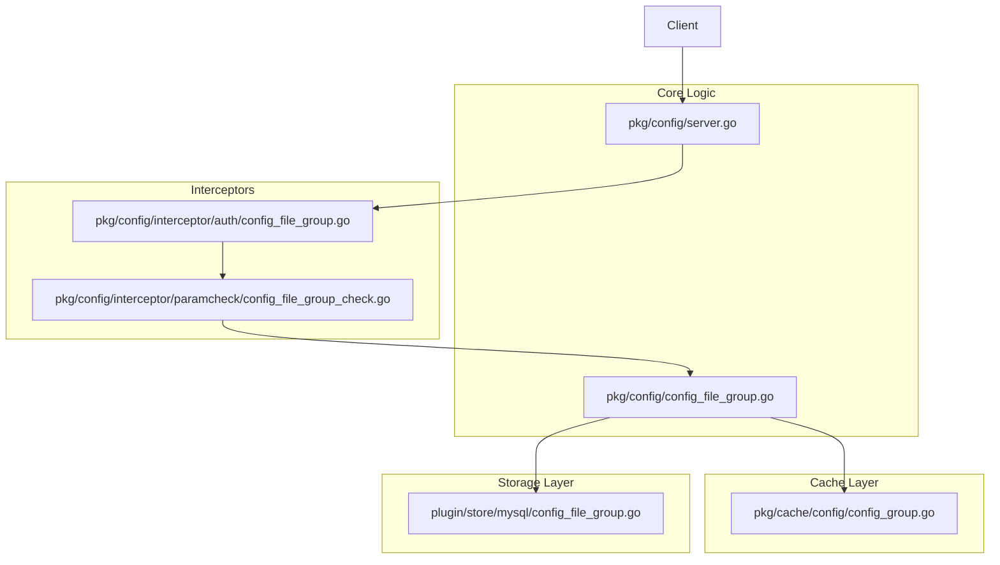
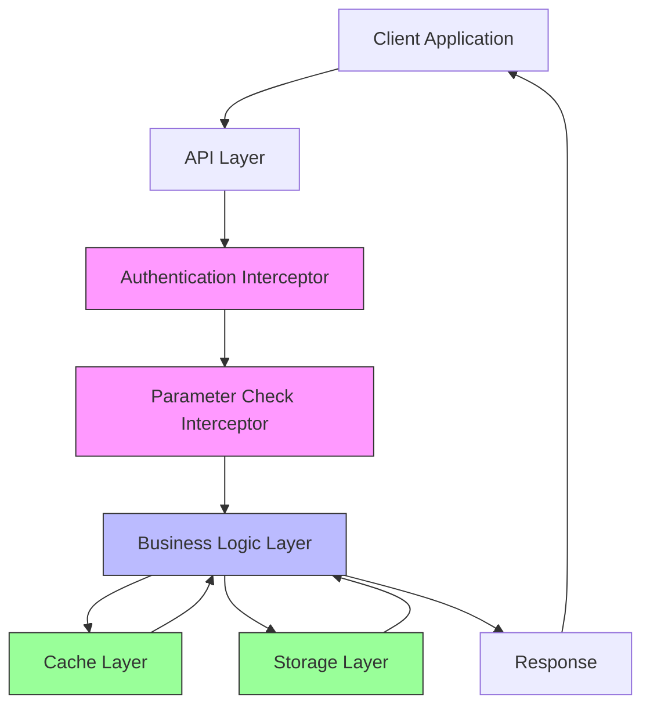
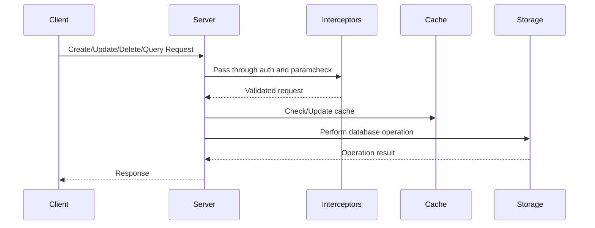
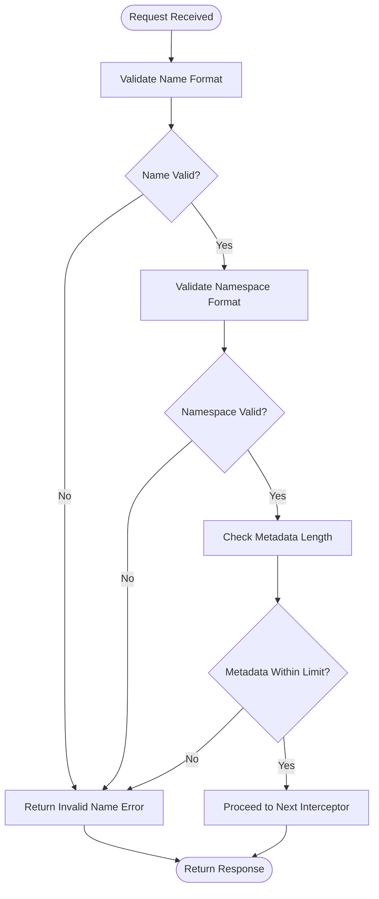
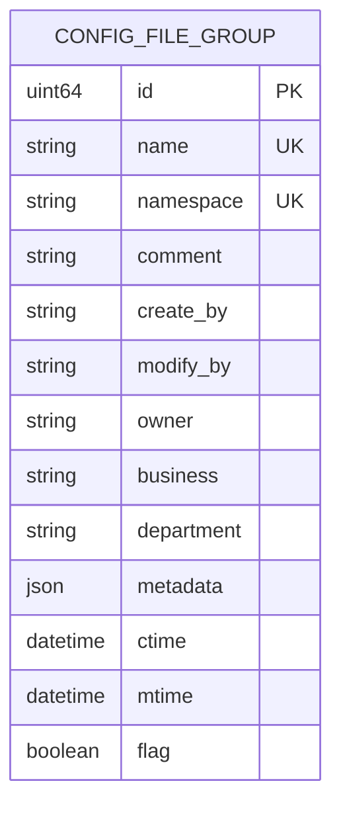
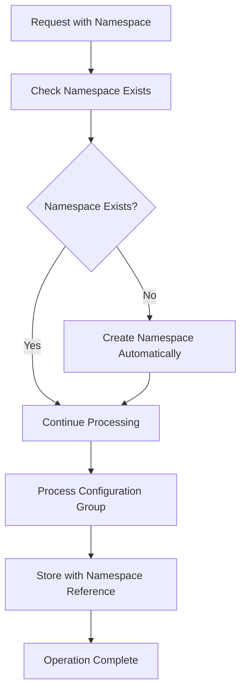
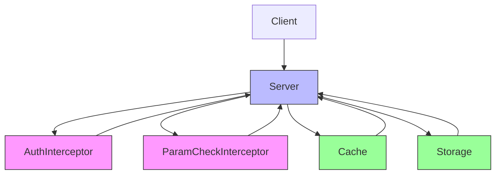

# Configuration Groups

<cite>
**Referenced Files in This Document**   
- [config_file_group.go](file://pkg/config/config_file_group.go)
- [config_group.go](file://pkg/cache/config/config_group.go)
- [config_file_group_check.go](file://pkg/config/interceptor/paramcheck/config_file_group_check.go)
- [config_file_group.go](file://plugin/store/mysql/config_file_group.go)
- [config_file_group.go](file://pkg/config/interceptor/auth/config_file_group.go)
</cite>

## Table of Contents
1. [Introduction](#introduction)
2. [Project Structure](#project-structure)
3. [Core Components](#core-components)
4. [Architecture Overview](#architecture-overview)
5. [Detailed Component Analysis](#detailed-component-analysis)
6. [Dependency Analysis](#dependency-analysis)
7. [Performance Considerations](#performance-considerations)
8. [Troubleshooting Guide](#troubleshooting-guide)
9. [Conclusion](#conclusion)

## Introduction
Configuration Groups serve as logical containers for organizing configuration files within the system. They enable grouping by environment, service, region, or other logical boundaries, facilitating better management and access control. This document details the implementation, operations, validation, storage, and best practices related to configuration groups.

## Project Structure
The configuration group functionality is distributed across multiple packages, primarily in `pkg/config`, `pkg/cache`, and `plugin/store/mysql`. The core logic resides in `pkg/config/config_file_group.go`, with caching handled by `pkg/cache/config/config_group.go`, persistence in `plugin/store/mysql/config_file_group.go`, and interceptors for authentication and parameter checking in their respective directories.

**Diagram sources**
- [config_file_group.go](file://pkg/config/config_file_group.go)
- [config_group.go](file://pkg/cache/config/config_group.go)
- [config_file_group_check.go](file://pkg/config/interceptor/paramcheck/config_file_group_check.go)
- [config_file_group.go](file://plugin/store/mysql/config_file_group.go)
- [config_file_group.go](file://pkg/config/interceptor/auth/config_file_group.go)

**Section sources**
- [config_file_group.go](file://pkg/config/config_file_group.go)
- [config_group.go](file://pkg/cache/config/config_group.go)

## Core Components
The configuration group system consists of several key components: the server implementation for CRUD operations, a caching layer for performance, a MySQL backend for persistence, and interceptors for authentication and parameter validation. These components work together to provide a robust and scalable configuration grouping system.

**Section sources**
- [config_file_group.go](file://pkg/config/config_file_group.go)
- [config_group.go](file://pkg/cache/config/config_group.go)
- [config_file_group_check.go](file://pkg/config/interceptor/paramcheck/config_file_group_check.go)

## Architecture Overview
The configuration group architecture follows a layered approach with clear separation of concerns. The API layer handles requests, which pass through authentication and parameter checking interceptors before reaching the business logic layer. The business logic interacts with both cache and storage layers, ensuring data consistency and performance.

**Diagram sources**
- [config_file_group.go](file://pkg/config/config_file_group.go)
- [config_group.go](file://pkg/cache/config/config_group.go)
- [config_file_group_check.go](file://pkg/config/interceptor/paramcheck/config_file_group_check.go)
- [config_file_group.go](file://plugin/store/mysql/config_file_group.go)

## Detailed Component Analysis

### Configuration Group Operations
The system supports four primary operations on configuration groups: creation, listing, updating, and deletion. Each operation follows a consistent pattern of request validation, authentication, business logic execution, and response generation.

#### Operation Sequence Diagram

**Diagram sources**
- [config_file_group.go](file://pkg/config/config_file_group.go)
- [config_file_group_check.go](file://pkg/config/interceptor/paramcheck/config_file_group_check.go)
- [config_file_group.go](file://pkg/config/interceptor/auth/config_file_group.go)

**Section sources**
- [config_file_group.go](file://pkg/config/config_file_group.go)

### Parameter Validation in Interceptors
The paramcheck interceptor performs comprehensive validation of configuration group parameters before any operation is executed. This ensures data integrity and prevents invalid configurations from being stored.

#### Validation Rules

**Diagram sources**
- [config_file_group_check.go](file://pkg/config/interceptor/paramcheck/config_file_group_check.go)

**Section sources**
- [config_file_group_check.go](file://pkg/config/interceptor/paramcheck/config_file_group_check.go)

### Backend Storage Implementation
Configuration groups are persisted in MySQL using a dedicated table with comprehensive metadata support. The storage layer provides CRUD operations with proper transaction handling and error management.

#### Database Schema

**Diagram sources**
- [config_file_group.go](file://plugin/store/mysql/config_file_group.go)

**Section sources**
- [config_file_group.go](file://plugin/store/mysql/config_file_group.go)

### Namespace Isolation
The system implements strict namespace isolation for configuration groups, ensuring that groups are scoped to their respective namespaces. This provides logical separation of configurations across different environments or teams.

#### Namespace Isolation Flow

**Diagram sources**
- [config_file_group.go](file://pkg/config/config_file_group.go)

**Section sources**
- [config_file_group.go](file://pkg/config/config_file_group.go)

## Dependency Analysis
The configuration group system has well-defined dependencies between components. The business logic depends on both cache and storage layers, while interceptors depend on the business logic layer. This dependency structure ensures loose coupling and high cohesion.

**Diagram sources**
- [config_file_group.go](file://pkg/config/config_file_group.go)
- [config_group.go](file://pkg/cache/config/config_group.go)
- [config_file_group_check.go](file://pkg/config/interceptor/paramcheck/config_file_group_check.go)
- [config_file_group.go](file://plugin/store/mysql/config_file_group.go)

**Section sources**
- [config_file_group.go](file://pkg/config/config_file_group.go)
- [config_group.go](file://pkg/cache/config/config_group.go)

## Performance Considerations
The system employs several performance optimizations for configuration groups, including in-memory caching, batch operations, and efficient database queries. The cache layer significantly reduces database load by serving frequent read requests directly from memory.

### Cache Performance Characteristics
- **Cache Hit Rate**: High for read-heavy workloads
- **Memory Usage**: Proportional to number of configuration groups
- **Update Latency**: Near real-time with singleflight optimization
- **Query Performance**: O(n) for filtered queries, optimized with indexing

The system uses a singleflight mechanism to prevent thundering herd problems during cache updates, ensuring that only one update operation runs at a time even under high concurrency.

**Section sources**
- [config_group.go](file://pkg/cache/config/config_group.go)

## Troubleshooting Guide
Common issues with configuration groups typically involve validation errors, permission issues, or storage problems. The system provides detailed error codes to help diagnose and resolve these issues.

### Common Error Scenarios
- **Invalid Parameter**: Check name, namespace, or metadata format
- **Resource Exists**: Configuration group with same name already exists
- **Not Found**: Attempting to update/delete non-existent group
- **Permission Denied**: Insufficient privileges for operation
- **Storage Error**: Database connectivity or constraint violation

When troubleshooting, check the server logs for detailed error messages and verify the request parameters against the validation rules.

**Section sources**
- [config_file_group_check.go](file://pkg/config/interceptor/paramcheck/config_file_group_check.go)
- [config_file_group.go](file://pkg/config/config_file_group.go)

## Conclusion
Configuration Groups provide a powerful mechanism for organizing configuration files by logical boundaries. The system's architecture ensures data integrity through comprehensive validation, provides strong security through authentication interceptors, and delivers high performance through intelligent caching. By following best practices for naming and scoping, users can effectively manage their configuration landscape at scale.