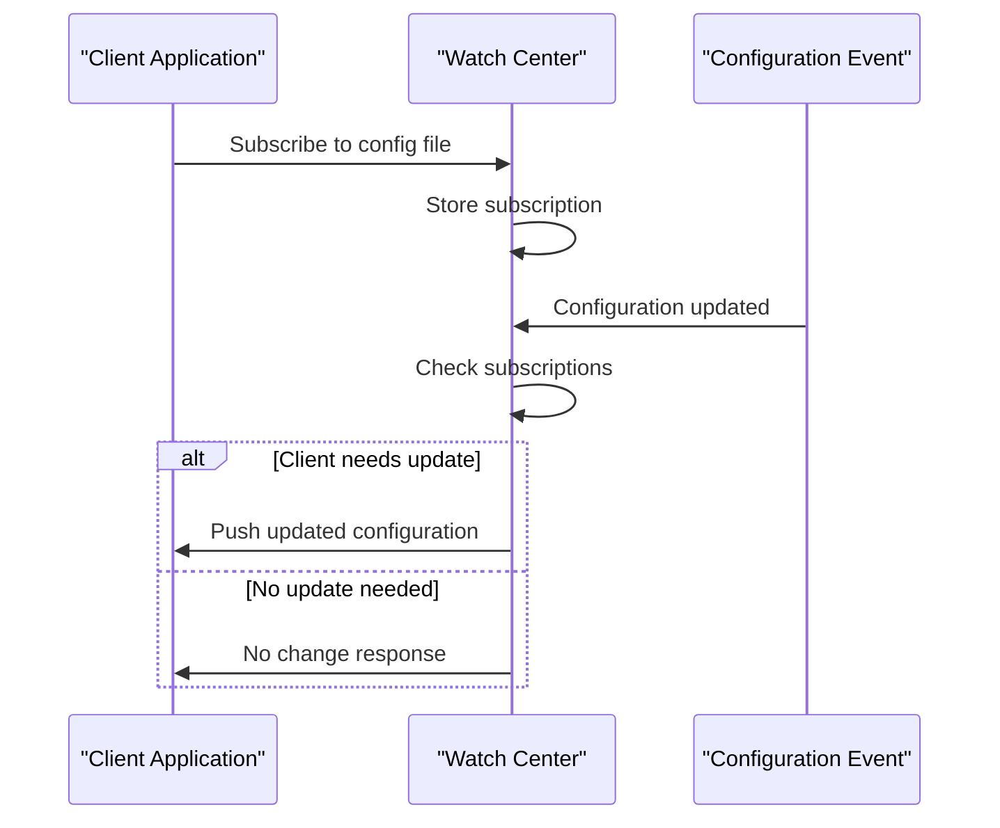
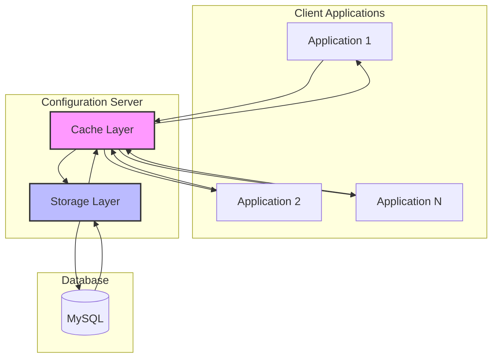

# Configuration Management

<cite>
**Referenced Files in This Document**   
- [config_file.go](file://pkg/config/config_file.go)
- [config_file_group.go](file://pkg/config/config_file_group.go)
- [config_file_template.go](file://pkg/config/config_file_template.go)
- [config_file_release.go](file://pkg/config/config_file_release.go)
- [watcher.go](file://pkg/config/watcher.go)
- [config_file.go](file://plugin/store/mysql/config_file.go)
- [config_file_group.go](file://plugin/store/mysql/config_file_group.go)
- [config_file_release.go](file://plugin/store/mysql/config_file_release.go)
- [config_file_template.go](file://plugin/store/mysql/config_file_template.go)
- [config_file.go](file://pkg/cache/config/config_file.go)
- [config_group.go](file://pkg/cache/config/config_group.go)
- [httpserver/config/file_access.go](file://plugin/apiserver/httpserver/config/file_access.go)
- [httpserver/config/group_access.go](file://plugin/apiserver/httpserver/config/group_access.go)
- [httpserver/config/tpl_access.go](file://plugin/apiserver/httpserver/config/tpl_access.go)
- [httpserver/config/release_access.go](file://plugin/apiserver/httpserver/config/release_access.go)
- [apolloserver/watch.go](file://plugin/apiserver/apolloserver/watch.go)
- [nacosserver/v1/config/watch.go](file://plugin/apiserver/nacosserver/v1/config/watch.go)
- [auth_checker.go](file://plugin/access_control/auth/policy/auth_checker.go)
- [config_response.go](file://pkg/common/api/v1/config_response.go)
</cite>

## Table of Contents
1. [Data Model](#data-model)
2. [CRUD Operations](#crud-operations)
3. [Watch/Long-Polling Mechanism](#watchlong-polling-mechanism)
4. [Configuration Chaining and Override Mechanisms](#configuration-chaining-and-override-mechanisms)
5. [Release Management](#release-management)
6. [Backend Storage and Caching](#backend-storage-and-caching)
7. [Configuration Retrieval via HTTP API and gRPC](#configuration-retrieval-via-http-api-and-grpc)
8. [Security Aspects](#security-aspects)
9. [Best Practices and Performance Considerations](#best-practices-and-performance-considerations)

## Data Model

The configuration management system is built around four core entities: configuration files, groups, templates, and releases. Each entity serves a distinct purpose in the overall configuration lifecycle.

### Configuration Files
Configuration files represent individual configuration units containing actual configuration content. Each file is uniquely identified by a combination of namespace, group, and name. The data structure includes metadata such as creation and modification timestamps, owner information, comments, and format type. Configuration files can be encrypted, with encryption metadata stored in the file's metadata field.

### Configuration Groups
Configuration groups serve as organizational containers for related configuration files. Groups are defined within a namespace and provide a way to logically group configuration files by application, service, or functional area. Each group contains metadata including business unit, department, owner, and custom metadata tags for additional categorization.

### Templates
Templates provide a mechanism for generating configuration files from predefined patterns. Templates contain reusable configuration content that can be instantiated with specific parameters to create actual configuration files. This enables consistent configuration patterns across multiple services or environments while allowing for necessary variations.

### Releases
Releases represent published versions of configuration files that are actively being used by services. Each release captures a specific version of a configuration file at a point in time, enabling version control, rollback capabilities, and audit trails. Releases can be normal (production) or gray (canary) deployments for gradual rollout.

**Section sources**
- [config_file.go](file://apis/pkg/types/config/config_file.go#L32-L97)
- [config_file_group.go](file://pkg/config/config_file_group.go#L73-L105)
- [config_file_template.go](file://pkg/config/config_file_template.go#L47-L74)

## CRUD Operations

The configuration management system provides comprehensive CRUD (Create, Read, Update, Delete) operations for all configuration entities through both HTTP and gRPC interfaces.

### Configuration File Operations
Configuration files can be created, retrieved, updated, and deleted through dedicated API endpoints. When creating a configuration file, the system automatically creates the corresponding configuration group if it does not already exist. File updates are transactional and include audit logging of all changes. The system supports batch operations for creating, updating, or deleting multiple files in a single request.

### Group Management
Configuration groups can be managed through CRUD operations that allow for the creation of new groups, retrieval of existing groups, updates to group metadata, and deletion of groups. Group operations include validation to prevent conflicts and ensure data integrity. The system supports querying groups with filtering and pagination capabilities.

### Template-Based Generation
Templates can be created, retrieved, updated, and deleted similar to configuration files. When creating a template, the system validates the content length against configurable limits. Templates can be used to generate configuration files programmatically, ensuring consistency across deployments while allowing for environment-specific overrides.

**Section sources**
- [config_file.go](file://pkg/config/config_file.go#L83-L97)
- [config_file_group.go](file://pkg/config/config_file_group.go#L73-L171)
- [config_file_template_test.go](file://pkg/config/config_file_template_test.go#L47-L144)
- [file_access.go](file://plugin/apiserver/httpserver/config/file_access.go#L186-L229)
- [group_access.go](file://plugin/apiserver/httpserver/config/group_access.go#L106-L159)

## Watch/Long-Polling Mechanism

The system implements a sophisticated watch/long-polling mechanism that enables clients to receive real-time notifications when configuration changes occur.

### Client Subscription Management
Clients can subscribe to specific configuration files by registering their interest through the watch mechanism. The system maintains a mapping of client subscriptions to configuration files, allowing efficient notification routing. Subscriptions include the client's current version of the configuration, enabling the system to determine when updates are needed.

### Notification Logic
When a configuration change occurs, the system evaluates whether subscribed clients need to be notified based on version comparison. If a client's current version is older than the latest release, the system triggers a notification. The notification includes the updated configuration content and metadata.

### Long-Polling Implementation
The system supports long-polling where clients maintain open connections that are held until either a configuration change occurs or a timeout is reached. This approach balances the need for timely updates with server resource efficiency. The implementation includes mechanisms to prevent connection exhaustion and ensure reliable delivery.

**Diagram sources**
- [watch.go](file://plugin/apiserver/apolloserver/watch.go#L107-L201)
- [watch.go](file://plugin/apiserver/nacosserver/v1/config/watch.go#L95-L144)

## Configuration Chaining and Override Mechanisms

The system supports configuration chaining and override mechanisms that enable hierarchical configuration management and environment-specific overrides.

### Configuration Chaining
Configuration chaining allows multiple configuration sources to be combined in a specific order, with later configurations overriding earlier ones. This enables base configurations to be defined at higher levels (such as namespace or group level) while allowing service-specific overrides at lower levels. The chaining mechanism ensures that configuration resolution is predictable and consistent.

### Override Mechanisms
The system provides several mechanisms for configuration overrides, including environment-specific configurations, service-specific configurations, and runtime overrides. Overrides follow a precedence hierarchy where more specific configurations take precedence over more general ones. This allows for flexible configuration management across different environments while maintaining consistency.

**Section sources**
- [config_file.go](file://pkg/config/config_file.go#L83-L97)
- [config_chain.go](file://pkg/config/config_chain.go)

## Release Management

The release management system provides versioning, rollback, and deployment capabilities for configuration changes.

### Versioning and Publishing
Each configuration change results in a new release version, with comprehensive version history maintained for audit and rollback purposes. The system supports both manual and automated publishing workflows. When a configuration is published, a new release record is created with metadata including the publisher, timestamp, and version number.

### Rollback Capabilities
The system provides robust rollback capabilities that allow administrators to revert to previous configuration versions. Rollback operations are validated to ensure they do not conflict with ongoing deployments or violate deployment policies. The system maintains a complete history of all releases, enabling point-in-time recovery.

### Gray Releases
The system supports gray (canary) releases for gradual deployment of configuration changes. Gray releases allow configurations to be tested with a subset of services before full rollout. The system provides mechanisms to monitor gray releases and either promote them to full release or roll them back based on predefined criteria.

**Section sources**
- [config_file_release.go](file://pkg/config/config_file_release.go)
- [releases.go](file://pkg/goverrule/releases.go#635-L714)
- [release_access.go](file://plugin/apiserver/httpserver/config/release_access.go#L36-L73)

## Backend Storage and Caching

The configuration management system uses a multi-layered storage architecture with MySQL for persistent storage and in-memory caching for performance optimization.

### MySQL Storage
All configuration data is stored in MySQL using a normalized schema with tables for configuration files, groups, templates, and releases. The storage layer provides transactional integrity, referential integrity, and comprehensive audit logging. The schema includes indexes optimized for common query patterns and supports efficient pagination and filtering.

### Caching Strategy
The system implements a sophisticated caching strategy using the pkg/cache/config package to minimize database load and improve response times. The cache layer maintains in-memory representations of frequently accessed configuration data, including active releases and configuration groups. Cache invalidation is handled automatically when configuration changes occur.

### Cache Implementation
The cache implementation uses segmented maps and synchronization primitives to ensure thread safety and optimal performance. For large configuration files, the system uses BoltDB for local file-based caching to reduce memory pressure. The cache layer provides metrics collection and reporting capabilities for monitoring cache performance and effectiveness.

**Diagram sources**
- [config_file.go](file://plugin/store/mysql/config_file.go)
- [config_file_group.go](file://plugin/store/mysql/config_file_group.go)
- [config_file.go](file://pkg/cache/config/config_file.go)
- [config_group.go](file://pkg/cache/config/config_group.go)

## Configuration Retrieval via HTTP API and gRPC

The system provides dual interfaces for configuration retrieval through both HTTP API and gRPC endpoints, catering to different client requirements and use cases.

### HTTP API
The HTTP API follows RESTful principles and provides endpoints for all configuration operations. The API uses standard HTTP methods (GET, POST, PUT, DELETE) and returns JSON responses. Authentication and authorization are handled through standard HTTP headers. The API includes comprehensive error handling with descriptive error messages and appropriate HTTP status codes.

### gRPC Interface
The gRPC interface provides a high-performance, strongly-typed API for configuration management. The interface uses Protocol Buffers for efficient serialization and supports bidirectional streaming for watch operations. The gRPC service includes built-in support for authentication, rate limiting, and monitoring.

### Client Operations
Both interfaces support the full range of configuration operations, including creating, reading, updating, and deleting configuration entities. The system provides client libraries for popular programming languages to simplify integration. The interfaces are designed to be idempotent where appropriate, ensuring reliable operation in distributed environments.

**Section sources**
- [file_access.go](file://plugin/apiserver/httpserver/config/file_access.go)
- [release_access.go](file://plugin/apiserver/httpserver/config/release_access.go)
- [client_access.go](file://plugin/apiserver/httpserver/config/client_access.go)
- [config_response.go](file://pkg/common/api/v1/config_response.go)

## Security Aspects

The configuration management system implements comprehensive security measures to protect sensitive configuration data and ensure proper access control.

### Sensitive Data Handling
The system provides built-in support for encrypting sensitive configuration data such as passwords, API keys, and certificates. Configuration files can be marked for encryption, and the system integrates with cryptographic providers to handle encryption and decryption transparently. Encryption metadata is stored securely with the configuration file.

### Access Control
The system implements a robust access control model that enforces permissions at multiple levels. Access policies can be defined at the namespace, group, and individual configuration file levels. The system supports role-based access control (RBAC) with predefined roles and the ability to create custom roles with specific permissions.

### Authentication and Authorization
All API requests are authenticated using standard authentication mechanisms. The system supports multiple authentication methods including API tokens and integration with external identity providers. Authorization decisions are made based on the authenticated user's roles and permissions, with detailed audit logging of all access attempts.

**Section sources**
- [auth_checker.go](file://plugin/access_control/auth/policy/auth_checker.go)
- [config_file.go](file://pkg/config/config_file.go#L83-L97)
- [const.go](file://apis/pkg/types/auth/const.go#L450-L505)

## Best Practices and Performance Considerations

The configuration management system includes several best practices and performance optimizations for large-scale deployments.

### Configuration Organization
For optimal organization, configurations should be grouped by application or service, with separate namespaces for different environments (development, staging, production). Configuration files should be kept focused and specific, avoiding overly large configuration files that are difficult to manage and version.

### Performance Optimization
The system is designed to handle large-scale deployments with thousands of configuration files and high request rates. The caching layer significantly reduces database load, while the watch mechanism minimizes polling overhead. For very large configurations, consider splitting them into multiple smaller files to improve performance and manageability.

### Scalability Considerations
The system can be scaled horizontally by adding additional configuration servers behind a load balancer. The shared MySQL database serves as the single source of truth, while each server maintains its own cache instance. This architecture allows for linear scalability while maintaining data consistency.

**Section sources**
- [config_file.go](file://pkg/config/config_file.go)
- [config_group.go](file://pkg/cache/config/config_group.go)
- [config_file.go](file://pkg/cache/config/config_file.go)