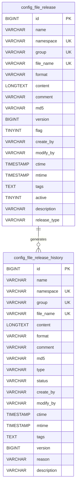
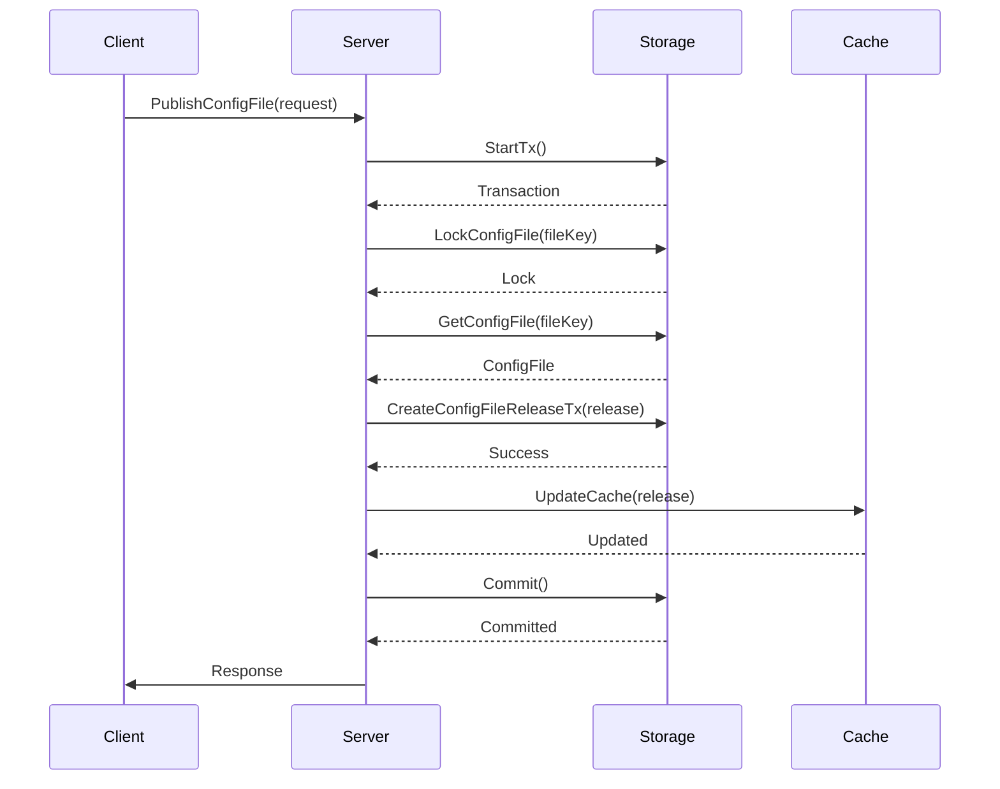
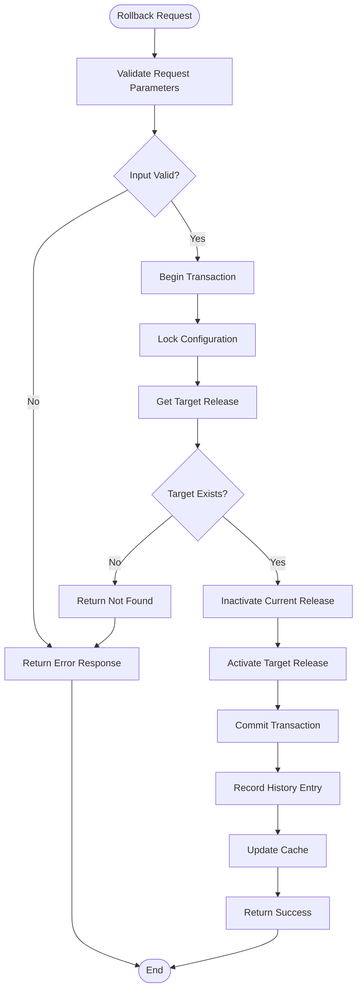
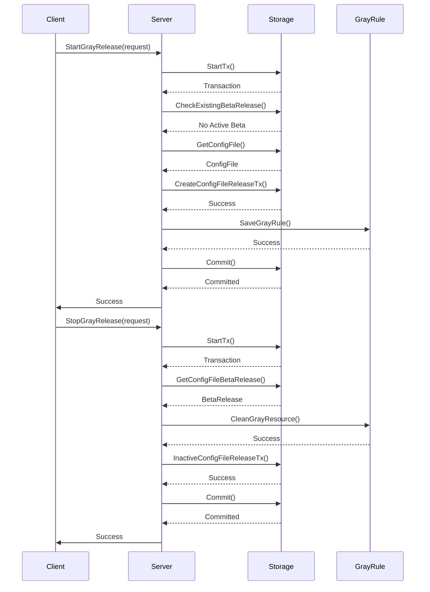

# Configuration Releases

<cite>
**Referenced Files in This Document**   
- [config_file_release.go](file://pkg/config/config_file_release.go)
- [config_file_release_history.go](file://pkg/config/config_file_release_history.go)
- [config_file_release.go](file://plugin/store/mysql/config_file_release.go)
- [config_file_release_history.go](file://plugin/store/mysql/config_file_release_history.go)
- [config_file_release.sql](file://plugin/store/mysql/scripts/pole_server.sql#L319-L344)
- [config_file_release_history.sql](file://plugin/store/mysql/scripts/pole_server.sql#L347-L371)
- [config_file_release.go](file://pkg/config/interceptor/auth/config_file_release.go)
- [config_file_release_history.go](file://pkg/config/interceptor/auth/config_file_release_history.go)
</cite>

## Table of Contents
1. [Introduction](#introduction)
2. [Release Model and Promotion Workflow](#release-model-and-promotion-workflow)
3. [Core Entities: config_file_release and config_file_release_history](#core-entities-config_file_release-and-config_file_release_history)
4. [Release Creation and Atomicity Guarantees](#release-creation-and-atomicity-guarantees)
5. [Rollback Mechanism and History Tracking](#rollback-mechanism-and-history-tracking)
6. [Audit Logging and Observability Integration](#audit-logging-and-observability-integration)
7. [Staged Release Workflows](#staged-release-workflows)
8. [API Examples for Release Management](#api-examples-for-release-management)
9. [Data Retention and Performance Considerations](#data-retention-and-performance-considerations)

## Introduction
This document details the configuration release and versioning system within the Polaris configuration management platform. The system enables safe, auditable, and traceable deployment of configuration changes through explicit release actions. Configuration changes are promoted across environments via a controlled release model that supports atomic operations, rollback capabilities, and comprehensive history tracking. The implementation ensures consistency and reliability through transactional integrity and provides integration with observability systems for monitoring and auditing.

## Release Model and Promotion Workflow
The configuration release model is designed to promote changes through environments via explicit release actions. Each configuration change must be published as a release to become active. The system supports two types of releases: normal (full) releases and gray (canary) releases. Normal releases apply configuration changes to all clients, while gray releases allow for staged deployment to a subset of clients based on specified labels. This model ensures that configuration changes are not automatically applied but require an explicit promotion action, providing a safety mechanism for deployment. The release process is designed to be idempotent and supports both synchronous and asynchronous operations through batch processing capabilities.

**Section sources**
- [config_file_release.go](file://pkg/config/config_file_release.go#L1-L788)
- [config_file_release.go](file://plugin/store/mysql/config_file_release.go#L1-L389)

## Core Entities: config_file_release and config_file_release_history
The system is built around two core entities: `config_file_release` and `config_file_release_history`. The `config_file_release` entity represents an active or historical configuration release, containing metadata such as namespace, group, file name, content, format, version, and release type. It includes fields for audit information (create_by, modify_by), timestamps, and status indicators. The `config_file_release_history` entity maintains a complete audit trail of all release operations, capturing the same configuration data along with additional metadata about the release operation itself, including type, status, reason, and detailed operation information. These entities are stored in separate database tables with appropriate indexing for performance.

**Diagram sources**
- [config_file_release.sql](file://plugin/store/mysql/scripts/pole_server.sql#L319-L344)
- [config_file_release_history.sql](file://plugin/store/mysql/scripts/pole_server.sql#L347-L371)

**Section sources**
- [config_file_release.go](file://pkg/config/config_file_release.go#L1-L788)
- [config_file_release_history.go](file://pkg/config/config_file_release_history.go#L1-L99)

## Release Creation and Atomicity Guarantees
The release creation process ensures atomicity and consistency through database transactions. When a configuration file is published, the operation begins with a transaction that first validates the existence of the target configuration file and checks for conflicts with existing releases. The system prevents multiple active releases for the same configuration by enforcing a single active release per namespace, group, and file name combination. During release creation, the system automatically generates a unique release name if not provided, calculates the MD5 hash of the content for integrity verification, and increments the version number. All operations are performed within a single transaction that is committed only if all validation checks pass, ensuring that the system remains in a consistent state even in the event of failures.

**Diagram sources**
- [config_file_release.go](file://pkg/config/config_file_release.go#L1-L788)
- [config_file_release.go](file://plugin/store/mysql/config_file_release.go#L1-L389)

**Section sources**
- [config_file_release.go](file://pkg/config/config_file_release.go#L1-L788)
- [config_file_release.go](file://plugin/store/mysql/config_file_release.go#L1-L389)

## Rollback Mechanism and History Tracking
The system provides robust rollback capabilities through the `RollbackConfigFileRelease` operation, which reactivates a previous configuration release. When a rollback is initiated, the system locates the target release by its identifier and performs an atomic transaction to deactivate the current active release and activate the target release. The operation is logged in the `config_file_release_history` table with the operation type set to "rollback". The history tracking system maintains a complete record of all release operations, including creation, deletion, rollback, and cancellation of gray releases. Each history record captures the full state of the configuration at the time of the operation, enabling full reconstruction of configuration states at any point in time.

**Diagram sources**
- [config_file_release.go](file://pkg/config/config_file_release.go#L1-L788)
- [config_file_release_history.go](file://pkg/config/config_file_release_history.go#L1-L99)

**Section sources**
- [config_file_release.go](file://pkg/config/config_file_release.go#L1-L788)
- [config_file_release_history.go](file://pkg/config/config_file_release_history.go#L1-L99)

## Audit Logging and Observability Integration
The system integrates comprehensive audit logging through the `config_file_release_history` entity, which captures all release operations with detailed metadata. Each operation is recorded with information about the operator, timestamp, operation type, and detailed request information. The audit logs are automatically generated by the `recordReleaseHistory` method, which is called after successful completion of release operations. The system also integrates with observability systems through event publishing and metrics collection. Audit logs can be queried using the `GetConfigFileReleaseHistories` API, which supports filtering by namespace, group, file name, and pagination. The logs include the full configuration content at the time of release, enabling forensic analysis and compliance auditing.

**Section sources**
- [config_file_release_history.go](file://pkg/config/config_file_release_history.go#L1-L99)
- [config_file_release.go](file://pkg/config/config_file_release.go#L1-L788)

## Staged Release Workflows
The system supports staged release workflows through gray (canary) releases, allowing for gradual rollout of configuration changes. Gray releases are created with a specific release type and include beta labels that define the target subset of clients. The system ensures that only one gray release can be active at a time for a given configuration, preventing conflicts. Gray releases can be stopped or canceled using the `StopGrayConfigFileRelease` operation, which deactivates the gray release and optionally rolls back to the previous configuration. The staged release workflow enables safe deployment practices by allowing teams to validate configuration changes with a subset of users before full rollout, reducing the risk of widespread issues.

**Diagram sources**
- [config_file_release.go](file://pkg/config/config_file_release.go#L1-L788)
- [config_file_release.go](file://plugin/store/mysql/config_file_release.go#L1-L389)

**Section sources**
- [config_file_release.go](file://pkg/config/config_file_release.go#L1-L788)
- [config_file_release.go](file://plugin/store/mysql/config_file_release.go#L1-L389)

## API Examples for Release Management
The system provides a comprehensive API for managing configuration releases. To query release history, clients can use the `GetConfigFileReleaseHistories` method with appropriate filters:

[SPEC SYMBOL](file://pkg/config/config_file_release_history.go#L50-L98)

To revert to a previous version, the `RollbackConfigFileRelease` API can be used:

[SPEC SYMBOL](file://pkg/config/config_file_release.go#L400-L480)

For creating a new release with upsert semantics, the `UpsertAndReleaseConfigFile` API combines configuration update and release operations:

[SPEC SYMBOL](file://pkg/config/config_file_release.go#L550-L788)

These APIs support batch operations through corresponding batch methods, enabling efficient management of multiple releases.

**Section sources**
- [config_file_release.go](file://pkg/config/config_file_release.go#L1-L788)
- [config_file_release_history.go](file://pkg/config/config_file_release_history.go#L1-L99)

## Data Retention and Performance Considerations
The system implements data retention policies to manage the growth of release history records. Historical releases are retained based on configurable time-based policies, with older records being automatically cleaned up. The `CleanDeletedConfigFileRelease` method removes soft-deleted releases that have been marked for deletion and are older than a specified threshold. For release history, the `CleanConfigFileReleaseHistory` method removes records older than a specified time. These cleanup operations are designed to be performed during low-traffic periods to minimize performance impact. The system uses database indexing on key fields such as namespace, group, file name, and modification time to ensure query performance even with extensive release histories. Caching mechanisms are employed to reduce database load for frequently accessed release information.

**Section sources**
- [config_file_release.go](file://plugin/store/mysql/config_file_release.go#L152-L184)
- [config_file_release_history.go](file://plugin/store/mysql/config_file_release_history.go#L72-L80)