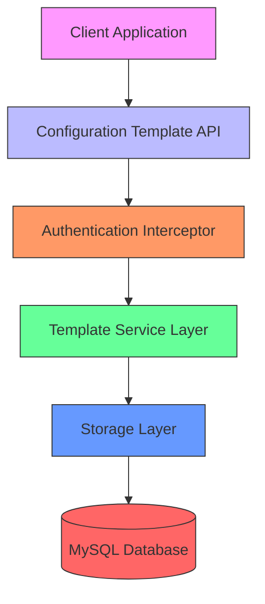
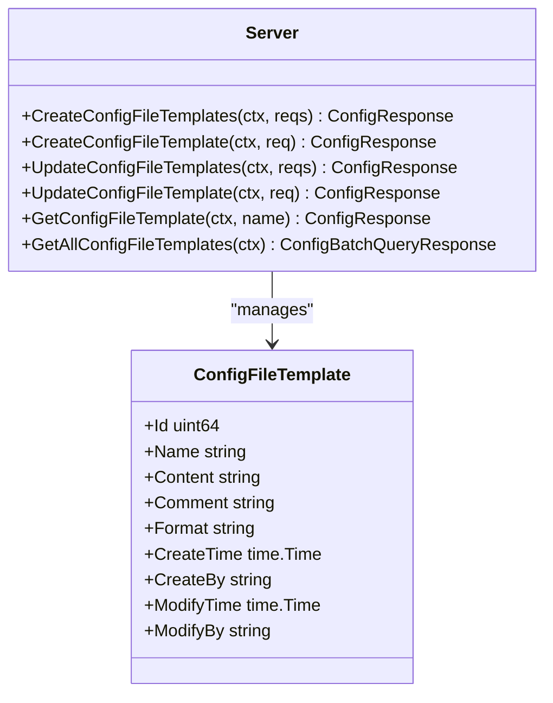
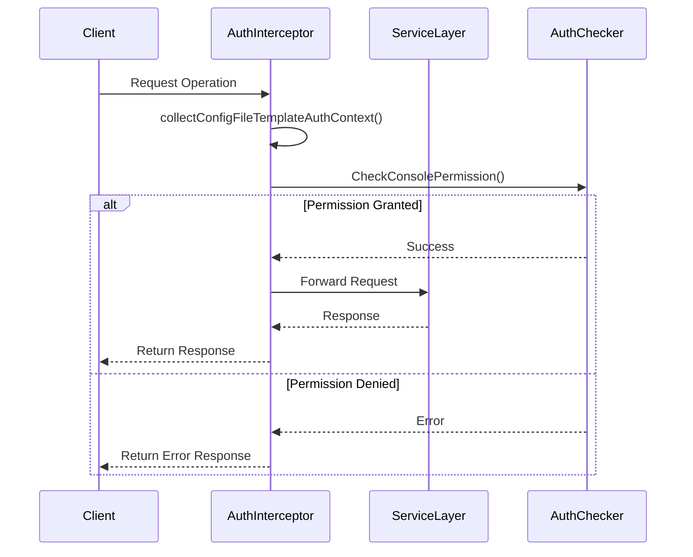
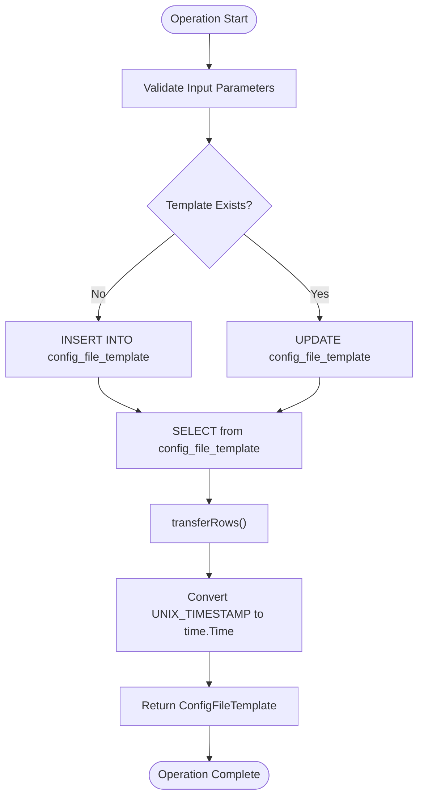
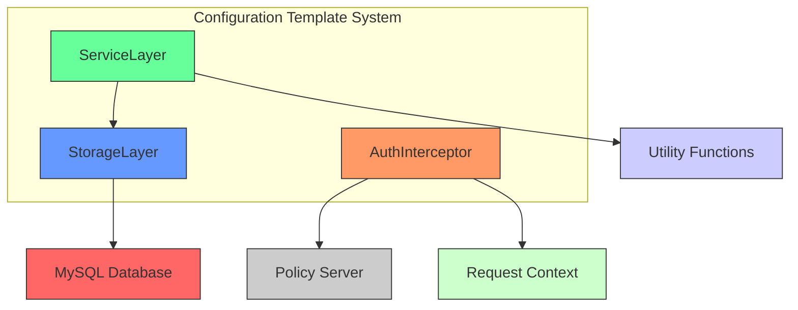

# Configuration Templates

<cite>
**Referenced Files in This Document**   
- [config_file_template.go](file://pkg/config/config_file_template.go)
- [config_file_template.go](file://pkg/config/interceptor/auth/config_file_template.go)
- [config_file_template.go](file://plugin/store/mysql/config_file_template.go)
- [config_file.go](file://apis/pkg/types/config/config_file.go)
- [config_file_template_check.go](file://pkg/config/interceptor/paramcheck/config_file_template_check.go)
- [pole_server.sql](file://plugin/store/mysql/scripts/pole_server.sql)
</cite>

## Table of Contents
1. [Introduction](#introduction)
2. [Core Components](#core-components)
3. [Architecture Overview](#architecture-overview)
4. [Detailed Component Analysis](#detailed-component-analysis)
5. [Dependency Analysis](#dependency-analysis)
6. [Performance Considerations](#performance-considerations)
7. [Troubleshooting Guide](#troubleshooting-guide)
8. [Conclusion](#conclusion)

## Introduction
Configuration templates in the Polaris system serve as reusable, parameterized blueprints for generating consistent configuration files across services. They enable standardized configuration patterns while allowing for service-specific customization through interpolation and instantiation. This documentation details the implementation, management, and security aspects of configuration templates within the system.

## Core Components

The configuration template system consists of three main components: the service layer that handles API operations, the authentication interceptor that enforces access control, and the storage layer that persists template data. These components work together to provide a secure and efficient template management system.

**Section sources**
- [config_file_template.go](file://pkg/config/config_file_template.go#L1-L147)
- [config_file_template.go](file://pkg/config/interceptor/auth/config_file_template.go#L1-L82)
- [config_file_template.go](file://plugin/store/mysql/config_file_template.go#L1-L124)

## Architecture Overview

The configuration template architecture follows a layered approach with clear separation of concerns. The service layer handles business logic and API operations, the interceptor layer manages authentication and authorization, and the storage layer handles persistence. This design enables extensibility and maintainability while ensuring security and data integrity.

**Diagram sources**
- [config_file_template.go](file://pkg/config/config_file_template.go#L1-L147)
- [config_file_template.go](file://pkg/config/interceptor/auth/config_file_template.go#L1-L82)
- [config_file_template.go](file://plugin/store/mysql/config_file_template.go#L1-L124)

## Detailed Component Analysis

### Template Service Layer Analysis
The template service layer implements CRUD operations for configuration templates, providing methods to create, read, update, and delete templates. It serves as the primary interface between the API and the underlying storage system.

**Diagram sources**
- [config_file_template.go](file://pkg/config/config_file_template.go#L34-L71)
- [config_file.go](file://apis/pkg/types/config/config_file.go#L274-L322)

### Authentication Interceptor Analysis
The authentication interceptor enforces access control policies for configuration template operations. It validates user permissions before allowing any template modifications or retrievals, ensuring that only authorized users can perform specific actions.

**Diagram sources**
- [config_file_template.go](file://pkg/config/interceptor/auth/config_file_template.go#L29-L81)
- [server.go](file://pkg/config/interceptor/auth/server.go#L128-L161)

### Storage Layer Analysis
The storage layer implements the persistence mechanism for configuration templates using MySQL as the backend database. It provides methods to save, retrieve, and query templates, handling the translation between Go objects and database records.

**Diagram sources**
- [config_file_template.go](file://plugin/store/mysql/config_file_template.go#L27-L123)
- [pole_server.sql](file://plugin/store/mysql/scripts/pole_server.sql#L373-L387)

## Dependency Analysis

The configuration template system has well-defined dependencies between components, with clear separation of concerns and minimal coupling. The service layer depends on the storage layer for persistence, while the authentication interceptor depends on the policy server for permission checking.

**Diagram sources**
- [config_file_template.go](file://pkg/config/config_file_template.go#L1-L147)
- [config_file_template.go](file://pkg/config/interceptor/auth/config_file_template.go#L1-L82)
- [config_file_template.go](file://plugin/store/mysql/config_file_template.go#L1-L124)

## Performance Considerations
The configuration template system is designed with performance in mind. The storage layer uses efficient SQL queries with appropriate indexing, and the service layer implements batch operations to reduce database round trips. The system also includes validation checks to prevent excessively large template content, ensuring consistent performance across operations.

**Section sources**
- [config_file_template_check.go](file://pkg/config/interceptor/paramcheck/config_file_template_check.go#L37-L79)
- [config_file_template.go](file://plugin/store/mysql/config_file_template.go#L27-L66)

## Troubleshooting Guide
Common issues with configuration templates typically involve permission errors, validation failures, or database connectivity problems. The system provides detailed error codes and messages to help diagnose issues. For example, attempting to create a template with existing name returns Code_ExistedResource, while invalid content length triggers Code_InvalidConfigFileContentLength.

**Section sources**
- [config_file_template.go](file://pkg/config/config_file_template.go#L34-L71)
- [config_file_template_check.go](file://pkg/config/interceptor/paramcheck/config_file_template_check.go#L37-L79)

## Conclusion
The configuration template system provides a robust foundation for managing reusable configuration blueprints in the Polaris platform. By combining secure access control, efficient storage, and comprehensive API operations, it enables organizations to maintain consistent configuration standards across their services while allowing for necessary customization. The system's modular architecture ensures maintainability and extensibility for future enhancements.