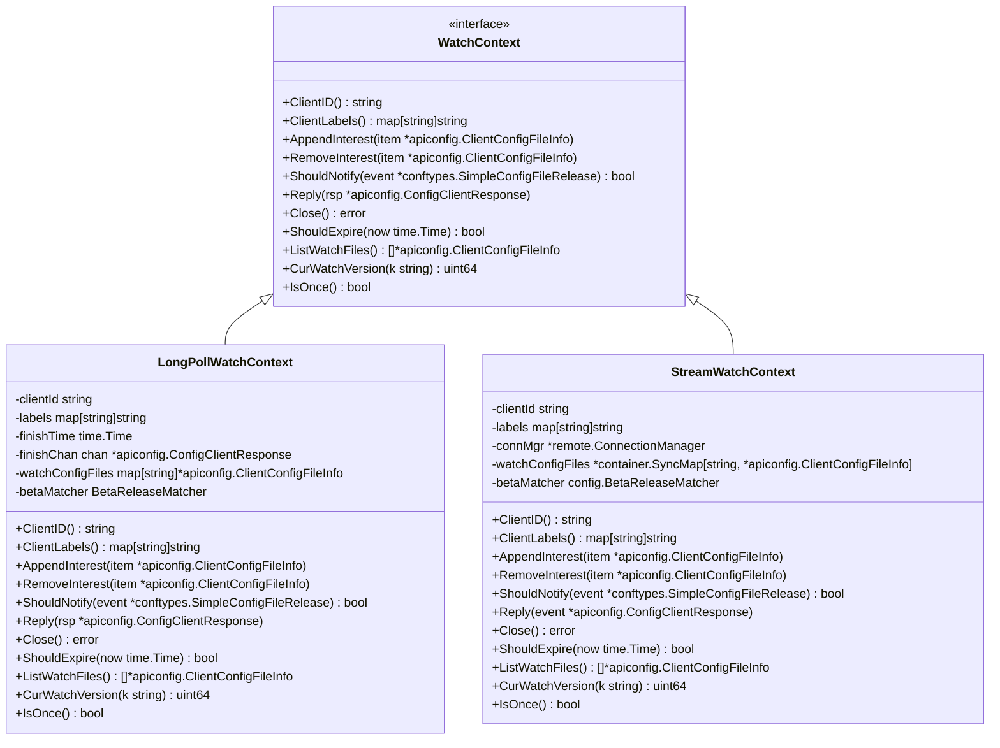
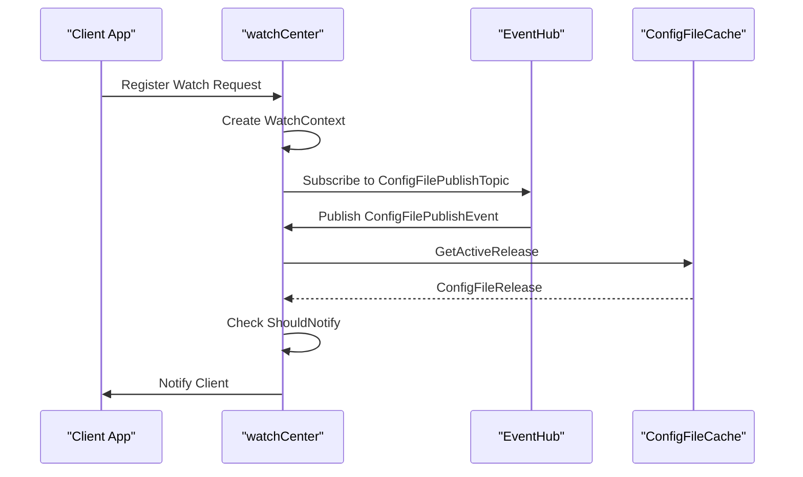
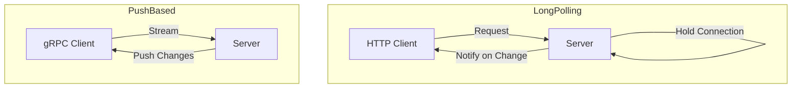
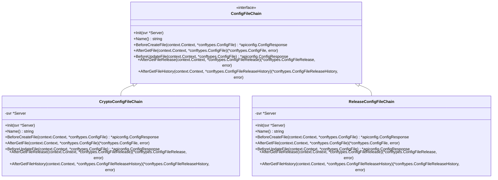
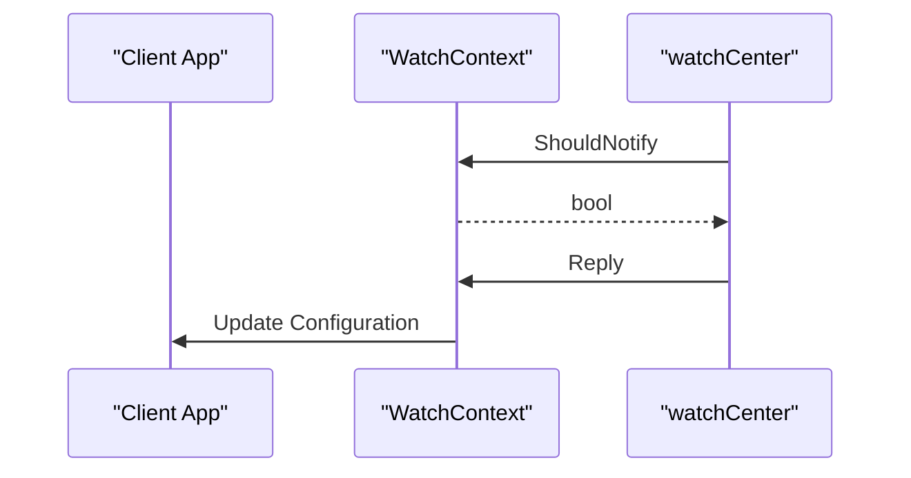
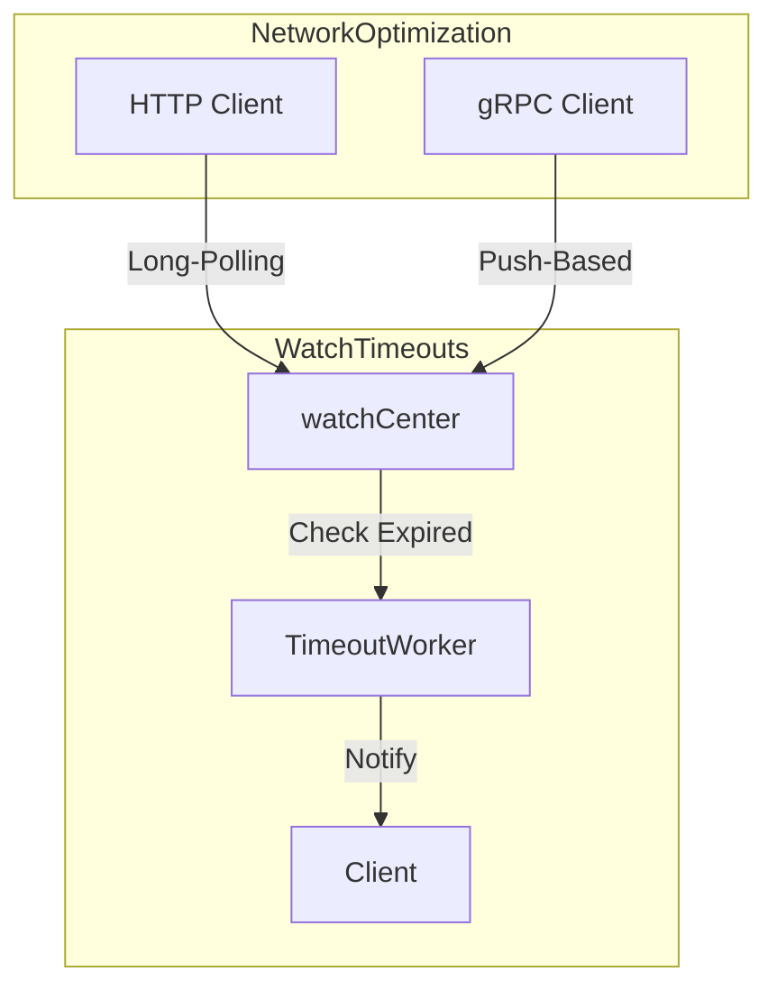

# Watch & Dynamic Updates

<cite>
**Referenced Files in This Document**   
- [pkg/config/watcher.go](file://pkg/config/watcher.go)
- [plugin/apiserver/nacosserver/v2/config/watch.go](file://plugin/apiserver/nacosserver/v2/config/watch.go)
- [plugin/apiserver/nacosserver/v2/config/config_file.go](file://plugin/apiserver/nacosserver/v2/config/config_file.go)
- [pkg/config/config_chain.go](file://pkg/config/config_chain.go)
- [pkg/config/server.go](file://pkg/config/server.go)
</cite>

## Table of Contents
1. [Introduction](#introduction)
2. [Watcher Lifecycle and Client Registration](#watcher-lifecycle-and-client-registration)
3. [Event Notification Flow](#event-notification-flow)
4. [Long-Polling vs Push-Based Update Detection](#long-polling-vs-push-based-update-detection)
5. [Configuration Chaining and Override Logic](#configuration-chaining-and-override-logic)
6. [Client-Side Handling of Watch Events](#client-side-handling-of-watch-events)
7. [Scalability Challenges and Mitigation](#scalability-challenges-and-mitigation)
8. [Watch Timeouts and Network Optimization](#watch-timeouts-and-network-optimization)
9. [Conclusion](#conclusion)

## Introduction
The configuration watch mechanism in the Polaris server enables dynamic configuration reloading through both long-polling and push-based update detection. This document provides a comprehensive overview of the watcher lifecycle, client registration, event notification flow, and integration with Nacos-compatible APIs. It also details configuration chaining, override logic, client-side handling of watch events, scalability challenges, and optimization strategies.

## Watcher Lifecycle and Client Registration

The watcher lifecycle is managed by the `watchCenter` struct, which handles client subscriptions and notifies them of configuration changes. Clients register themselves by sending a watch request, which includes the configuration files they are interested in. The `watchCenter` creates a `WatchContext` for each client, which encapsulates the client's subscription details and provides methods for managing the subscription.



**Diagram sources**
- [pkg/config/watcher.go](file://pkg/config/watcher.go#L100-L200)
- [plugin/apiserver/nacosserver/v2/config/watch.go](file://plugin/apiserver/nacosserver/v2/config/watch.go#L50-L150)

**Section sources**
- [pkg/config/watcher.go](file://pkg/config/watcher.go#L100-L200)
- [plugin/apiserver/nacosserver/v2/config/watch.go](file://plugin/apiserver/nacosserver/v2/config/watch.go#L50-L150)

## Event Notification Flow

The event notification flow is triggered when a configuration file is updated. The `watchCenter` listens for `ConfigFilePublishTopic` events and notifies all clients that are subscribed to the updated file. The notification process involves checking if the client should be notified based on the client's labels and the release type of the configuration file.



**Diagram sources**
- [pkg/config/watcher.go](file://pkg/config/watcher.go#L250-L350)
- [plugin/apiserver/nacosserver/v2/config/watch.go](file://plugin/apiserver/nacosserver/v2/config/watch.go#L150-L200)

**Section sources**
- [pkg/config/watcher.go](file://pkg/config/watcher.go#L250-L350)
- [plugin/apiserver/nacosserver/v2/config/watch.go](file://plugin/apiserver/nacosserver/v2/config/watch.go#L150-L200)

## Long-Polling vs Push-Based Update Detection

The configuration watch mechanism supports both long-polling and push-based update detection. Long-polling is used for HTTP clients, where the client sends a request and the server holds the connection open until a configuration change is detected or a timeout occurs. Push-based update detection is used for gRPC clients, where the server pushes configuration changes to the client as they occur.



**Diagram sources**
- [pkg/config/watcher.go](file://pkg/config/watcher.go#L100-L200)
- [plugin/apiserver/nacosserver/v2/config/watch.go](file://plugin/apiserver/nacosserver/v2/config/watch.go#L50-L150)

**Section sources**
- [pkg/config/watcher.go](file://pkg/config/watcher.go#L100-L200)
- [plugin/apiserver/nacosserver/v2/config/watch.go](file://plugin/apiserver/nacosserver/v2/config/watch.go#L50-L150)

## Configuration Chaining and Override Logic

Configuration chaining allows multiple configuration sources to be combined, with later sources overriding earlier ones. The `ConfigChains` struct manages the order of configuration chains and applies them in sequence. Each chain can modify the configuration before it is returned to the client.



**Diagram sources**
- [pkg/config/config_chain.go](file://pkg/config/config_chain.go#L50-L150)
- [pkg/config/server.go](file://pkg/config/server.go#L240-L326)

**Section sources**
- [pkg/config/config_chain.go](file://pkg/config/config_chain.go#L50-L150)
- [pkg/config/server.go](file://pkg/config/server.go#L240-L326)

## Client-Side Handling of Watch Events

Clients handle watch events by implementing the `WatchContext` interface. The `Reply` method is called when a configuration change is detected, and the client can then update its configuration. The `ShouldNotify` method is used to determine if the client should be notified of a configuration change.



**Diagram sources**
- [pkg/config/watcher.go](file://pkg/config/watcher.go#L100-L200)
- [plugin/apiserver/nacosserver/v2/config/watch.go](file://plugin/apiserver/nacosserver/v2/config/watch.go#L50-L150)

**Section sources**
- [pkg/config/watcher.go](file://pkg/config/watcher.go#L100-L200)
- [plugin/apiserver/nacosserver/v2/config/watch.go](file://plugin/apiserver/nacosserver/v2/config/watch.go#L50-L150)

## Scalability Challenges and Mitigation

Scalability challenges arise when thousands of watchers are active. The `watchCenter` uses caching and batching to mitigate these challenges. The `fileCache` is used to store active configuration releases, and the `watchers` map is used to store the list of clients watching each configuration file.

```mermaid
graph TD
subgraph Scalability
WatchCenter[watchCenter] --> |Caching| FileCache[ConfigFileCache]
WatchCenter --> |Batching| Watchers[SyncMap[string, SyncSet[string]]]
end
```

**Diagram sources**
- [pkg/config/watcher.go](file://pkg/config/watcher.go#L250-L350)
- [plugin/apiserver/nacosserver/v2/config/watch.go](file://plugin/apiserver/nacosserver/v2/config/watch.go#L150-L200)

**Section sources**
- [pkg/config/watcher.go](file://pkg/config/watcher.go#L250-L350)
- [plugin/apiserver/nacosserver/v2/config/watch.go](file://plugin/apiserver/nacosserver/v2/config/watch.go#L150-L200)

## Watch Timeouts and Network Optimization

Watch timeouts are managed by the `startHandleTimeoutRequestWorker` method in the `watchCenter`. This method periodically checks for expired watch contexts and notifies the client with a "not modified" response. Network usage is optimized by using long-polling for HTTP clients and push-based updates for gRPC clients.



**Diagram sources**
- [pkg/config/watcher.go](file://pkg/config/watcher.go#L350-L412)
- [plugin/apiserver/nacosserver/v2/config/watch.go](file://plugin/apiserver/nacosserver/v2/config/watch.go#L150-L200)

**Section sources**
- [pkg/config/watcher.go](file://pkg/config/watcher.go#L350-L412)
- [plugin/apiserver/nacosserver/v2/config/watch.go](file://plugin/apiserver/nacosserver/v2/config/watch.go#L150-L200)

## Conclusion
The configuration watch mechanism in the Polaris server provides a robust and scalable solution for dynamic configuration reloading. By supporting both long-polling and push-based update detection, it caters to a wide range of client types. The use of configuration chaining and override logic allows for flexible configuration management, while caching and batching mitigate scalability challenges. Proper handling of watch events and optimization of network usage ensure efficient and reliable configuration updates.