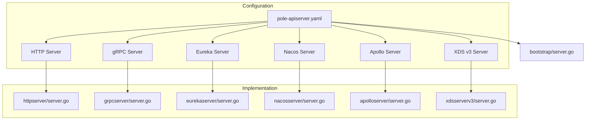
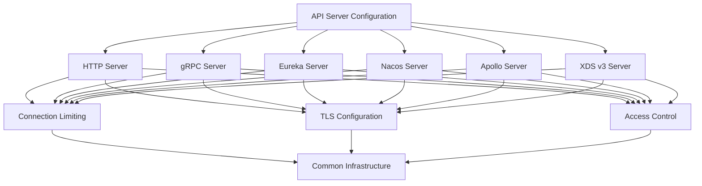
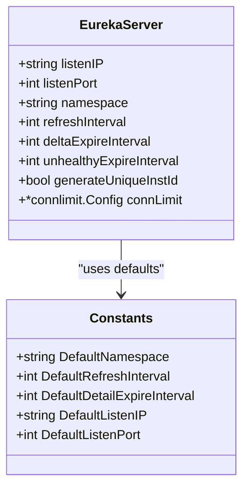
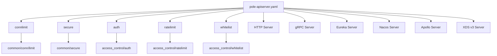

# API Server Configuration

<cite>
**Referenced Files in This Document**   
- [pole-apiserver.yaml](file://deploy/conf/pole-apiserver.yaml)
- [config.go](file://plugin/apiserver/eurekaserver/config.go)
- [server.go](file://plugin/apiserver/httpserver/server.go)
- [server.go](file://plugin/apiserver/grpcserver/server.go)
- [server.go](file://plugin/apiserver/nacosserver/server.go)
- [server.go](file://plugin/apiserver/apolloserver/server.go)
- [server.go](file://plugin/apiserver/xdsserverv3/server.go)
</cite>

## Table of Contents
1. [Introduction](#introduction)
2. [Project Structure](#project-structure)
3. [Core Components](#core-components)
4. [Architecture Overview](#architecture-overview)
5. [Detailed Component Analysis](#detailed-component-analysis)
6. [Dependency Analysis](#dependency-analysis)
7. [Performance Considerations](#performance-considerations)
8. [Troubleshooting Guide](#troubleshooting-guide)
9. [Conclusion](#conclusion)

## Introduction
This document provides comprehensive configuration guidance for the `pole-apiserver.yaml` file, which defines the API server configurations for the pole-io/pole-server system. It covers all supported API protocols including HTTP, gRPC, Eureka, Nacos, Apollo, and XDS v3. The documentation details endpoint configurations, request handling limits, keep-alive settings, and protocol-specific options. It explains how to configure multiple API servers simultaneously with proper port allocation, secure API endpoints, and tune performance for high-throughput scenarios. The document also addresses integration with the main server configuration, inheritance of global settings, and provides troubleshooting guidance for common issues.

## Project Structure
The API server configuration is defined in the `pole-apiserver.yaml` file located in the `deploy/conf/` directory. This configuration file is part of a larger system that includes various plugins for different API protocols, each with its own implementation and configuration requirements. The system supports multiple API protocols through dedicated server implementations in the `plugin/apiserver/` directory.



**Diagram sources**
- [pole-apiserver.yaml](file://deploy/conf/pole-apiserver.yaml)
- [server.go](file://plugin/apiserver/httpserver/server.go)
- [server.go](file://plugin/apiserver/grpcserver/server.go)
- [server.go](file://plugin/apiserver/eurekaserver/server.go)
- [server.go](file://plugin/apiserver/nacosserver/server.go)
- [server.go](file://plugin/apiserver/apolloserver/server.go)
- [server.go](file://plugin/apiserver/xdsserverv3/server.go)

**Section sources**
- [pole-apiserver.yaml](file://deploy/conf/pole-apiserver.yaml)

## Core Components
The core components of the API server configuration system include the configuration file parser, protocol-specific server implementations, connection limiters, and TLS configuration handlers. Each API server type is defined as a plugin with its own configuration options and operational parameters. The system supports concurrent operation of multiple API servers on different ports, with shared access control and rate limiting mechanisms.

**Section sources**
- [pole-apiserver.yaml](file://deploy/conf/pole-apiserver.yaml)
- [server.go](file://plugin/apiserver/httpserver/server.go)
- [server.go](file://plugin/apiserver/grpcserver/server.go)

## Architecture Overview
The API server architecture is designed to support multiple protocols simultaneously through a plugin-based system. Each protocol implementation operates as an independent server instance with its own configuration, while sharing common infrastructure for connection management, security, and monitoring. The configuration file defines a list of API servers, each with a name, protocol type, and specific configuration options.



**Diagram sources**
- [pole-apiserver.yaml](file://deploy/conf/pole-apiserver.yaml)
- [server.go](file://plugin/apiserver/httpserver/server.go)
- [server.go](file://plugin/apiserver/grpcserver/server.go)

## Detailed Component Analysis

### HTTP Server Configuration
The HTTP server configuration provides RESTful API endpoints for various services including administration, console, and client interfaces. It supports connection limiting, TLS encryption, and response caching to improve performance.

```mermaid
classDiagram
class HTTPServer {
+string listenIP
+uint32 listenPort
+*connlimit.Config connLimitConfig
+*secure.TLSInfo tlsInfo
+map[string]interface{} option
+map[string]apiserver.APIConfig openAPI
+*atomic.Bool enablePprof
+bool enableSwagger
+*http.Server server
+Initialize(ctx context.Context, option map[string]interface{}, apiConf map[string]apiserver.APIConfig) error
+Run(errCh chan error)
+Stop()
+Restart(option map[string]interface{}, apiConf map[string]apiserver.APIConfig, errCh chan error) error
+createRestfulContainer() (*restful.Container, error)
}
HTTPServer --> connlimit.Config : "uses"
HTTPServer --> secure.TLSInfo : "uses"
HTTPServer --> restful.Container : "creates"
```

**Diagram sources**
- [server.go](file://plugin/apiserver/httpserver/server.go)

**Section sources**
- [pole-apiserver.yaml](file://deploy/conf/pole-apiserver.yaml#L40-L67)
- [server.go](file://plugin/apiserver/httpserver/server.go#L0-L674)

### gRPC Server Configuration
The gRPC server configuration enables high-performance RPC communication for service discovery and configuration management. It supports connection limiting and protobuf response caching to optimize throughput.

**Section sources**
- [pole-apiserver.yaml](file://deploy/conf/pole-apiserver.yaml#L68-L94)

### Eureka Server Configuration
The Eureka server configuration provides compatibility with Netflix Eureka clients, enabling service registration and discovery using the Eureka protocol. It includes settings for data refresh intervals and instance expiration.



**Diagram sources**
- [config.go](file://plugin/apiserver/eurekaserver/config.go)

**Section sources**
- [pole-apiserver.yaml](file://deploy/conf/pole-apiserver.yaml#L1-L23)
- [config.go](file://plugin/apiserver/eurekaserver/config.go#L0-L50)

### Nacos Server Configuration
The Nacos server configuration enables compatibility with Alibaba Nacos clients, allowing service discovery and configuration management using the Nacos protocol.

**Section sources**
- [pole-apiserver.yaml](file://deploy/conf/pole-apiserver.yaml#L114-L121)

### Apollo Server Configuration
The Apollo server configuration provides compatibility with Ctrip Apollo clients, enabling configuration management and service discovery using the Apollo protocol.

**Section sources**
- [pole-apiserver.yaml](file://deploy/conf/pole-apiserver.yaml#L122-L127)

### XDS v3 Server Configuration
The XDS v3 server configuration implements the xDS v3 API for service mesh control plane functionality, enabling integration with Envoy proxies and other xDS-compatible clients.

**Section sources**
- [pole-apiserver.yaml](file://deploy/conf/pole-apiserver.yaml#L109-L113)

## Dependency Analysis
The API server configuration system has dependencies on various components including connection limiting, TLS security, and access control modules. These dependencies are shared across all protocol implementations, ensuring consistent behavior and security policies.



**Diagram sources**
- [pole-apiserver.yaml](file://deploy/conf/pole-apiserver.yaml)
- [server.go](file://plugin/apiserver/httpserver/server.go)

**Section sources**
- [pole-apiserver.yaml](file://deploy/conf/pole-apiserver.yaml)
- [server.go](file://plugin/apiserver/httpserver/server.go)

## Performance Considerations
The API server configuration includes several performance optimization options. For high-throughput scenarios, consider enabling response caching and adjusting connection limits appropriately. The HTTP server supports protobuf response caching which can significantly improve service discovery QPS. Connection limits should be tuned based on expected client load and server resources.

For optimal performance:
- Enable `enableCacheProto` for gRPC servers handling service discovery
- Set appropriate `sizeCacheProto` values based on memory availability
- Configure connection limits to prevent resource exhaustion
- Use TLS offloading for encrypted connections under high load

**Section sources**
- [pole-apiserver.yaml](file://deploy/conf/pole-apiserver.yaml)
- [server.go](file://plugin/apiserver/httpserver/server.go)

## Troubleshooting Guide
Common issues with API server configuration include binding failures and protocol negotiation problems. For binding failures, verify that ports are not already in use and that the listen IP is correctly configured. For protocol negotiation issues, ensure that client and server protocol versions are compatible.

Common troubleshooting steps:
1. Check port availability and binding permissions
2. Verify TLS certificate paths and permissions
3. Validate connection limit configurations
4. Check protocol-specific configuration options
5. Review server logs for initialization errors

**Section sources**
- [pole-apiserver.yaml](file://deploy/conf/pole-apiserver.yaml)
- [server.go](file://plugin/apiserver/httpserver/server.go)

## Conclusion
The `pole-apiserver.yaml` configuration file provides a flexible and comprehensive way to configure multiple API servers for the pole-io/pole-server system. By understanding the various configuration options and their implications, administrators can optimize the system for their specific use cases, ensuring high performance, security, and reliability across all supported protocols.