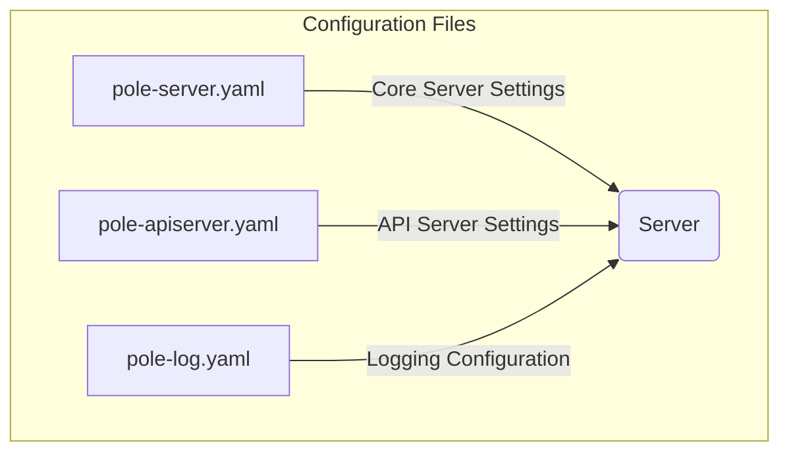
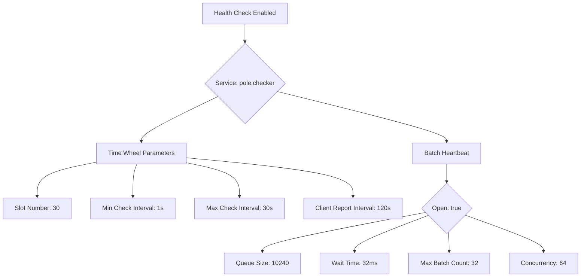
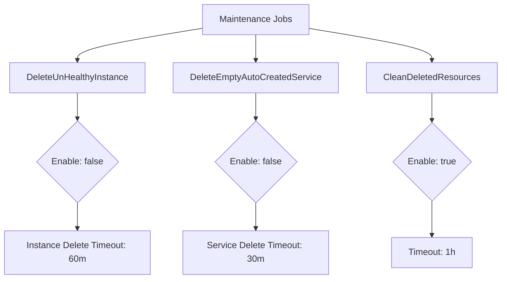
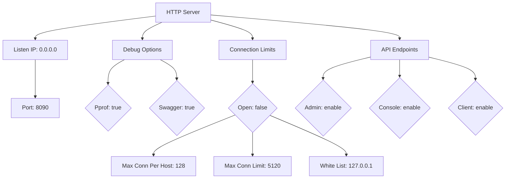
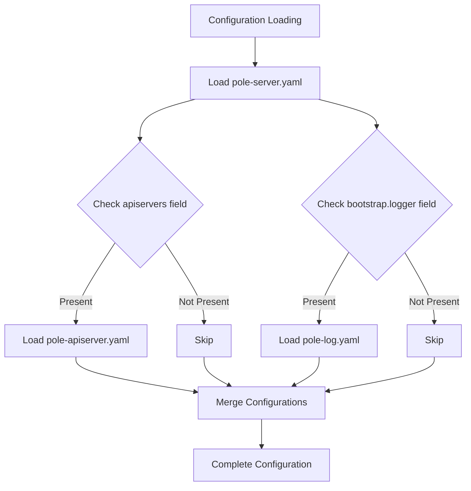
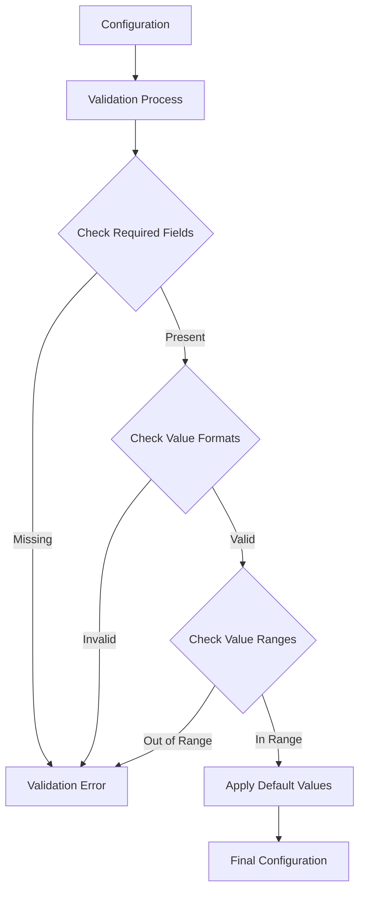

# Configuration Reference

<cite>
**Referenced Files in This Document**   
- [pole-server.yaml](file://deploy/conf/pole-server.yaml)
- [pole-apiserver.yaml](file://deploy/conf/pole-apiserver.yaml)
- [pole-log.yaml](file://deploy/conf/pole-log.yaml)
- [config.go](file://pkg/common/conn/limit/config.go)
- [config_file.go](file://pkg/cache/config/config_file.go)
- [config_group.go](file://pkg/cache/config/config_group.go)
- [server.go](file://plugin/apiserver/eurekaserver/server.go)
- [config.go](file://pkg/common/log/config.go)
</cite>

## Table of Contents
1. [Introduction](#introduction)
2. [Core Configuration Files](#core-configuration-files)
3. [pole-server.yaml Configuration](#pole-serveryaml-configuration)
4. [pole-apiserver.yaml Configuration](#pole-apiserveryaml-configuration)
5. [pole-log.yaml Configuration](#pole-logyaml-configuration)
6. [Hierarchical Configuration Loading](#hierarchical-configuration-loading)
7. [Environment Variable Overrides](#environment-variable-overrides)
8. [Configuration Validation and Defaults](#configuration-validation-and-defaults)
9. [Configuration Reload Behavior](#configuration-reload-behavior)
10. [Production and Development Examples](#production-and-development-examples)
11. [Troubleshooting Configuration Issues](#troubleshooting-configuration-issues)
12. [Advanced Configuration Settings](#advanced-configuration-settings)

## Introduction
This document provides comprehensive reference documentation for the configuration system of pole-server. It details all configuration options across the three primary configuration files: pole-server.yaml, pole-apiserver.yaml, and pole-log.yaml. The documentation covers server settings, logging, cache, database, and plugin configurations, along with advanced settings such as thread pool sizes, connection limits, and timeout values. This guide also explains hierarchical configuration loading, environment variable overrides, configuration validation, default values, and reload behavior, providing examples of production and development configurations and troubleshooting guidance for misconfiguration issues.

## Core Configuration Files
The pole-server configuration system consists of three primary YAML configuration files that control different aspects of the server's behavior. These files are typically located in the `deploy/conf/` directory and are loaded at startup to configure the server's operation.

**Diagram sources**
- [pole-server.yaml](file://deploy/conf/pole-server.yaml)
- [pole-apiserver.yaml](file://deploy/conf/pole-apiserver.yaml)
- [pole-log.yaml](file://deploy/conf/pole-log.yaml)

## pole-server.yaml Configuration
The pole-server.yaml file contains the core configuration for the pole-server instance, including bootstrap settings, authentication, namespace management, health checking, configuration center settings, cache configuration, maintenance jobs, storage configuration, and plugin settings.

### Bootstrap Configuration
The bootstrap section contains initialization settings for the server startup process.

**Section sources**
- [pole-server.yaml](file://deploy/conf/pole-server.yaml#L1-L20)

### Authentication Configuration
The auth section configures authentication settings for both console and client access, including user management and strategy configuration.

**Section sources**
- [pole-server.yaml](file://deploy/conf/pole-server.yaml#L45-L60)

### Namespace and Naming Configuration
These sections control namespace creation and service naming behavior, allowing automatic creation of namespaces and services.

**Section sources**
- [pole-server.yaml](file://deploy/conf/pole-server.yaml#L62-L67)

### Health Check Configuration
The healthcheck section configures the health checking system, including whether it's enabled, the service used for health checking, time wheel parameters, and batch processing settings.

**Diagram sources**
- [pole-server.yaml](file://deploy/conf/pole-server.yaml#L69-L91)

### Configuration Center Configuration
The config section controls the configuration center module, including whether it's enabled and content length limits (though this setting is deprecated).

**Section sources**
- [pole-server.yaml](file://deploy/conf/pole-server.yaml#L93-L97)

### Cache Configuration
The cache section configures caching behavior, specifically the time range for incremental synchronization data.

**Section sources**
- [pole-server.yaml](file://deploy/conf/pole-server.yaml#L99-L102)

### Maintenance Jobs Configuration
The maintain section defines periodic maintenance jobs that clean up various types of resources, including unhealthy instances, empty services, and deleted resources.

**Diagram sources**
- [pole-server.yaml](file://deploy/conf/pole-server.yaml#L104-L124)

### Storage Configuration
The store section configures the database storage backend, specifying the plugin name, database type, connection string, and connection pool settings.

**Section sources**
- [pole-server.yaml](file://deploy/conf/pole-server.yaml#L126-L137)

### Plugin Configuration
The plugin section configures various plugins for cryptographic operations, CMDB integration, history logging, event discovery, statistics, and rate limiting.

**Section sources**
- [pole-server.yaml](file://deploy/conf/pole-server.yaml#L139-L171)

## pole-apiserver.yaml Configuration
The pole-apiserver.yaml file configures the API server components, including various protocol servers (Eureka, HTTP, gRPC, Nacos, Apollo, XDS) and their specific settings.

### Eureka Server Configuration
Configures the Eureka protocol server with listen IP and port, namespace mapping, data refresh intervals, and connection limits.

**Section sources**
- [pole-apiserver.yaml](file://deploy/conf/pole-apiserver.yaml#L1-L25)

### HTTP Server Configuration
Configures the HTTP API server with listen settings, connection limits, debugging options (pprof and swagger), and API endpoint exposure.

**Diagram sources**
- [pole-apiserver.yaml](file://deploy/conf/pole-apiserver.yaml#L26-L54)

### gRPC Server Configuration
Configures the gRPC servers for service and configuration management, including TLS settings and connection limits.

**Section sources**
- [pole-apiserver.yaml](file://deploy/conf/pole-apiserver.yaml#L55-L93)

### XDS Server Configuration
Configures the XDS v3 server with listen settings and connection limits.

**Section sources**
- [pole-apiserver.yaml](file://deploy/conf/pole-apiserver.yaml#L94-L101)

### Nacos and Apollo Server Configuration
Configures the Nacos and Apollo protocol servers with their respective listen ports and connection limits.

**Section sources**
- [pole-apiserver.yaml](file://deploy/conf/pole-apiserver.yaml#L102-L127)

## pole-log.yaml Configuration
The pole-log.yaml file configures logging for various components of the pole-server system, including log file locations, rotation settings, output levels, and compression.

### Log Scope Configuration
Each log scope (config, auth, store, cache, naming, healthcheck, etc.) has its own configuration for log file paths, rotation settings, output levels, and compression.

```mermaid
flowchart TD
LogScopes[Log Scopes] --> Config[config]
Config --> RotatePath[rotateOutputPath]
Config --> ErrorPath[errorRotateOutputPath]
Config --> MaxSize[rotationMaxSize: 100MB]
Config --> MaxBackups[rotationMaxBackups: 30]
Config --> MaxAge[rotationMaxAge: 7 days]
Config --> OutputLevel[outputLevel: info]
Config --> Compress{compress: true}
LogScopes --> Auth[auth]
Auth --> RotatePath2[rotateOutputPath]
Auth --> ErrorPath2[errorRotateOutputPath]
Auth --> MaxSize2[rotationMaxSize: 100MB]
Auth --> MaxBackups2[rotationMaxBackups: 30]
Auth --> MaxAge2[rotationMaxAge: 7 days]
Auth --> OutputLevel2[outputLevel: info]
Auth --> Compress2{compress: true}
LogScopes --> Store[store]
Store --> RotatePath3[rotateOutputPath]
Store --> ErrorPath3[errorRotateOutputPath]
Store --> MaxSize3[rotationMaxSize: 100MB]
Store --> MaxBackups3[rotationMaxBackups: 30]
Store --> MaxAge3[rotationMaxAge: 7 days]
Store --> OutputLevel3[outputLevel: info]
Store --> Compress3{compress: true}
```

**Diagram sources**
- [pole-log.yaml](file://deploy/conf/pole-log.yaml#L1-L50)

### Protocol-Specific Logging
Specialized logging configurations exist for protocol-specific components like XDS, Eureka, Nacos, and Apollo servers.

**Section sources**
- [pole-log.yaml](file://deploy/conf/pole-log.yaml#L51-L100)

### Plugin and Statistics Logging
Logging configurations for various plugins (token-bucket, discoverstat, local) and operational history (HistoryLogger, discoverEventLocal).

**Section sources**
- [pole-log.yaml](file://deploy/conf/pole-log.yaml#L101-L160)

## Hierarchical Configuration Loading
The pole-server configuration system supports hierarchical loading of configuration files, where settings from different files are combined to form the complete configuration. The system loads pole-server.yaml first, which then references pole-apiserver.yaml and pole-log.yaml through their respective configuration entries.

**Diagram sources**
- [pole-server.yaml](file://deploy/conf/pole-server.yaml#L43)
- [pole-apiserver.yaml](file://deploy/conf/pole-apiserver.yaml)
- [pole-log.yaml](file://deploy/conf/pole-log.yaml)

## Environment Variable Overrides
The configuration system supports environment variable overrides, allowing runtime configuration of sensitive values like database credentials. This is particularly evident in the database connection string in pole-server.yaml which uses environment variables for the username, password, and host.

**Section sources**
- [pole-server.yaml](file://deploy/conf/pole-server.yaml#L132)

## Configuration Validation and Defaults
The pole-server system performs validation on configuration values and provides default values for optional settings. For example, the connection limit configuration has default values for various parameters, and the system validates the format and content of configuration values.

**Diagram sources**
- [config.go](file://pkg/common/conn/limit/config.go)
- [config_file.go](file://pkg/cache/config/config_file.go)
- [config_group.go](file://pkg/cache/config/config_group.go)

## Configuration Reload Behavior
The configuration system supports reloading of certain configuration aspects at runtime without requiring a server restart. This includes log configuration reloading and cache updates, allowing for dynamic adjustment of logging levels and other runtime parameters.

**Section sources**
- [config.go](file://pkg/common/log/config.go#L294-L342)

## Production and Development Examples
The configuration system supports different configuration profiles for production and development environments. While the provided configuration files serve as templates, specific values should be adjusted based on the deployment environment, security requirements, and performance needs.

**Section sources**
- [pole-server.yaml](file://deploy/conf/pole-server.yaml)
- [pole-apiserver.yaml](file://deploy/conf/pole-apiserver.yaml)
- [pole-log.yaml](file://deploy/conf/pole-log.yaml)

## Troubleshooting Configuration Issues
When encountering configuration issues, check the log files for validation errors, ensure all required fields are present, verify the syntax of YAML files, and confirm that environment variables are properly set. Common issues include incorrect database connection strings, invalid port numbers, and misconfigured file paths.

**Section sources**
- [pole-server.yaml](file://deploy/conf/pole-server.yaml)
- [pole-apiserver.yaml](file://deploy/conf/pole-apiserver.yaml)
- [pole-log.yaml](file://deploy/conf/pole-log.yaml)

## Advanced Configuration Settings
The configuration system includes several advanced settings for fine-tuning server performance and behavior, including connection limits, thread pool sizes (implied by concurrency settings), and timeout values for various operations.

### Connection Limit Configuration
The connection limit settings control the maximum number of connections per host and in total, helping to prevent resource exhaustion.

**Section sources**
- [config.go](file://pkg/common/conn/limit/config.go)

### Timeout and Interval Settings
Various timeout and interval settings control the behavior of health checking, connection management, and data synchronization processes.

**Section sources**
- [pole-server.yaml](file://deploy/conf/pole-server.yaml#L75-L91)