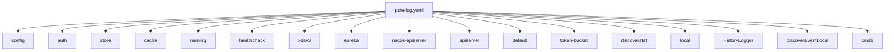
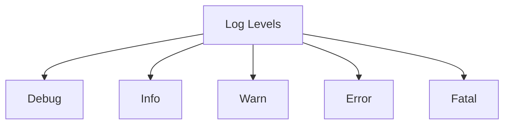
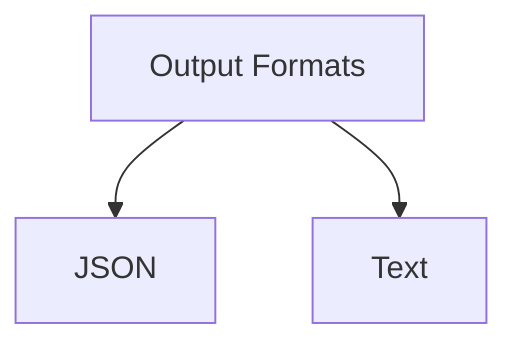
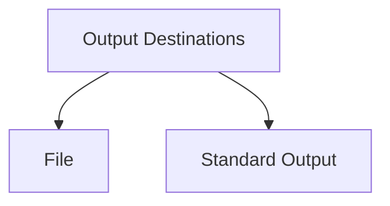
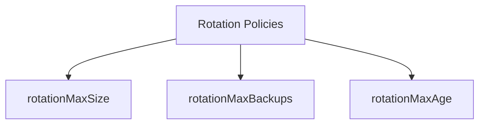
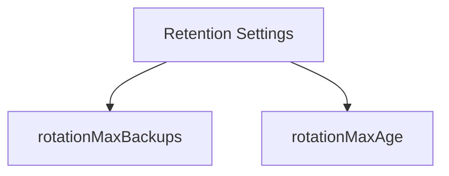
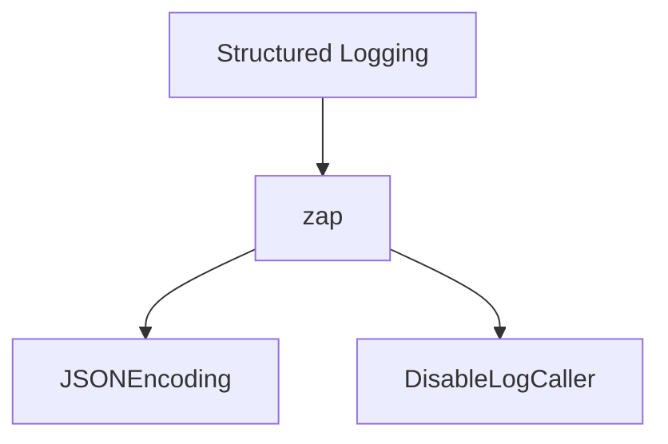
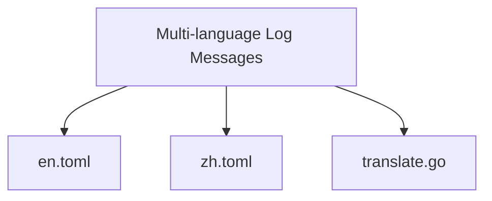
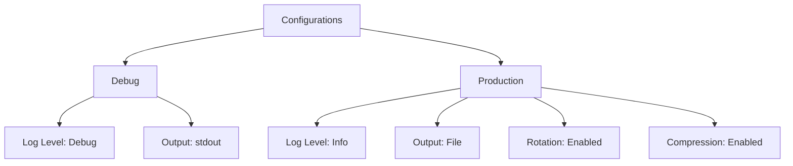
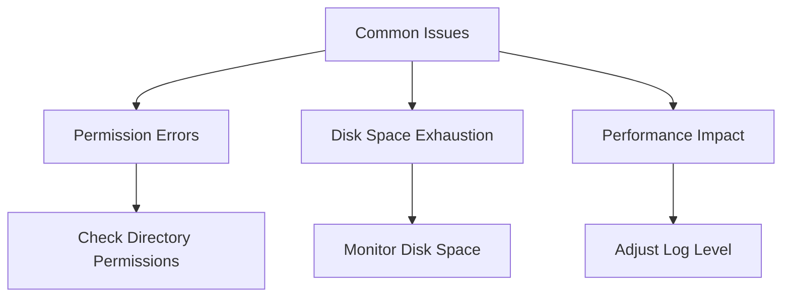

# Logging Configuration

<cite>
**Referenced Files in This Document**   
- [pole-log.yaml](file://deploy/conf/pole-log.yaml)
- [config.go](file://pkg/common/log/config.go)
- [options.go](file://pkg/common/log/options.go)
- [en.toml](file://deploy/conf/i18n/en.toml)
- [zh.toml](file://deploy/conf/i18n/zh.toml)
- [translate.go](file://plugin/apiserver/httpserver/i18n/translate.go)
</cite>

## Table of Contents
1. [Introduction](#introduction)
2. [Logging Configuration Overview](#logging-configuration-overview)
3. [Log Levels](#log-levels)
4. [Output Formats](#output-formats)
5. [Output Destinations](#output-destinations)
6. [Rotation Policies](#rotation-policies)
7. [Retention Settings](#retention-settings)
8. [Structured Logging with Zap](#structured-logging-with-zap)
9. [Multi-language Log Messages with i18n](#multi-language-log-messages-with-i18n)
10. [Debug and Production Configurations](#debug-and-production-configurations)
11. [Common Issues and Troubleshooting](#common-issues-and-troubleshooting)
12. [Conclusion](#conclusion)

## Introduction

The logging configuration in the pole-server project is designed to provide comprehensive logging capabilities for various components of the system. The configuration is managed through the `pole-log.yaml` file, which defines logging options for different scopes such as configuration, authentication, storage, and more. This document details all logging options, including log levels, output formats, destinations, rotation policies, and retention settings. It also explains how to configure structured logging with zap and customize log fields, as well as how to integrate with i18n for multi-language log messages.

**Section sources**
- [pole-log.yaml](file://deploy/conf/pole-log.yaml#L1-L160)

## Logging Configuration Overview

The `pole-log.yaml` file is the central configuration file for logging in the pole-server project. It defines logging options for various scopes, each with its own set of configuration parameters. The file is structured as a YAML document with each scope having its own section. The configuration includes parameters for log file location, error log file location, log file size, number of log files to save, maximum preservation days, log output level, and log file compression.

**Diagram sources**
- [pole-log.yaml](file://deploy/conf/pole-log.yaml#L1-L160)

**Section sources**
- [pole-log.yaml](file://deploy/conf/pole-log.yaml#L1-L160)

## Log Levels

The logging system supports five log levels: debug, info, warn, error, and fatal. These levels are defined in the `Options` struct in the `options.go` file. The log level determines the severity of the log message and is used to filter log output. The default log level is info, but it can be configured for each scope in the `pole-log.yaml` file.

**Diagram sources**
- [options.go](file://pkg/common/log/options.go#L30-L35)

**Section sources**
- [options.go](file://pkg/common/log/options.go#L30-L35)

## Output Formats

The logging system supports two output formats: JSON and text. The format is controlled by the `JSONEncoding` field in the `Options` struct. When `JSONEncoding` is set to true, log messages are formatted as JSON objects. When it is set to false, log messages are formatted as plain text. The default format is text.

**Diagram sources**
- [options.go](file://pkg/common/log/options.go#L118-L120)

**Section sources**
- [options.go](file://pkg/common/log/options.go#L118-L120)

## Output Destinations

Log messages can be directed to different destinations, including files and standard output. The `rotateOutputPath` and `errorRotateOutputPath` fields in the `Options` struct specify the file paths for regular and error log files, respectively. If these fields are not set, log messages are written to standard output. The `outputPaths` and `errorOutputPaths` fields can be used to specify multiple output destinations.

**Diagram sources**
- [options.go](file://pkg/common/log/options.go#L70-L75)

**Section sources**
- [options.go](file://pkg/common/log/options.go#L70-L75)

## Rotation Policies

The logging system uses the `lumberjack` library to manage log file rotation. The `rotationMaxSize`, `rotationMaxBackups`, and `rotationMaxAge` fields in the `Options` struct control the rotation policy. `rotationMaxSize` specifies the maximum size of a single log file in megabytes. `rotationMaxBackups` specifies the maximum number of old log files to retain. `rotationMaxAge` specifies the maximum number of days to retain old log files.

**Diagram sources**
- [options.go](file://pkg/common/log/options.go#L95-L116)

**Section sources**
- [options.go](file://pkg/common/log/options.go#L95-L116)

## Retention Settings

The retention settings for log files are controlled by the `rotationMaxBackups` and `rotationMaxAge` fields in the `Options` struct. `rotationMaxBackups` specifies the maximum number of old log files to retain, while `rotationMaxAge` specifies the maximum number of days to retain old log files. These settings help manage disk space by automatically removing old log files.

**Diagram sources**
- [options.go](file://pkg/common/log/options.go#L105-L116)

**Section sources**
- [options.go](file://pkg/common/log/options.go#L105-L116)

## Structured Logging with Zap

The logging system uses the `zap` library for structured logging. The `zap` library provides a high-performance logging solution with support for structured logging. The `Options` struct in the `options.go` file includes fields for configuring structured logging, such as `JSONEncoding` and `DisableLogCaller`. The `zap` library is configured in the `config.go` file, where the `prepZap` function sets up the logging encoder and cores.

**Diagram sources**
- [config.go](file://pkg/common/log/config.go#L81-L128)

**Section sources**
- [config.go](file://pkg/common/log/config.go#L81-L128)

## Multi-language Log Messages with i18n

The logging system supports multi-language log messages through the integration with the `i18n` library. The `en.toml` and `zh.toml` files in the `deploy/conf/i18n` directory contain the translations for log messages in English and Chinese, respectively. The `translate.go` file in the `plugin/apiserver/httpserver/i18n` directory provides the functionality for loading and translating log messages.

**Diagram sources**
- [en.toml](file://deploy/conf/i18n/en.toml#L1-L172)
- [zh.toml](file://deploy/conf/i18n/zh.toml#L1-L172)
- [translate.go](file://plugin/apiserver/httpserver/i18n/translate.go#L1-L63)

**Section sources**
- [en.toml](file://deploy/conf/i18n/en.toml#L1-L172)
- [zh.toml](file://deploy/conf/i18n/zh.toml#L1-L172)
- [translate.go](file://plugin/apiserver/httpserver/i18n/translate.go#L1-L63)

## Debug and Production Configurations

The `pole-log.yaml` file includes configurations for both debug and production environments. In the debug configuration, the log level is set to debug, and log messages are written to standard output. In the production configuration, the log level is set to info, and log messages are written to files with rotation and compression enabled.

**Diagram sources**
- [pole-log.yaml](file://deploy/conf/pole-log.yaml#L1-L160)

**Section sources**
- [pole-log.yaml](file://deploy/conf/pole-log.yaml#L1-L160)

## Common Issues and Troubleshooting

Common issues with logging include log file permission errors, disk space exhaustion, and performance impact of verbose logging. To troubleshoot these issues, ensure that the log file directories have the correct permissions, monitor disk space usage, and adjust the log level to reduce the volume of log messages.

**Diagram sources**
- [config.go](file://pkg/common/log/config.go#L220-L273)

**Section sources**
- [config.go](file://pkg/common/log/config.go#L220-L273)

## Conclusion

The logging configuration in the pole-server project provides a flexible and powerful logging system that can be tailored to meet the needs of different environments and use cases. By understanding the various configuration options and their implications, developers can effectively manage logging to ensure that the system is both performant and easy to debug.

**Section sources**
- [pole-log.yaml](file://deploy/conf/pole-log.yaml#L1-L160)
- [config.go](file://pkg/common/log/config.go#L1-L424)
- [options.go](file://pkg/common/log/options.go#L1-L189)
- [en.toml](file://deploy/conf/i18n/en.toml#L1-L172)
- [zh.toml](file://deploy/conf/i18n/zh.toml#L1-L172)
- [translate.go](file://plugin/apiserver/httpserver/i18n/translate.go#L1-L63)