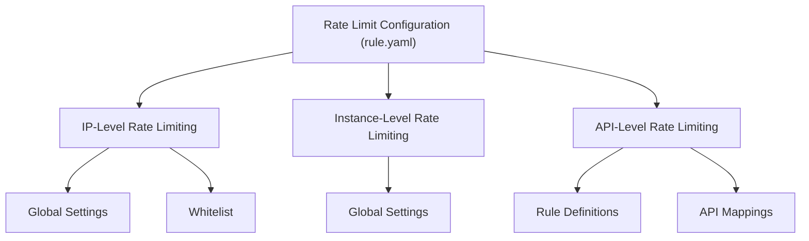
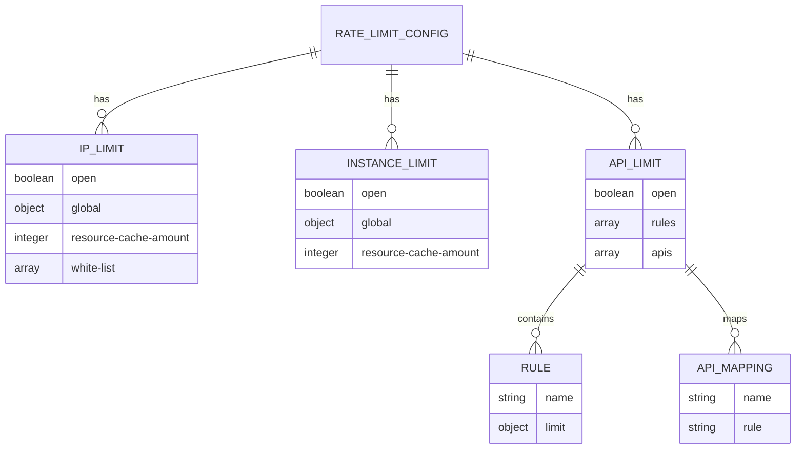
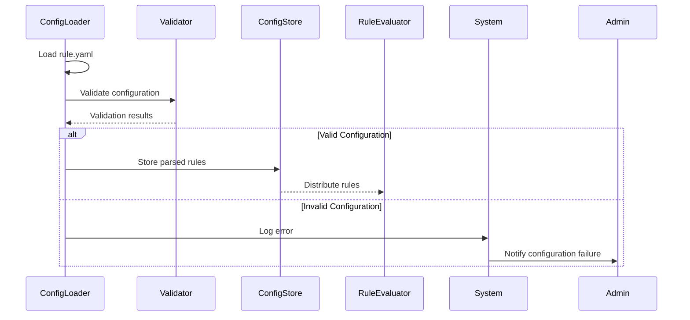
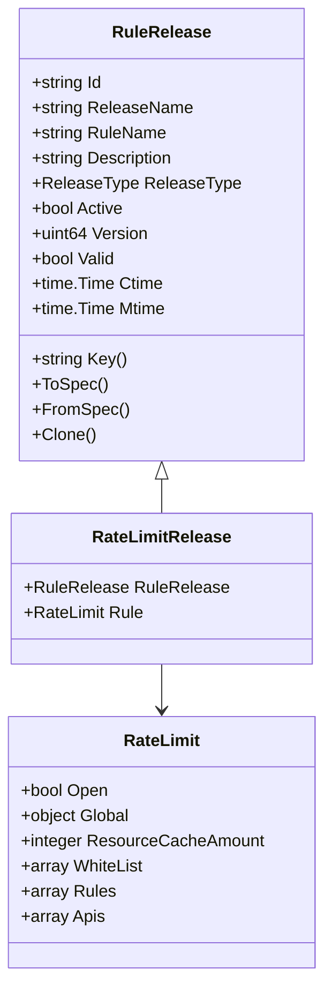

# Plugin Configuration

<cite>
**Referenced Files in This Document**   
- [rule.yaml](file://deploy/conf/plugin/ratelimit/rule.yaml)
- [ratelimit_config.go](file://plugin/store/mysql/ratelimit_config.go)
- [release.go](file://apis/pkg/types/rules/release.go)
- [ratelimit.go](file://pkg/cache/rules/ratelimit_config.go)
- [ratelimit_rule.go](file://pkg/goverrule/interceptor/paramcheck/ratelimit_rule.go)
</cite>

## Table of Contents
1. [Introduction](#introduction)
2. [Rate Limiting Rule Configuration](#rate-limiting-rule-configuration)
3. [Configuration Syntax and Structure](#configuration-syntax-and-structure)
4. [Runtime Loading and Validation](#runtime-loading-and-validation)
5. [Integration with Core Governance System](#integration-with-core-governance-system)
6. [Common Rate Limiting Patterns](#common-rate-limiting-patterns)
7. [Testing and Troubleshooting](#testing-and-troubleshooting)
8. [Conclusion](#conclusion)

## Introduction
This document provides comprehensive guidance on configuring rate limiting rules within the plugin system using the `rule.yaml` configuration file. It details the syntax, structure, and semantics of rate limiting configurations, explains how these configurations are loaded and validated at runtime, and describes their integration with the core governance framework. The document also covers common usage patterns and provides practical advice for testing and troubleshooting rule evaluation issues.

## Rate Limiting Rule Configuration
The rate limiting functionality is configured through the `rule.yaml` file located in the plugin configuration directory. This configuration enables different levels of rate limiting including IP-level, instance-level, and API-level restrictions. Each type of rate limiting can be independently enabled or disabled and configured with specific thresholds and time windows.

**Diagram sources**
- [rule.yaml](file://deploy/conf/plugin/ratelimit/rule.yaml)

**Section sources**
- [rule.yaml](file://deploy/conf/plugin/ratelimit/rule.yaml)

## Configuration Syntax and Structure
The `rule.yaml` file defines three main types of rate limiting configurations: `ip-limit`, `instance-limit`, and `api-limit`. Each configuration type follows a hierarchical structure with global settings, resource specifications, and threshold definitions.

The token bucket algorithm is used for rate limiting, where `bucket` represents the maximum burst capacity (token count) and `rate` represents the token refill rate per second. The configuration also includes caching parameters to manage resource usage for tracking rate limits across different dimensions.

**Diagram sources**
- [rule.yaml](file://deploy/conf/plugin/ratelimit/rule.yaml)

**Section sources**
- [rule.yaml](file://deploy/conf/plugin/ratelimit/rule.yaml)

### IP-Level Rate Limiting
IP-level rate limiting controls traffic based on client IP addresses. It includes global rate limiting parameters and supports IP whitelisting to exclude certain addresses from restrictions. The configuration specifies both the maximum burst capacity (`bucket`) and sustained rate (`rate`) allowed per IP address.

**Section sources**
- [rule.yaml](file://deploy/conf/plugin/ratelimit/rule.yaml)

### API-Level Rate Limiting
API-level rate limiting allows fine-grained control over specific endpoints. Rules are defined with names and associated rate limiting parameters, then mapped to specific HTTP methods and URL paths. This enables different rate limiting policies for read versus write operations, or for different API endpoints based on their importance or resource requirements.

**Section sources**
- [rule.yaml](file://deploy/conf/plugin/ratelimit/rule.yaml)

## Runtime Loading and Validation
Rate limiting configurations are loaded at runtime from the `rule.yaml` file and stored in the system's configuration store. The loading process involves parsing the YAML configuration, validating its structure and values, and converting it into internal data structures that can be efficiently queried and enforced.

Configuration validation occurs at multiple levels: syntax validation ensures the YAML is well-formed, semantic validation checks that all required fields are present and within acceptable ranges, and consistency validation ensures that references between rules and API mappings are valid.

**Diagram sources**
- [ratelimit_config.go](file://plugin/store/mysql/ratelimit_config.go)
- [ratelimit_rule.go](file://pkg/goverrule/interceptor/paramcheck/ratelimit_rule.go)

**Section sources**
- [ratelimit_config.go](file://plugin/store/mysql/ratelimit_config.go)
- [ratelimit_rule.go](file://pkg/goverrule/interceptor/paramcheck/ratelimit_rule.go)

## Integration with Core Governance System
Rate limiting configurations are integrated with the core governance system through the rule release mechanism. The `RateLimitRelease` structure wraps the rate limiting rules with metadata such as version, activation status, and release type, enabling versioned deployments and canary rollouts of rate limiting policies.

The governance system provides APIs for creating, updating, and activating rate limiting rules. When a rule is activated, it becomes the active configuration for the corresponding service or namespace. The system maintains previous versions of rules to support rollback capabilities.

**Diagram sources**
- [release.go](file://apis/pkg/types/rules/release.go)
- [ratelimit_config.go](file://plugin/store/mysql/ratelimit_config.go)

**Section sources**
- [release.go](file://apis/pkg/types/rules/release.go)
- [ratelimit_config.go](file://plugin/store/mysql/ratelimit_config.go)

## Common Rate Limiting Patterns
The rate limiting system supports several common patterns for controlling traffic in microservices architectures. These patterns can be combined to create comprehensive traffic management strategies that protect system resources while maintaining service availability.

### API-Level Limits
API-level limits differentiate between different types of operations, typically applying stricter limits to write operations than read operations. This pattern helps protect data integrity and storage systems from excessive modification requests while allowing clients to retrieve data as needed.

**Section sources**
- [rule.yaml](file://deploy/conf/plugin/ratelimit/rule.yaml)

### Client IP-Based Limits
Client IP-based limits control the rate of requests from individual clients. This pattern is effective for preventing abuse from specific sources and ensuring fair usage across different clients. The whitelist feature allows trusted clients to bypass rate limiting, which is useful for internal services or partners.

**Section sources**
- [rule.yaml](file://deploy/conf/plugin/ratelimit/rule.yaml)

### Service-to-Service Limits
Service-to-service limits control the rate of requests between microservices. This pattern prevents cascading failures by ensuring that a misbehaving service cannot overwhelm its dependencies. Limits can be configured based on service identity rather than IP address, providing more precise control in dynamic environments.

**Section sources**
- [rule.yaml](file://deploy/conf/plugin/ratelimit/rule.yaml)

## Testing and Troubleshooting
Testing rate limiting configurations requires careful validation of both the configuration syntax and the runtime behavior. The system provides tools for verifying that rules are correctly loaded and activated, and for monitoring the enforcement of rate limits.

When troubleshooting rule evaluation issues, administrators should first verify that the configuration file is correctly formatted and located in the expected directory. They should then check the system logs for any validation errors during configuration loading. Finally, they can use monitoring tools to observe the actual rate limiting behavior and compare it with the expected configuration.

Common issues include:
- Incorrect API path mappings in the configuration
- Typos in rule names when mapping APIs to rules
- Conflicting rules that may cause unexpected behavior
- Configuration files not being reloaded after updates

**Section sources**
- [ratelimit_config_test.go](file://pkg/cache/rules/ratelimit_config_test.go)
- [ratelimit_rule.go](file://pkg/goverrule/interceptor/paramcheck/ratelimit_rule.go)

## Conclusion
The rate limiting plugin provides a flexible and powerful mechanism for controlling traffic to services. By understanding the configuration syntax, runtime behavior, and integration points with the core governance system, administrators can effectively protect their systems from overload while maintaining service availability. The support for multiple rate limiting patterns allows for sophisticated traffic management strategies that can adapt to different usage scenarios and operational requirements.