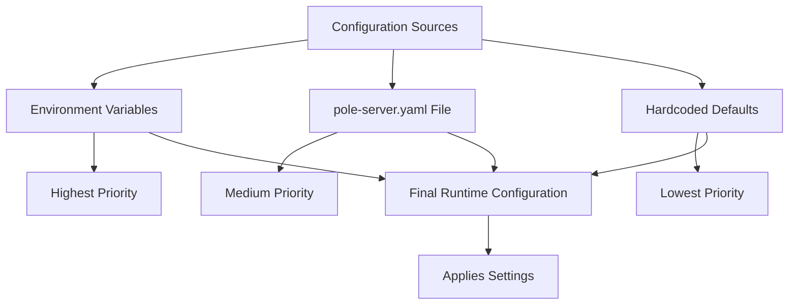
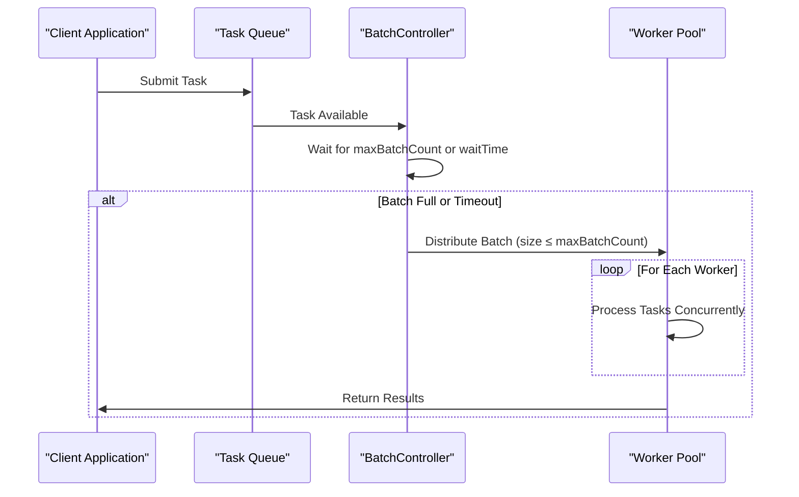

# Server Configuration

<cite>
**Referenced Files in This Document**   
- [pole-server.yaml](file://deploy/conf/pole-server.yaml)
- [default_boot.go](file://bootstrap/config/default_boot.go)
- [server.go](file://bootstrap/server.go)
- [config.go](file://pkg/common/conn/limit/config.go)
- [batch.go](file://pkg/common/batchctrl/batch.go)
- [config.go](file://pkg/service/batch/config.go)
</cite>

## Table of Contents
1. [Introduction](#introduction)
2. [Core Server Settings](#core-server-settings)
3. [Hierarchical Configuration Loading](#hierarchical-configuration-loading)
4. [Thread Pool and Batch Processing](#thread-pool-and-batch-processing)
5. [Connection Management](#connection-management)
6. [Health Check Configuration](#health-check-configuration)
7. [Storage Configuration](#storage-configuration)
8. [Production vs Development Configurations](#production-vs-development-configurations)
9. [Common Misconfiguration Issues](#common-misconfiguration-issues)
10. [Performance Tuning Guidelines](#performance-tuning-guidelines)

## Introduction
This document provides comprehensive documentation for the pole-server.yaml configuration file, detailing all server-level settings for the Polaris service mesh control plane. The configuration governs critical aspects of server operation including network settings, cluster coordination, thread pool configurations, connection limits, and timeout values. The document explains the hierarchical configuration loading mechanism, environment variable override capabilities, and the role of default_boot.go in providing fallback values. It includes examples of production-ready configurations with high availability settings and development configurations with relaxed limits, while addressing common misconfiguration issues and providing performance tuning guidance based on deployment scale.

## Core Server Settings
The pole-server.yaml configuration file contains essential server-level settings that control the fundamental behavior of the Polaris server instance. The bootstrap section contains critical startup guidance configuration including global logger settings that reference pole-log.yaml for logging configuration. The server supports ordered startup through the startInOrder configuration, which prevents database overload during initialization by coordinating startup sequences with a distributed lock key. The polaris_service configuration enables service registration with Arctic Star Service, allowing the server to register itself in the service mesh with specified protocols like service-grpc. The configuration also supports various authentication settings under the auth section, including user authentication with configurable SALT for token encryption and strategy-based access control with console and client authentication switches. Namespace and naming configurations provide automatic creation capabilities for both namespaces and services, while the healthcheck section controls the health inspection functionality with configurable service names, time wheel parameters, and check intervals.

**Section sources**
- [pole-server.yaml](file://deploy/conf/pole-server.yaml#L1-L50)

## Hierarchical Configuration Loading
The Polaris server employs a hierarchical configuration loading mechanism that combines configuration files, environment variables, and default values to determine the final runtime configuration. The primary configuration is loaded from pole-server.yaml, which serves as the foundation for server settings. Environment variables can override specific configuration values, allowing for deployment-specific customization without modifying configuration files. For example, database connection strings can be overridden using environment variables like MYSQL_USER, MYSQL_PWD, and MYSQL_HOST, as demonstrated in the store configuration's DNS setting. When configuration values are not provided in the YAML file or through environment variables, the system falls back to default values defined in the codebase, particularly in default_boot.go. This file contains the defaultBootstrap function that establishes default values for critical settings such as ordered startup (enabled by default with key "sz") and service registration (enabled by default). The hierarchical loading follows the precedence: environment variables > configuration file values > hardcoded defaults, ensuring flexibility across different deployment environments while maintaining sensible defaults for unconfigured options.

**Diagram sources**
- [pole-server.yaml](file://deploy/conf/pole-server.yaml#L1-L173)
- [default_boot.go](file://bootstrap/config/default_boot.go#L1-L90)

## Thread Pool and Batch Processing
The Polaris server implements sophisticated thread pool and batch processing configurations to optimize performance and resource utilization. The batch processing system is configured under the healthcheck.batch.heartbeat section, with parameters that control the behavior of batched operations. The queueSize parameter (default 10240) determines the maximum number of pending operations that can be queued before rejection, while waitTime (default 32ms) specifies the maximum duration to wait before processing a batch, even if the maximum batch size hasn't been reached. The maxBatchCount (default 32) limits the number of operations processed in a single batch, preventing excessive resource consumption during batch processing. The concurrency parameter (default 64) controls the number of worker goroutines that process batches in parallel, effectively determining the thread pool size for batch operations. These settings are implemented using the BatchController system, which manages a pool of worker goroutines that process incoming tasks in batches, balancing throughput and latency. The system uses a main loop that collects tasks until either the waitTime expires or the maxBatchCount is reached, then distributes the batch to available workers based on the concurrency setting.

**Diagram sources**
- [pole-server.yaml](file://deploy/conf/pole-server.yaml#L62-L67)
- [batch.go](file://pkg/common/batchctrl/batch.go#L63-L202)
- [config.go](file://pkg/service/batch/config.go#L34-L92)

## Connection Management
The Polaris server implements comprehensive connection management to control resource usage and prevent denial-of-service conditions. While the primary configuration file (pole-server.yaml) does not explicitly define connection limits, the system supports connection limiting through configuration options processed by the ConnLimiter. The connection limit configuration includes parameters such as maxConnLimit (maximum total connections), maxConnPerHost (maximum connections per client IP), and readTimeout (duration before closing inactive connections). These settings are typically provided through the apiserver configurations referenced in pole-apiserver.yaml, which is included via the apiservers directive in pole-server.yaml. The system maintains statistics on active connections per host and enforces limits to prevent any single client from overwhelming the server. Connection cleanup is handled automatically, with idle connections being purged based on the purgeCounterExpire setting, and connection statistics being recycled at intervals defined by purgeCounterInterval. The implementation uses a listener wrapper that intercepts incoming connections and applies the limiting logic before passing connections to the actual server implementation.

**Section sources**
- [config.go](file://pkg/common/conn/limit/config.go#L42-L76)
- [listener_test.go](file://pkg/common/conn/limit/listener_test.go#L337-L386)

## Health Check Configuration
The health check subsystem is a critical component of the Polaris server, responsible for monitoring service instance health and maintaining system reliability. The healthcheck configuration section enables the health check function module and specifies the service name (pole.checker) used for health inspection tasks. The time wheel implementation uses a configurable slotNum (default 30) to manage the scheduling of health check tasks efficiently. The minCheckInterval (default 1s) and maxCheckInterval (default 30s) parameters establish boundaries for the frequency of health checks, preventing both excessive checking and insufficient monitoring. The clientReportInterval (default 120s) configures how often SDK-reported health status is processed. The system supports multiple health check plugins through the checkers list, with currently supported plugins including heartBeatMemory, heartBeatredis, and heartBeatLeader, though only one can be active at a time due to their similar functionality. The batch configuration for heartbeat operations optimizes the processing of multiple heartbeat reports by batching them together, reducing database load and improving throughput during periods of high activity.

**Section sources**
- [pole-server.yaml](file://deploy/conf/pole-server.yaml#L51-L67)

## Storage Configuration
The storage configuration in pole-server.yaml defines how the Polaris server connects to and interacts with its persistent data store. The store section specifies the database storage plugin (defaultStore) and its configuration options, with the master database configuration including dbType (mysql), dns (connection string with environment variable placeholders), maxOpenConns (300), maxIdleConns (50), and connMaxLifetime (300 seconds). The maxOpenConns parameter controls the maximum number of open connections to the database, preventing the server from overwhelming the database with too many simultaneous connections. The maxIdleConns setting manages the number of idle connections maintained in the connection pool, balancing connection reuse with resource conservation. The connMaxLifetime parameter ensures that database connections are periodically refreshed, preventing issues with stale or broken connections in long-running server instances. The connection string uses environment variable substitution (MYSQL_USER, MYSQL_PWD, MYSQL_HOST) to allow deployment-specific database credentials without exposing sensitive information in the configuration file.

**Section sources**
- [pole-server.yaml](file://deploy/conf/pole-server.yaml#L148-L154)

## Production vs Development Configurations
The Polaris server supports different configuration profiles for production and development environments, allowing optimal settings for each context. For production deployments requiring high availability, a recommended configuration includes conservative connection limits (maxOpenConns: 300, maxIdleConns: 50), aggressive health checking (minCheckInterval: 5s, maxCheckInterval: 15s), and optimized batch processing (queueSize: 20480, maxBatchCount: 64, concurrency: 128). The startInOrder functionality should remain enabled to prevent database overload during rolling updates, and service registration should be enabled for proper service mesh integration. In contrast, development configurations can use more relaxed limits to facilitate testing and debugging: higher connection limits (maxOpenConns: 100, maxIdleConns: 20), less frequent health checking (minCheckInterval: 30s, maxCheckInterval: 60s), and smaller batch sizes (queueSize: 4096, maxBatchCount: 16, concurrency: 16). Development configurations may also disable certain plugins like rate limiting and enable additional logging for troubleshooting. Both configurations should maintain the same core structure but adjust numerical values based on the expected load and operational requirements of the environment.

**Section sources**
- [pole-server.yaml](file://deploy/conf/pole-server.yaml#L1-L173)

## Common Misconfiguration Issues
Several common misconfiguration issues can impact the stability and performance of the Polaris server. Port conflicts occur when the server attempts to bind to a port already in use by another process, typically due to improper coordination in multi-instance deployments or when the default port is already occupied. Thread pool exhaustion can happen when the batch processing concurrency is set too high, causing excessive goroutine creation and memory consumption, or when the queueSize is too small, leading to task rejection under load. Network binding problems arise when the server fails to bind to the specified interface, often due to incorrect network_inter settings in the polaris_service configuration or firewall restrictions on the target port. Database connection issues frequently stem from incorrect DNS settings in the store configuration, particularly when environment variables for database credentials are not properly set. Another common issue is improper health check configuration, where minCheckInterval is set too aggressively, overwhelming service instances with excessive health probes. These issues can be mitigated through proper configuration validation, monitoring of system resources, and gradual tuning based on observed performance metrics.

**Section sources**
- [pole-server.yaml](file://deploy/conf/pole-server.yaml#L1-L173)
- [server.go](file://bootstrap/server.go#L341-L380)

## Performance Tuning Guidelines
Performance tuning for the Polaris server should be based on the deployment scale and expected workload characteristics. For small-scale deployments (up to 10,000 service instances), moderate settings are sufficient: maxOpenConns: 150, batch concurrency: 32, and health check intervals of 15-30 seconds. Medium-scale deployments (10,000-100,000 instances) require more aggressive tuning: maxOpenConns: 250-350, batch concurrency: 64-96, and health check intervals of 5-15 seconds to maintain responsiveness. Large-scale deployments (100,000+ instances) demand careful optimization: maxOpenConns: 400-500 (with corresponding database capacity), batch concurrency: 128-256, and specialized health check configurations with staggered intervals to prevent thundering herd problems. The batch processing queueSize should scale with expected traffic bursts, typically set to 2-3 times the expected peak concurrent operations. Connection timeout values should be adjusted based on network conditions, with readTimeout typically set between 30-120 seconds to balance responsiveness and resilience to network latency. Monitoring of batch processing metrics (queue depth, processing latency) and database connection pool statistics (wait times, idle connections) should inform ongoing tuning efforts, with adjustments made incrementally and validated through performance testing.

**Section sources**
- [pole-server.yaml](file://deploy/conf/pole-server.yaml#L1-L173)
- [config.go](file://pkg/service/batch/config.go#L34-L92)
- [config.go](file://pkg/common/conn/limit/config.go#L42-L76)