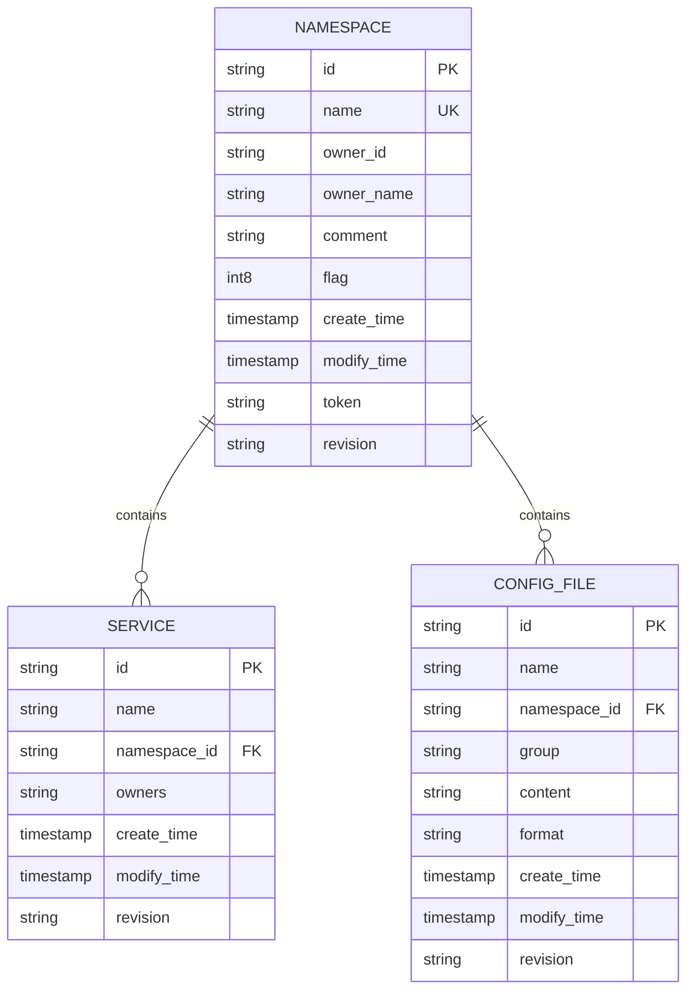
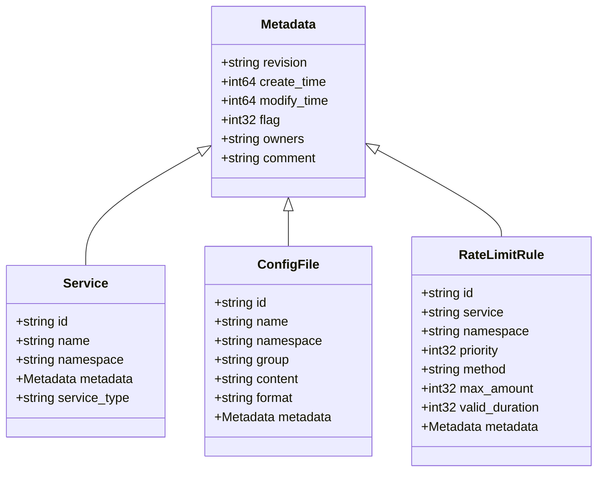
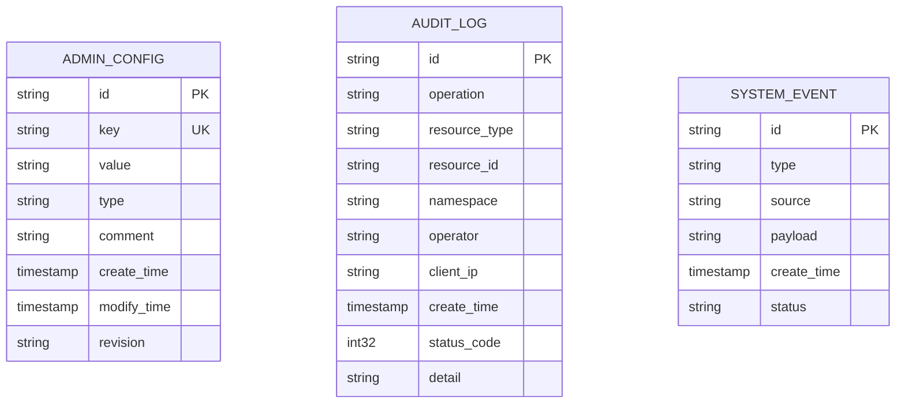
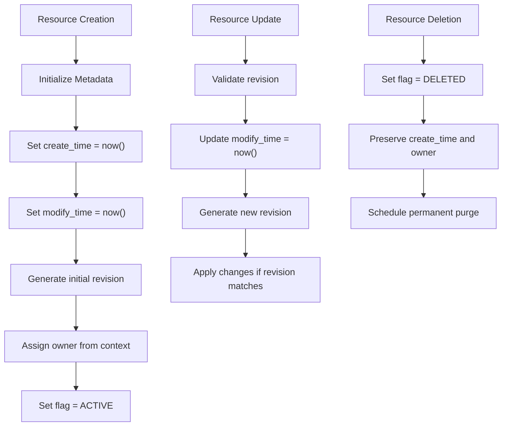
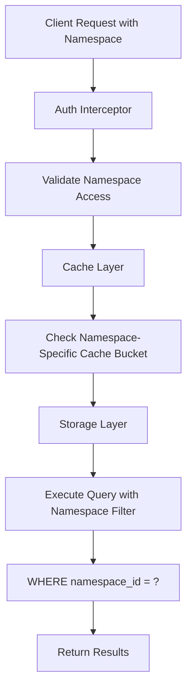
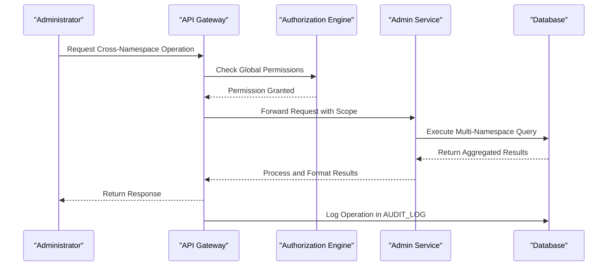

# Administration & Metadata Schema

<cite>
**Referenced Files in This Document**   
- [namespace.go](file://pkg/namespace/namespace.go)
- [admin.go](file://apis/pkg/types/admin/admin.go)
- [config.go](file://pkg/admin/config.go)
- [metadata.go](file://apis/pkg/types/metadata.go)
- [instance.go](file://pkg/service/instance.go)
- [namespace.go](file://apis/pkg/types/namespace.go)
- [admin_api.go](file://apis/store/admin_api.go)
- [namespace.go](file://pkg/cache/namespace/namespace.go)
- [namespace.go](file://plugin/store/mysql/namespace.go)
- [instance.go](file://pkg/cache/service/instance.go)
</cite>

## Table of Contents
1. [Introduction](#introduction)
2. [Namespace Management](#namespace-management)
3. [Administrative Metadata Schema](#administrative-metadata-schema)
4. [System-Level Administrative Data](#system-level-administrative-data)
5. [Metadata for Resource Ownership and Lifecycle](#metadata-for-resource-ownership-and-lifecycle)
6. [Data Isolation and Multi-Tenancy](#data-isolation-and-multi-tenancy)
7. [Query Patterns and Indexing Strategy](#query-patterns-and-indexing-strategy)
8. [Cross-Namespace Operations](#cross-namespace-operations)
9. [Conclusion](#conclusion)

## Introduction
This document provides comprehensive documentation for the administration and metadata schema in the pole-server system. It details the structure, constraints, and relationships of namespaces and administrative metadata tables. The system leverages namespaces to provide logical isolation for services, configurations, and governance rules across multiple tenants. Administrative metadata includes resource ownership, creation timestamps, and modification tracking to ensure auditability and operational visibility.

## Namespace Management

Namespaces serve as the primary mechanism for logical isolation within the system, enabling multi-tenancy by segregating services, configurations, and access policies. Each namespace defines a boundary for resource visibility and access control, ensuring that entities within one namespace do not interfere with those in another unless explicitly permitted.

The namespace model is implemented across multiple layers including API types, business logic, caching, and persistence. The core structure includes a unique identifier, name, owner information, description, and status fields that support soft deletion and lifecycle management.



**Diagram sources**
- [namespace.go](file://pkg/namespace/namespace.go#L15-L60)
- [namespace.go](file://apis/pkg/types/namespace.go#L10-L45)

**Section sources**
- [namespace.go](file://pkg/namespace/namespace.go#L1-L100)
- [namespace.go](file://apis/pkg/types/namespace.go#L1-L50)

## Administrative Metadata Schema

The administrative metadata schema provides a consistent set of fields across all managed resources to support auditing, versioning, and operational tracking. These metadata fields are embedded in various entity types including services, configuration files, routing rules, and rate limiting policies.

Key metadata fields include:
- `create_time`: Timestamp when the resource was first created
- `modify_time`: Timestamp of the last modification
- `revision`: Version identifier for optimistic concurrency control
- `flag`: Bitmask indicating resource state (e.g., deleted, disabled)
- `owners`: List of users or teams responsible for the resource

This schema enables reliable tracking of changes and supports eventual consistency models through revision-based updates.



**Diagram sources**
- [metadata.go](file://apis/pkg/types/metadata.go#L5-L40)
- [admin.go](file://apis/pkg/types/admin/admin.go#L15-L35)

**Section sources**
- [metadata.go](file://apis/pkg/types/metadata.go#L1-L50)
- [admin.go](file://apis/pkg/types/admin/admin.go#L1-L40)

## System-Level Administrative Data

System-level administrative data encompasses global configuration, operational state, and platform-wide settings stored in dedicated administrative tables. This includes default policies, system-wide rate limits, audit logging configurations, and cluster-wide feature flags.

Administrative data is managed through a dedicated API layer that enforces strict access controls and provides transactional consistency. The schema supports hierarchical configuration inheritance and environment-specific overrides.



**Diagram sources**
- [config.go](file://pkg/admin/config.go#L20-L65)
- [admin_api.go](file://apis/store/admin_api.go#L10-L50)

**Section sources**
- [config.go](file://pkg/admin/config.go#L1-L80)
- [admin_api.go](file://apis/store/admin_api.go#L1-L60)

## Metadata for Resource Ownership and Lifecycle

Resource ownership and lifecycle tracking are enforced through standardized metadata fields applied consistently across all persistent entities. These fields enable fine-grained access control decisions, audit trail generation, and automated lifecycle management workflows.

Ownership is represented as a string field that may contain user IDs, team names, or service account identifiers. The system supports both direct ownership and group-based delegation models. Lifecycle state is managed through the `flag` field, which uses bit masking to represent multiple states simultaneously (e.g., deleted, disabled, locked).

Automated jobs periodically process resources based on their lifecycle state, such as purging soft-deleted entries after a retention period or archiving inactive configurations.



**Diagram sources**
- [instance.go](file://pkg/service/instance.go#L75-L95)
- [metadata.go](file://apis/pkg/types/metadata.go#L15-L35)

**Section sources**
- [instance.go](file://pkg/service/instance.go#L50-L120)
- [metadata.go](file://apis/pkg/types/metadata.go#L1-L50)

## Data Isolation and Multi-Tenancy

Data isolation is achieved through namespace-based partitioning at both the application and storage layers. All queries involving tenant-specific data include the namespace identifier as a mandatory filter condition, ensuring that cross-tenant data leaks are prevented by design.

The system implements isolation at multiple levels:
- **API Layer**: Namespace validation in interceptors
- **Business Logic**: Namespace enforcement in service methods
- **Cache Layer**: Namespace-partitioned cache buckets
- **Storage Layer**: Namespace-indexed database queries

Each tenant's data is logically separated, and cross-namespace access requires explicit permission grants and role-based access control checks.



**Diagram sources**
- [namespace.go](file://pkg/cache/namespace/namespace.go#L10-L30)
- [namespace.go](file://plugin/store/mysql/namespace.go#L25-L50)

**Section sources**
- [namespace.go](file://pkg/cache/namespace/namespace.go#L1-L40)
- [namespace.go](file://plugin/store/mysql/namespace.go#L1-L60)

## Query Patterns and Indexing Strategy

The system employs optimized query patterns and indexing strategies to support efficient namespace-based filtering and multi-tenancy operations. All major entity tables include composite indexes that begin with the namespace identifier followed by other frequently queried fields.

Primary query patterns include:
- **Namespace-scoped list operations**: Filtered by namespace_id with pagination
- **Cross-namespace administrative queries**: Used by global operators with explicit permissions
- **Revision-based conditional updates**: Optimistic concurrency control
- **Time-range based audit queries**: For compliance and troubleshooting

Indexing strategy prioritizes query performance for common access patterns while minimizing overhead on write operations.

```mermaid
erDiagram
SERVICE {
string id PK
string name
string namespace_id FK
string owners
timestamp create_time
timestamp modify_time
string revision
}
index idx_namespace_name on SERVICE(namespace_id, name)
index idx_namespace_modify on SERVICE(namespace_id, modify_time)
index idx_revision on SERVICE(revision)
CONFIG_FILE {
string id PK
string name
string namespace_id FK
string group
string content
string format
timestamp create_time
timestamp modify_time
string revision
}
index idx_namespace_group_name on CONFIG_FILE(namespace_id, group, name)
index idx_namespace_modify on CONFIG_FILE(namespace_id, modify_time)
index idx_revision on CONFIG_FILE(revision)
```

**Diagram sources**
- [namespace.go](file://plugin/store/mysql/namespace.go#L30-L50)
- [instance.go](file://pkg/cache/service/instance.go#L20-L40)

**Section sources**
- [namespace.go](file://plugin/store/mysql/namespace.go#L1-L70)
- [instance.go](file://pkg/cache/service/instance.go#L1-L50)

## Cross-Namespace Operations

Cross-namespace operations are restricted to users with elevated privileges and are primarily used for administrative tasks, migration workflows, and global reporting. These operations require explicit authorization checks and are logged extensively for audit purposes.

Supported cross-namespace patterns include:
- **Global search**: Query resources across multiple authorized namespaces
- **Bulk migration**: Move configurations between namespaces
- **Consolidated monitoring**: Aggregate metrics and events across namespaces
- **Policy synchronization**: Propagate governance rules across tenant boundaries

All cross-namespace access is mediated through dedicated service interfaces that enforce permission checks and maintain audit trails.



**Diagram sources**
- [admin_api.go](file://apis/store/admin_api.go#L25-L60)
- [config.go](file://pkg/admin/config.go#L40-L70)

**Section sources**
- [admin_api.go](file://apis/store/admin_api.go#L1-L80)
- [config.go](file://pkg/admin/config.go#L1-L100)

## Conclusion
The administration and metadata schema in pole-server provides a robust foundation for multi-tenant service governance. Through comprehensive namespace isolation, standardized metadata modeling, and efficient indexing strategies, the system ensures secure, auditable, and scalable management of distributed resources. The consistent application of metadata fields across all entities enables powerful operational capabilities including change tracking, ownership enforcement, and lifecycle management. Cross-namespace operations are carefully controlled through privilege-based access and comprehensive auditing, maintaining security while supporting necessary administrative workflows.