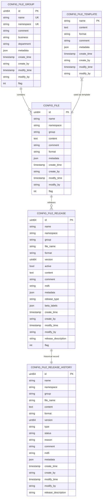
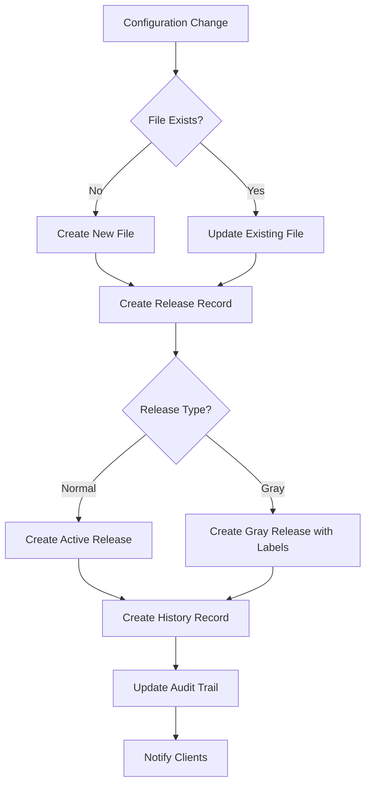
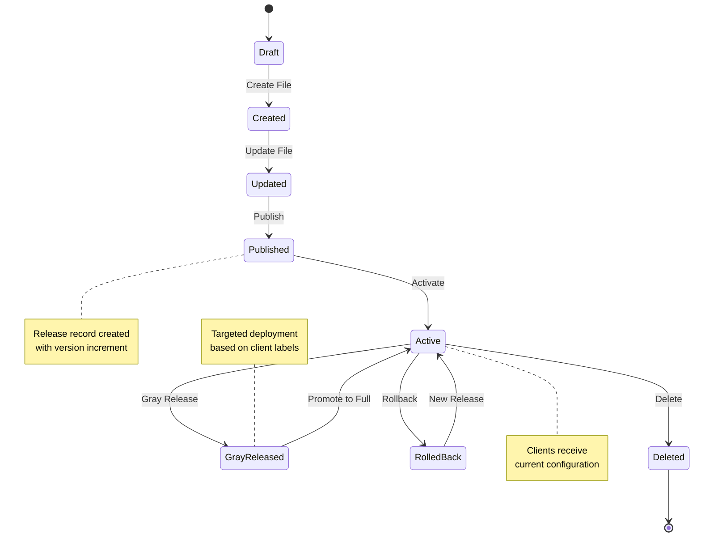

# Configuration Management Schema

<cite>
**Referenced Files in This Document**   
- [config_file.go](file://pkg/config/config_file.go)
- [config_file_group.go](file://pkg/config/config_file_group.go)
- [config_file_release.go](file://pkg/config/config_file_release.go)
- [config_file_release_history.go](file://pkg/config/config_file_release_history.go)
- [config_file_template.go](file://pkg/config/config_file_template.go)
- [types.go](file://apis/pkg/types/config/types.go)
- [config_file.go](file://plugin/store/mysql/config_file.go)
- [config_file_group.go](file://plugin/store/mysql/config_file_group.go)
- [config_file_release.go](file://plugin/store/mysql/config_file_release.go)
- [config_file_release_history.go](file://plugin/store/mysql/config_file_release_history.go)
- [config_file_template.go](file://plugin/store/mysql/config_file_template.go)
</cite>

## Table of Contents
1. [Introduction](#introduction)
2. [Core Data Models](#core-data-models)
3. [Configuration Relationships](#configuration-relationships)
4. [Versioning and Audit Trail](#versioning-and-audit-trail)
5. [Query Patterns](#query-patterns)
6. [Performance Optimization](#performance-optimization)
7. [Configuration Lifecycle](#configuration-lifecycle)

## Introduction
The Configuration Management Schema provides a comprehensive system for managing configuration files, groups, releases, and templates. This documentation details the data model, relationships, versioning system, and operational patterns for the configuration management subsystem. The schema supports full audit trails, version history, and both normal and gray (canary) release strategies. The system is designed to handle large-scale configuration management with emphasis on reliability, traceability, and performance.

## Core Data Models

### Configuration File (config_file)
The Configuration File entity represents an individual configuration file in the system.

**Column Definitions:**
- **id**: uint64 - Primary key, auto-incrementing identifier
- **name**: string - Configuration file name (max 128 characters)
- **namespace**: string - Namespace identifier (max 64 characters)
- **group**: string - Group identifier (max 128 characters)
- **content**: text - Configuration content (unlimited size)
- **comment**: string - Description or comment (max 255 characters)
- **format**: string - File format (text, yaml, xml, json, html, properties)
- **metadata**: json - Key-value metadata storage
- **create_time**: timestamp - Creation timestamp
- **create_by**: string - Creator identifier
- **modify_time**: timestamp - Last modification timestamp
- **modify_by**: string - Last modifier identifier
- **flag**: int - Deletion flag (0 = active, 1 = deleted)

**Constraints:**
- Unique constraint on (namespace, group, name) combination
- Foreign key relationship to config_file_group (namespace, group)
- Not null constraints on name, namespace, group, and create_time

**Section sources**
- [config_file.go](file://pkg/config/config_file.go#L1-L564)
- [config_file.go](file://plugin/store/mysql/config_file.go#L1-L314)

### Configuration Group (config_file_group)
The Configuration Group entity represents a logical grouping of configuration files.

**Column Definitions:**
- **id**: uint64 - Primary key, auto-incrementing identifier
- **name**: string - Group name (max 128 characters)
- **namespace**: string - Namespace identifier (max 64 characters)
- **comment**: string - Description or comment (max 255 characters)
- **business**: string - Business unit identifier (max 128 characters)
- **department**: string - Department identifier (max 128 characters)
- **metadata**: json - Key-value metadata storage
- **create_time**: timestamp - Creation timestamp
- **create_by**: string - Creator identifier
- **modify_time**: timestamp - Last modification timestamp
- **modify_by**: string - Last modifier identifier
- **flag**: int - Deletion flag (0 = active, 1 = deleted)

**Constraints:**
- Unique constraint on (namespace, name) combination
- Not null constraints on name, namespace, and create_time
- Cascade delete to associated configuration files

**Section sources**
- [config_file_group.go](file://pkg/config/config_file_group.go#L1-L319)
- [config_file_group.go](file://plugin/store/mysql/config_file_group.go#L1-L150)

### Configuration Release (config_file_release)
The Configuration Release entity represents a published version of a configuration file.

**Column Definitions:**
- **id**: uint64 - Primary key, auto-incrementing identifier
- **name**: string - Release name (max 128 characters)
- **namespace**: string - Namespace identifier (max 64 characters)
- **group**: string - Group identifier (max 128 characters)
- **file_name**: string - Associated configuration file name
- **format**: string - File format
- **version**: uint64 - Release version number
- **active**: boolean - Active status (true = current version)
- **content**: text - Configuration content
- **comment**: string - Release comment
- **md5**: string - Content MD5 hash (32 characters)
- **metadata**: json - Key-value metadata storage
- **release_type**: string - Release type (normal, gray, cancel-gray, delete, rollback, clean)
- **beta_labels**: json - Gray release labels
- **create_time**: timestamp - Creation timestamp
- **create_by**: string - Creator identifier
- **modify_time**: timestamp - Last modification timestamp
- **modify_by**: string - Last modifier identifier
- **release_description**: string - Release description
- **flag**: int - Deletion flag (0 = active, 1 = deleted)

**Constraints:**
- Unique constraint on (namespace, group, file_name, name) combination
- Foreign key relationship to config_file (namespace, group, name)
- Check constraint on release_type values
- Not null constraints on critical fields

**Section sources**
- [config_file_release.go](file://pkg/config/config_file_release.go#L1-L788)
- [config_file_release.go](file://plugin/store/mysql/config_file_release.go#L1-L280)

### Configuration Release History (config_file_release_history)
The Configuration Release History entity maintains an audit trail of all configuration releases.

**Column Definitions:**
- **id**: uint64 - Primary key, auto-incrementing identifier
- **name**: string - Release name
- **namespace**: string - Namespace identifier
- **group**: string - Group identifier
- **file_name**: string - Configuration file name
- **content**: text - Configuration content
- **format**: string - File format
- **version**: uint64 - Release version
- **type**: string - Release type
- **status**: string - Release status (success, failure, to-be-released)
- **reason**: string - Failure reason (if applicable)
- **comment**: string - Release comment
- **md5**: string - Content MD5 hash
- **metadata**: json - Key-value metadata storage
- **create_time**: timestamp - Creation timestamp
- **create_by**: string - Creator identifier
- **modify_time**: timestamp - Modification timestamp
- **modify_by**: string - Modifier identifier
- **release_description**: string - Release description

**Constraints:**
- No unique constraints (allows full history retention)
- No deletion flag (immutable audit trail)
- Not null constraints on essential fields
- Index on (namespace, group, file_name, create_time) for efficient querying

**Section sources**
- [config_file_release_history.go](file://pkg/config/config_file_release_history.go#L1-L98)
- [config_file_release_history.go](file://plugin/store/mysql/config_file_release_history.go#L1-L120)

### Configuration Template (config_file_template)
The Configuration Template entity provides reusable templates for configuration files.

**Column Definitions:**
- **name**: string - Template name (primary key, max 128 characters)
- **content**: text - Template content
- **format**: string - Template format
- **comment**: string - Template description
- **metadata**: json - Key-value metadata storage
- **create_time**: timestamp - Creation timestamp
- **create_by**: string - Creator identifier
- **modify_time**: timestamp - Last modification timestamp
- **modify_by**: string - Last modifier identifier

**Constraints:**
- Primary key on name
- Not null constraints on name and create_time
- Unique constraint on name

**Section sources**
- [config_file_template.go](file://pkg/config/config_file_template.go#L1-L147)
- [config_file_template.go](file://plugin/store/mysql/config_file_template.go#L1-L100)

## Configuration Relationships



**Diagram sources**
- [config_file.go](file://pkg/config/config_file.go#L1-L564)
- [config_file_group.go](file://pkg/config/config_file_group.go#L1-L319)
- [config_file_release.go](file://pkg/config/config_file_release.go#L1-L788)
- [config_file_release_history.go](file://pkg/config/config_file_release_history.go#L1-L98)
- [config_file_template.go](file://pkg/config/config_file_template.go#L1-L147)

**Section sources**
- [config_file.go](file://pkg/config/config_file.go#L1-L564)
- [config_file_group.go](file://pkg/config/config_file_group.go#L1-L319)

## Versioning and Audit Trail

### Versioning System
The configuration management system implements a comprehensive versioning system that tracks all changes to configuration files through the release mechanism. Each configuration release is assigned a unique version number and timestamp, creating an immutable record of the configuration state at that point in time.

When a configuration file is published, a new release record is created with:
- A unique release name (auto-generated if not specified)
- Current content and metadata
- MD5 hash of the content for integrity verification
- Version number (incremented from previous release)
- Timestamps for creation and modification
- User identifiers for audit purposes

The system supports two types of releases:
- **Normal releases**: Full deployment to all clients
- **Gray releases**: Targeted deployment based on client labels

### Audit Trail Capabilities
The audit trail is implemented through the config_file_release_history table, which captures every release operation regardless of outcome. Each history record includes:
- Complete configuration content
- Release type (create, update, delete, rollback, etc.)
- Release status (success, failure, pending)
- Failure reason (if applicable)
- User who performed the operation
- Timestamp of the operation

The audit trail is immutable - once a record is created, it cannot be modified or deleted. This ensures complete traceability of all configuration changes and supports compliance requirements.



**Diagram sources**
- [config_file_release.go](file://pkg/config/config_file_release.go#L1-L788)
- [config_file_release_history.go](file://pkg/config/config_file_release_history.go#L1-L98)

**Section sources**
- [config_file_release.go](file://pkg/config/config_file_release.go#L1-L788)
- [config_file_release_history.go](file://pkg/config/config_file_release_history.go#L1-L98)

## Query Patterns

### Configuration Retrieval
The system supports multiple query patterns for retrieving configuration data:

**By File Identifier:**
```sql
SELECT * FROM config_file 
WHERE namespace = ? AND `group` = ? AND name = ? AND flag = 0
```

**By Release Status:**
```sql
SELECT * FROM config_file_release 
WHERE namespace = ? AND `group` = ? AND file_name = ? 
AND active = true AND flag = 0
```

**By Release History:**
```sql
SELECT * FROM config_file_release_history 
WHERE namespace = ? AND `group` = ? AND file_name = ?
ORDER BY create_time DESC LIMIT ? OFFSET ?
```

### Watch Operations
The system supports watch operations for real-time configuration updates:

**File Watch:**
```sql
SELECT id, modify_time FROM config_file 
WHERE namespace = ? AND `group` = ? AND name = ? AND flag = 0
```

**Release Watch:**
```sql
SELECT id, version, modify_time FROM config_file_release 
WHERE namespace = ? AND `group` = ? AND file_name = ? 
AND active = true AND flag = 0
```

Clients can use these queries to detect changes by comparing timestamps or version numbers.

### Historical Comparisons
The system supports historical comparisons between configuration versions:

**Compare Two Versions:**
```sql
SELECT content FROM config_file_release_history 
WHERE namespace = ? AND `group` = ? AND file_name = ?
AND name IN (?, ?)
ORDER BY create_time
```

**Get Version Diff:**
```sql
SELECT h1.create_time as old_time, h2.create_time as new_time,
       h1.content as old_content, h2.content as new_content
FROM config_file_release_history h1, config_file_release_history h2
WHERE h1.namespace = ? AND h1.`group` = ? AND h1.file_name = ?
AND h2.namespace = ? AND h2.`group` = ? AND h2.file_name = ?
AND h1.name = ? AND h2.name = ?
```

**Section sources**
- [config_file.go](file://pkg/config/config_file.go#L1-L564)
- [config_file_release.go](file://pkg/config/config_file_release.go#L1-L788)
- [config_file_release_history.go](file://pkg/config/config_file_release_history.go#L1-L98)

## Performance Optimization

### Large Configuration File Handling
The system implements several optimizations for handling large configuration files:

**Content Retrieval Optimization:**
- Two-stage retrieval pattern where metadata is retrieved first
- Optional content retrieval via "brief" mode
- Streaming API for very large files
- Content compression for storage and transmission

**Storage Optimization:**
- Content stored in TEXT fields with appropriate indexing
- Metadata stored in JSON format with partial indexing
- Content MD5 hashing for change detection without full content retrieval

### Indexing Strategies
The system employs strategic indexing for fast lookups:

**Primary Indexes:**
- config_file: (namespace, group, name) - for direct file access
- config_file_release: (namespace, group, file_name, active) - for current release lookup
- config_file_release_history: (namespace, group, file_name, create_time) - for historical queries

**Secondary Indexes:**
- config_file: (namespace, group) - for group-based queries
- config_file_release: (create_time) - for time-based queries
- config_file_release_history: (type, status) - for operational analysis

**Composite Indexes:**
- config_file: (namespace, group, name, flag) - covering index for soft deletes
- config_file_release: (namespace, group, file_name, name, flag) - covering index for release operations

**Section sources**
- [config_file.go](file://pkg/config/config_file.go#L1-L564)
- [config_file_release.go](file://pkg/config/config_file_release.go#L1-L788)
- [config_file_release_history.go](file://pkg/config/config_file_release_history.go#L1-L98)

## Configuration Lifecycle



**Diagram sources**
- [config_file.go](file://pkg/config/config_file.go#L1-L564)
- [config_file_release.go](file://pkg/config/config_file_release.go#L1-L788)

**Section sources**
- [config_file.go](file://pkg/config/config_file.go#L1-L564)
- [config_file_release.go](file://pkg/config/config_file_release.go#L1-L788)