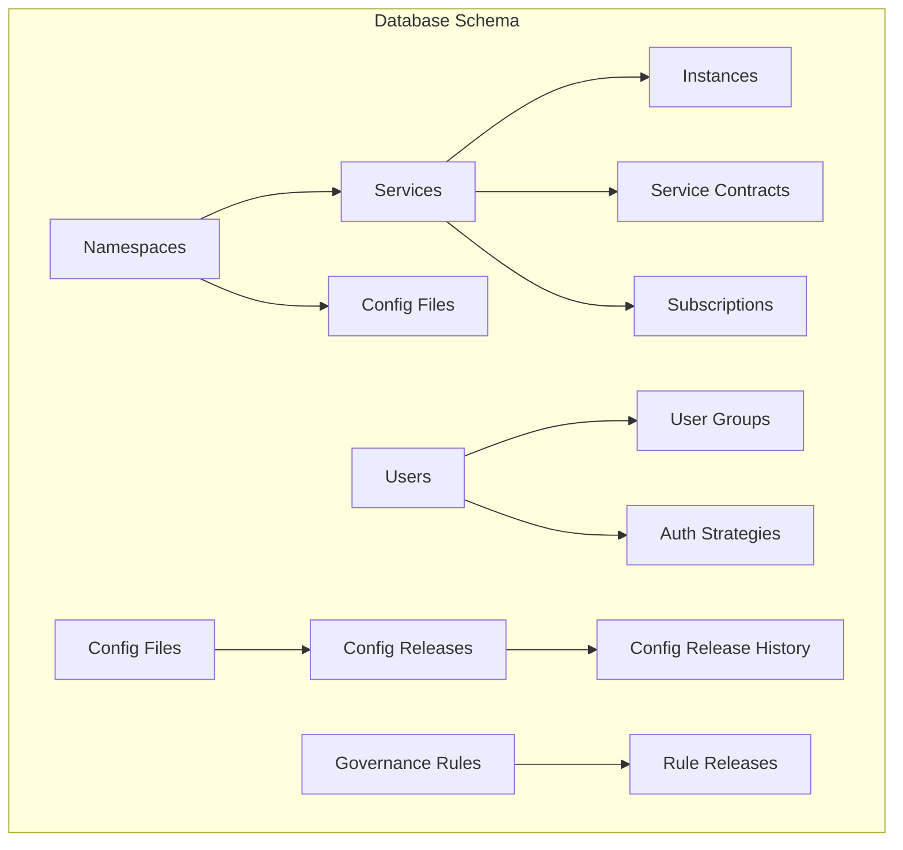
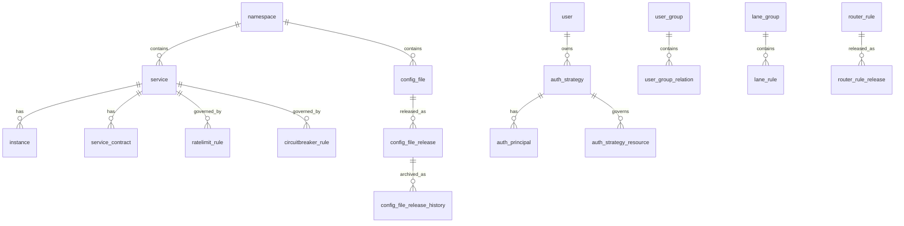
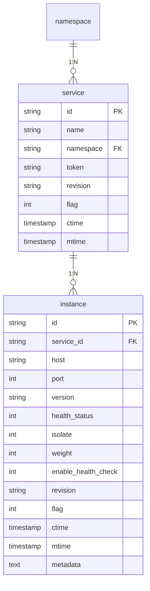
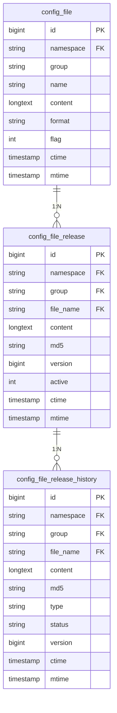
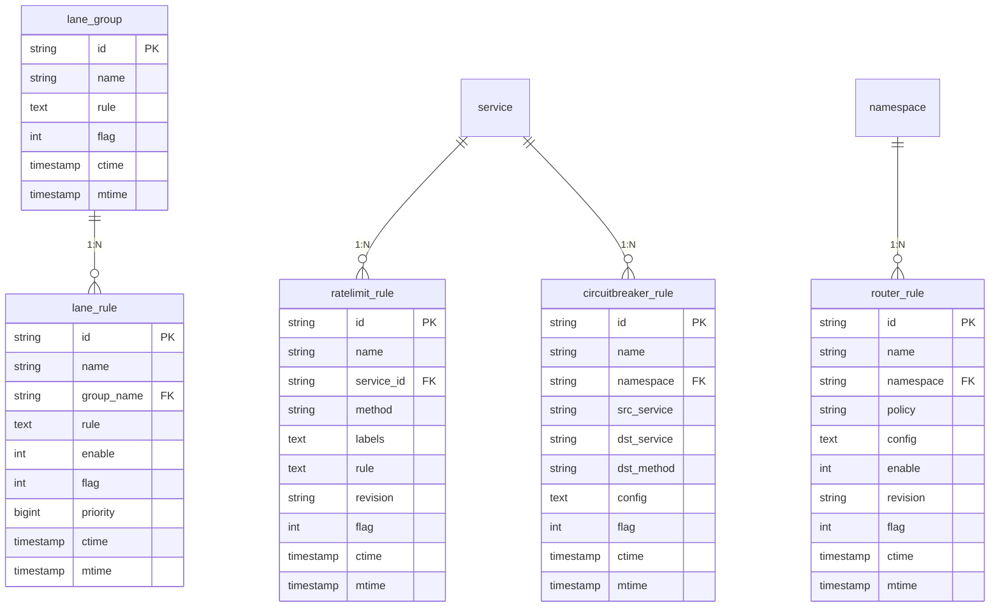
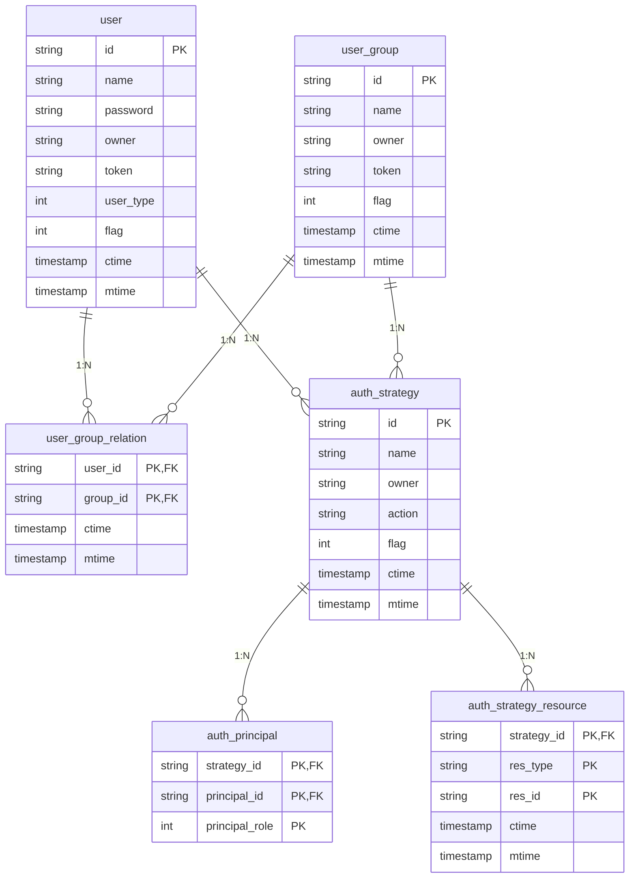
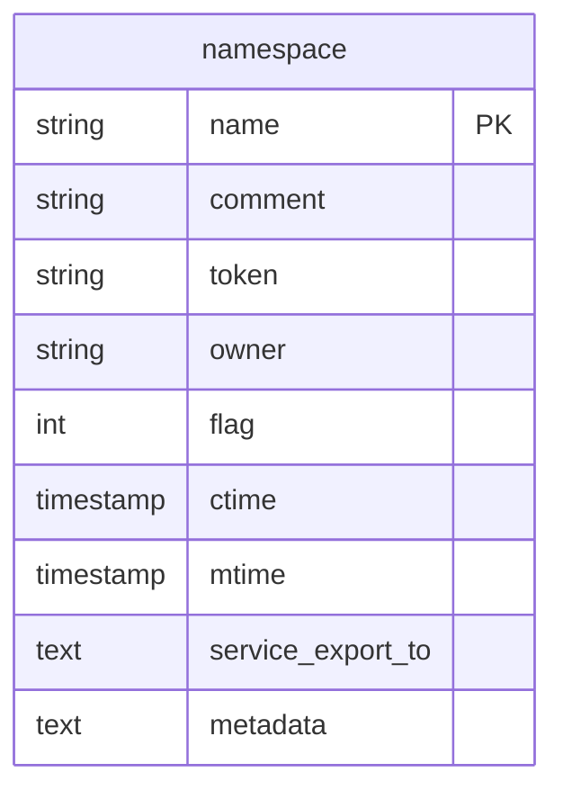
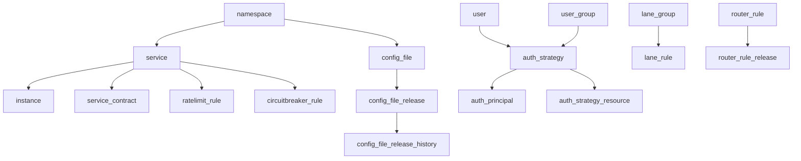

# Database Schema

<cite>
**Referenced Files in This Document**   
- [pole_server.sql](file://plugin/store/mysql/scripts/pole_server.sql)
- [service.go](file://plugin/store/mysql/service.go)
- [service_contract.go](file://plugin/store/mysql/service_contract.go)
- [config_file_release_history.go](file://plugin/store/mysql/config_file_release_history.go)
- [lane.go](file://plugin/store/mysql/lane.go)
- [circuitbreaker.go](file://plugin/store/mysql/circuitbreaker.go)
- [strategy.go](file://plugin/store/mysql/strategy.go)
- [common.go](file://plugin/store/mysql/common.go)
- [history_clean.go](file://pkg/admin/job/history_clean.go)
- [clean_deleted_resource.go](file://pkg/admin/job/clean_deleted_resource.go)
</cite>

## Table of Contents
1. [Introduction](#introduction)
2. [Project Structure](#project-structure)
3. [Core Components](#core-components)
4. [Architecture Overview](#architecture-overview)
5. [Detailed Component Analysis](#detailed-component-analysis)
6. [Dependency Analysis](#dependency-analysis)
7. [Performance Considerations](#performance-considerations)
8. [Troubleshooting Guide](#troubleshooting-guide)
9. [Conclusion](#conclusion)
10. [Appendices](#appendices)

## Introduction
This document provides comprehensive documentation for the MySQL database schema used by the pole-server system. The schema supports service discovery, configuration management, governance rules, user authentication, and namespace management in a microservices architecture. The database design follows a logical structure that enables efficient data access patterns while maintaining data integrity through proper indexing and constraints. This documentation details all tables, their relationships, data types, constraints, and usage patterns to provide a complete understanding of the database structure and its operational characteristics.

## Project Structure
The database schema is defined in SQL scripts located within the plugin/store/mysql/scripts directory of the repository. The primary schema definition file is pole_server.sql, which contains the complete DDL for all tables, indexes, and initial data. The Go code in the plugin/store/mysql package implements the data access layer that interacts with this schema. The overall structure follows a modular approach with separate tables for services, instances, configurations, governance rules, users, and namespaces, each with their respective metadata and relationship tables.



**Diagram sources**
- [pole_server.sql](file://plugin/store/mysql/scripts/pole_server.sql)

**Section sources**
- [pole_server.sql](file://plugin/store/mysql/scripts/pole_server.sql)

## Core Components
The database schema consists of several core components that support the service mesh functionality. These include service and instance management tables, configuration management tables, governance rules tables, user and authentication tables, and namespace management tables. Each component is designed to store specific types of data with appropriate relationships and constraints to ensure data integrity and efficient querying.

**Section sources**
- [pole_server.sql](file://plugin/store/mysql/scripts/pole_server.sql)

## Architecture Overview
The database architecture follows a normalized design pattern with entity tables, relationship tables, and history/audit tables. The schema supports both current state storage and historical tracking for configuration changes and rule updates. The architecture enables efficient querying through carefully designed indexes on frequently accessed columns and supports soft deletion through flag columns rather than physical deletion.



**Diagram sources**
- [pole_server.sql](file://plugin/store/mysql/scripts/pole_server.sql)

## Detailed Component Analysis

### Services and Instances Analysis
The service and instance tables form the core of the service discovery functionality. The service table stores metadata about each service including name, namespace, business information, and ownership details. The instance table stores information about individual service instances including host, port, health status, and metadata. These tables are linked by the service_id field, enabling efficient lookup of all instances for a given service.



**Diagram sources**
- [pole_server.sql](file://plugin/store/mysql/scripts/pole_server.sql#L200-L266)

**Section sources**
- [pole_server.sql](file://plugin/store/mysql/scripts/pole_server.sql#L200-L266)
- [service.go](file://plugin/store/mysql/service.go#L1112-L1151)

### Configuration Management Analysis
The configuration management system consists of multiple tables that support file-based configuration storage, versioning, and release management. The config_file table stores the current version of configuration files, while config_file_release tracks published versions. The config_file_release_history table maintains an audit trail of all configuration changes, enabling rollback and change tracking.



**Diagram sources**
- [pole_server.sql](file://plugin/store/mysql/scripts/pole_server.sql#L297-L371)

**Section sources**
- [pole_server.sql](file://plugin/store/mysql/scripts/pole_server.sql#L297-L371)
- [config_file_release_history.go](file://plugin/store/mysql/config_file_release_history.go#L39-L150)

### Governance Rules Analysis
The governance rules system supports various service governance patterns including rate limiting, circuit breaking, routing, and fault detection. Each rule type has a corresponding table (ratelimit_rule, circuitbreaker_rule, router_rule, etc.) and a release table that tracks published versions. The lane_rule and lane_group tables support canary release and traffic shaping through lane-based routing.



**Diagram sources**
- [pole_server.sql](file://plugin/store/mysql/scripts/pole_server.sql#L515-L813)

**Section sources**
- [pole_server.sql](file://plugin/store/mysql/scripts/pole_server.sql#L515-L813)
- [circuitbreaker.go](file://plugin/store/mysql/circuitbreaker.go#L765-L807)
- [lane.go](file://plugin/store/mysql/lane.go#L403-L620)

### Users and Authentication Analysis
The user management system supports fine-grained access control through users, user groups, roles, and authentication strategies. The user table stores user account information, while user_group and user_group_relation manage group membership. The auth_strategy table defines access policies, which are linked to principals (users or groups) through auth_principal and to resources through auth_strategy_resource.



**Diagram sources**
- [pole_server.sql](file://plugin/store/mysql/scripts/pole_server.sql#L372-L485)

**Section sources**
- [pole_server.sql](file://plugin/store/mysql/scripts/pole_server.sql#L372-L485)
- [strategy.go](file://plugin/store/mysql/strategy.go#L536-L585)

### Namespaces Analysis
The namespace table provides logical isolation for services, configurations, and other resources. Each namespace has a unique name, owner, and token for write operations. Namespaces enable multi-tenancy and organizational separation within the service mesh, allowing different teams or applications to manage their resources independently.



**Diagram sources**
- [pole_server.sql](file://plugin/store/mysql/scripts/pole_server.sql#L145-L198)

**Section sources**
- [pole_server.sql](file://plugin/store/mysql/scripts/pole_server.sql#L145-L198)

## Dependency Analysis
The database schema has well-defined relationships between tables that maintain referential integrity while supporting the application's functionality. The primary dependencies flow from namespaces to services, services to instances, and configuration files to their releases and history. The authentication system has dependencies from strategies to principals and resources, enabling flexible access control policies.



**Diagram sources**
- [pole_server.sql](file://plugin/store/mysql/scripts/pole_server.sql)

**Section sources**
- [pole_server.sql](file://plugin/store/mysql/scripts/pole_server.sql)

## Performance Considerations
The database schema includes several performance optimizations through indexing and query patterns. Most tables have indexes on mtime for time-based queries, and frequently queried fields like service_id, namespace, and name have dedicated indexes. The schema uses soft deletion (flag column) rather than physical deletion to maintain referential integrity and support audit requirements. For large tables like instance and config_file_release_history, partitioning or archiving strategies may be beneficial for long-term performance.

**Section sources**
- [pole_server.sql](file://plugin/store/mysql/scripts/pole_server.sql)

## Troubleshooting Guide
Common issues with the database schema typically relate to data consistency, performance degradation, or configuration errors. The history tables (config_file_release_history, etc.) provide valuable audit trails for troubleshooting configuration changes. The flag column pattern used for soft deletion means that queries must include flag = 0 conditions to retrieve active records. Performance issues may arise from missing indexes or large history tables, which can be addressed through proper indexing and data retention policies.

**Section sources**
- [pole_server.sql](file://plugin/store/mysql/scripts/pole_server.sql)
- [history_clean.go](file://pkg/admin/job/history_clean.go)
- [clean_deleted_resource.go](file://pkg/admin/job/clean_deleted_resource.go)

## Conclusion
The MySQL database schema for pole-server provides a comprehensive foundation for service discovery, configuration management, and governance in a microservices architecture. The schema design balances normalization with performance considerations, providing efficient data access patterns while maintaining data integrity. The inclusion of history tables for configuration and rule changes enables auditability and rollback capabilities. The authentication and authorization system supports fine-grained access control through a flexible policy model. Overall, the schema effectively supports the requirements of a modern service mesh control plane.

## Appendices

### Data Lifecycle Management
The system implements data lifecycle management through background jobs that clean up deleted resources and expired history records. The CleanConfigFileHistoryJob removes configuration release history older than a configurable retention period (default 7 days). Similarly, the CleanDeletedResourceJob removes logically deleted resources (instances, services, rules, etc.) after a grace period, ensuring referential integrity while preventing accumulation of stale data.

**Section sources**
- [history_clean.go](file://pkg/admin/job/history_clean.go)
- [clean_deleted_resource.go](file://pkg/admin/job/clean_deleted_resource.go)

### Migration Examples
Schema migrations are typically performed using SQL scripts that add columns, modify constraints, or create new tables. When adding new columns, it's important to consider default values and whether the column should allow NULL values. For example, adding a new metadata column to an existing table would use:
```sql
ALTER TABLE service ADD COLUMN metadata TEXT COMMENT 'service metadata' AFTER flag;
```
When modifying existing columns, care must be taken to ensure compatibility with existing data and application code. Version compatibility is maintained by ensuring that new schema versions remain backward compatible with older application versions, typically by making new columns optional or providing default values.

**Section sources**
- [pole_server.sql](file://plugin/store/mysql/scripts/pole_server.sql)