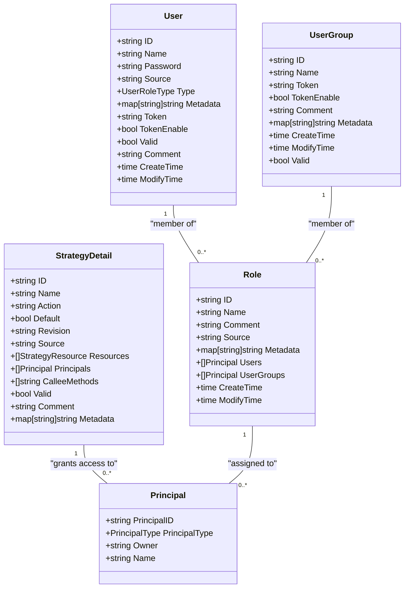
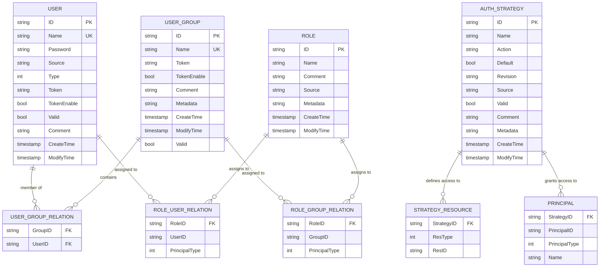
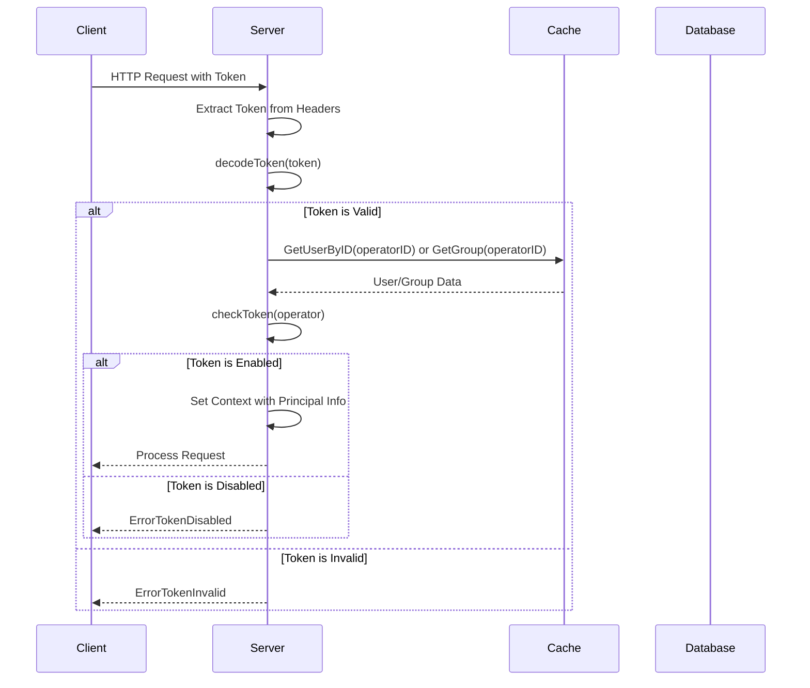
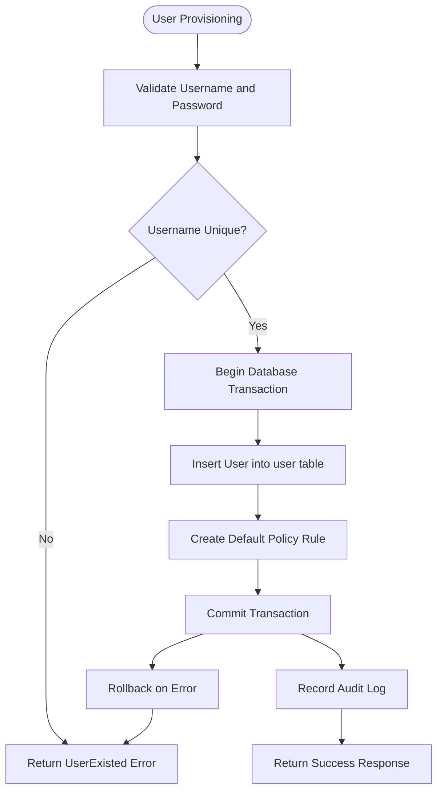

# Security & Access Control Schema

<cite>
**Referenced Files in This Document**   
- [user.go](file://plugin/access_control/auth/user/user.go)
- [group.go](file://plugin/access_control/auth/user/group.go)
- [policy.go](file://plugin/access_control/auth/policy/policy.go)
- [role.go](file://plugin/access_control/auth/policy/role.go)
- [auth.go](file://apis/pkg/types/auth/auth.go)
- [user.go](file://plugin/store/mysql/user.go)
- [user_group.go](file://plugin/store/mysql/user_group.go)
- [strategy.go](file://plugin/store/mysql/strategy.go)
- [token.go](file://plugin/access_control/auth/user/token.go)
</cite>

## Table of Contents
1. [Introduction](#introduction)
2. [Core Data Models](#core-data-models)
3. [Role-Based Access Control (RBAC) Implementation](#role-based-access-control-rbac-implementation)
4. [Policy Definitions and Relationships](#policy-definitions-and-relationships)
5. [Authentication Token Management](#authentication-token-management)
6. [Permission Checking and Indexing Strategy](#permission-checking-and-indexing-strategy)
7. [Common Security Operations](#common-security-operations)
8. [Conclusion](#conclusion)

## Introduction

The security and access control schema in the pole-server system provides a comprehensive framework for managing user identities, group memberships, role assignments, and fine-grained access policies. This documentation details the data model and implementation of the access control system, focusing on the users, user groups, roles, and policy rules that govern authorization decisions. The system implements a robust Role-Based Access Control (RBAC) model, where permissions are assigned through role memberships and policy rules that link principals (users, groups, roles) to resources. Authentication is managed through secure token mechanisms with configurable enablement and expiration policies. The design emphasizes scalability, auditability, and efficient permission checking through optimized data structures and indexing strategies.

## Core Data Models

The access control system is built upon several core data models that represent identities, resources, and their relationships. The primary entities are users, user groups, roles, and policy rules, each with specific attributes and constraints that define their behavior and interactions within the system.

### Users Table

The users table represents individual identities within the system. Each user is uniquely identified by an ID and has associated metadata that defines their properties and access rights.

**Table: Users**
| Column | Type | Description | Constraints |
| :--- | :--- | :--- | :--- |
| ID | string | Unique identifier for the user | Primary Key, Not Null |
| Name | string | Username for login and identification | Unique (with owner), Not Null |
| Password | string | Hashed password for authentication | Not Null |
| Source | string | Origin or source of the user account | Optional |
| Type | UserRoleType | Role type (Owner or SubAccount) | Not Null |
| Metadata | map[string]string | Key-value pairs for additional user information | Optional |
| Token | string | Authentication token for API access | Not Null |
| TokenEnable | boolean | Flag indicating if the token is active | Not Null, Default: true |
| Valid | boolean | Flag indicating if the user account is valid | Not Null, Default: true |
| Comment | string | Description or notes about the user | Optional |
| CreateTime | time | Timestamp when the user was created | Not Null |
| ModifyTime | time | Timestamp when the user was last modified | Not Null |

**Section sources**
- [auth.go](file://apis/pkg/types/auth/auth.go#L191-L258)
- [user.go](file://plugin/access_control/auth/user/user.go#L0-L650)
- [user.go](file://plugin/store/mysql/user.go#L0-L420)

### User Groups Table

The user groups table represents collections of users that can be managed collectively for access control purposes. Groups simplify permission management by allowing policies to be applied to a group rather than individual users.

**Table: User Groups**
| Column | Type | Description | Constraints |
| :--- | :--- | :--- | :--- |
| ID | string | Unique identifier for the user group | Primary Key, Not Null |
| Name | string | Name of the user group | Unique (with owner), Not Null |
| Token | string | Authentication token for group-based API access | Not Null |
| TokenEnable | boolean | Flag indicating if the group token is active | Not Null, Default: true |
| Comment | string | Description or notes about the group | Optional |
| Metadata | map[string]string | Key-value pairs for additional group information | Optional |
| CreateTime | time | Timestamp when the group was created | Not Null |
| ModifyTime | time | Timestamp when the group was last modified | Not Null |
| Valid | boolean | Flag indicating if the group is valid | Not Null, Default: true |

**Section sources**
- [group.go](file://plugin/access_control/auth/user/group.go#L0-L590)
- [user_group.go](file://plugin/store/mysql/user_group.go#L0-L410)

### Roles Table

The roles table defines named sets of permissions that can be assigned to users or groups. Roles serve as a template for access rights, enabling consistent policy application across multiple principals.

**Table: Roles**
| Column | Type | Description | Constraints |
| :--- | :--- | :--- | :--- |
| ID | string | Unique identifier for the role | Primary Key, Not Null |
| Name | string | Name of the role | Not Null |
| Comment | string | Description or notes about the role | Optional |
| Source | string | Origin or source of the role | Optional |
| Metadata | map[string]string | Key-value pairs for additional role information | Optional |
| Users | []Principal | List of users assigned to this role | Optional |
| UserGroups | []Principal | List of user groups assigned to this role | Optional |
| CreateTime | time | Timestamp when the role was created | Not Null |
| ModifyTime | time | Timestamp when the role was last modified | Not Null |

**Section sources**
- [role.go](file://plugin/access_control/auth/policy/role.go#L0-L251)

## Role-Based Access Control (RBAC) Implementation

The Role-Based Access Control (RBAC) system in pole-server implements a flexible and hierarchical permission model where access rights are granted through role memberships and policy rules. The implementation follows a principal-based approach, where users, user groups, and roles are all treated as principals that can be granted permissions to access specific resources.

The core of the RBAC implementation lies in the relationship between principals and policy rules. A principal (user, group, or role) is granted access to a resource by being explicitly listed in the `Principals` field of a policy rule. The system supports both direct assignment, where a user or group is directly linked to a policy, and indirect assignment through role membership, where a principal inherits permissions from the roles they are assigned to.

The `Principal` struct, defined in the system, unifies the representation of different principal types. It contains fields for `PrincipalID`, `PrincipalType` (distinguishing between User, Group, and Role), `Owner`, and `Name`. This abstraction allows the policy engine to uniformly process authorization requests regardless of the principal type. When a user or group is assigned to a role, the role's ID is added to the respective `Users` or `UserGroups` list in the role's definition. The policy engine then resolves these memberships during permission checks, effectively expanding the set of principals that are eligible for the permissions defined in the role's associated policies.

The system also implements a default policy mechanism that automatically grants baseline permissions to new users and groups. For example, when a new user is created, the system automatically creates a default policy rule that grants the user read-write access to all resources. This ensures that new principals have a functional set of permissions by default, which can then be refined through additional policy rules. The creation of these default policies is handled by the `CreatePrincipalPolicy` method in the policy helper, which is invoked during the user or group creation process.

**Diagram sources **
- [auth.go](file://apis/pkg/types/auth/auth.go#L191-L258)
- [policy.go](file://plugin/access_control/auth/policy/policy.go#L0-L799)
- [role.go](file://plugin/access_control/auth/policy/role.go#L0-L251)

**Section sources**
- [policy.go](file://plugin/access_control/auth/policy/policy.go#L0-L799)
- [role.go](file://plugin/access_control/auth/policy/role.go#L0-L251)

## Policy Definitions and Relationships

Policy definitions are the cornerstone of the access control system, serving as the explicit rules that determine which principals (users, groups, or roles) can perform specific actions on designated resources. A policy rule, represented by the `StrategyDetail` struct, is a comprehensive object that encapsulates all the necessary information for an authorization decision.

Each policy rule has a unique `ID` and a human-readable `Name`. The `Action` field specifies whether the rule allows (`ALLOW`) or denies (`DENY`) access. The `Resources` field is a list of `StrategyResource` objects, each identifying a specific resource by its `ResType` (e.g., Namespaces, Services, ConfigGroups) and `ResID` (the unique identifier of the resource instance). The `Principals` field is a list of `Principal` objects that are granted the permissions defined by this rule. The system supports wildcards (e.g., `*`) in the `ResID` field, allowing a single policy to grant access to all resources of a particular type.

The relationships between policies, principals, and resources are managed through dedicated storage interfaces and caching mechanisms. The `StrategyStore` interface in the `auth_api.go` file defines the operations for managing policy rules, including `AddStrategy`, `UpdateStrategy`, `DeleteStrategy`, and `GetStrategyDetail`. The `GetStrategyResources` method is particularly important for permission checking, as it efficiently retrieves all resources that a given principal is authorized to access by querying the `auth_strategy_resource` table.

The system also implements a sophisticated query mechanism for retrieving policies from the perspective of either a principal or a resource. The `GetPolicies` method in the `policy.go` file handles these queries, applying different filtering logic based on the context. When querying from a user's perspective, the system automatically injects filters based on the user's role (e.g., only showing policies owned by a main user). When querying from a resource's perspective, the system ignores these role-based restrictions to provide a complete view of all policies affecting that resource.

**Diagram sources **
- [auth_api.go](file://apis/store/auth_api.go#L76-L96)
- [strategy.go](file://plugin/store/mysql/strategy.go#L0-L49)
- [user.go](file://plugin/store/mysql/user.go#L0-L420)
- [user_group.go](file://plugin/store/mysql/user_group.go#L0-L410)

**Section sources**
- [policy.go](file://plugin/access_control/auth/policy/policy.go#L0-L799)
- [strategy.go](file://plugin/store/mysql/strategy.go#L0-L49)

## Authentication Token Management

The authentication token management system provides a secure mechanism for API access and user identification. Tokens are generated for both individual users and user groups, serving as credentials for authenticating requests to the system. The token lifecycle is managed through a combination of storage, caching, and validation mechanisms.

Tokens are stored in the `user` and `user_group` tables within the database, in the `Token` column. The `TokenEnable` flag controls whether a token is active; if set to `false`, any request using that token will be rejected with a `ErrorTokenDisabled` error. This allows administrators to quickly disable access for a user or group without deleting their account.

The token validation process is initiated by the `CheckCredential` method in the `user.go` file. This method is called at the beginning of most API requests to verify the authenticity of the provided token. The process involves several steps: first, the token is extracted from the HTTP request headers (either `Authorization` or `X-Polaris-Token`). The `decodeToken` function then parses the token to extract the operator information, including the `OperatorID` and whether it is a user or group token. The `checkToken` function performs additional validation, such as verifying the token's integrity and checking the `TokenEnable` flag. If the token is valid, the user's or group's information is retrieved from the cache, and the context is enriched with the principal's details.

The system also provides a mechanism for token rotation. The `ResetUserToken` and `ResetGroupToken` methods generate a new, cryptographically secure token and update it in the database. This is useful for security best practices, allowing tokens to be refreshed periodically. The token generation itself is handled by the `createUserToken` and `createGroupToken` functions, which use a combination of the user/group ID and a system-wide salt to produce a unique and unpredictable token.

**Diagram sources **
- [user.go](file://plugin/access_control/auth/user/user.go#L0-L650)
- [token.go](file://plugin/access_control/auth/user/token.go#L0-L39)

**Section sources**
- [user.go](file://plugin/access_control/auth/user/user.go#L0-L650)
- [token.go](file://plugin/access_control/auth/user/token.go#L0-L39)

## Permission Checking and Indexing Strategy

The permission checking system is designed for high performance and low latency, leveraging a combination of in-memory caching and optimized database queries. The core of the permission checking logic is the `GetPrincipalResources` method, which efficiently determines all resources a given principal is authorized to access.

The indexing strategy is centered around the `auth_strategy_resource` table in the database. This table has a composite primary key consisting of `strategy_id` and `res_id`, ensuring fast lookups for specific strategy-resource pairs. More importantly, it has a secondary index on the `strategy_id` column, which is crucial for the `GetStrategyResources` query. This query, which retrieves all resources associated with a principal, works by first finding all strategies that the principal is linked to (via the `auth_principal` table) and then joining to the `auth_strategy_resource` table using the `strategy_id` index. This design allows the database to quickly locate all relevant resource entries for a given principal without requiring a full table scan.

The system further optimizes performance by maintaining an in-memory cache of policy rules and principal-resource mappings. The `policyCache` struct in the `policy.go` file implements a sophisticated caching layer that stores pre-computed authorization data. This cache is updated whenever a policy rule is created, updated, or deleted, ensuring that the in-memory representation remains consistent with the database. For frequently accessed principals or resources, this cache can dramatically reduce the number of database queries required for permission checks.

The query patterns for permission checking are designed to be as efficient as possible. When a user needs to be checked for access to a specific resource, the system can use the `GetResourcePrincipals` method, which queries the policy cache for all principals associated with that resource. Conversely, when a user needs to list all resources they can access, the `GetPrincipalResources` method is used, which aggregates the results from all policies the user is a part of. Both of these operations are optimized to minimize database load and response time, making the access control system scalable to large numbers of users, groups, and resources.

**Section sources**
- [strategy.go](file://plugin/store/mysql/strategy.go#L536-L585)
- [policy.go](file://plugin/access_control/auth/policy/policy.go#L0-L799)
- [policy.go](file://pkg/cache/auth/policy.go#L0-L48)

## Common Security Operations

This section documents common security operations performed within the system, including user provisioning and role assignment. These operations are implemented as API endpoints that follow a consistent pattern of validation, transactional execution, and audit logging.

### User Provisioning

User provisioning is handled by the `CreateUser` method in the `user.go` file. The process begins with validation: the system checks that the username is unique within the owner's namespace and that the provided password meets complexity requirements. Once validated, the operation begins a database transaction. Within this transaction, the user record is inserted into the `user` table, and a default policy rule is created that grants the new user full access to their resources. The use of a transaction ensures that both the user creation and the policy creation are atomic; if either step fails, the entire operation is rolled back, preventing the creation of an orphaned user without permissions. After a successful commit, an audit log entry is recorded using the `userRecordEntry` function, capturing the details of the operation for compliance and troubleshooting.

### Role Assignment

Role assignment is managed through the `UpdateRole` method in the `role.go` file. This operation allows administrators to assign users and user groups to a role by updating the `Users` and `UserGroups` lists in the role's definition. The method first retrieves the existing role data from the database to ensure it exists and to compare the new data with the current state. If any changes are detected (e.g., new users added, existing users removed), the updated role data is written back to the database. The system does not create new policy rules during this operation; instead, the assignment takes effect when the policy engine resolves the role's membership during a permission check. An audit log entry is created to record the change in role membership.

**Diagram sources **
- [user.go](file://plugin/access_control/auth/user/user.go#L0-L650)

**Section sources**
- [user.go](file://plugin/access_control/auth/user/user.go#L0-L650)
- [role.go](file://plugin/access_control/auth/policy/role.go#L0-L251)

## Conclusion

The security and access control schema in the pole-server system provides a robust and scalable framework for managing identities and permissions. By implementing a comprehensive RBAC model with support for users, user groups, and roles, the system offers flexible and granular access control. The use of policy rules as the central mechanism for defining permissions ensures that authorization decisions are explicit, auditable, and easy to manage. The integration of secure token-based authentication, efficient permission checking through optimized indexing and caching, and comprehensive audit logging makes this system well-suited for production environments with demanding security requirements. The clear separation of concerns between the data models, storage layer, and business logic ensures that the system is maintainable and extensible.