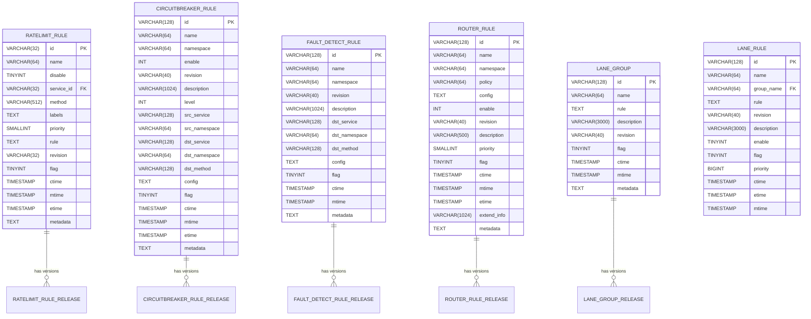
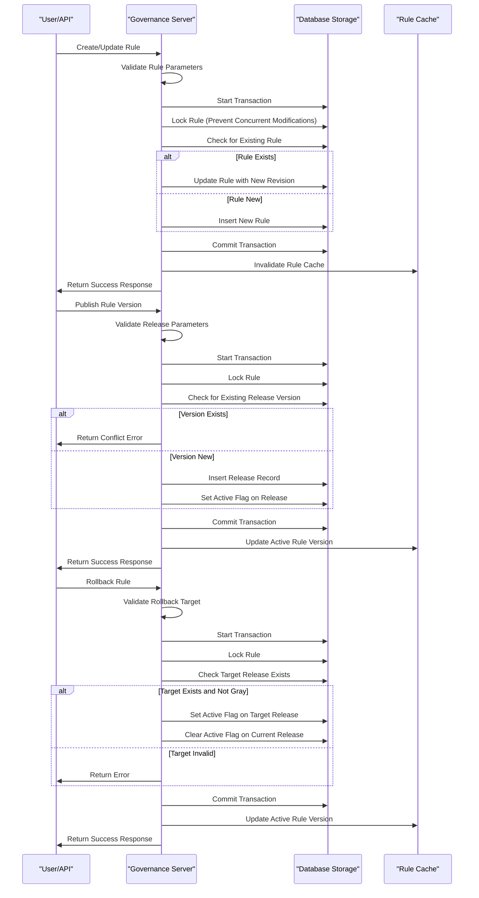

# Service Governance Schema

<cite>
**Referenced Files in This Document**   
- [governance_api.go](file://apis/store/governance_api.go)
- [release.go](file://apis/pkg/types/rules/release.go)
- [pole_server.sql](file://plugin/store/mysql/scripts/pole_server.sql)
- [ratelimit_rule.go](file://pkg/goverrule/ratelimit_rule.go)
- [circuitbreaker_rule.go](file://pkg/goverrule/circuitbreaker_rule.go)
- [faultdetect_rule.go](file://pkg/goverrule/faultdetect_rule.go)
- [router_rule.go](file://pkg/goverrule/router_rule.go)
- [lane_rule.go](file://pkg/goverrule/lane_rule.go)
- [releases.go](file://pkg/goverrule/releases.go)
</cite>

## Table of Contents
1. [Introduction](#introduction)
2. [Core Governance Rule Types](#core-governance-rule-types)
3. [Rule Storage and Release Mechanism](#rule-storage-and-release-mechanism)
4. [Relationship with Services and Namespaces](#relationship-with-services-and-namespaces)
5. [Rule Condition Storage and Matching](#rule-condition-storage-and-matching)
6. [Rule Lifecycle Management](#rule-lifecycle-management)
7. [Complex Rule Queries and Evaluation](#complex-rule-queries-and-evaluation)

## Introduction
The Service Governance Schema defines a comprehensive framework for managing various service governance policies within the system. This includes rate limiting, circuit breaking, fault detection, routing rules, and lane configurations. The schema provides a structured approach to define, store, release, and evaluate governance rules that control service interactions and ensure system stability. Governance rules are organized by type and can be associated with specific services and namespaces, allowing for fine-grained control over service behavior. The system supports rule inheritance through namespaces, enabling consistent policy application across service hierarchies. Rules are stored in a relational database with a release mechanism that supports versioning, rollback, and lifecycle management.

**Section sources**
- [governance_api.go](file://apis/store/governance_api.go#L0-L42)

## Core Governance Rule Types

### Rate Limiting Rules
Rate limiting rules control the maximum number of requests that can be processed by a service within a specified time window. These rules are defined by thresholds and durations, and can be applied based on various matching conditions such as service, method, and metadata labels. The rules support different rate limiting algorithms and can specify actions to take when limits are exceeded, such as rejecting requests or queuing them.

**Section sources**
- [ratelimit_rule.go](file://pkg/goverrule/ratelimit_rule.go#L0-L471)

### Circuit Breaking Rules
Circuit breaking rules implement the circuit breaker pattern to prevent cascading failures in distributed systems. These rules monitor service health metrics such as error rates and response times, and automatically open the circuit when thresholds are exceeded. The rules define conditions for tripping the circuit, recovery strategies, and fallback behaviors. They can be configured at various levels, including service-to-service, service-to-method, and with specific source service constraints.

**Section sources**
- [circuitbreaker_rule.go](file://pkg/goverrule/circuitbreaker_rule.go#L0-L313)

### Fault Detection Rules
Fault detection rules define proactive health checking mechanisms for service instances. These rules specify the frequency, timeout, and protocol for health checks, as well as the criteria for determining instance health. The rules can be configured for different protocols (HTTP, TCP, UDP) and include specific configuration parameters for each protocol type. They enable the system to detect and isolate unhealthy instances before they impact service consumers.

**Section sources**
- [faultdetect_rule.go](file://pkg/goverrule/faultdetect_rule.go#L0-L290)

### Routing Rules
Routing rules determine how service requests are distributed among available instances. These rules support various routing strategies such as weighted round-robin, least connections, and consistent hashing. They can include complex matching conditions based on request metadata, client attributes, and service characteristics. Routing rules enable features like canary deployments, A/B testing, and geographic routing by directing traffic according to predefined policies.

**Section sources**
- [router_rule.go](file://pkg/goverrule/router_rule.go#L0-L327)

### Lane Configuration Rules
Lane configuration rules implement traffic isolation and segmentation through the concept of "lanes." These rules define lane groups and lane rules that categorize traffic based on specific attributes such as user groups, application versions, or business contexts. Lanes enable controlled traffic flow between different service versions or environments, supporting use cases like blue-green deployments and feature flagging. The rules include priority settings and enable/disable controls for managing lane activation.

**Section sources**
- [lane_rule.go](file://pkg/goverrule/lane_rule.go#L0-L443)

## Rule Storage and Release Mechanism

### Rule Storage Schema
Governance rules are stored in a relational database with dedicated tables for each rule type. The core rule tables include `ratelimit_rule`, `circuitbreaker_rule`, `fault_detect_rule`, `router_rule`, and `lane_rule`. Each rule table contains fields for rule identification, configuration data, metadata, timestamps, and status flags. The configuration data is stored as serialized JSON or text, allowing for flexible rule definitions that can evolve over time without requiring database schema changes.

**Diagram sources **
- [pole_server.sql](file://plugin/store/mysql/scripts/pole_server.sql#L748-L800)

### Rule Release and Versioning
The governance system implements a release mechanism that separates rule definition from activation. Each rule type has a corresponding release table (e.g., `ratelimit_rule_release`, `circuitbreaker_rule_release`) that stores published versions of rules. The release process creates a new entry in the release table with a unique version number, allowing for version tracking and rollback capabilities. Rules can be published as full releases or gray (canary) releases, enabling gradual rollout of changes. The active flag in release tables indicates whether a particular version is currently in effect.

**Section sources**
- [releases.go](file://pkg/goverrule/releases.go#L0-L743)

## Relationship with Services and Namespaces

### Service Association
Governance rules are associated with services through explicit references in the rule configuration. Rate limiting and circuit breaking rules directly reference service IDs or service names within specific namespaces. This association enables the system to apply rules to specific service endpoints and methods. The relationship is maintained through foreign key constraints in the database schema, ensuring referential integrity between rules and services.

### Namespace Inheritance
The governance system supports rule inheritance through namespaces, allowing rules defined at a higher namespace level to be inherited by services in child namespaces. This hierarchical approach enables consistent policy application across service groups while allowing for overrides at lower levels. Namespace inheritance is implemented through the namespace field in rule definitions, with rules matching services based on namespace hierarchy. The system evaluates rules from the most specific namespace to the most general, applying the first matching rule.

**Section sources**
- [circuitbreaker_rule.go](file://pkg/goverrule/circuitbreaker_rule.go#L0-L313)
- [ratelimit_rule.go](file://pkg/goverrule/ratelimit_rule.go#L0-L471)

## Rule Condition Storage and Matching

### Condition Storage Format
Rule conditions are stored in a flexible format that supports complex matching logic. For most rule types, conditions are serialized as JSON strings in the rule table's config or rule column. This approach allows for evolving rule schemas without requiring database migrations. The JSON structure includes fields for match conditions, thresholds, durations, and action configurations. For example, circuit breaking rules store error conditions, trigger conditions, and recovery conditions in a structured JSON format that can be easily parsed and evaluated.

### Indexing Strategy
The system employs a comprehensive indexing strategy to ensure efficient rule matching during request processing. Primary indexes are created on rule ID and name fields for fast lookups. Additional indexes are created on service ID, namespace, and method fields to support efficient querying by service context. Timestamp indexes (mtime) enable fast retrieval of recently modified rules for cache invalidation. The indexing strategy is designed to optimize the most common query patterns, such as finding all rules for a specific service or retrieving the latest version of a rule by name.

**Section sources**
- [pole_server.sql](file://plugin/store/mysql/scripts/pole_server.sql#L748-L800)

## Rule Lifecycle Management

### Creation and Modification
Governance rules are created and modified through a transactional process that ensures data consistency. The creation process involves validating rule parameters, generating unique identifiers, and storing the rule in the appropriate rule table. Modifications follow a similar process, with additional steps to preserve rule history and manage versioning. The system supports batch operations for creating, updating, and deleting multiple rules in a single request, improving efficiency for bulk operations.

### Publication and Activation
The rule publication process separates rule definition from activation, enabling safe deployment of changes. When a rule is published, a new version is created in the corresponding release table with an incremented version number. The publication process includes validation steps to ensure the rule is complete and consistent. Activation occurs when the active flag is set on a release, making that version the current configuration. The system supports both immediate activation and scheduled activation through the etime field.

### Rollback and Deprecation
The governance system provides robust rollback capabilities to revert to previous rule versions in case of issues. Rollback operations are implemented through the rollback API, which validates the target version and activates it by updating the active flag in the release table. The system prevents rollback to gray (canary) releases to maintain deployment safety. Deprecation of rules is handled through soft deletion, where the flag field is set to indicate the rule is no longer active, while preserving the historical record for auditing and troubleshooting.

**Diagram sources **
- [releases.go](file://pkg/goverrule/releases.go#L0-L743)
- [ratelimit_rule.go](file://pkg/goverrule/ratelimit_rule.go#L0-L471)

## Complex Rule Queries and Evaluation

### Query Patterns
The system supports complex query patterns for retrieving governance rules based on various criteria. Queries can filter rules by service, namespace, rule name, creation time, and custom metadata. The system implements pagination through offset and limit parameters to handle large result sets efficiently. Advanced queries can combine multiple filter conditions using AND logic, enabling precise rule retrieval for management and auditing purposes.

### Evaluation Logic
Rule evaluation follows a prioritized matching strategy where rules are processed in order of specificity and priority. For each request, the system identifies all potentially applicable rules based on service, method, and metadata matches. Rules are then sorted by priority, with higher priority rules taking precedence. The evaluation process includes condition checking against request attributes and current system state, with short-circuit evaluation to improve performance. The final decision is based on the first matching rule in the priority order, ensuring predictable behavior.

**Section sources**
- [releases.go](file://pkg/goverrule/releases.go#L0-L743)
- [ratelimit_rule.go](file://pkg/goverrule/ratelimit_rule.go#L0-L471)