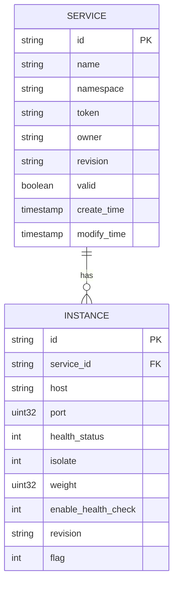
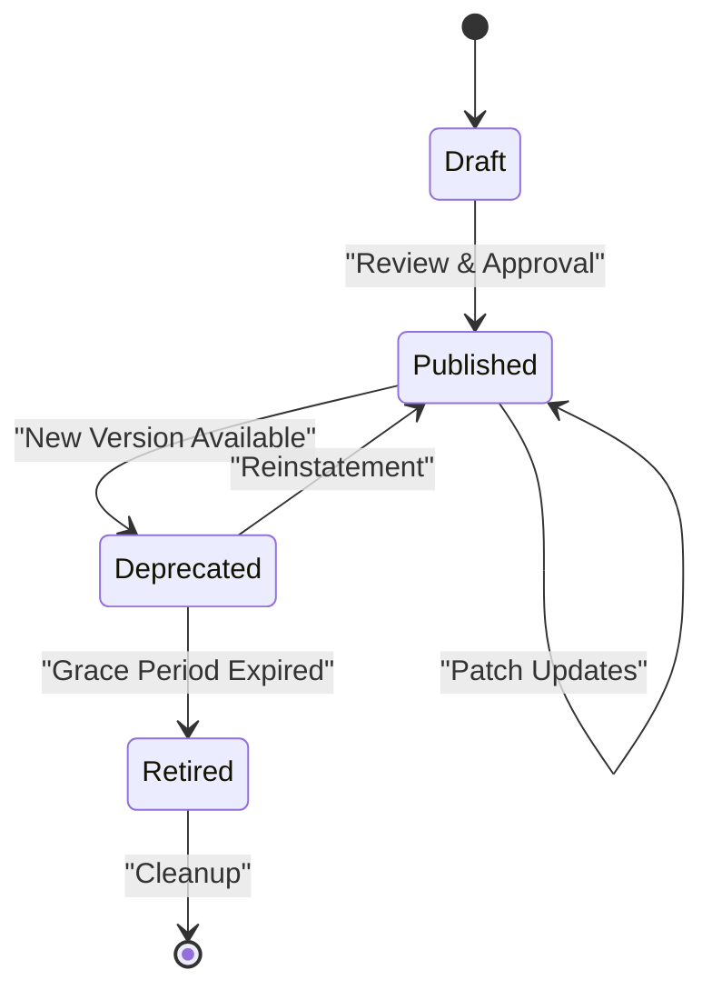

# Service Management Schema

<cite>
**Referenced Files in This Document**   
- [service.go](file://apis/pkg/types/service/service.go)
- [instance.go](file://apis/pkg/types/service/instance.go)
- [contract.go](file://apis/pkg/types/service/contract.go)
- [service.go](file://plugin/store/mysql/service.go)
- [instance.go](file://plugin/store/mysql/instance.go)
- [service_contract.go](file://plugin/store/mysql/service_contract.go)
</cite>

## Table of Contents
1. [Introduction](#introduction)
2. [Core Data Models](#core-data-models)
3. [Entity Relationships](#entity-relationships)
4. [Service Contract Enforcement](#service-contract-enforcement)
5. [Versioning Mechanism](#versioning-mechanism)
6. [Common Queries](#common-queries)
7. [Performance Considerations](#performance-considerations)
8. [Indexing Strategy](#indexing-strategy)

## Introduction

The service management schema provides a comprehensive data model for managing microservices in a distributed system. This documentation details the core components including services, instances, and service contracts, along with their relationships, constraints, and operational mechanisms. The schema supports service discovery, health monitoring, contract enforcement, and version management, enabling robust service governance in dynamic environments.

## Core Data Models

This section details the primary data models used in the service management system, including their columns, data types, constraints, and indexes.

### Services Table

The services table stores metadata about available services in the system.

**Table Schema**
| Column Name | Data Type | Constraints | Description |
|-------------|-----------|-------------|-------------|
| ID | string | Primary Key, Not Null | Unique identifier for the service |
| Name | string | Not Null | Service name |
| Namespace | string | Not Null | Service namespace for isolation |
| Business | string | - | Business unit ownership |
| Ports | string | - | Port configuration as JSON string |
| Meta | JSON | - | Metadata key-value pairs |
| Comment | string | - | Description of the service |
| Department | string | - | Organizational department |
| CmdbMod1-3 | string | - | CMDB module identifiers |
| Token | string | Not Null | Authentication token |
| Owner | string | Not Null | Service owner |
| Revision | string | Not Null | Version identifier |
| Reference | string | - | Reference to source service (for aliases) |
| PlatformID | string | - | Platform identifier |
| Valid | boolean | Not Null | Logical deletion flag |
| CreateTime | timestamp | Not Null | Creation timestamp |
| ModifyTime | timestamp | Not Null | Last modification timestamp |
| Mtime | int64 | - | Modification time in Unix format |
| Ctime | int64 | - | Creation time in Unix format |
| ExportTo | JSON | - | Service visibility configuration |

**Indexes**
- Primary Key: ID
- Unique Constraint: (Name, Namespace) where flag = 0
- Index: ModifyTime (for incremental updates)
- Index: Namespace (for namespace-based queries)

**Section sources**
- [service.go](file://apis/pkg/types/service/service.go#L15-L166)
- [service.go](file://plugin/store/mysql/service.go#L15-L799)

### Instances Table

The instances table tracks individual service instances and their health status.

**Table Schema**
| Column Name | Data Type | Constraints | Description |
|-------------|-----------|-------------|-------------|
| ID | string | Primary Key, Not Null | Unique identifier for the instance |
| ServiceID | string | Foreign Key, Not Null | References services.ID |
| Host | string | Not Null | Hostname or IP address |
| VpcID | string | - | Virtual Private Cloud identifier |
| Port | uint32 | Not Null | Service port |
| Protocol | string | - | Communication protocol |
| Version | string | - | Instance version |
| HealthStatus | int | Not Null | 0=unhealthy, 1=healthy |
| Isolate | int | Not Null | 0=active, 1=isolated |
| Weight | uint32 | Not Null | Load balancing weight |
| EnableHealthCheck | int | Not Null | Health check enabled flag |
| CheckType | int32 | - | Type of health check |
| TTL | uint32 | - | Time-to-live for heartbeat |
| Priority | uint32 | Not Null | Routing priority |
| Revision | string | Not Null | Version identifier |
| LogicSet | string | - | Logical set for routing |
| Region | string | - | Geographic region |
| Zone | string | - | Availability zone |
| Campus | string | - | Campus location |
| Meta | JSON | - | Instance metadata |
| Flag | int | Not Null | Logical deletion flag |
| CreateTime | int64 | Not Null | Creation timestamp |
| ModifyTime | int64 | Not Null | Last modification timestamp |

**Indexes**
- Primary Key: ID
- Index: ServiceID (for service-based queries)
- Composite Index: (ServiceID, Host) for instance lookup
- Index: HealthStatus (for health-based queries)
- Index: Isolate (for isolation status)
- Index: ModifyTime (for incremental updates)

**Section sources**
- [instance.go](file://apis/pkg/types/service/instance.go#L15-L708)
- [instance.go](file://plugin/store/mysql/instance.go#L15-L799)

### Service Contracts Table

The service contracts table manages API contracts between services.

**Table Schema**
| Column Name | Data Type | Constraints | Description |
|-------------|-----------|-------------|-------------|
| ID | string | Primary Key, Not Null | Unique identifier for the contract |
| Namespace | string | Not Null | Service namespace |
| Service | string | Not Null | Service name |
| Type | string | Not Null | Contract type |
| Protocol | string | Not Null | Communication protocol (http/grpc/dubbo/thrift) |
| Version | string | Not Null | Contract version |
| Revision | string | Not Null | Version identifier |
| Content | text | - | Contract content |
| ContentDigest | string | - | Content hash for comparison |
| Metadata | JSON | - | Contract metadata |
| MetadataStr | string | - | Serialized metadata |
| CreateTime | timestamp | Not Null | Creation timestamp |
| ModifyTime | timestamp | Not Null | Last modification timestamp |
| Valid | boolean | Not Null | Logical deletion flag |

**Service Contract Details Table**
| Column Name | Data Type | Constraints | Description |
|-------------|-----------|-------------|-------------|
| ID | string | Primary Key, Not Null | Unique identifier for the interface |
| ContractID | string | Foreign Key, Not Null | References service_contract.ID |
| Namespace | string | Not Null | Interface namespace |
| Service | string | Not Null | Service name |
| Protocol | string | Not Null | Communication protocol |
| Version | string | Not Null | Interface version |
| Type | string | Not Null | Interface type |
| Method | string | Not Null | HTTP method or operation name |
| Path | string | Not Null | Endpoint path |
| Content | text | - | Interface specification |
| ContentDigest | string | - | Content hash |
| Revision | string | Not Null | Version identifier |
| Source | int | Not Null | 1=manual, 2=client-discovered |
| CreateTime | timestamp | Not Null | Creation timestamp |
| ModifyTime | timestamp | Not Null | Last modification timestamp |
| Valid | boolean | Not Null | Logical deletion flag |

**Indexes**
- Primary Key: ID
- Composite Index: (Namespace, Service, Protocol, Version) for contract lookup
- Index: ModifyTime (for incremental updates)
- Index: ContractID (for contract details)
- Composite Index: (ContractID, Method, Path, Type) for interface lookup

**Section sources**
- [contract.go](file://apis/pkg/types/service/contract.go#L15-L208)
- [service_contract.go](file://plugin/store/mysql/service_contract.go#L15-L622)

## Entity Relationships

This section details the relationships between services and instances, including foreign key constraints and cascading behaviors.

### Service-Instance Relationship

The relationship between services and instances is defined through a foreign key constraint where each instance references its parent service.



**Diagram sources**
- [service.go](file://apis/pkg/types/service/service.go#L15-L166)
- [instance.go](file://apis/pkg/types/service/instance.go#L15-L708)

**Section sources**
- [service.go](file://apis/pkg/types/service/service.go#L15-L166)
- [instance.go](file://apis/pkg/types/service/instance.go#L15-L708)

### Foreign Key Constraints

The schema implements the following foreign key relationships:

- **Instance.ServiceID** references **Service.ID**
  - On Delete: No Action (logical deletion used instead)
  - On Update: Cascade
  - Purpose: Ensures referential integrity between instances and their services

- **ServiceContract.Service** and **ServiceContract.Namespace** reference **Service.Name** and **Service.Namespace**
  - On Delete: No Action (logical deletion used instead)
  - On Update: Cascade
  - Purpose: Links contracts to their corresponding services

### Cascading Behaviors

The system implements logical deletion rather than physical deletion to maintain data integrity and support audit requirements:

1. **Service Deletion**: When a service is deleted, its `flag` column is set to 1, marking it as invalid. This cascades to:
   - All associated instances are marked as invalid
   - All associated service contracts are marked as invalid
   - Service metadata is preserved but marked as inactive

2. **Instance Deletion**: When an instance is deleted, its `flag` column is set to 1. The service relationship is maintained for historical tracking.

3. **Service Contract Updates**: When a service contract is updated, the `revision` field is incremented, and previous versions are preserved for audit purposes.

## Service Contract Enforcement

The service contract enforcement mechanism ensures that services adhere to defined API contracts and provides validation for service interactions.

### Contract Validation Process

The system enforces service contracts through a multi-layer validation process:

1. **Registration-Time Validation**: When a service registers, its contract is validated against existing contracts in the same namespace.
2. **Discovery-Time Validation**: When a service discovers dependencies, contract compatibility is verified.
3. **Runtime Validation**: Optional runtime validation can be enabled for critical services.

### Enforcement Mechanisms

The enforcement system provides several mechanisms to ensure contract compliance:

- **Version Compatibility Checking**: The system checks for backward compatibility between consumer and provider contract versions.
- **Breaking Change Detection**: The system analyzes contract changes to detect potential breaking changes.
- **Deprecation Management**: Old contract versions can be marked as deprecated with migration timelines.

### Contract Lifecycle Management



**Diagram sources**
- [contract.go](file://apis/pkg/types/service/contract.go#L15-L208)

**Section sources**
- [contract.go](file://apis/pkg/types/service/contract.go#L15-L208)

## Versioning Mechanism

The database implements a comprehensive versioning system for tracking changes to services, instances, and contracts.

### Revision Management

Each entity maintains a revision field that is automatically updated on modification:

- **Revision Generation**: UUID-based revision identifiers are generated for each change
- **Immutable Revisions**: Once created, revisions cannot be modified
- **Historical Tracking**: All previous revisions are preserved for audit and rollback

### Versioning Strategy

The system implements semantic versioning for service contracts:

- **Major Version**: Breaking changes to the API
- **Minor Version**: Backward-compatible additions
- **Patch Version**: Backward-compatible bug fixes

### Version Storage

Versioned data is stored using the following approach:

1. **Current Version**: Stored in the main table with `flag = 0`
2. **Historical Versions**: Stored with `flag = 1` for audit purposes
3. **Metadata Tracking**: Creation and modification timestamps are maintained

### Version Query Interface

The system provides APIs for version management:

- **ListVersions**: Retrieve all versions of a service contract
- **GetContractByRevision**: Retrieve a specific version of a contract
- **CompareVersions**: Compare two contract versions for differences

**Section sources**
- [contract.go](file://apis/pkg/types/service/contract.go#L15-L208)
- [service_contract.go](file://plugin/store/mysql/service_contract.go#L15-L622)

## Common Queries

This section provides examples of common queries for service discovery and instance status checks.

### Service Discovery Queries

**Find Services by Namespace**
```sql
SELECT * FROM service 
WHERE namespace = ? AND flag = 0 
ORDER BY mtime DESC 
LIMIT ? OFFSET ?
```

**Search Services by Metadata**
```sql
SELECT s.* FROM service s 
INNER JOIN service_metadata sm ON s.id = sm.id 
WHERE s.flag = 0 
AND sm.mkey = ? AND sm.mvalue = ?
```

**Find Services with Healthy Instances**
```sql
SELECT DISTINCT s.* FROM service s 
INNER JOIN instance i ON s.id = i.service_id 
WHERE s.flag = 0 AND i.flag = 0 
AND i.health_status = 1
```

### Instance Status Queries

**Check Instance Health by Service**
```sql
SELECT 
    COUNT(*) as total,
    SUM(health_status) as healthy,
    SUM(isolate) as isolated
FROM instance 
WHERE service_id = ? AND flag = 0
```

**Find Unhealthy Instances**
```sql
SELECT * FROM instance 
WHERE service_id = ? 
AND flag = 0 
AND (health_status = 0 OR isolate = 1)
```

**Get Instances by Health Status**
```sql
SELECT * FROM instance 
WHERE service_id = ? 
AND flag = 0 
AND health_status = ? 
AND isolate = ?
```

### Service Contract Queries

**Get Latest Contract Version**
```sql
SELECT * FROM service_contract 
WHERE namespace = ? AND service = ? AND protocol = ? 
AND flag = 0 
ORDER BY mtime DESC LIMIT 1
```

**List All Contract Versions**
```sql
SELECT version, revision, mtime FROM service_contract 
WHERE namespace = ? AND service = ? AND protocol = ? 
AND flag = 0 
ORDER BY mtime DESC
```

**Find Interfaces by Method and Path**
```sql
SELECT sd.* FROM service_contract_detail sd 
INNER JOIN service_contract sc ON sd.contract_id = sc.id 
WHERE sc.namespace = ? AND sc.service = ? 
AND sd.method = ? AND sd.path = ? 
AND sc.flag = 0 AND sd.flag = 0
```

**Section sources**
- [service.go](file://plugin/store/mysql/service.go#L15-L799)
- [instance.go](file://plugin/store/mysql/instance.go#L15-L799)
- [service_contract.go](file://plugin/store/mysql/service_contract.go#L15-L622)

## Performance Considerations

This section addresses performance considerations for handling high-cardinality instance data and optimizing query performance.

### High-Cardinality Challenges

The system faces performance challenges with high-cardinality instance data due to:

- **Large Instance Counts**: Services may have thousands of instances
- **Frequent Updates**: Instance health status changes frequently
- **Complex Queries**: Service discovery queries with multiple filters

### Optimization Strategies

The system implements several optimization strategies:

1. **Connection Pooling**: Database connection pooling to reduce connection overhead
2. **Query Batching**: Batch operations for bulk instance updates
3. **Result Caching**: Query result caching for frequently accessed data
4. **Asynchronous Processing**: Background processing for non-critical operations

### Memory Management

For high-cardinality data, the system uses:

- **Streaming Queries**: Large result sets are streamed rather than loaded entirely into memory
- **Pagination**: Results are paginated to limit memory usage
- **Lazy Loading**: Related data is loaded on-demand rather than eagerly

### Transaction Management

The system optimizes transactions for performance:

- **Short Transactions**: Keep transactions as short as possible
- **Batch Operations**: Group related operations in single transactions
- **Retry Logic**: Implement retry logic for transient failures

**Section sources**
- [instance.go](file://plugin/store/mysql/instance.go#L15-L799)
- [service.go](file://plugin/store/mysql/service.go#L15-L799)

## Indexing Strategy

This section details the indexing strategy for fast lookup by service name, namespace, and health status.

### Primary Indexes

**Services Table**
- `idx_service_name_namespace` (Name, Namespace): For service discovery by name and namespace
- `idx_service_modify_time` (ModifyTime): For incremental updates and change tracking
- `idx_service_namespace` (Namespace): For namespace-based queries

**Instances Table**
- `idx_instance_service_id` (ServiceID): For finding instances by service
- `idx_instance_health_status` (HealthStatus): For health-based queries
- `idx_instance_isolate` (Isolate): For isolation status queries
- `idx_instance_service_host` (ServiceID, Host): For unique instance identification
- `idx_instance_modify_time` (ModifyTime): For incremental updates

**Service Contracts Table**
- `idx_contract_namespace_service` (Namespace, Service): For contract discovery
- `idx_contract_protocol_version` (Protocol, Version): For protocol-specific queries
- `idx_contract_modify_time` (ModifyTime): For incremental updates

### Composite Indexes

The system uses composite indexes for common query patterns:

- **Service Discovery**: (Namespace, Name, ModifyTime DESC)
- **Instance Status**: (ServiceID, HealthStatus, Isolate)
- **Contract Lookup**: (Namespace, Service, Protocol, Version)

### Index Maintenance

The system implements the following index maintenance practices:

- **Regular Analysis**: Database statistics are regularly updated
- **Index Monitoring**: Query performance is monitored to identify missing indexes
- **Index Pruning**: Unused indexes are periodically reviewed and removed

### Query Optimization

The indexing strategy supports optimized query execution:

- **Covering Indexes**: Frequently accessed columns are included in indexes
- **Selective Indexing**: Only high-selectivity columns are indexed
- **Partitioning**: Large tables are partitioned by time or namespace

**Section sources**
- [service.go](file://plugin/store/mysql/service.go#L15-L799)
- [instance.go](file://plugin/store/mysql/instance.go#L15-L799)
- [service_contract.go](file://plugin/store/mysql/service_contract.go#L15-L622)