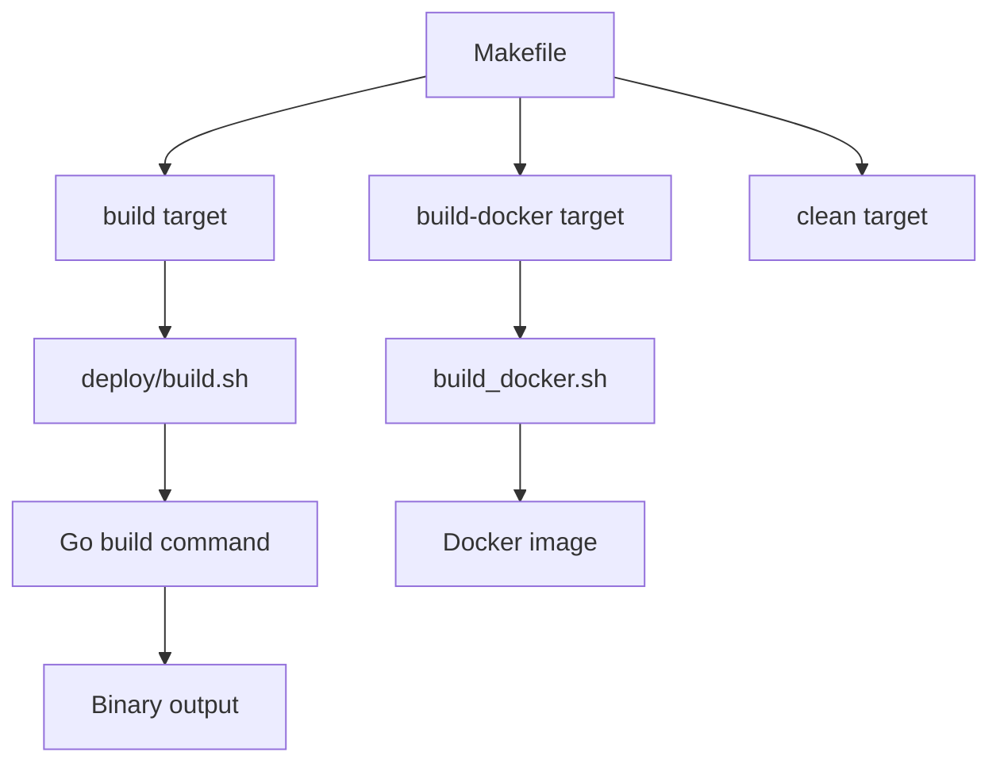
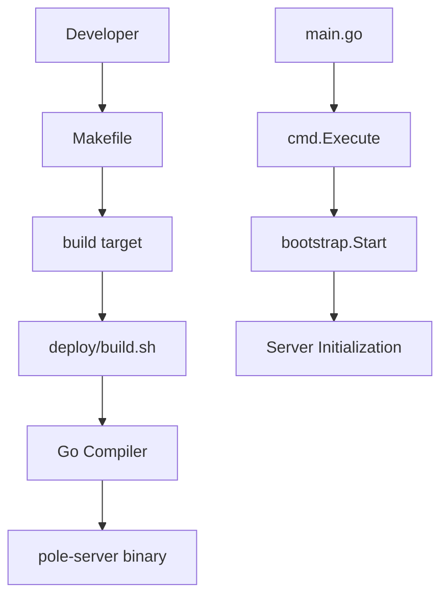
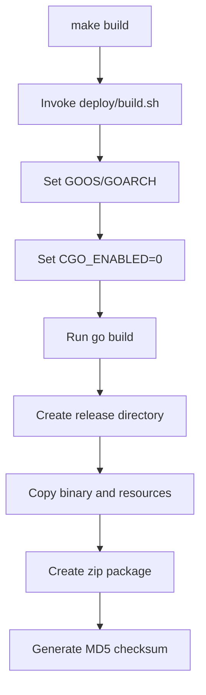
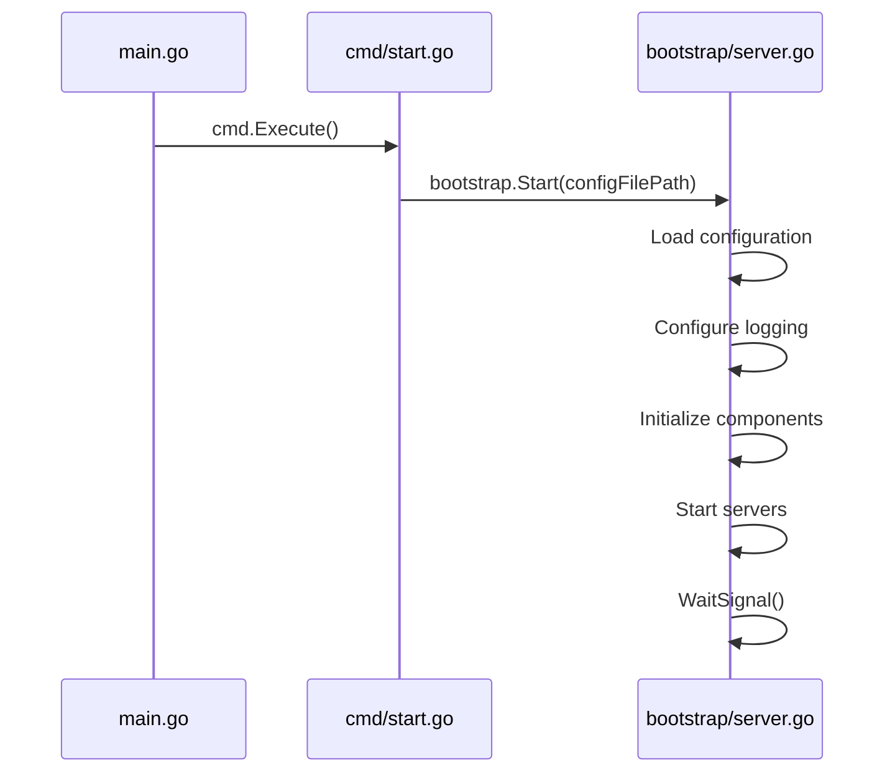
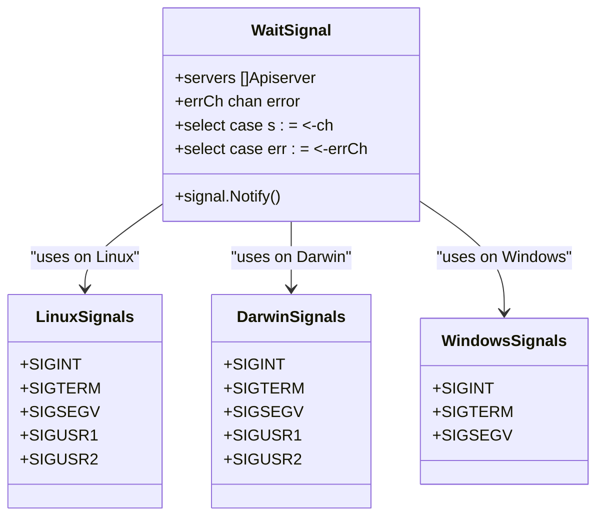
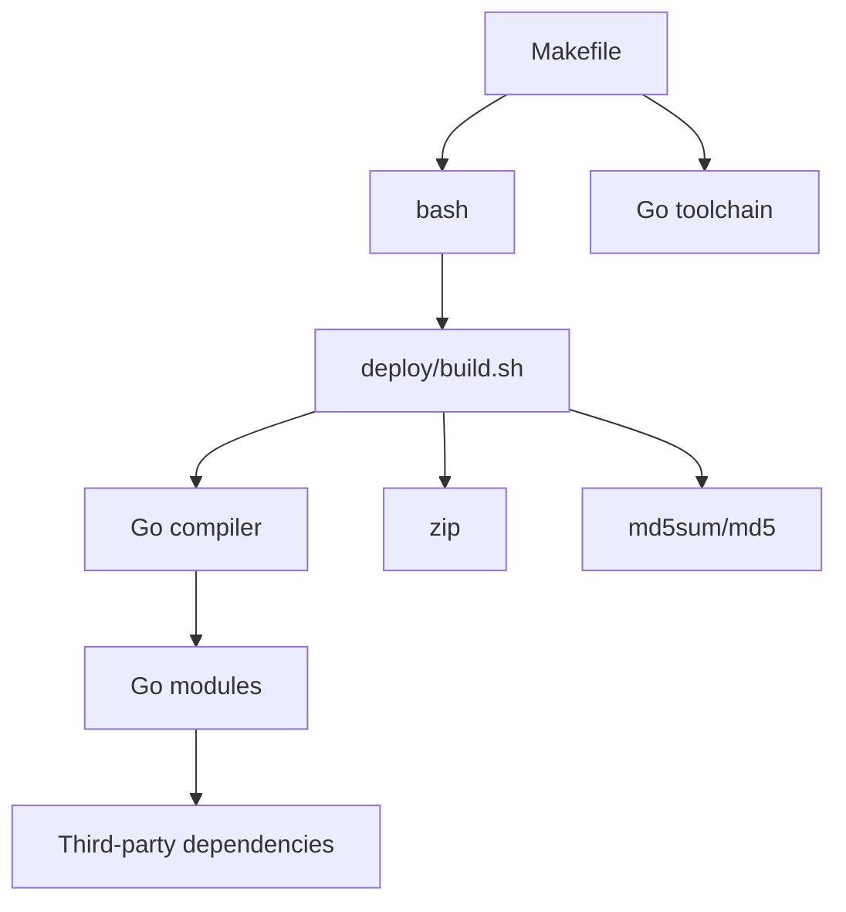

# Building and Compilation

<cite>
**Referenced Files in This Document**   
- [main.go](file://main.go)
- [Makefile](file://Makefile)
- [deploy/build.sh](file://deploy/build.sh)
- [bootstrap/server.go](file://bootstrap/server.go)
- [cmd/start.go](file://cmd/start.go)
- [bootstrap/run_linux.go](file://bootstrap/run_linux.go)
- [bootstrap/run_darwin.go](file://bootstrap/run_darwin.go)
- [bootstrap/run_windows.go](file://bootstrap/run_windows.go)
</cite>

## Table of Contents
1. [Introduction](#introduction)
2. [Project Structure](#project-structure)
3. [Core Components](#core-components)
4. [Architecture Overview](#architecture-overview)
5. [Detailed Component Analysis](#detailed-component-analysis)
6. [Dependency Analysis](#dependency-analysis)
7. [Performance Considerations](#performance-considerations)
8. [Troubleshooting Guide](#troubleshooting-guide)
9. [Conclusion](#conclusion)

## Introduction
This document provides comprehensive guidance on building and compiling the pole-server application. It covers the use of Makefile targets, platform-specific builds, entry point initialization, environment requirements, cross-compilation, build flags, CI/CD integration, troubleshooting, and performance considerations during compilation.

**Section sources**
- [main.go](file://main.go#L1-L29)
- [Makefile](file://Makefile#L1-L65)

## Project Structure
The pole-server project follows a modular structure with distinct directories for different concerns:
- `apis/`: API definitions and implementations
- `bootstrap/`: Server initialization and startup logic
- `cmd/`: Command-line interface definitions
- `deploy/`: Deployment scripts and configuration
- `pkg/`: Core business logic packages
- `plugin/`: Plugin implementations
- Root-level files include `main.go`, `Makefile`, and `version`

The build process is orchestrated through the Makefile and supporting shell scripts in the deploy directory.

**Diagram sources**
- [Makefile](file://Makefile#L1-L65)
- [deploy/build.sh](file://deploy/build.sh#L1-L82)

**Section sources**
- [Makefile](file://Makefile#L1-L65)
- [deploy/build.sh](file://deploy/build.sh#L1-L82)

## Core Components
The core components involved in the build and compilation process include the Makefile for build orchestration, the deploy/build.sh script for platform-specific compilation, and the main.go file as the application entry point. The bootstrap package contains platform-specific startup logic and server initialization code.

**Section sources**
- [main.go](file://main.go#L1-L29)
- [Makefile](file://Makefile#L1-L65)
- [bootstrap/server.go](file://bootstrap/server.go#L1-L717)

## Architecture Overview
The build architecture of pole-server consists of a Makefile that serves as the primary interface for compilation tasks. The Makefile delegates to shell scripts that handle platform-specific details and invoke the Go compiler with appropriate flags. The application entry point is main.go, which delegates to the cmd package for command-line processing, ultimately invoking the bootstrap package to start the server.

**Diagram sources**
- [Makefile](file://Makefile#L1-L65)
- [main.go](file://main.go#L1-L29)
- [bootstrap/server.go](file://bootstrap/server.go#L1-L717)

## Detailed Component Analysis

### Build System Analysis
The build system is centered around the Makefile which provides standardized targets for building the application. The primary build target invokes deploy/build.sh, which handles the actual compilation process including setting environment variables, determining platform specifics, and invoking go build with appropriate ldflags to embed version information.

#### Build Process Flow

**Diagram sources**
- [Makefile](file://Makefile#L1-L65)
- [deploy/build.sh](file://deploy/build.sh#L1-L82)

**Section sources**
- [Makefile](file://Makefile#L1-L65)
- [deploy/build.sh](file://deploy/build.sh#L1-L82)

### Entry Point Analysis
The application entry point is defined in main.go, which imports the cmd package and calls Execute() in the main function. This follows the Cobra command-line library pattern. The cmd/start.go file defines the start command that invokes bootstrap.Start() with the configuration file path.

#### Application Initialization Flow

**Diagram sources**
- [main.go](file://main.go#L1-L29)
- [cmd/start.go](file://cmd/start.go#L1-L43)
- [bootstrap/server.go](file://bootstrap/server.go#L1-L717)

**Section sources**
- [main.go](file://main.go#L1-L29)
- [cmd/start.go](file://cmd/start.go#L1-L43)
- [bootstrap/server.go](file://bootstrap/server.go#L1-L717)

### Platform-Specific Initialization
The bootstrap package contains platform-specific files (run_linux.go, run_darwin.go, run_windows.go) that define the WaitSignal function for handling OS signals. These files ensure proper signal handling on different operating systems, with Linux and Darwin supporting SIGUSR1/SIGUSR2 for restart functionality while Windows has a simpler signal handling implementation.

**Diagram sources**
- [bootstrap/run_linux.go](file://bootstrap/run_linux.go#L1-L67)
- [bootstrap/run_darwin.go](file://bootstrap/run_darwin.go#L1-L67)
- [bootstrap/run_windows.go](file://bootstrap/run_windows.go#L1-L50)

**Section sources**
- [bootstrap/run_linux.go](file://bootstrap/run_linux.go#L1-L67)
- [bootstrap/run_darwin.go](file://bootstrap/run_darwin.go#L1-L67)
- [bootstrap/run_windows.go](file://bootstrap/run_windows.go#L1-L50)

## Dependency Analysis
The build process has minimal external dependencies, primarily relying on standard Go tooling. The Makefile depends on bash for script execution, and the build.sh script uses standard Unix tools like zip and md5sum (with a fallback to md5 on Darwin). The application itself has Go module dependencies declared in go.mod, but these are resolved during the go build step rather than in the build orchestration.

**Diagram sources**
- [Makefile](file://Makefile#L1-L65)
- [deploy/build.sh](file://deploy/build.sh#L1-L82)

**Section sources**
- [Makefile](file://Makefile#L1-L65)
- [deploy/build.sh](file://deploy/build.sh#L1-L82)

## Performance Considerations
The build process is optimized for reproducibility and cross-platform compatibility rather than maximum build speed. Key performance characteristics include:
- CGO_ENABLED=0 for static compilation and improved portability
- Use of ldflags to embed version information at compile time
- Sequential rather than parallel build steps to ensure reliability
- Complete cleanup of previous build artifacts before each build
- Generation of checksums for build verification

For CI/CD pipelines, consider caching Go modules and build artifacts to improve performance. The build process does not currently support incremental builds, so full recompilation occurs with each build invocation.

**Section sources**
- [deploy/build.sh](file://deploy/build.sh#L1-L82)

## Troubleshooting Guide
Common build issues and their solutions:

### Build Script Failures
- **Issue**: "command not found" errors for zip or md5sum
- **Solution**: Install required tools (zip, coreutils on macOS)

- **Issue**: Cross-compilation failures
- **Solution**: Ensure CGO_ENABLED=0 when cross-compiling

- **Issue**: Missing version file
- **Solution**: Create a version file in the project root or pass VERSION parameter

### Compilation Errors
- **Issue**: Missing dependencies
- **Solution**: Run `go mod download` before building

- **Issue**: Platform-specific compilation errors
- **Solution**: Verify GOOS and GOARCH settings match target platform

### Makefile Issues
- **Issue**: Permission denied when executing build.sh
- **Solution**: Ensure build.sh is executable (`chmod +x deploy/build.sh`)

- **Issue**: Custom version not being applied
- **Solution**: Use `make build VERSION=your-version` or set VERSION environment variable

**Section sources**
- [Makefile](file://Makefile#L1-L65)
- [deploy/build.sh](file://deploy/build.sh#L1-L82)

## Conclusion
The pole-server build system provides a robust and portable compilation process through its Makefile-driven approach. The system supports cross-platform compilation and produces self-contained release packages. The separation of build orchestration (Makefile) from platform-specific details (build.sh) allows for flexible deployment across different environments. For production use, integrate the build process into CI/CD pipelines with proper versioning and artifact management.