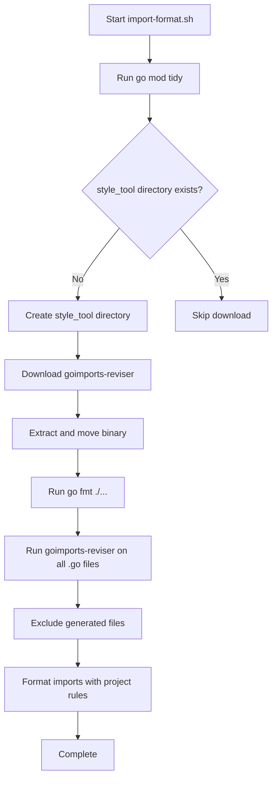
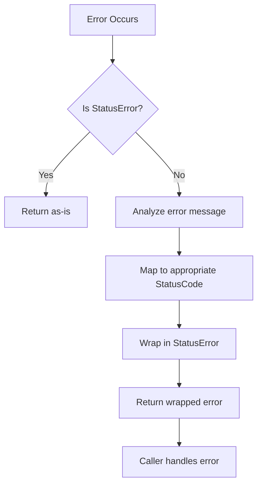

# Coding Standards and Formatting

<cite>
**Referenced Files in This Document**   
- [import-format.sh](file://import-format.sh)
- [scope.go](file://pkg/common/log/scope.go)
- [config.go](file://pkg/common/log/config.go)
- [types.go](file://apis/pkg/types/types.go)
- [context.go](file://apis/access_control/auth/context.go)
- [utils.go](file://pkg/common/utils/funcs.go)
</cite>

## Table of Contents
1. [Introduction](#introduction)
2. [Import Formatting with import-format.sh](#import-formatting-with-import-formattersh)
3. [Naming Conventions](#naming-conventions)
4. [Comment Standards](#comment-standards)
5. [Error Handling Patterns](#error-handling-patterns)
6. [Logging Practices with Zap](#logging-practices-with-zap)
7. [Go Idioms and Project Patterns](#go-idioms-and-project-patterns)
8. [IDE Integration and Pre-commit Hooks](#ide-integration-and-pre-commit-hooks)
9. [Conclusion](#conclusion)

## Introduction
This document outlines the coding standards and formatting practices used in the pole-server project. It covers import formatting, naming conventions, comment standards, error handling, logging with Zap, and project-specific patterns such as interceptor usage and context propagation. The goal is to ensure code consistency, readability, and maintainability across the codebase.

## Import Formatting with import-format.sh

The `import-format.sh` script is responsible for enforcing consistent Go import ordering and formatting across the codebase. It ensures that all Go files follow a standardized import structure, which improves code readability and reduces merge conflicts.

The script performs the following operations:
1. Runs `go mod tidy -compat=1.17` to clean up module dependencies
2. Downloads and installs `goimports-reviser` tool if not already present
3. Applies `go fmt ./...` to format all Go files
4. Uses `goimports-reviser` to organize imports with specific rules:
   - Removes unused imports
   - Groups imports by prefix (standard library, project-specific, third-party)
   - Formats imports according to project conventions

The script intelligently handles different operating systems and architectures when downloading the `goimports-reviser` tool, supporting Linux (AMD64), macOS (AMD64 and ARM64).



**Diagram sources**
- [import-format.sh](file://import-format.sh)

**Section sources**
- [import-format.sh](file://import-format.sh)

## Naming Conventions

The project follows Go naming conventions with specific patterns for different code elements:

### Package Names
Packages are named using lowercase with underscores only when necessary for clarity. Examples include `common/log`, `common/utils`, and `service/healthcheck`.

### Type Names
Structs and interfaces use PascalCase:
- `StatusError` (error type in store/status.go)
- `Scope` (logging scope in common/log/scope.go)
- `Options` (configuration options in common/log/config.go)

### Function and Method Names
Functions use camelCase with descriptive names that indicate their purpose:
- `RegisterScope` - registers a new logging scope
- `Configure` - configures logging system
- `ConvertGRPCContext` - converts gRPC context to internal format

### Constants
Constants use UPPER_SNAKE_CASE:
- `DebugLevel`, `InfoLevel`, `WarnLevel` (logging levels)
- `DefaultLoggerName` (constant in common/log/default.go)

### Variables
Local variables use camelCase with descriptive names:
- `requestID`, `clientIP`, `userAgent` (context variables)
- `outputLevel`, `stackTraceLevel` (logging configuration)

**Section sources**
- [scope.go](file://pkg/common/log/scope.go)
- [config.go](file://pkg/common/log/config.go)

## Comment Standards

The project follows Go comment conventions with specific patterns for different comment types:

### Package Comments
Each package should have a package comment at the top of at least one file describing its purpose and functionality.

### Function Comments
Functions are documented with comments that describe their purpose, parameters, and return values:
```go
// Configure configures the logging system with the provided options.
// You typically call this once at process startup.
// Once this call returns, the logging system is ready to accept data.
func Configure(optionsMap map[string]*Options) error {
```

### Inline Comments
Inline comments are used to explain complex logic or non-obvious code decisions:
```go
// t = t.UTC() 不用utc时间
// Skip UTC conversion as we want to use local time
```

### TODO Comments
The codebase uses TODO comments to mark areas for future improvement:
```go
// TODO(dfawley): don't use deprecated functions in examples or first-party plugins.
```

**Section sources**
- [config.go](file://pkg/common/log/config.go)
- [scope.go](file://pkg/common/log/scope.go)

## Error Handling Patterns

The project implements a comprehensive error handling system with standardized patterns:

### StatusError Type
A custom `StatusError` type is used to provide structured error information:
```go
type StatusError struct {
    code    StatusCode
    message string
}
```

This type implements the error interface and provides methods to extract the status code:
```go
func (s *StatusError) Error() string {
    if s == nil {
        return ""
    }
    return s.message
}
```

### Error Conversion
Functions are provided to convert between standard errors and `StatusError`:
- `Error(err error) error` - converts a standard error to `StatusError`
- `NewStatusError(code StatusCode, message string) error` - creates a new `StatusError`
- `Code(err error) StatusCode` - extracts the status code from an error

Specific error conditions are mapped to appropriate status codes:
- "Data too long" → `OutOfRangeErr`
- "Duplicate entry" → `DuplicateEntryErr`
- "a foreign key constraint fails" → `ForeignKeyErr`
- "Deadlock" → `DeadlockErr`

### Error Propagation
Errors are propagated through the call stack with appropriate context, and the system handles both expected and unexpected error conditions gracefully.



**Diagram sources**
- [status.go](file://apis/store/status.go)

**Section sources**
- [status.go](file://apis/store/status.go)

## Logging Practices with Zap

The project uses Zap as its primary logging framework, with a custom wrapper that provides additional functionality and consistency.

### Log Levels
The following log levels are supported:
- `DebugLevel` - detailed information for debugging
- `InfoLevel` - general operational information
- `WarnLevel` - potential issues that don't prevent operation
- `ErrorLevel` - errors that affect operation
- `FatalLevel` - critical errors that terminate the process
- `NoneLevel` - disables logging output

### Scope-Based Logging
Logging is organized by scopes, which allow different components to have independent logging configurations:
```go
type Scope struct {
    name        string
    description string
    outputLevel Level
    stackTraceLevel Level
}
```

Scopes are registered with `RegisterScope()` and can be retrieved with `FindScope()`.

### Log Configuration
The logging system is configured through a structured options system that supports:
- Multiple output paths
- Log rotation based on size and time
- JSON or console encoding
- Separate error and regular log files
- Stack trace level configuration

### Log Methods
Each scope provides multiple logging methods:
- `Info(msg string, fields ...zapcore.Field)` - structured logging
- `Infof(template string, args ...interface{})` - formatted logging
- `Infoa(args ...interface{})` - variadic logging

The system also provides global logging functions that delegate to the default scope.

```mermaid
classDiagram
class Scope {
+string name
+string description
+Level outputLevel
+Level stackTraceLevel
+bool logCallers
+Fatal(msg string, fields... zapcore.Field)
+Error(msg string, fields... zapcore.Field)
+Warn(msg string, fields... zapcore.Field)
+Info(msg string, fields... zapcore.Field)
+Debug(msg string, fields... zapcore.Field)
+Fatalf(template string, args... interface{})
+Errorf(template string, args... interface{})
+Warnf(template string, args... interface{})
+Infof(template string, args... interface{})
+Debugf(template string, args... interface{})
}
class Logger {
+Configure(optionsMap map[string]*Options) error
+Sync() error
+RegisterScope(name string, description string, callerSkip int) *Scope
+FindScope(scope string) *Scope
}
Logger --> Scope : "manages"
```

**Diagram sources**
- [scope.go](file://pkg/common/log/scope.go)
- [config.go](file://pkg/common/log/config.go)

**Section sources**
- [scope.go](file://pkg/common/log/scope.go)
- [config.go](file://pkg/common/log/config.go)

## Go Idioms and Project Patterns

The project follows Go idioms while implementing specific patterns for its domain.

### Interceptor Usage
Interceptors are used throughout the codebase to implement cross-cutting concerns such as authentication, rate limiting, and request validation. These are typically implemented as middleware that wraps handler functions.

### Context Propagation
The project uses Go's context package extensively for request-scoped data propagation. Custom context functions are provided to extract and append values:

```go
func ConvertGRPCContext(ctx context.Context) types.RequestContext {
    // Extract metadata from gRPC context
    // Extract peer information
    // Create and populate RequestContext
    return ctx
}
```

Common context values include:
- Request ID
- Client IP address
- User agent
- Authentication token
- gRPC metadata

### Functional Options Pattern
The configuration system uses the functional options pattern to provide flexible and extensible configuration:

```go
type Options struct {
    OutputLevel          string
    StackTraceLevel      string
    RotateOutputPath     string
    ErrorRotateOutputPath string
    // ... other fields
}
```

### Error Handling with Multierror
The project uses the multierror package to handle multiple errors that may occur during operations:

```go
var errs error
for _, core := range cores {
    if err := core.Write(ent, fields); err != nil {
        errs = multierror.Append(errs, err)
    }
}
```

### Interface Design
Interfaces are designed to be small and focused, following the Go principle of "accept interfaces, return structs":

```go
type patchTable struct {
    write       func(ent zapcore.Entry, fields []zapcore.Field) error
    sync        func() error
    exitProcess func(code int)
    errorSink   zapcore.WriteSyncer
}
```

**Section sources**
- [utils.go](file://pkg/common/utils/funcs.go)
- [context.go](file://apis/access_control/auth/context.go)
- [types.go](file://apis/pkg/types/types.go)

## IDE Integration and Pre-commit Hooks

To automate enforcement of coding standards, the project provides mechanisms for IDE integration and pre-commit hooks.

### IDE Integration
Developers should configure their IDEs to:
1. Run `import-format.sh` before saving Go files
2. Use goimports or goimports-reviser for import formatting
3. Enable gofmt on save
4. Configure linters (golint, staticcheck) with project-specific rules

### Pre-commit Hooks
A pre-commit hook should be installed to ensure code quality before commits. The hook should:
1. Run `import-format.sh` to format imports
2. Run `go fmt` to format code
3. Run linters to catch common issues
4. Run basic tests to catch regressions

The `vert.sh` script provides some of these checks and can be adapted for pre-commit use:

```bash
#!/bin/bash
# Pre-commit hook script

echo "Running import formatting..."
./import-format.sh

echo "Running linters..."
# Add linter commands here
misspell -error .

echo "All checks passed!"
exit 0
```

To install the pre-commit hook:
```bash
# Copy the hook script to .git/hooks/pre-commit
cp scripts/pre-commit .git/hooks/pre-commit
# Make it executable
chmod +x .git/hooks/pre-commit
```

### EditorConfig
An .editorconfig file should be used to standardize editor settings across different IDEs:
```ini
root = true

[*.go]
indent_style = space
indent_size = 4
end_of_line = lf
insert_final_newline = true
trim_trailing_whitespace = true
```

**Section sources**
- [import-format.sh](file://import-format.sh)
- [vert.sh](file://vert.sh)

## Conclusion
The pole-server project maintains high code quality through consistent application of coding standards and formatting practices. The `import-format.sh` script ensures consistent import ordering, while comprehensive logging with Zap provides visibility into system behavior. Error handling follows structured patterns with the `StatusError` type, and context propagation enables request-scoped data flow. By following Go idioms and project-specific patterns like interceptors and functional options, the codebase remains maintainable and extensible. IDE integration and pre-commit hooks automate enforcement of these standards, ensuring consistency across the development team.