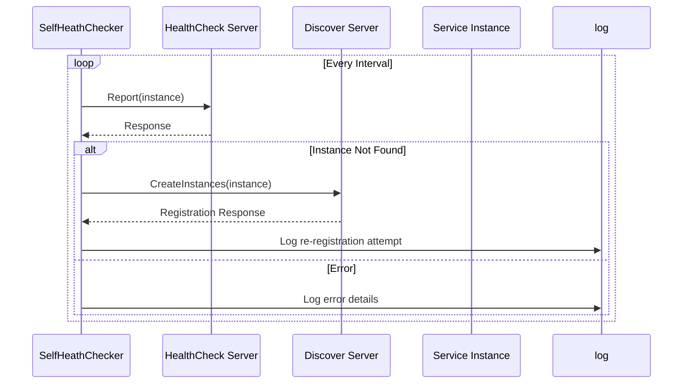
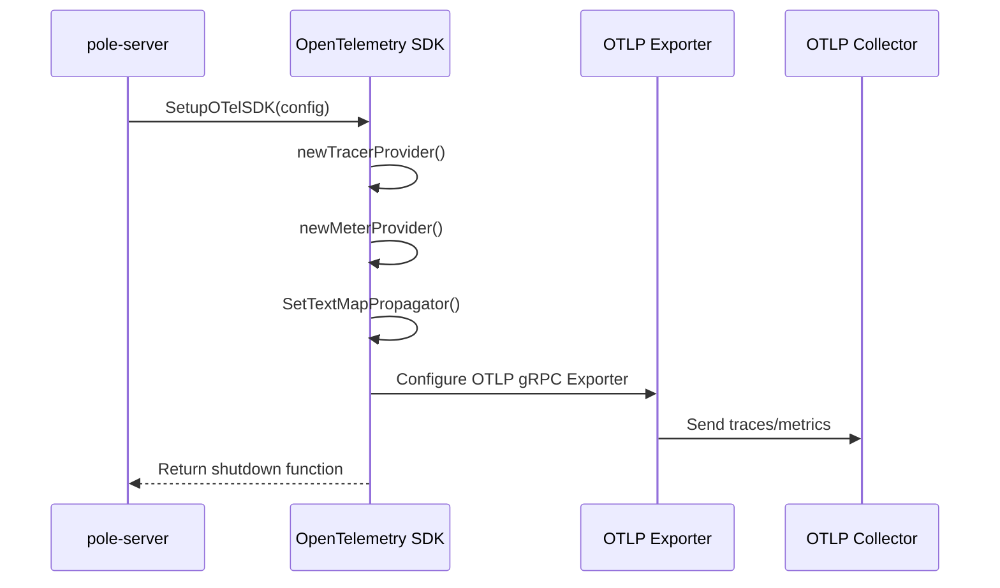

# Debugging and Profiling

<cite>
**Referenced Files in This Document**   
- [self_checker.go](file://bootstrap/self_checker.go)
- [otel.go](file://pkg/common/otel/otel.go)
- [config.go](file://pkg/common/otel/config.go)
- [dump.yaml](file://test/data/xds/dump.yaml)
- [config.go](file://pkg/common/log/config.go)
</cite>

## Table of Contents
1. [Introduction](#introduction)
2. [Enabling Debug Logs](#enabling-debug-logs)
3. [Self-Checker for Health Verification](#self-checker-for-health-verification)
4. [OpenTelemetry Tracing Setup](#opentelemetry-tracing-setup)
5. [Profiling with pprof](#profiling-with-pprof)
6. [Diagnosing Common Issues Using Dump Files](#diagnosing-common-issues-using-dump-files)
7. [Log Analysis and Metric Interpretation](#log-analysis-and-metric-interpretation)
8. [Reproducing Edge Cases in Development](#reproducing-edge-cases-in-development)
9. [Conclusion](#conclusion)

## Introduction
This document provides comprehensive guidance on debugging and profiling techniques for the pole-server project. It covers essential tools and practices including debug logging, health verification via self-checker, distributed tracing using OpenTelemetry, performance profiling with pprof, and practical diagnostics using configuration dumps. The goal is to equip developers and operators with the knowledge to effectively monitor, troubleshoot, and optimize the system.

## Enabling Debug Logs
To enable debug logs in pole-server, configure the logging system through the log configuration file, typically located at `deploy/conf/pole-log.yaml`. This file controls log levels, output paths, rotation policies, and formatting.

The logging subsystem uses structured logging powered by Zap, with support for multiple log scopes. Each scope can have independent log levels and output configurations. To enable debug-level logging globally or for specific components, set the `outputLevel` field to `DEBUG` in the relevant scope configuration.

For example:
```yaml
default:
  outputLevel: DEBUG
  stackTraceLevel: ERROR
  rotationMaxSize: 100
  rotationMaxBackups: 5
  rotationMaxAge: 30
```

The log system also supports rotating log files based on size and time, and can output logs in both console and JSON formats depending on the `JSONEncoding` setting.

**Section sources**
- [config.go](file://pkg/common/log/config.go#L0-L423)

## Self-Checker for Health Verification
The self-checker mechanism in `bootstrap/self_checker.go` provides automated health verification for pole-server instances. It periodically checks the heartbeat status of registered service instances and attempts re-registration if an instance is found missing.

The `SelfHeathChecker` struct initializes with a list of service instances and a check interval. During startup, it retrieves the discovery and health check servers, then begins a ticker-based loop that triggers health reports for each instance at the configured interval.

If a heartbeat request returns a `NotFoundResource` error, indicating the instance was unexpectedly removed, the self-checker automatically triggers a re-registration process to ensure service continuity. Other errors are logged as warnings or errors depending on severity.

This mechanism ensures high availability by protecting against accidental deregistration and maintaining consistent service presence in the registry.



**Diagram sources**
- [self_checker.go](file://bootstrap/self_checker.go#L0-L106)

**Section sources**
- [self_checker.go](file://bootstrap/self_checker.go#L0-L106)

## OpenTelemetry Tracing Setup
pole-server integrates OpenTelemetry for distributed tracing and metrics collection through the `pkg/common/otel` package. The tracing system is initialized during server startup using the `SetupOTelSDK` function, which configures trace and metric providers based on the provided configuration.

Tracing configuration is defined in the `Config` struct, which includes settings such as:
- `Endpoint`: OTLP collector endpoint
- `Timeout`: Connection timeout duration
- `ReconnectionPeriod`: Reconnection interval
- `Compressor`: Compression algorithm (default: gzip)
- `PushInterval`: Metrics push interval (default: 5 seconds)

The system sets up both trace and metric exporters using gRPC transport. Traces are exported via `otlptracegrpc`, while metrics use `otlpmetricgrpc`. The propagator is configured to support both TraceContext and Baggage for context propagation across service boundaries.

Metrics are exposed through a global meter named "pole-server", accessible via the `Meter()` function. Various plugins register their own metrics using this meter, enabling comprehensive observability.



**Diagram sources**
- [otel.go](file://pkg/common/otel/otel.go#L0-L127)
- [config.go](file://pkg/common/otel/config.go#L0-L31)

**Section sources**
- [otel.go](file://pkg/common/otel/otel.go#L0-L127)
- [config.go](file://pkg/common/otel/config.go#L0-L31)

## Profiling with pprof
While explicit pprof endpoints are not visible in the provided codebase, Go's standard pprof profiling capabilities can be enabled by importing the `net/http/pprof` package and exposing the debug endpoints through an HTTP server.

Typical profiling scenarios include:
- CPU profiling to identify performance bottlenecks
- Memory profiling to detect leaks or excessive allocations
- Goroutine profiling to analyze concurrency patterns and detect blocking operations
- Heap profiling to understand memory usage patterns

To enable profiling, ensure that an HTTP server is running (such as the admin server) and register the pprof handlers. Then, use the `go tool pprof` command to collect and analyze profiling data:

```bash
# Collect 30-second CPU profile
go tool pprof http://localhost:16010/debug/pprof/profile?seconds=30

# Fetch heap profile
go tool pprof http://localhost:16010/debug/pprof/heap

# Analyze goroutine blocking profile
go tool pprof http://localhost:16010/debug/pprof/block
```

The collected profiles can be visualized using `pprof`'s web interface or analyzed interactively to identify hot paths and optimization opportunities.

## Diagnosing Common Issues Using Dump Files
The `test/data/xds/dump.yaml` file provides a snapshot of XDS (Envoy Discovery Service) configuration used for service mesh integration. This dump file can be invaluable for diagnosing issues related to service registration, routing, and traffic policies.

Key sections in the dump file include:
- **Clusters**: Defines upstream services with load balancing policies and circuit breaker settings
- **Endpoints**: Lists service instances with health status and metadata
- **Listeners**: Configures inbound traffic handling with filter chains
- **Routers**: Specifies routing rules based on domains and match conditions

For example, when diagnosing service registration issues, check the `endpoints` section to verify that instances are properly registered and marked as `HEALTHY`. Unhealthy instances may indicate health check failures or network connectivity problems.

When investigating governance rule mismatches, examine the `filterMetadata` fields which contain policy information such as TLS mode (`polarismesh.cn/tls-mode: strict`) and mTLS requirements.

The routing configuration under `routers` can help identify misconfigurations in virtual hosts or route matches that might cause traffic to be routed incorrectly.

**Section sources**
- [dump.yaml](file://test/data/xds/dump.yaml#L0-L113)

## Log Analysis and Metric Interpretation
Effective debugging requires understanding both log patterns and metric trends. pole-server's logging system categorizes messages by scope (e.g., `apollo-apiserver`, `apollo-trace`), allowing focused analysis of specific components.

Key log patterns to monitor:
- `[Bootstrap] heartbeat not found instance`: Indicates potential registration issues
- `re-register fail`: Suggests problems with service registration
- `heartbeat fail`: Points to health check or connectivity problems

Metrics are collected through the OpenTelemetry meter provider and can include:
- API call counts and latencies
- Configuration resource totals
- Service instance health status
- Rate limiting statistics

When interpreting metrics, look for anomalies such as:
- Sudden drops in healthy instance counts
- Increasing error rates in API calls
- Memory usage growth over time
- High latency percentiles in service discovery

Correlate metric anomalies with log entries from the same time period to identify root causes. For example, a spike in `NotFoundResource` errors in logs combined with decreasing instance counts in metrics strongly suggests a service registration problem.

**Section sources**
- [config.go](file://pkg/common/log/config.go#L0-L423)
- [otel.go](file://pkg/common/otel/otel.go#L0-L127)

## Reproducing Edge Cases in Development
To reproduce edge cases in development, leverage the test infrastructure and configuration files provided in the repository:

1. Use the `test/data/xds/dump.yaml` file as a baseline configuration for setting up test environments that mirror production issues.

2. Modify configuration parameters to simulate failure conditions:
   - Reduce health check intervals to trigger frequent checks
   - Configure strict TLS modes to test mTLS scenarios
   - Set low circuit breaker thresholds to trigger failures

3. Utilize the self-checker mechanism to test automatic recovery from instance deregistration by:
   - Manually removing instances from the registry
   - Observing the self-checker's re-registration attempts
   - Verifying that services are restored

4. Enable debug logging and tracing to capture detailed execution flow during edge case reproduction.

5. Use the provided test suites in `test/suit/` as templates for creating targeted integration tests that exercise specific failure modes.

By systematically reproducing edge cases in a controlled environment, developers can validate fixes and ensure robustness before deployment.

**Section sources**
- [self_checker.go](file://bootstrap/self_checker.go#L0-L106)
- [dump.yaml](file://test/data/xds/dump.yaml#L0-L113)

## Conclusion
This document has covered essential debugging and profiling techniques for pole-server, including debug log configuration, health verification through the self-checker, OpenTelemetry integration for tracing, and diagnostic analysis using configuration dumps. By mastering these tools and practices, developers can effectively maintain system reliability, diagnose issues, and optimize performance. The combination of structured logging, automated health checks, distributed tracing, and comprehensive metrics provides a robust foundation for observability and troubleshooting in complex service mesh environments.