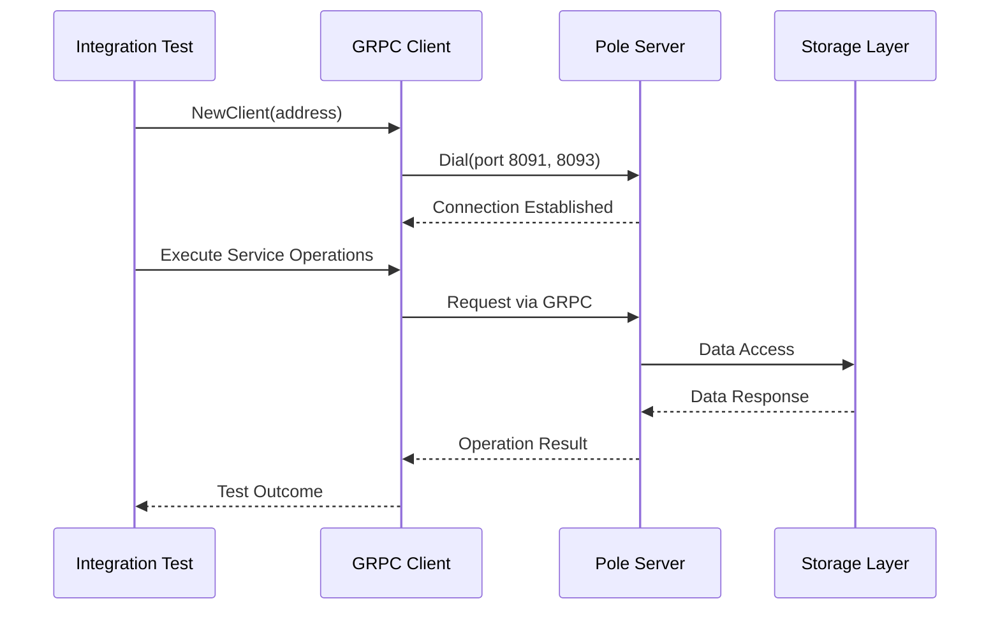
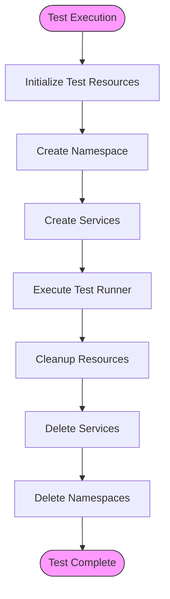
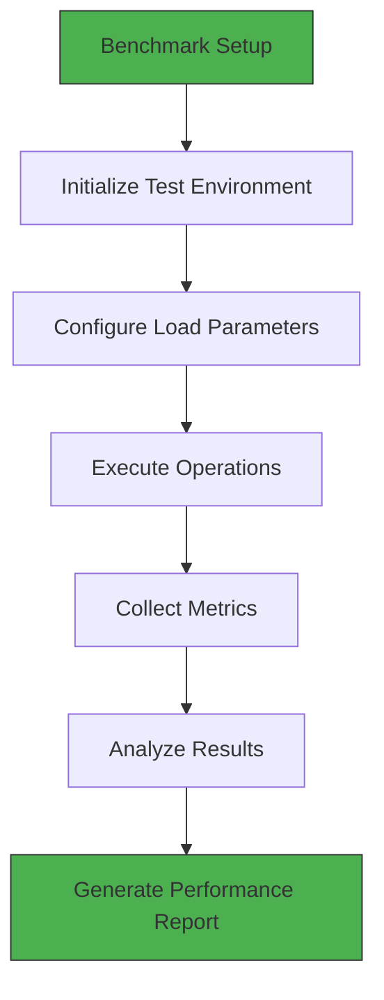
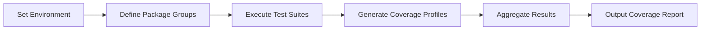
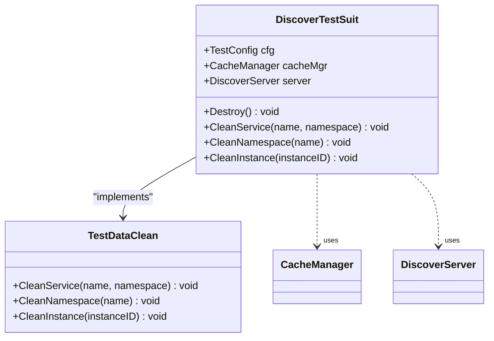
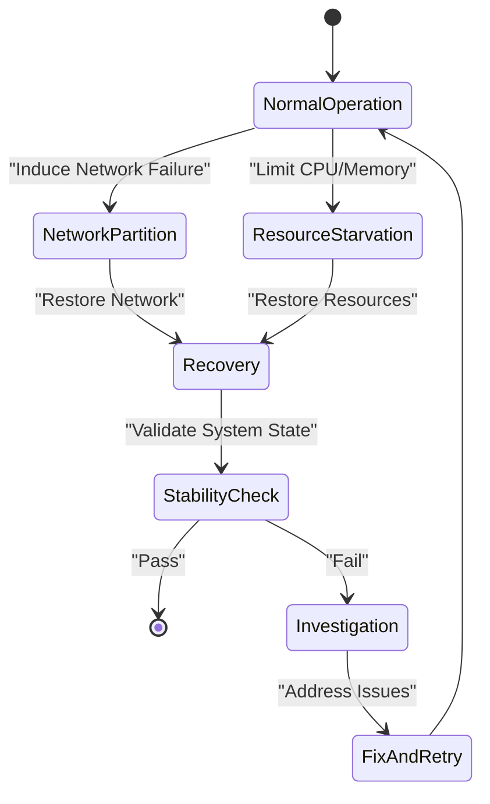

# Testing Strategy

<cite>
**Referenced Files in This Document**   
- [codecov.sh](file://test/codecov.sh)
- [README.md](file://test/chaosmesh/README.md)
- [README.md](file://test/suit/README.md)
- [test_suit.go](file://test/suit/test_suit.go)
- [test_router.go](file://test/suit/test_router.go)
- [common_test.go](file://test/integrate/common_test.go)
- [client.go](file://test/integrate/grpc/client.go)
- [discover_test.go](file://test/benchmark/grpc/client/discover_test.go)
- [script.go](file://test/benchmark/grpc/heartbeat/script.go)
</cite>

## Table of Contents
1. [Introduction](#introduction)
2. [Unit Testing Framework](#unit-testing-framework)
3. [Integration Testing Strategy](#integration-testing-strategy)
4. [Benchmarking Procedures](#benchmarking-procedures)
5. [Test Execution and Coverage](#test-execution-and-coverage)
6. [Plugin and Router Testing with test/suit](#plugin-and-router-testing-with-testsuit)
7. [Chaos Engineering with ChaosMesh](#chaos-engineering-with-chaosmesh)
8. [Best Practices for Test Development](#best-practices-for-test-development)
9. [Conclusion](#conclusion)

## Introduction
The pole-server testing strategy encompasses a comprehensive suite of validation mechanisms designed to ensure system reliability, performance, and correctness across multiple dimensions. This document details the testing architecture, covering unit tests, integration tests for gRPC, HTTP, and end-to-end scenarios, benchmarking procedures, and chaos engineering practices. The test framework supports multi-protocol validation, dependency mocking, and robust test data management, enabling thorough verification of both functional and non-functional requirements.

## Unit Testing Framework
The unit testing framework in pole-server focuses on isolated component validation, ensuring individual modules function correctly in isolation. Tests are organized by package and feature area, with comprehensive coverage of core functionalities including service discovery, configuration management, authentication, and caching mechanisms. The framework leverages Go's built-in testing package with extensive use of table-driven tests for edge case validation.

**Section sources**
- [test_suit.go](file://test/suit/test_suit.go#L0-L799)

## Integration Testing Strategy
The integration testing strategy validates multi-component interactions through the test/integrate directory, covering gRPC, HTTP, and E2E scenarios. The framework provides a structured approach to testing complex workflows involving multiple system components.

### gRPC Integration Testing
gRPC integration tests validate the server's gRPC interfaces using dedicated client implementations. The test/integrate/grpc package contains client utilities that establish connections to the gRPC endpoints on ports 8091 (service) and 8093 (configuration).

**Diagram sources**
- [client.go](file://test/integrate/grpc/client.go#L0-L67)

### HTTP Integration Testing
HTTP integration tests validate RESTful interfaces through the test/integrate/http package, covering endpoints for circuit breaker configuration, rate limiting, service management, and user operations. Tests use the HTTP server running on port 8090.

### Test Resource Management
The common_test.go file provides shared utilities for integration tests, including resource initialization and cleanup. The DiscoveryRunAndInitResource function orchestrates test execution by creating prerequisite resources (namespaces, services) before running test scenarios and ensuring proper cleanup afterward.

**Diagram sources**
- [common_test.go](file://test/integrate/common_test.go#L0-L131)

**Section sources**
- [common_test.go](file://test/integrate/common_test.go#L0-L131)

## Benchmarking Procedures
The benchmarking framework in test/benchmark evaluates system performance under various workloads, focusing on critical operations like service discovery and heartbeat processing.

### gRPC Discovery Benchmarking
The discover_test.go file contains benchmark tests for gRPC discovery operations, measuring performance metrics for service lookup and resolution under different load conditions.

### Heartbeat Performance Testing
The heartbeat benchmarking suite includes a script.go file that simulates high-volume heartbeat operations, enabling performance regression detection and capacity planning.

**Diagram sources**
- [discover_test.go](file://test/benchmark/grpc/client/discover_test.go)
- [script.go](file://test/benchmark/grpc/heartbeat/script.go)

**Section sources**
- [discover_test.go](file://test/benchmark/grpc/client/discover_test.go)
- [script.go](file://test/benchmark/grpc/heartbeat/script.go)

## Test Execution and Coverage
The testing framework provides standardized procedures for executing test suites and generating coverage reports using the codecov.sh script.

### Running Test Suites
Test suites can be executed in different modes:
- **Standalone mode**: Tests run with embedded storage
- **Cluster mode**: Tests run against external MySQL database

The codecov.sh script orchestrates test execution, setting appropriate environment variables and collecting coverage data across multiple packages.

### Coverage Report Generation
The codecov.sh script generates comprehensive coverage reports by:
1. Defining package groups for coverage analysis
2. Executing tests with coverage instrumentation
3. Aggregating coverage profiles from different test runs
4. Producing combined coverage output for code quality assessment

**Section sources**
- [codecov.sh](file://test/codecov.sh#L0-L219)

## Plugin and Router Testing with test/suit
The test/suit package provides a specialized framework for plugin and router testing, enabling comprehensive validation of extension points and routing logic.

### Test Suite Architecture
The DiscoverTestSuit struct serves as the foundation for integration testing, providing:
- Configuration management
- Component initialization
- Resource cleanup
- Database interaction utilities

### Router Testing Utilities
The test_router.go file contains utilities for mocking routing configurations, enabling validation of complex routing scenarios with programmatically generated test data.

**Diagram sources**
- [test_suit.go](file://test/suit/test_suit.go#L0-L799)
- [test_router.go](file://test/suit/test_router.go#L0-L84)

**Section sources**
- [test_suit.go](file://test/suit/test_suit.go#L0-L799)
- [test_router.go](file://test/suit/test_router.go#L0-L84)

## Chaos Engineering with ChaosMesh
The chaosmesh directory contains fault injection scenarios for testing system resilience under adverse conditions. This practice follows the principles of chaos engineering to proactively identify weaknesses in the system's fault tolerance mechanisms.

### Chaos Testing Objectives
- Validate system behavior during network partitions
- Test recovery from database failures
- Verify graceful degradation under resource constraints
- Ensure data consistency after node failures

**Section sources**
- [README.md](file://test/chaosmesh/README.md#L0-L0)

## Best Practices for Test Development
The pole-server testing framework embodies several best practices for effective test development.

### Writing New Integration Tests
When creating new integration tests:
1. Leverage existing test utilities in common_test.go
2. Use the DiscoveryRunAndInitResource pattern for resource management
3. Ensure proper cleanup in defer statements
4. Follow consistent naming conventions

### Mocking Dependencies
The framework supports dependency mocking through:
- Interface-based design enabling easy substitution
- Test-specific store implementations
- Configuration-driven component replacement
- Environment variable injection for test-specific behavior

### Validating Multi-Protocol Behavior
To validate multi-protocol behavior:
1. Implement parallel tests for gRPC and HTTP interfaces
2. Use consistent test data across protocols
3. Verify identical business logic execution
4. Compare response semantics between protocols

### Test Data Management
Effective test data management practices include:
- Isolation of test data through unique naming
- Automated cleanup of test resources
- Use of transactional operations for database cleanup
- Parameterized test data generation

### Parallel Execution
The framework supports parallel test execution through:
- Independent test namespaces
- Isolated storage contexts
- Thread-safe test utilities
- Proper synchronization mechanisms

### Performance Regression Detection
Performance regression detection is achieved through:
- Regular benchmark execution
- Historical performance tracking
- Threshold-based alerting
- Comparative analysis between versions

## Conclusion
The pole-server testing strategy provides a comprehensive framework for ensuring software quality across multiple dimensions. By combining unit tests, integration tests, benchmarking, and chaos engineering, the framework enables thorough validation of both functional correctness and non-functional requirements. The modular design of the test suite, combined with robust utilities for resource management and data cleanup, facilitates efficient test development and maintenance. This comprehensive approach to testing ensures the reliability, performance, and resilience of the pole-server system in production environments.