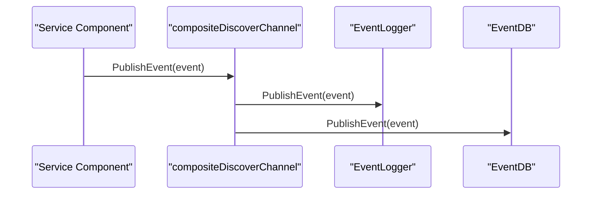
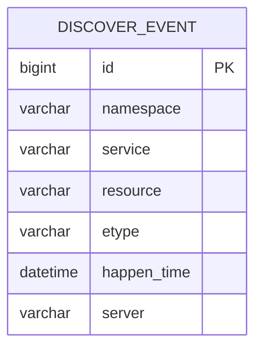

# Event System

<cite>
**Referenced Files in This Document**   
- [discoverevent.go](file://apis/observability/event/discoverevent.go)
- [event_local.go](file://plugin/observability/discoverevent/logger/event_local.go)
- [config.go](file://plugin/observability/discoverevent/logger/config.go)
- [event_db.go](file://plugin/observability/discoverevent/rds/event_db.go)
</cite>

## Table of Contents
1. [Introduction](#introduction)
2. [Event Publishing and Consumption](#event-publishing-and-consumption)
3. [Storage Backends](#storage-backends)
4. [Event Types and Payload Structure](#event-types-and-payload-structure)
5. [Delivery Guarantees](#delivery-guarantees)
6. [Configuration Options](#configuration-options)
7. [Event Emission Patterns](#event-emission-patterns)
8. [Integration with External Monitoring Systems](#integration-with-external-monitoring-systems)
9. [Best Practices for Event-Driven Automation](#best-practices-for-event-driven-automation)
10. [Performance Considerations](#performance-considerations)

## Introduction
The Event System in the Polaris server provides a robust mechanism for publishing and consuming operational events such as service up/down, configuration changes, and health status transitions. Built on a plugin-based architecture, it supports multiple storage backends and enables integration with external monitoring and automation tools. This document details the design, implementation, and usage of the event system, focusing on its core components and operational characteristics.

## Event Publishing and Consumption
The event system uses a publish-subscribe model where operational events are emitted by various components and consumed by registered plugins. The central interface `DiscoverChannel` allows multiple subscribers to receive events simultaneously. The `compositeDiscoverChannel` implementation enables chaining of multiple event handlers, ensuring that each event is delivered to all active plugins.

Events are published via the `PublishEvent` method, which forwards the event to all plugins in the chain. This design supports extensibility, allowing new storage or processing backends to be added without modifying core logic.



**Diagram sources**
- [discoverevent.go](file://apis/observability/event/discoverevent.go#L115-L129)

**Section sources**
- [discoverevent.go](file://apis/observability/event/discoverevent.go#L1-L130)

## Storage Backends
The event system supports two primary storage backends: local file-based logging and database persistence via RDS.

### Local File-Based Logging
The `discoverEventLocal` plugin writes events to local log files with configurable rotation policies. Events are buffered in memory and flushed either when the buffer reaches capacity (1024 events) or every 10 seconds, whichever comes first. This ensures both performance and timeliness in event delivery.

Log files are rotated based on size, age, and backup count, preventing unbounded growth. The default configuration retains logs for 7 days with up to 100 backup files, each limited to 50MB.

### Database Persistence via RDS
The `discoverEventDB` plugin persists events to a MySQL database using the `discover_event` table. The table is partitioned by month on the `happen_time` column to optimize query performance and manage data lifecycle efficiently.

A background task runs daily to ensure future partitions are pre-created for the next 12 months, avoiding runtime DDL operations during peak loads. Events are batch-inserted using `INSERT IGNORE` to prevent duplicates, and the system automatically handles connection initialization and schema creation.



**Diagram sources**
- [event_db.go](file://plugin/observability/discoverevent/rds/event_db.go#L250-L270)

**Section sources**
- [event_local.go](file://plugin/observability/discoverevent/logger/event_local.go#L1-L230)
- [event_db.go](file://plugin/observability/discoverevent/rds/event_db.go#L1-L359)

## Event Types and Payload Structure
Events conform to the `DiscoverEvent` interface, which defines the following properties:
- **ID**: Unique identifier of the resource
- **Event**: Type of event (e.g., instance online/offline)
- **Resource**: Descriptive information about the affected resource
- **HappenTime**: Timestamp when the event occurred

Supported event types include:
- `EventInstanceOnline`
- `EventInstanceOffline`
- `EventInstanceTurnHealth`
- `EventInstanceTurnUnHealth`
- `EventInstanceOpenIsolate`
- `EventInstanceCloseIsolate`

Each event type corresponds to a specific operational state change in the service mesh. The payload structure varies slightly depending on whether the event pertains to an instance or service, but all implement the common interface for uniform processing.

**Section sources**
- [discoverevent.go](file://apis/observability/event/discoverevent.go#L15-L35)
- [event_local.go](file://plugin/observability/discoverevent/logger/event_local.go#L156-L164)

## Delivery Guarantees
The event system provides at-least-once delivery semantics with in-memory buffering and non-blocking publishing. Events are published asynchronously through a buffered channel (default size: 128), allowing producers to continue without waiting for persistence.

If the channel is full, new events are dropped silently to prevent system blocking under high load. This trade-off prioritizes system stability over guaranteed delivery during extreme conditions. Consumers process events in batches, either by size threshold (1024 events) or time interval (10 seconds), ensuring timely delivery under normal operation.

**Section sources**
- [event_local.go](file://plugin/observability/discoverevent/logger/event_local.go#L145-L154)
- [event_db.go](file://plugin/observability/discoverevent/rds/event_db.go#L144-L155)

## Configuration Options
The event system is highly configurable through JSON configuration entries. Key options include:

### For File-Based Logging:
- **queueSize**: Size of the internal event channel (default: 128)
- **outputPath**: Directory for log files (default: ./discover-event)
- **rotationMaxSize**: Maximum log file size in MB (default: 50)
- **rotationMaxAge**: Maximum age of log files in days (default: 7)
- **rotationMaxBackups**: Number of retained backup files (default: 100)

### For Database Persistence:
- **dns**: MySQL connection string (required)

All configurations are validated at initialization time, and invalid settings cause plugin startup to fail, ensuring configuration correctness.

**Section sources**
- [config.go](file://plugin/observability/discoverevent/logger/config.go#L1-L60)

## Event Emission Patterns
Events are emitted using the global `GetDiscoverEvent()` function, which returns the initialized `DiscoverChannel`. Components create event objects (e.g., `InstanceEvent`) and publish them through this channel.

The following example shows how an instance event is constructed and published:

```go
GetDiscoverEvent().PublishEvent(&svctypes.InstanceEvent{
    Id:         "instance-123",
    Namespace:  "default",
    Service:    "demo-service",
    Instance:   instanceObj,
    EType:      svctypes.EventInstanceOnline,
    CreateTime: time.Now(),
})
```

This pattern is used consistently across the codebase for all operational events, ensuring uniform handling and processing.

**Section sources**
- [discoverevent.go](file://apis/observability/event/discoverevent.go#L56-L101)
- [event_local_test.go](file://plugin/observability/discoverevent/logger/event_local_test.go#L34-L85)

## Integration with External Monitoring Systems
The event system facilitates integration with external monitoring tools through both storage backends. The database backend allows SQL-based querying for integration with BI tools and alerting systems. The file-based backend supports log aggregation platforms like ELK or Splunk via file tailing.

Additionally, the modular plugin architecture allows custom integrations to be developed and plugged in without modifying core functionality. For example, a plugin could forward events to Kafka, Prometheus, or cloud monitoring services.

**Section sources**
- [event_db.go](file://plugin/observability/discoverevent/rds/event_db.go#L200-L212)
- [event_local.go](file://plugin/observability/discoverevent/logger/event_local.go#L210-L229)

## Best Practices for Event-Driven Automation
To leverage the event system effectively:
1. Subscribe to relevant event types only to reduce noise
2. Use database queries with time-range filters for efficient event processing
3. Implement idempotent consumers to handle potential duplicate events
4. Monitor event queue depth to detect processing backlogs
5. Use file-based logs for debugging and auditing, and database for analytics

Automated workflows should be designed to react to specific event types (e.g., auto-healing on `EventInstanceTurnUnHealth`) while maintaining resilience to event delivery delays or duplicates.

## Performance Considerations
The event system is optimized for high-volume environments through:
- **Batch processing**: Events are processed in batches of up to 1024
- **Asynchronous I/O**: All persistence operations run in goroutines
- **Memory pooling**: `eventBufferHolder` instances are reused via `sync.Pool`
- **Partitioned tables**: Database storage uses time-based partitioning
- **Non-blocking publish**: Producers never block on event submission

For high-volume scenarios, consider:
- Increasing `queueSize` to handle traffic spikes
- Using SSD storage for log files
- Scaling the database with read replicas for query offloading
- Monitoring buffer utilization and flush frequency

The system can handle thousands of events per second with proper tuning, making it suitable for large-scale service meshes.

**Section sources**
- [event_local.go](file://plugin/observability/discoverevent/logger/event_local.go#L46-L104)
- [event_db.go](file://plugin/observability/discoverevent/rds/event_db.go#L46-L105)